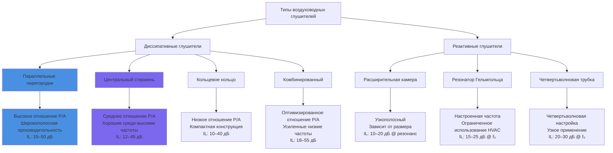

Вставочное ослабление (IL) количественно характеризует снижение уровня звуковой мощности, достигаемое установкой глушителя воздуховода в систему HVAC, выраженное в децибелах для октавных или третьоктавных полос частот. Этот параметр служит основным показателем акустических характеристик глушителя и критически зависит от геометрии глушителя, свойств поглощающего материала, характеристик воздушного потока и частоты.

## Теоретическая основа

Вставочное ослабление диссипативного глушителя возникает в результате преобразования акустической энергии в тепло при взаимодействии звуковых волн с волокнистыми поглощающими материалами. Волна звукового давления вызывает движение частиц в пористой среде, создавая вязкое трение и тепловые обмены, которые рассеивают акустическую энергию.

**Основное уравнение вставочного ослабления**

Для параллельных перегородочных глушителей теоретическое вставочное ослабление имеет вид:

$$IL = 1.05 \times \alpha \times L \times \left(\frac{P}{A}\right) - 10\log_{10}\left(\frac{A_1}{A_2}\right)$$

Где:
- $IL$ = вставочное ослабление (дБ)
- $\alpha$ = коэффициент поглощения материала облицовки (безразмерный, зависит от частоты)
- $L$ = активная длина глушителя (м)
- $P$ = периметр поглощающей поверхности (м)
- $A$ = свободная площадь поперечного сечения воздушного проводника (м²)
- $A_1$ = площадь входного воздуховода (м²)
- $A_2$ = площадь выходного воздуховода (м²)

Отношение периметра к площади $(P/A)$ критически важно—меньшие воздушные проводники с большей площадью поверхности на единицу поперечного сечения обеспечивают превосходное ослабление. Константа 1.05 преобразует расчеты естественного логарифма в децибельную шкалу и учитывает геометрические факторы.

**Упрощенная практическая формула**

Для стандартных прямоугольных глушителей с совпадающими входными/выходными площадями:

$$IL = K \times \alpha \times L \times \left(\frac{P}{A}\right)$$

Где $K$ варьируется от 0.8 до 1.2 в зависимости от конфигурации перегородок и деталей монтажа.

## Частотная избирательность

Вставочное ослабление демонстрирует сильную частотную зависимость, при этом характеристики производительности варьируются значительно в пределах акустического спектра. Эта избирательность возникает из-за соотношения длины волны к размерам и частотно-зависимого коэффициента поглощения волокнистых материалов.

**Производительность на низких частотах (63–250 Гц)**

На низких частотах длины волн (от 4.5 до 17 м при 125 Гц) существенно превышают типичные размеры воздушных проводников и толщину поглощающего материала. Это несоответствие размеров ограничивает взаимодействие акустической энергии с поглощающей средой. Стекловолокно и минеральная вата демонстрируют коэффициенты поглощения от 0.1 до 0.3 в этом диапазоне, что приводит к скромным значениям вставочного ослабления.

Практическое вставочное ослабление на низких частотах для стандартных глушителей:
- Глушитель 0.9 м: 3–6 дБ при 125 Гц
- Глушитель 1.5 м: 5–9 дБ при 125 Гц
- Глушитель 3.0 м: 9–15 дБ при 125 Гц

Достижение значительного ослабления на низких частотах требует увеличенной длины глушителя или специальных конфигураций с расширенной площадью поверхности обработки.

**Производительность на средних частотах (500–2000 Гц)**

Средние частоты представляют оптимальный диапазон производительности для диссипативных глушителей. Длины волн (от 0.6 до 2.3 м при 1000 Гц) приближаются к размерам воздушных проводников, максимизируя взаимодействие акустической энергии с поглощающими материалами. Коэффициенты поглощения достигают 0.7 до 0.95, обеспечивая существенное рассеивание энергии.

Этот частотный диапазон обычно определяет выбор глушителя, потому что:
1. Оборудование HVAC генерирует значительную энергию в этих полосах
2. Чувствительность слуха человека максимальна в этом диапазоне
3. Производительность глушителя достигает максимальной эффективности

**Производительность на высоких частотах (4000–8000 Гц)**

Затухание на высоких частотах часто превышает требования конструкции. Длины волн (от 0.14 до 0.6 м при 4000 Гц) остаются малы относительно размеров обработки, а коэффициенты поглощения приближаются к 0.95–0.99. Даже короткие глушители обеспечивают ослабление 20–30 дБ.

Естественное ослабление воздуховода и поглощение воздухом также становятся значительными на высоких частотах, иногда исключая необходимость в специальной обработке глушителя выше 4000 Гц.

## Эффекты длины глушителя

Взаимосвязь между длиной глушителя и вставочным ослаблением демонстрирует приблизительно линейное поведение в большей части спектра частот, хотя с уменьшающейся эффективностью при экстремальных длинах из-за эффектов насыщения.

**Соотношение длина-ослабление**

Удвоение длины глушителя увеличивает вставочное ослабление на:
- 63–125 Гц: 2–3 дБ на удвоение
- 250–500 Гц: 4–5 дБ на удвоение
- 1000–2000 Гц: 5–6 дБ на удвоение
- 4000–8000 Гц: 3–4 дБ на удвоение (эффекты насыщения)

Эта зависимость позволяет масштабировать производительность:

$$IL_2 = IL_1 + 10\log_{10}\left(\frac{L_2}{L_1}\right) \times F_{freq}$$

Где:
- $IL_2$ = вставочное ослабление при новой длине (дБ)
- $IL_1$ = вставочное ослабление при опорной длине (дБ)
- $L_2$ = новая длина глушителя (м)
- $L_1$ = опорная длина (м)
- $F_{freq}$ = частотный корректирующий коэффициент (0.6–1.0)

## Типичные данные производительности вставочного ослабления

Следующие таблицы представляют сертифицированные тестовые данные согласно ASTM E477 для стандартных параллельных перегородочных глушителей с воздушными проводниками 10–15 см и плотностью стекловолокна 48–96 кг/м³.

**Прямоугольные параллельные перегородочные глушители**

| Длина | 63 Гц | 125 Гц | 250 Гц | 500 Гц | 1000 Гц | 2000 Гц | 4000 Гц | 8000 Гц |
|--------|-------|--------|--------|--------|---------|---------|---------|---------|
| 0.9 м  | 2–3   | 4–6    | 7–10   | 13–17  | 19–24   | 23–29   | 25–31   | 26–32   |
| 1.5 м  | 3–5   | 6–9    | 11–15  | 19–25  | 27–34   | 32–40   | 35–43   | 36–44   |
| 2.1 м  | 5–7   | 8–12   | 15–20  | 24–32  | 34–43   | 40–50   | 43–53   | 44–54   |
| 3.0 м  | 7–10  | 11–16  | 19–26  | 30–40  | 42–53   | 48–60   | 51–63   | 52–64   |

**Круглые центральные стержневые глушители**

| Длина | 63 Гц | 125 Гц | 250 Гц | 500 Гц | 1000 Гц | 2000 Гц | 4000 Гц | 8000 Гц |
|--------|-------|--------|--------|--------|---------|---------|---------|---------|
| 0.9 м  | 1–2   | 3–5    | 6–9    | 11–15  | 16–21   | 20–26   | 22–28   | 23–29   |
| 1.5 м  | 2–4   | 5–8    | 9–13   | 16–22  | 23–30   | 28–36   | 31–39   | 32–40   |
| 2.1 м  | 3–6   | 7–11   | 12–17  | 21–29  | 29–38   | 35–45   | 38–48   | 39–49   |
| 3.0 м  | 5–8   | 9–14   | 16–23  | 27–37  | 36–47   | 43–55   | 46–58   | 47–59   |

Круглые глушители демонстрируют приблизительно на 10–15% более низкое вставочное ослабление, чем эквивалентные прямоугольные устройства, из-за сниженной площади поверхности обработки на единицу объема.

## Эффекты лицевой скорости

Скорость воздуха через глушитель влияет на вставочное ослабление через два конкурирующих механизма: акустический поток и генерирование собственного шума.

**Эффекты акустического потока**

При умеренных скоростях (от 2.5 до 10 м/с), воздушный поток усиливает транспорт акустической энергии в поглощающий материал, потенциально увеличивая вставочное ослабление на 1–2 дБ в диапазоне 500–2000 Гц. Это преимущество вытекает из улучшенной акустической связи на границе воздух-материал.

**Деградация собственного шума**

При повышенных скоростях (>10 м/с) турбулентный поток в перфорированных фасадах генерирует собственный шум, который может превышать пользу вставочного ослабления. Собственный шум преимущественно влияет на высокие частоты (2000–8000 Гц), где турбулентные пограничные слои производят значительную акустическую энергию.

Эффективное вставочное ослабление с учетом собственного шума:

$$IL_{eff} = IL_{static} - IL_{degradation}$$

Где:

$$IL_{degradation} = 10\log_{10}\left(\frac{V_{actual}}{V_{reference}}\right) \times 6$$

Для $V_{reference}$ = 7.6 м/с и применяется главным образом выше 2000 Гц.

**Рекомендуемые пределы лицевой скорости**

Для сохранения эффективности вставочного ослабления:
- Приложения с низким шумом (NC 25–30): максимум 6.1–7.6 м/с
- Приложения с умеренным шумом (NC 30–35): максимум 7.6–10.2 м/с
- Приложения с повышенным шумом (NC 35–40): максимум 10.2–12.7 м/с
- Промышленные приложения (NC 40+): максимум 12.7–15.2 м/с

## Сравнение конфигураций глушителя

Различные геометрии глушителей обеспечивают различные характеристики вставочного ослабления на основе их отношений периметра к площади и конфигураций акустической обработки.

## Протокол тестирования ASTM E477

ASTM E477 стандартизирует лабораторное измерение вставочного ослабления воздуховодного глушителя, обеспечивая согласованность отчетности производительности между производителями. Метод тестирования использует источник звука в реверберационной камере, испытательный воздуховод с установкой глушителя и анэхоическое завершение.

**Требования к конфигурации тестирования**

1. Восходящий прямой воздуховод: минимум 3 диаметра воздуховода
2. Нисходящий прямой воздуховод: минимум 5 диаметров воздуховода
3. Анэхоическое завершение для предотвращения отражений
4. Несколько позиций микрофона (минимум 4) для пространственного усреднения
5. Моделирование воздушного потока при установленных скоростях

**Процедура измерения**

Определение вставочного ослабления требует двух последовательных измерений:

1. **Исходное измерение**: Уровень звуковой мощности с пустым воздуховодом (без глушителя)
2. **Измерение глушителя**: Уровень звуковой мощности с установленным глушителем

Вставочное ослабление равно:

$$IL = L_{w,baseline} - L_{w,silencer}$$

Где измерения происходят в октавных или третьоктавных полосах от 63 Гц до 8000 Гц.

**Требования к отчетности**

Согласно ASTM E477, производители должны сообщать:
- Вставочное ослабление в каждой полосе частот
- Скорость тестирования (м/с)
- Перепад давления при скорости тестирования
- Уровень звуковой мощности собственного шума
- Размеры глушителя и конфигурацию
- Тип поглощающего материала и плотность

## Руководящие принципы применения ASHRAE

ASHRAE Handbook—HVAC Applications, Глава 49 предоставляет комплексное руководство по выбору глушителя и применению вставочного ослабления в проектировании системы.

**Расчет вставочного ослабления системы**

Требуемое вставочное ослабление глушителя вытекает из уравнения акустического проектирования:

$$IL_{required} = L_{w,source} - A_{duct} - A_{end} - A_{room} - NC_{target}$$

Где:
- $L_{w,source}$ = уровень звуковой мощности оборудования (дБ на полосу)
- $A_{duct}$ = естественное ослабление воздуховода (дБ на полосу)
- $A_{end}$ = потеря концевого отражения (дБ на полосу)
- $A_{room}$ = эффект помещения (дБ на полосу)
- $NC_{target}$ = целевой уровень критерия шума (дБ на полосу)

**Коэффициенты безопасности**

ASHRAE рекомендует применять коэффициенты безопасности для учета:
- Производственных допусков: 2–3 дБ
- Вариаций установки: 2–3 дБ
- Эффектов старения: 1–2 дБ (оседание волокнистого материала)

Общий запас конструкции обычно варьируется от 5 до 8 дБ в критических полосах частот.

## Практическая методология выбора

**Шаг 1: Анализ частотной полосы**

Определите критические полосы частот, требующие ослабления. Обычно 500–2000 Гц определяет выбор для управления шумом вентилятора, в то время как 250–1000 Гц доказывает критичность для приложений с компрессором.

**Шаг 2: Определение длины**

Выберите минимальную длину глушителя, обеспечивающую требуемое вставочное ослабление в критических полосах. Кросс-проверьте данные производителя при установленной лицевой скорости.

**Шаг 3: Проверка скорости**

Рассчитайте лицевую скорость:

$$V_{face} = \frac{CFM (м³/ч)}{A_{face}}$$

Проверьте, что скорость остается в пределах лимитов для целевого уровня NC.

**Шаг 4: Подтверждение производительности**

Подтвердите, что вставочное ослабление превышает требования во всех октавных полосах с надлежащим запасом безопасности. Решите проблемы недостаточных полос путем увеличения длины или установки нескольких этапов глушителя.

Комбинация надлежащего теоретического понимания, стандартизированных тестовых данных согласно ASTM E477 и руководящих принципов проектирования ASHRAE обеспечивает точный выбор глушителя и предсказуемую акустическую производительность в установленных системах HVAC.
