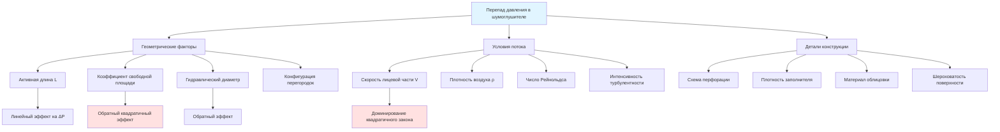

Перепад давления через шумоглушители воздуховодов представляет критический параметр проектирования, влияющий на энергопотребление вентилятора, эксплуатационные расходы системы и компромиссы в отношении акустических характеристик. Понимание фундаментальных взаимосвязей между геометрией шумоглушителя, характеристиками потока воздуха и потерями давления позволяет инженерам оптимизировать выбор шумоглушителя для минимизации затрат на весь период эксплуатации при достижении требуемого акустического ослабления.

## Фундаментальная теория перепада давления

Перепад давления в шумоглушителях воздуховодов является результатом трех основных механизмов: потери на трение вдоль поглощающих поверхностей, потери формы на переходах входа/выхода и турбулентность в ограниченных воздушных каналах. Общий перепад давления объединяет эти компоненты в единое системное сопротивление, которое должен преодолеть нагнетательный вентилятор.

**Основное уравнение перепада давления**

Фундаментальная взаимосвязь, управляющая перепадом давления в шумоглушителе, следует уравнению Дарси-Вейсбаха, адаптированному для приложений HVAC:

$$\Delta P = f \cdot \frac{L}{D_h} \cdot \frac{\rho V^2}{2} + K_e \cdot \frac{\rho V^2}{2}$$

Где:
- $\Delta P$ = общий перепад давления (Па)
- $f$ = коэффициент трения Дарси (безразмерный, обычно 0,02-0,08 для шумоглушителей)
- $L$ = активная длина шумоглушителя (м)
- $D_h$ = гидравлический диаметр воздушного канала (м)
- $\rho$ = плотность воздуха (кг/м³)
- $V$ = скорость потока через шумоглушитель (м/с)
- $K_e$ = коэффициент потерь на входе/выходе (обычно 0,5-1,0)

**Расчет гидравлического диаметра**

Для прямоугольных каналов между параллельными перегородками:

$$D_h = \frac{4A}{P} = \frac{4 \cdot W \cdot H}{2(W + H)} = \frac{2WH}{W + H}$$

Где:
- $A$ = площадь поперечного сечения канала (м²)
- $P$ = смоченный периметр (м)
- $W$ = ширина канала (м)
- $H$ = высота канала (м)

Для квадратных каналов (W = H): $D_h = W$

**Упрощенная инженерная формула**

Для предварительного расчета при стандартных условиях (уровень моря, 21°C):

$$\Delta P = C_f \cdot \left(\frac{V}{1000}\right)^2 \cdot \frac{L}{D_h}$$

Где $C_f$ — коэффициент конфигурации в диапазоне 0,08-0,15, зависящий от:
- Геометрии перфорации (размер отверстия, процент открытой площади)
- Плотности заполнителя и материала облицовки
- Качества выравнивания внутренних перегородок
- Шероховатости поверхности

## Коэффициент свободной площади и эффекты скорости

Коэффициент свободной площади (FAR) определяет долю площади лицевой части шумоглушителя, доступной для потока воздуха, относительно обструкции перегородкой. Этот параметр прямо влияет как на перепад давления, так и на акустические характеристики.

**Определение коэффициента свободной площади**

$$FAR = \frac{A_{канал}}{A_{всего}} = \frac{\sum(ширины\ каналов)}{общая\ ширина\ шумоглушителя}$$

**Взаимосвязь скоростей**

Для шумоглушителя с площадью лицевой части $A_f$ и объемным потоком $Q$:

Скорость лицевой части: $V_f = \frac{Q}{A_f}$

Скорость в канале: $V_a = \frac{Q}{A_f \cdot FAR} = \frac{V_f}{FAR}$

Поскольку перепад давления зависит от квадрата скорости, снижение FAR с 0,60 до 0,50 увеличивает перепад давления в $(0,60/0,50)^2 = 1,44$ раза (увеличение на 44%).

**Типичные коэффициенты свободной площади по типам шумоглушителей**

| Конфигурация шумоглушителя | Коэффициент свободной площади | Относительный перепад давления | Акустическое преимущество |
|------------------------|-----------------|------------------------|-------------------|
| Широкие каналы (20 см) | 0,65-0,70 | Базовое (1,0×) | Нижнее IL/м |
| Стандартные каналы (15 см) | 0,55-0,60 | 1,3-1,5× | Сбалансированная производительность |
| Узкие каналы (10 см) | 0,45-0,50 | 1,8-2,2× | Более высокое IL/м |
| Высокопроизводительные (7,5 см) | 0,35-0,40 | 2,8-3,5× | Максимальное IL/м |

Более узкие каналы увеличивают отношение периметра к площади (P/A), улучшая акустическое поглощение, но значительно увеличивая перепад давления. Оптимальный баланс зависит от конкретных требований проекта и анализа энергетических затрат.

## Влияние длины шумоглушителя

Перепад давления увеличивается линейно с длиной шумоглушителя при полностью развитом турбулентном потоке, тогда как потери вставки следуют логарифмической зависимости с уменьшающимися возвратами при увеличенных длинах.

**Влияние длины на перепад давления**

Удвоение длины шумоглушителя удваивает компоненту трения перепада давления:

$$\frac{\Delta P_2}{\Delta P_1} = \frac{L_2}{L_1}$$

Однако потери на входе/выходе остаются постоянными независимо от длины.

**Сравнительный перепад давления по длинам**

| Длина шумоглушителя | 305 м/ч | 457 м/ч | 610 м/ч | 762 м/ч | 914 м/ч |
|-----------------|----------|----------|----------|----------|----------|
| 0,9 м | 10 Па | 22 Па | 40 Па | 62 Па | 89 Па |
| 1,5 м | 17 Па | 37 Па | 67 Па | 104 Па | 149 Па |
| 2,1 м | 25 Па | 54 Па | 94 Па | 146 Па | 210 Па |
| 3,0 м | 35 Па | 77 Па | 134 Па | 208 Па | 300 Па |

Значения для прямоугольных шумоглушителей с FAR 0,55.

**Акустическая эффективность в сравнении со штрафом на давление**

Потеря вставки на единицу перепада давления обеспечивает метрику для сравнения эффективности шумоглушителя:

$$\eta_{акустическая} = \frac{IL_{средн.}\ (дБ)}{\Delta P\ (Па)}$$

Более короткие шумоглушители обычно демонстрируют более высокие значения $\eta_{акустическая}$, что делает их предпочтительными при умеренном ослаблении и доминирующих затратах на энергию в расчетах жизненного цикла.

## Перепад давления по типам шумоглушителей

Различные конфигурации шумоглушителей демонстрируют различные характеристики перепада давления на основе конструкции и характеров потока воздуха.

### Шумоглушители с параллельными перегородками (прямоугольные)

Стандартная конструкция с множественными параллельными перегородками создает равномерное распределение потока воздуха и предсказуемый перепад давления. Потери давления тесно коррелируют с FAR и длиной перегородки.

**Типичная производительность:**
- Перепад давления: 37-99 Па при 610 м/ч
- Коэффициент свободной площади: 0,50-0,60
- Лучшее применение: Основные каналы подачи/возврата

### Шумоглушители центрального стержня (круглые)

Конструкция центрального стержня концентрирует поглощающий материал вдоль осевой линии канала, создавая кольцевой поток воздуха. Диаметр стержня относительно диаметра канала определяет перепад давления.

**Влияние отношения диаметров:**

| Отношение стержень/канал | FAR | Коэффициент перепада давления | Комментарии |
|----------------|-----|---------------------|----------|
| 0,40 | 0,84 | 1,0× | Минимальный перепад давления, нижнее IL |
| 0,50 | 0,75 | 1,3× | Сбалансированная конструкция |
| 0,60 | 0,64 | 1,7× | Более высокое IL, умеренное давление |
| 0,70 | 0,51 | 2,6× | Максимальное IL, высокий перепад давления |

**Типичная производительность:**
- Перепад давления: 25-74 Па при 610 м/ч
- Коэффициент свободной площади: 0,65-0,85
- Лучшее применение: Круглые магистральные каналы, ограниченное пространство

### Шумоглушители колена

Шумоглушители колена объединяют акустическую обработку с изменением направления, исключая отдельное колено. Перепад давления включает как трение, так и потери формы от поворота на 90°.

**Типичная производительность:**
- Перепад давления: 62-149 Па при 610 м/ч
- Эквивалент: Прямой шумоглушитель + стандартное колено
- Лучшее применение: Установки с ограниченным пространством

### Сравнение диссипативных и реактивных типов

| Тип | Перепад давления | Широкополосная производительность | Пригодность для HVAC |
|------|---------------|----------------------|------------------|
| Диссипативный (волокнистое заполнение) | Умеренный (37-99 Па) | Отличная | Стандартный выбор |
| Реактивный (камера/резонатор) | Низкий (12-37 Па) | Узкополосный только | Редко в HVAC |
| Гибридный (комбинированный) | Умеренный-высокий (50-124 Па) | Очень хороший | Специализированные приложения |

## Энергетическое воздействие и эксплуатационные расходы

Перепад давления напрямую переводится в энергопотребление вентилятора через фундаментальное уравнение мощности вентилятора:

$$P_{вентилятор} = \frac{Q \cdot \Delta P}{\eta_{вентилятор}} = \frac{Q \cdot \Delta P}{423000 \cdot \eta_{вентилятор}}$$

Где:
- $P_{вентилятор}$ = мощность вентилятора (кВт)
- $Q$ = расход воздуха (м³/ч)
- $\Delta P$ = общее давление (Па)
- $\eta_{вентилятор}$ = общий КПД вентилятора (обычно 0,55-0,75)

**Расчет годовой стоимости энергии**

$$Стоимость_{годовая} = P_{вентилятор} \cdot t_{часы} \cdot c_{кВтч}$$

Где:
- $t_{часы}$ = годовые часы эксплуатации
- $c_{кВтч}$ = стоимость электроэнергии ($/кВтч)

**Пример сравнения энергетических расходов**

Параметры системы:
- Расход воздуха: 4,72 м³/с (10 000 CFM)
- Часы эксплуатации: 4 000 ч/год
- Стоимость электроэнергии: 0,12 $/кВтч
- КПД вентилятора: 0,65

| Перепад давления шумоглушителя | Мощность вентилятора | Годовое кВтч | Годовая стоимость | 10-летняя стоимость |
|-------------|-----------|------------|-------------|--------------|
| 50 Па | 3,6 кВт | 14 300 | 1 716 $ | 17 160 $ |
| 99 Па | 7,1 кВт | 28 600 | 3 432 $ | 34 320 $ |
| 149 Па | 10,7 кВт | 42 900 | 5 148 $ | 51 480 $ |
| 198 Па | 14,3 кВт | 57 200 | 6 864 $ | 68 640 $ |

Увеличение перепада давления на 99 Па обходится в 17 160 $ за 10 лет для этой системы среднего размера. Крупные системы с более высокими расходами испытывают пропорционально большие энергетические штрафы.

## Факторы, влияющие на перепад давления

## Стратегии проектной оптимизации

**Стратегия 1: Максимизировать коэффициент свободной площади**

Указывайте более широкие каналы, если акустические требования позволяют. Увеличение ширины канала с 10 см до 15 см (FAR с 0,50 до 0,60) снижает перепад давления примерно на 30% с соответствующим снижением потерь вставки на 2-4 дБ.

**Стратегия 2: Снизить скорость лицевой части**

Увеличивайте размеры лицевой части шумоглушителя для достижения более низких скоростей. Поскольку $\Delta P \propto V^2$, снижение скорости с 610 м/ч до 457 м/ч (снижение на 25%) уменьшает перепад давления на 44%.

Корректировка площади лицевой части:

$$A_{новая} = A_{исходная} \cdot \left(\frac{V_{исходная}}{V_{целевая}}\right)$$

**Стратегия 3: Минимизировать требуемую длину**

Используйте самый короткий шумоглушитель, который достигает требуемых потерь вставки. Рассмотрите несколько более коротких шумоглушителей в серии вместо одного длинного блока, если позволяют ограничения по установке, так как это обеспечивает акустическую избыточность с эквивалентным или более низким общим перепадом давления.

**Стратегия 4: Выбрать подходящий тип шумоглушителя**

Сопоставьте конфигурацию шумоглушителя с приложением:
- Приоритет низкого перепада давления: Центральные стержни в круглых каналах или ширококанальные прямоугольные блоки
- Приоритет максимального ослабления: Узкоканальные параллельные перегородки
- Сбалансированный подход: Стандартные прямоугольные с FAR 0,55-0,60

## Тестирование и проверка

ASTM E477 "Стандартный метод испытания для лабораторного измерения акустической и аэродинамической производительности материалов облицовки воздуховодов и готовых шумоглушителей" устанавливает процедуры измерения перепада давления наряду с потерями вставки. Производители предоставляют сертифицированные данные испытаний, показывающие кривые перепада давления в диапазоне скоростей.

**Полевая проверка**

Установите датчики давления в 2-3 диаметрах воздуховода выше и ниже шумоглушителя, избегая турбулентных областей вблизи колен или переходов. Используйте откалиброванные манометры или датчики дифференциального давления для измерения фактического перепада давления при расходе проектирования.

Измеренные значения, превышающие прогнозы производителя более чем на 20%, указывают на:
- Неправильную установку с препятствиями потоку воздуха
- Поврежденный или сжатый поглощающий материал
- Производственные дефекты или отклонения от спецификации

## Стандарты и справочные материалы ASHRAE

Справочник ASHRAE—Приложения HVAC, Глава 49 (Контроль звука и вибрации) обеспечивает комплексное руководство по расчетам перепада давления шумоглушителя и процедурам выбора. Глава включает поправочные коэффициенты для:
- Высоты (сниженная плотность воздуха уменьшает перепад давления)
- Температуры (более высокие температуры снижают плотность)
- Влажности (минимальный эффект на перепад давления)

Расчеты перепада давления учитывают стандартную плотность воздуха 1,20 кг/м³ на уровне моря. На высоте 1500 м плотность воздуха снижается примерно на 13%, уменьшая перепад давления примерно на 13%.

Стандарт ASHRAE 90.1 (Энергетический стандарт для зданий) косвенно обращается к перепаду давления шумоглушителя через ограничения мощности вентилятора и бюджеты перепада давления для компонентов системы. Общий перепад давления системы, включая шумоглушители, должен оставаться в пределах эффективного диапазона работы вентилятора.

## Экономическая основа для принятия решений

Общая стоимость жизненного цикла объединяет первоначальную стоимость и эксплуатационные расходы за период анализа:

$$LCC = C_{начальная} + \sum_{i=1}^{n} \frac{C_{энергия,i}}{(1+d)^i}$$

Где:
- $LCC$ = стоимость жизненного цикла
- $C_{начальная}$ = стоимость оборудования и установки
- $C_{энергия,i}$ = энергетическая стоимость в году i
- $d$ = ставка дисконтирования
- $n$ = период анализа (обычно 15-20 лет)

Шумоглушители с низким перепадом давления имеют более высокую первоначальную стоимость, но сниженные эксплуатационные расходы. Оптимальный выбор зависит от тарифов на электроэнергию, графиков работы и ставок дисконтирования. На объектах с постоянной работой и высокими энергетическими расходами премиальные шумоглушители с низким перепадом давления обычно оказываются экономичными, несмотря на 20-40% более высокие первоначальные инвестиции.

Выбирайте шумоглушители, балансируя акустическую производительность, перепад давления, физические ограничения и экономику жизненного цикла. Оптимизация минимальной первоначальной стоимости часто приводит к существенно более высоким эксплуатационным расходам в течение срока службы системы, особенно в системах с расширенным графиком работы или требующих значительного ослабления с использованием более длинных шумоглушителей.
