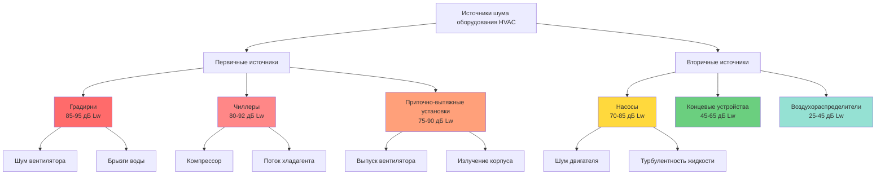

## Обзор

Уровни шума оборудования представляют основную акустическую проблему при проектировании систем HVAC для помещений общего пользования. Хотя шум, передаваемый по воздуховодам, может быть ослаблен с помощью глушителей и конструкций с низкой скоростью воздушного потока, шум, создаваемый оборудованием, требует контроля источника путем тщательного выбора, размещения и виброизоляции. Понимание уровней звуковой мощности, характеристик в октавных полосах и акустических характеристик конкретного оборудования позволяет проектировщикам указать системы, которые соответствуют строгим требованиям NC 15-25 без дорогостоящих переделок.

Уровень звуковой мощности (Lw) характеризует общую акустическую энергию, излучаемую оборудованием независимо от расстояния или характеристик помещения. Этот независимый от частоты показатель позволяет прямое сравнение между производителями и прогнозирование установленных уровней звукового давления с использованием установленных акустических формул. ASHRAE Fundamentals, глава 8, и AMCA Publication 300 содержат стандартизированные методы испытаний и процедуры оценки, которые обеспечивают надежные акустические прогнозы.

## Основы определения уровня звуковой мощности

### Расчет уровня звуковой мощности

Уровень звуковой мощности представляет логарифмическое отношение выходной акустической мощности к эталонному уровню мощности:

$$L_w = 10 \log_{10} \left( \frac{W}{W_0} \right)$$

Где:
- $L_w$ = уровень звуковой мощности (дБ относительно $10^{-12}$ Вт)
- $W$ = выходная акустическая мощность (Вт)
- $W_0$ = эталонная мощность = $10^{-12}$ Вт

Для оборудования с несколькими источниками общая звуковая мощность складывается логарифмически:

$$L_{w,total} = 10 \log_{10} \left( \sum_{i=1}^{n} 10^{L_{w,i}/10} \right)$$

Эта зависимость демонстрирует, что объединение двух идентичных источников (одинаковых Lw) увеличивает общую звуковую мощность на 3 дБ, а не удваивает ее.

### Анализ в октавных полосах

Звуковая мощность оборудования должна анализироваться в октавных полосах для проверки соответствия кривым NC, которые устанавливают зависящие от частоты пределы:

$$L_{w,oct} = L_{w,overall} + K_{oct}$$

Где:
- $L_{w,oct}$ = звуковая мощность в октавной полосе (дБ)
- $L_{w,overall}$ = общая звуковая мощность с взвешиванием по шкале А (дБА)
- $K_{oct}$ = коэффициент коррекции октавной полосы из данных производителя

Стандартные октавные полосы для анализа HVAC: 63 Гц, 125 Гц, 250 Гц, 500 Гц, 1000 Гц, 2000 Гц, 4000 Гц, 8000 Гц.

### Затухание на расстоянии

Уровень звукового давления в точке приема уменьшается с расстоянием согласно закону обратных квадратов для точечных источников:

$$L_p = L_w - 20 \log_{10}(r) - 11$$

Где:
- $L_p$ = уровень звукового давления на расстоянии r (дБ)
- $r$ = расстояние от источника (м)
- 11 дБ = константа для точечного источника в свободном поле

Для линейных источников (трубопроводные магистрали) затухание следует:

$$L_p = L_w - 10 \log_{10}(r) - 8$$

## Иерархия уровней шума оборудования HVAC

## Уровни шума приточно-вытяжных установок

### Акустические характеристики приточно-вытяжных установок

Приточно-вытяжные установки генерируют шум несколькими механизмами: вращение вентилятора, турбулентность воздуха, работа двигателя и вибрация корпуса. Общая звуковая мощность приточно-вытяжной установки зависит от типа вентилятора, расхода воздуха, статического давления и конструкции корпуса.

**Типичные уровни звуковой мощности приточно-вытяжных установок по конфигурации:**

| Тип приточно-вытяжной установки | Расход воздуха (CFM) | Тип вентилятора | Lw Общее (дБА) | Lw @ 500 Гц (дБ) |
|----------------------------------|----------------------|------------------|-----------------|------------------|
| Всасывающая | 8,500 (14,500 м³/ч) | Центробежный FC | 78 | 72 |
| Всасывающая | 17,000 (28,900 м³/ч) | Центробежный FC | 83 | 77 |
| Всасывающая | 34,000 (57,800 м³/ч) | Центробежный AF | 88 | 82 |
| Нагнетающая | 8,500 (14,500 м³/ч) | Центробежный FC | 81 | 75 |
| Нагнетающая | 17,000 (28,900 м³/ч) | Центробежный FC | 86 | 80 |
| Нагнетающая | 34,000 (57,800 м³/ч) | Центробежный AF | 91 | 85 |
| Вентилятор в камере | 17,000 (28,900 м³/ч) | Радиальный вентилятор | 80 | 74 |
| Вентилятор в камере | 34,000 (57,800 м³/ч) | Радиальный вентилятор | 85 | 79 |

Примечание: FC = с загнутыми вперед лопатками, AF = аэродинамический профиль. Конфигурации всасывания обеспечивают на 3-5 дБ более низкий уровень звуковой мощности выпуска.

### Выбор вентилятора для низкого шума

Выбор вентилятора принципиально определяет акустические характеристики приточно-вытяжной установки. Работа вентиляторов на пиковой эффективности (обычно 70-80% от максимального каталогизированного объема) минимизирует генерацию шума:

$$L_{w,fan} = K_w + 10 \log_{10}(Q) + 20 \log_{10}(P_{sf})$$

Где:
- $K_w$ = специфичная для вентилятора константа (из данных AMCA)
- $Q$ = расход воздуха (CFM)
- $P_{sf}$ = статическое давление вентилятора (Па)

Эта зависимость показывает, что удвоение статического давления увеличивает звуковую мощность на 6 дБ, а удвоение расхода воздуха увеличивает звуковую мощность на 3 дБ.

**Классификация типов вентиляторов по уровню звуковой мощности (от самого тихого к самому громкому):**

1. Центробежный с загнутыми назад аэродинамическими лопатками (Kw = 35-40)
2. Центробежный с загнутыми назад лопатками (Kw = 38-43)
3. Радиальные/радиальные вентиляторы (Kw = 40-45)
4. Центробежный с загнутыми вперед лопатками (Kw = 45-50)
5. Осевые вентиляторы (Kw = 48-53)

### Излучение шума корпусом приточно-вытяжной установки

Излучение шума корпусом происходит, когда внутренняя звуковая энергия передается через стенки приточно-вытяжной установки. Двойная конструкция стенок с изоляцией из стекловолокна толщиной 5-10 см обеспечивает затухание на 15-25 дБ в октавных полосах:

| Частота (Гц) | Однослойная стенка 22 калибра | Двойная стенка 5 см изоляции | Двойная стенка 10 см изоляции |
|--------------|-------------------------------|-------------------------------|-------------------------------|
| 63 | 8 дБ | 18 дБ | 22 дБ |
| 125 | 12 дБ | 22 дБ | 28 дБ |
| 250 | 16 дБ | 26 дБ | 32 дБ |
| 500 | 18 дБ | 28 дБ | 35 дБ |
| 1000 | 20 дБ | 30 дБ | 38 дБ |
| 2000 | 22 дБ | 32 дБ | 40 дБ |
| 4000 | 24 дБ | 34 дБ | 42 дБ |

Указывайте приточно-вытяжные установки с двойной стенкой и акустической облицовкой для применения в помещениях общего пользования. Требуйте сертифицированные звуковые характеристики AMCA 300.

## Уровни шума чиллеров

### Акустические характеристики чиллеров

Чиллеры генерируют шум в основном посредством работы компрессора, потока хладагента и модуляции регулирующего клапана. Водяные центробежные чиллеры обеспечивают самые низкие уровни шума, в то время как воздушные роторные и винтовые чиллеры создают значительно более высокий выход.

**Уровни звуковой мощности чиллеров по типам:**

| Тип чиллера | Производительность (кВт) | Компрессор | Lw Общее (дБА) | Lw @ 125 Гц (дБ) | Lw @ 500 Гц (дБ) |
|-------------|--------------------------|-----------|-----------------|------------------|------------------|
| Центробежный, водяной | 704 | Одноступенчатый | 82 | 79 | 76 |
| Центробежный, водяной | 1760 | Одноступенчатый | 87 | 84 | 81 |
| Центробежный, водяной | 3520 | Двухступенчатый | 90 | 87 | 84 |
| Винтовой, водяной | 704 | Двойной винт | 85 | 83 | 80 |
| Винтовой, водяной | 1760 | Двойной винт | 90 | 88 | 85 |
| Роторный, воздушный | 176 | Несколько роторов | 84 | 78 | 75 |
| Роторный, воздушный | 352 | Несколько роторов | 89 | 83 | 80 |
| Винтовой, воздушный | 704 | Одинарный винт | 92 | 88 | 85 |

### Управление шумом компрессора

Шум, создаваемый компрессором, доминирует в акустическом выходе чиллера, особенно на низких частотах (63-250 Гц), где пределы кривой NC наиболее ограничительны. Компрессоры с переменной скоростью, работающие при частичной нагрузке, снижают звуковую мощность на 3-8 дБ по сравнению с работой при полной нагрузке.

Изоляция на монтажных опорах снижает передачу вибраций через конструкцию, но не влияет на излучение воздушного шума. Акустические кожухи чиллеров обеспечивают вставку затухания на 10-20 дБ при правильном проектировании с звукопоглощающей внутренней облицовкой и герметизированными панелями доступа.

### Требования к размещению чиллера

Располагайте чиллеры с минимальным горизонтальным расстоянием 30 м от помещений общего пользования или изолируйте конструкцией STC 60+. Механические помещения над залами производительности требуют железобетонных конструктивных плит толщиной 15-20 см с непрерывным виброизолирующим подслоем для предотвращения передачи низкочастотного шума.

## Уровни шума насосов

### Акустический выход насосов

Насосы генерируют шум посредством работы двигателя, вращения рабочего колеса, турбулентности жидкости и кавитации. Правильно выбранные насосы, работающие в номинальных условиях, создают звуковую мощность 70-80 дБА, в то время как перегруженные насосы, дросселируемые регулирующими клапанами, могут превышать 85 дБА.

**Уровни звуковой мощности насосов:**

| Тип насоса | Подача (л/мин) | Напор (м) | Мощность двигателя (кВт) | Lw Общее (дБА) | Lw @ 250 Гц (дБ) |
|-----------|---------------|----------|---------------------------|-----------------|------------------|
| Консольный | 378 | 15 | 3.7 | 73 | 68 |
| Консольный | 1893 | 24 | 18.6 | 79 | 74 |
| Консольный | 3785 | 30 | 37.3 | 83 | 78 |
| Спиральный | 3785 | 45 | 55.9 | 85 | 80 |
| Спиральный | 7570 | 60 | 111.8 | 89 | 84 |
| Вертикальный встроенный | 757 | 18 | 7.5 | 76 | 71 |
| Вертикальный встроенный | 1893 | 30 | 22.4 | 81 | 76 |

### Шум кавитации

Кавитация происходит, когда локальное давление жидкости падает ниже давления пара, создавая и разрушая пузырьки пара. Это явление генерирует широкополосный шум на 10-20 дБ выше нормальной работы насоса и вызывает быстрое повреждение рабочего колеса.

Предотвращайте кавитацию, поддерживая доступный чистый напор на стороне всасывания (NPSHa) по крайней мере на 1.5 м выше требуемого чистого напора на стороне всасывания (NPSHr):

$$NPSH_a = P_{атм} + P_{статическое} - P_{пара} - h_{потери}$$

Где все члены выражены в метрах жидкого столба.

### Виброизоляция насосов

Устанавливайте насосы на пружинные изоляторы со статическим прогибом 3.8-5.1 см или эластомерные подкладки. Устанавливайте гибкие соединители на трубопроводы всасывания и нагнетания в пределах 10 см от фланцев насоса. Обеспечивайте инерционные основания (массой в 2-2.5 раза больше массы насоса) для насосов мощностью более 15 кВт.

## Уровни шума градирен

### Акустические характеристики градирен

Градирни входят в число самых шумных оборудования HVAC, сочетая шум вентилятора со звуком брызг воды. Открытые градирни прямого типа генерируют 85-95 дБА при типичных условиях работы, создавая серьезные проблемы для объектов, прилегающих к помещениям общего пользования.

**Уровни звуковой мощности градирен:**

| Тип градирни | Производительность (кВт) | Мощность вентилятора (кВт) | Количество вентиляторов | Lw Общее (дБА) | Lw @ 500 Гц (дБ) |
|--------------|--------------------------|---------------------------|------------------------|----|
| Тяговая, открытая | 704 | 7.5 | 2 | 87 | 82 |
| Тяговая, открытая | 1760 | 15 | 2 | 91 | 86 |
| Тяговая, открытая | 3520 | 22.4 | 3 | 94 | 89 |
| Напорная, открытая | 704 | 11.2 | 2 | 89 | 84 |
| Напорная, открытая | 1760 | 18.6 | 2 | 93 | 88 |
| Замкнутая система | 704 | 11.2 | 2 | 85 | 80 |
| Замкнутая система | 1760 | 18.6 | 2 | 89 | 84 |

### Затухание шума градирни

Несколько стратегий снижают передачу шума градирни в смежные помещения:

1. **Вентиляторы низкой скорости** - Снижение окружной скорости вентилятора с 3.6 до 2.4 м/с для снижения на 6-8 дБ
2. **Выпускные камеры** - Добавление высоты камеры выше вентиляторов на 1.8-3 м для затухания на 5-8 дБ
3. **Звуковые барьеры** - Установка периметральных стен с массой 20-30 кг/м² для снижения на 10-15 дБ
4. **Акустические жалюзи** - Замена стандартных входных жалюзи на акустические версии для вставки затухания на 8-12 дБ

Объединение стратегий обеспечивает кумулятивное затухание, приближающееся к 25-30 дБ, что достаточно для градирен, расположенных на расстоянии 15+ м от помещений общего пользования.

### Альтернативные системы охлаждения

Рассмотрите замкнутые системы для объектов, где шум градирни оказывается непреодолимой проблемой:

- Сухие охладители (воздушные охладители жидкости): 82-88 дБА, без шума брызг воды
- Адиабатические охладители: 84-90 дБА, предварительное охлаждение минимизирует шум испарения
- Гибридные градирни: переключение в сухой режим при низкой нагрузке или на чувствительные к шуму периоды

## Стандарты тестирования и проверки

### AMCA 300 - Стандарты звукового тестирования

AMCA Publication 300, "Reverberant Room Method for Sound Testing of Fans" (Метод реверберирующей камеры для звукового тестирования вентиляторов), устанавливает стандартизированные процедуры тестирования для определения уровней звуковой мощности вентиляторов. Этот стандарт требует:

- Реверберирующую камеру, соответствующую критериям квалификации (T60 > 1.5 сек)
- Фоновый шум на 10 дБ ниже уровней испытаний
- Измерения в октавных полосах от 63 Гц до 8000 Гц
- Множественные позиции микрофонов (минимум 6) с усреднением во времени
- Коррекция для характеристик поглощения в помещении

Указывайте, что все вентиляторы и приточно-вытяжные установки включают сертифицированные звуковые характеристики AMCA 300. Отклоняйте оборудование без сертифицированных данных производительности.

### AHRI 370 - Рейтинг звука чиллера

Стандарт AHRI 370 устанавливает процедуры оценки звука и тестирования для жидкостных холодильных пакетов. Тестирование происходит в полуреверберирующих условиях с применением коррекций для характеристик помещения. Сертифицированные рейтинги включают:

- Уровни звуковой мощности по октавным полосам
- Общий уровень звуковой мощности с взвешиванием по шкале А
- Эталонный уровень звукового давления на расстоянии 5 м
- Условие работы (полная нагрузка, частичная нагрузка)

### Тестирование уровня звука при проверке

Проводите тестирование звука после установки для проверки соответствия критериям проектирования:

1. **Измерение фонового шума** - Измерьте окружающий уровень со всем оборудованием, отключенным
2. **Измерение работы оборудования** - Измерьте с включенным конкретным оборудованием
3. **Анализ в октавных полосах** - Сравните измеренные уровни с пределами кривой NC
4. **Идентификация источника** - Изолируйте чрезмерные источники для исправления

Требуйте от подрядчика тестирование, проводимое сертифицированными акустическими консультантами для помещений NC 15-25. Задокументируйте все измерения и передайте проектной группе для проверки.

## Заключение

Уровни шума оборудования определяют акустический успех систем HVAC помещений общего пользования. Выбор оборудования с низким уровнем шума (вентиляторы с аэродинамическим профилем, центробежные чиллеры, правильно подобранные насосы), стратегическое размещение с адекватным разделением и комплексная виброизоляция образуют основу эффективного акустического проектирования. Уровни звуковой мощности, сертифицированные в соответствии со стандартами AMCA 300 и AHRI 370, обеспечивают надежные прогнозы, в то время как тестирование после установки проверяет соответствие. Надбавка в стоимости на 10-15% для оборудования с акустическими характеристиками представляет важное инвестирование для достижения производительности NC 15-25 в театрах, концертных залах и аудиториях. Обратитесь к ASHRAE Handbook—Fundamentals, глава 8, для процедур акустического расчета и ASHRAE Handbook—HVAC Applications, глава 49, для рекомендаций по конкретному оборудованию.
