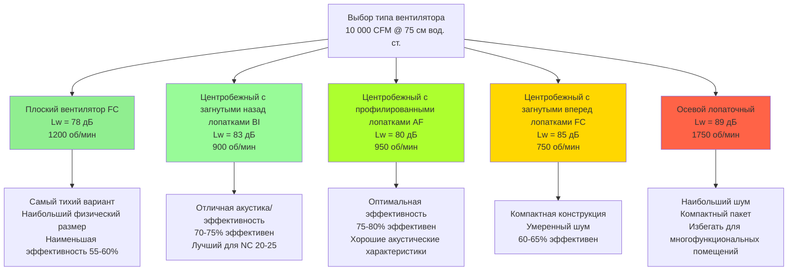

## Обзор

Выбор вентилятора представляет наиболее критичное решение при достижении приемлемых акустических характеристик в системах HVAC для многофункциональных помещений. Вентилятор определяет базовый уровень звуковой мощности, которая распространяется по всей системе распределения, и неправильный выбор может сделать даже тщательно спроектированную систему воздуховодов неспособной соответствовать критериям NC 15-25. Вентиляторы, работающие в приложениях многофункциональных помещений, должны обеспечивать значительный расход воздуха (обычно 10 000–50 000 CFM (16,99–84,95 м³/ч)) при генерировании звуковой мощности на 15–20 дБ меньше, чем вентиляторы в обычных коммерческих системах.

Акустические характеристики вентилятора зависят от шести основных факторов: типа вентилятора, конструкции крыльчатки, точки работы относительно пиковой эффективности, частоты вращения, условий на входе и выходе, а также эффектов системы. Каждый фактор логарифмически вносит вклад в общий выход звуковой мощности, что делает оптимизацию всех параметров существенной, а не факультативной.

## Основы звуковой мощности вентилятора

### Определение уровня звуковой мощности

Уровень звуковой мощности ($L_w$) представляет собой общую акустическую энергию, излучаемую вентилятором, измеренную в децибелах относительно $10^{-12}$ ватт. В отличие от уровня звукового давления, который варьируется в зависимости от расстояния и акустики помещения, уровень звуковой мощности является внутренним свойством источника.

Связь между аэродинамическими характеристиками вентилятора и звуковой мощностью следует эмпирически полученным уравнениям. Для центробежных вентиляторов общий уровень звуковой мощности коррелирует с размером вентилятора и рабочими условиями:

$$L_w = K_w + 10\log_{10}(Q) + 20\log_{10}(P) + C$$

Где:
- $L_w$ = общий уровень звуковой мощности (дБ относительно $10^{-12}$ Вт)
- $K_w$ = коэффициент удельной звуковой мощности (зависит от типа вентилятора)
- $Q$ = расход воздуха (CFM (м³/ч))
- $P$ = общее давление (см вод. ст.)
- $C$ = коэффициент коррекции для точки работы и установки

### Распределение по октавным полосам

Вентиляторы генерируют звуковую мощность по всему спектру частот, но распределение значительно варьируется в зависимости от типа вентилятора. Уровень звуковой мощности по октавной полосе на частоте $f$ можно оценить на основе общей звуковой мощности:

$$L_{w,f} = L_w - \Delta L_f$$

Где $\Delta L_f$ представляет сокращение октавной полосы от общего уровня. Для центробежных вентиляторов с загнутыми назад лопатками, работающих в точке проектирования:

| Центральная частота октавной полосы (Гц) | $\Delta L_f$ (дБ) | Типичное применение |
|-------------------------------------------|-------------------|---------------------|
| 63 | -12 | Низкочастотный гул |
| 125 | -8 | Проблема передачи через конструкцию |
| 250 | -3 | Первичная акустическая энергия |
| 500 | -1 | Пиковый выход звуковой мощности |
| 1000 | -2 | Диапазон частоты речи |
| 2000 | -5 | Содержание высокочастотного звука |
| 4000 | -10 | Обычно ослабляется глушителями |
| 8000 | -16 | Минимальный вклад в NC |

Концентрация акустической энергии в диапазоне 250–1000 Гц непосредственно совпадает с максимальной чувствительностью человеческого уха и частотами разборчивости речи, что делает анализ октавной полосы необходимым для приложений многофункциональных помещений.

### Связь между скоростью вентилятора и звуковой мощностью

Уровень звуковой мощности резко возрастает с частотой вращения вентилятора в соответствии с законами вентиляторов. Для вентилятора, работающего на своей характеристической кривой:

$$L_{w2} = L_{w1} + 50\log_{10}\left(\frac{N_2}{N_1}\right)$$

Где:
- $L_{w1}$, $L_{w2}$ = уровни звуковой мощности на скоростях $N_1$ и $N_2$
- $N_1$, $N_2$ = частоты вращения (об/мин)

Это отношение демонстрирует, почему снижение скорости вентилятора на 20% (посредством управления VFD или механического изменения скорости) снижает звуковую мощность примерно на 8,5 дБ — явно слышимую разницу. Для многофункциональных помещений это отношение определяет фундаментальную стратегию: выбирайте более крупные, медленно вращающиеся вентиляторы вместо более мелких, быстрых единиц.

### Акустический предел скорости кончика лопатки

Скорость на кончике лопатки вентилятора ($V_{tip}$) принципиально ограничивает акустические характеристики. Скорость на кончике связана с диаметром вентилятора и частотой вращения:

$$V_{tip} = \frac{\pi D N}{720}$$

Где:
- $V_{tip}$ = скорость на кончике лопатки (м/с)
- $D$ = диаметр крыльчатки (см)
- $N$ = частота вращения (об/мин)

Для приложений многофункциональных помещений поддерживайте скорости на кончике ниже следующих пределов:

| Тип вентилятора | Максимальная скорость кончика | Предел применения |
|------------------|-------------------------------|-------------------|
| Плоские вентиляторы (FC) | 61 м/с | Помещения NC 15-20 |
| Центробежный с загнутыми назад лопатками | 114 м/с | Помещения NC 20-25 |
| Центробежный с профилированными лопатками | 152 м/с | Помещения NC 25-30 |
| Осевые вентиляторы лопаточного типа | 183 м/с | Не рекомендуется для критичной акустики |

Превышение этих пределов генерирует турбулентный шум, который не может быть эффективно ослаблен нижестоящими глушителями, особенно в высокочастотных октавных полосах.

## Акустические характеристики типов вентиляторов

### Сравнительные уровни звуковой мощности

Различные типы вентиляторов демонстрируют характерные уровни звуковой мощности при эквивалентных аэродинамических характеристиках. Следующая диаграмма иллюстрирует относительную акустическую производительность:

### Плоские вентиляторы (с загнутыми вперед лопатками)

Плоские вентиляторы используют крыльчатку с загнутыми вперед лопатками в корпусе, спроектированном для прямой установки в потолочный плоский пленум. Их акустическое преимущество вытекает из:

1. **Низкая скорость вращения** — обычно 600–1200 об/мин, что обеспечивает минимальный шум от частоты прохождения лопаток
2. **Большой диаметр крыльчатки** — 91–152 см для среднего расхода воздуха, поддерживая низкую скорость на кончике
3. **Плавный воздушный поток** — множество пологих лопаток (40–64 лопатки) создают равномерный выброс

**Характеристики звуковой мощности:**

| Расход воздуха (CFM) | Статическое давление (см вод. ст.) | Общий $L_w$ (дБ) | $L_w$ на 500 Гц (дБ) |
|----------------------|-------------------------------------|------------------|----------------------|
| 5 000 | 51 | 73 | 65 |
| 10 000 | 64 | 78 | 70 |
| 15 000 | 76 | 82 | 74 |
| 20 000 | 89 | 85 | 77 |

Плоские вентиляторы представляют оптимальный выбор для приложений NC 15–20 (концертные залы, студии звукозаписи) несмотря на более низкую статическую эффективность (55–65%) и больший размер оборудования.

### Центробежные вентиляторы с загнутыми назад лопатками

Вентиляторы с загнутыми назад лопатками (BI) используют лопатки из одного слоя профилированного материала или изогнутые лопатки, наклоненные от направления вращения. Эти вентиляторы обеспечивают лучший баланс акустических характеристик и энергетической эффективности для большинства приложений многофункциональных помещений.

**Ключевые акустические преимущества:**

- **Неперегружающая характеристика мощности** — мощность достигает пика около точки проектирования, предотвращая перегрузку двигателя
- **Стабильная точка работы** — хорошо работает при 60–100% расхода проектирования
- **Умеренная скорость** — 800–1400 об/мин для средних единиц
- **Самоочищающаяся** — загнутая назад конструкция устойчива к накоплению пыли

**Звуковая мощность по размеру (75 см вод. ст.):**

| Размер вентилятора (см) | Расход воздуха при пиковой эффективности (CFM) | Скорость (об/мин) | Скорость на кончике (м/с) | Общий $L_w$ (дБ) |
|-------------------------|--------------------------------------------------|-------------------|---------------------------|------------------|
| 46 | 5 000 | 1 350 | 41 | 79 |
| 61 | 10 000 | 1 050 | 40 | 83 |
| 76 | 16 000 | 900 | 43 | 86 |
| 91 | 25 000 | 750 | 43 | 89 |
| 107 | 35 000 | 650 | 44 | 91 |

Вентиляторы с загнутыми назад лопатками подходят для приложений NC 20–30 и представляют отраслевой стандарт для систем HVAC театров, аудиторий и лекционных залов.

### Центробежные вентиляторы с профилированными лопатками

Вентиляторы с профилированными лопатками используют толстые аэродинамические профилированные лопатки (аналогичные крыльям самолета), которые обеспечивают максимальную статическую эффективность (75–82%) с акустическими характеристиками, приближающимися к конструкциям с загнутыми назад лопатками.

**Акустические соображения:**

- Звуковая мощность примерно на 2–3 дБ ниже, чем у вентиляторов с загнутыми назад лопатками при одинаковой производительности
- Наивысшая эффективность снижает требуемую мощность двигателя и стоимость эксплуатации
- Более чувствительны к условиям входа — плохая конфигурация входа увеличивает шум на 5–8 дБ
- Оптимальны для больших систем (>20 000 CFM) в приложениях NC 25–30

### Центробежные вентиляторы с загнутыми вперед лопатками

Вентиляторы с загнутыми вперед лопатками (отличные от плоских вентиляторов) используют множество тонких лопаток, изогнутых в направлении вращения. Хотя они компактны, они генерируют на 5–7 дБ больше звуковой мощности, чем вентиляторы с загнутыми назад лопатками при эквивалентной производительности из-за:

- Более высокой частоты прохождения лопаток (60–80 лопаток против 10–16 для BI)
- Турбулентной схемы выброса
- Перегружающей характеристики мощности, требующей осторожного подбора двигателя

Используйте только в некритичных к акустике приложениях или когда ограничения по пространству препятствуют использованию более крупных типов вентиляторов.

### Осевые вентиляторы лопаточного типа и трубчатые осевые вентиляторы

Осевые вентиляторы генерируют наивысшие уровни звуковой мощности среди распространенных типов вентиляторов HVAC из-за:

1. **Высокая скорость вращения** — обычно 1 200–3 000 об/мин
2. **Вихри на кончиках лопаток** — отрыв вихря на кончиках лопаток создает широкополосный шум
3. **Узкая схема выброса** — сосредоточенная струя генерирует турбулентный шум ниже по потоку

**Типичное сравнение звуковой мощности (10 000 CFM @ 75 см вод. ст.):**

- Осевой лопаточный со входными направляющими лопатками: $L_w$ = 89 дБ
- Центробежный с загнутыми назад лопатками: $L_w$ = 83 дБ
- Разница: 6 дБ (воспринимается как примерно в два раза громче)

Избегайте осевых лопаточных вентиляторов в приложениях многофункциональных помещений. Если избежать невозможно из-за ограничений по пространству, указывайте двухступенчатые глушители (входа и выхода) и работайте на сниженной скорости через VFD.

## Оптимизация точки работы

### Работа при пиковой эффективности

Звуковая мощность вентилятора варьируется с точкой работы на кривой вентилятора. Минимальная звуковая мощность достигается при примерно 75–85% от максимального объема (точка максимальной статической эффективности для большинства центробежных вентиляторов).

Штраф за звуковую мощность при работе вне точки пика:

$$\Delta L_w = 10\log_{10}\left(\frac{1}{\eta}\right) + K_{op}$$

Где:
- $\eta$ = статическая эффективность (десятичная)
- $K_{op}$ = коэффициент коррекции для точки работы

Работа при 90% пиковой эффективности обычно добавляет 2–3 дБ к выходу звуковой мощности. Работа при 70% эффективности добавляет 5–6 дБ.

### Стратегия выбора для переменных нагрузок

Многофункциональные помещения характеризуются высокоизменяющейся занятостью и, следовательно, тепловыми нагрузками. Спроектируйте выбор вентилятора для оптимизации акустических характеристик при наиболее критичном условии работы:

1. **Размер для акустических характеристик** — выбирайте вентилятор для работы при 70–80% максимального объема при условии проектирования
2. **Используйте управление VFD** — снижайте скорость во время низконагруженных периодов для дополнительного снижения шума
3. **Рассмотрите несколько более мелких единиц** — два вентилятора на 50% мощности каждый позволяют работать одного вентилятора при низкой занятости

**Пример: концертный зал 15 000 CFM**

- Вариант A: Одиночный вентилятор, номинальный 18 000 CFM, работает при 83% объема, $L_w$ = 84 дБ
- Вариант B: Два вентилятора по 9 000 CFM каждый; один вентилятор работает во время репетиций при 60% скорости, $L_w$ = 76 дБ
- Вариант B обеспечивает снижение на 8 дБ во время большинства занятых часов

## Условия входа и выхода

### Коэффициенты эффекта системы

Плохие условия входа или выхода увеличивают звуковую мощность вентилятора на 3–10 дБ через турбулентность и разделение потока. Эффекты системы включают:

**Препятствия входа:**
- Отводы в пределах 3 диаметров вентилятора от входа: +3 до +5 дБ
- Входной глушитель или жалюзи: +2 до +4 дБ
- Обструированный вход (близость стены): +5 до +8 дБ
- Скорость входного воздуховода >7,6 м/с: +3 до +6 дБ

**Препятствия выхода:**
- Отвод выхода сразу ниже по потоку: +4 до +7 дБ
- Резкий переход (расширение/сужение): +3 до +5 дБ
- Выход в плоский пленум: +2 до +4 дБ

### Правильная конфигурация входа

Оптимальная конфигурация входа для акустических приложений:

1. **Прямой воздуховод** — минимум 4 эквивалентных диаметра прямого воздуховода перед входом вентилятора
2. **Входной раструб** — входной раструб с радиусом r/D ≥ 0,1 снижает турбулентный шум
3. **Низкая скорость входа** — ограничивайте скорость входного воздуховода до 5–7,6 м/с
4. **Направляющие лопатки** — если перед вентилятором неизбежен отвод, установите направляющие лопатки (минимум 38 мм хорда)

**Влияние конфигурации входа на звуковую мощность:**

| Условие входа | Конфигурация | Штраф за звуковую мощность |
|---------------|--------------|-----------------------------|
| Оптимальное | Прямой воздуховод, 5D длина, входной раструб | 0 дБ (базовый уровень) |
| Хорошее | Прямой воздуховод, 3D длина, без раструба | +1 до +2 дБ |
| Удовлетворительное | Отвод с направляющими лопатками, 2D длина | +3 до +4 дБ |
| Плохое | Отвод без лопаток, <2D длина | +5 до +7 дБ |
| Неприемлемое | Прямое подключение к стене, препятствие | +8 до +10 дБ |

### Размещение выходного глушителя

Размещайте выходные глушители в 3–5 диаметрах воздуховода ниже по потоку от выхода вентилятора, чтобы позволить стабилизации потока. Глушители, размещенные сразу у выхода вентилятора, работают в турбулентных полях потока, снижая номинальное ослабление вставки на 3–5 дБ и генерируя собственный шум.

## Звуковые рейтинги AMCA

### Стандарт AMCA 300

Стандарт 300 Ассоциации движения воздуха и контроля (AMCA) устанавливает единые методы расчета и отчета об уровнях звуковой мощности вентилятора. Сертификация AMCA обеспечивает:

1. **Данные звуковой мощности по октавным полосам** — опубликованы для каждой модели каталога вентилятора при нескольких точках работы
2. **Стандартная методология испытания** — испытания согласно AMCA 300 в сертифицированных лабораториях с реверберирующими камерами
3. **Категория установки** — рейтинги предоставлены для конфигурации с воздуховодом на входе/воздуховодом на выходе (DIDO), используемой в системах многофункциональных помещений

### Сертифицированная программа рейтингов AMCA

Указывайте вентиляторы с сертифицированными рейтингами AMCA для обеспечения точности данных звуковой мощности. Печать AMCA указывает на:

- Проверку третьей стороной опубликованных данных производителя
- Испытания, проведенные в лаборатории, аккредитованной AMCA
- Годовые аудиты производственного предприятия и процедур испытания
- Точность опубликованных данных в пределах ±2 дБ

**Рейтинги включают:**

| Параметр | Описание | Применение |
|----------|---------|-----------|
| $L_{wA}$ | Общая взвешенная по шкале A звуковая мощность | Однозначное сравнение |
| $L_{w,63}$ до $L_{w,8000}$ | Уровни звуковой мощности по октавным полосам | Детальный акустический анализ |
| $L_{wi}$ | Звуковая мощность входа (конфигурация DIDO) | Определение размера входного глушителя |
| $L_{wo}$ | Звуковая мощность выхода (конфигурация DIDO) | Определение размера выходного глушителя |

### Звуковая мощность при некаталожных условиях

Когда вентиляторы работают при условиях между каталожными рейтингами, интерполируйте уровни звуковой мощности. Для изменений скорости на одном вентиляторе:

$$L_{w,new} = L_{w,catalog} + 50\log_{10}\left(\frac{N_{new}}{N_{catalog}}\right)$$

Для вентиляторов разных размеров в одном семействе (геометрическое сходство):

$$L_{w,2} = L_{w,1} + 70\log_{10}\left(\frac{D_2}{D_1}\right)$$

Где $D_1$ и $D_2$ — диаметры крыльчатки.

## Процедура выбора для многофункциональных помещений

### Пошаговый процесс

**Шаг 1: Определите допустимую звуковую мощность вентилятора**

Рассчитайте допустимую звуковую мощность выхода вентилятора в обратном направлении от требования NC помещения:

1. Установите критерий NC помещения (NC 15–25 для многофункциональных помещений)
2. Определите уровень звукового давления в помещении при каждой октавной полосе из кривой NC
3. Рассчитайте допустимую звуковую мощность воздуховода на терминалах (с учетом количества диффузоров)
4. Добавьте затухание воздуховода (естественное + глушитель), чтобы найти допустимую звуковую мощность вентилятора

**Шаг 2: Установите производительность вентилятора**

Определите аэродинамические требования:
- Расход воздуха: сумма зональных нагрузок + компенсация вытяжки + герметизация
- Общее давление: трение воздуховода + перепад давления теплообменника + устройство терминала + фильтры + коэффициент безопасности (15%)

**Шаг 3: Выберите тип вентилятора**

На основе требования NC:
- NC 15–20: плоский вентилятор или увеличенный центробежный с загнутыми назад лопатками на сниженной скорости
- NC 20–25: центробежный с загнутыми назад лопатками или центробежный с профилированными лопатками
- NC 25–30: центробежный с профилированными лопатками или центробежный с загнутыми назад лопатками

**Шаг 4: Выберите размер и скорость вентилятора**

Выбирайте размер и скорость вентилятора для:
- Работы при 70–80% максимального объема
- Поддержания скорости на кончике ниже пределов (4 000–7 500 м/с в зависимости от типа вентилятора)
- Достижения статической эффективности >70%
- Обеспечения фактической звуковой мощности ≤ допустимая звуковая мощность (Шаг 1)

**Шаг 5: Подтвердите производительность**

Подтвердите:
- Лошадиные силы двигателя при максимальной точке работы
- Звуковую мощность при всех октавных полосах ниже пределов
- Минимизированные эффекты системы через правильную установку

### Пример выбора

**Требования:**
- Концертный зал, критерий NC 20
- Расход воздуха: 20 000 CFM (33,98 м³/ч)
- Общее давление: 114 см вод. ст.
- Допустимая звуковая мощность выхода: $L_w$ = 81 дБ (октавная полоса 500 Гц)

**Анализ:**

Вариант A: Центробежный с загнутыми назад лопатками, диаметр 91 см
- Скорость: 950 об/мин
- Скорость на кончике: 43 м/с (превышает предел 7 500 м/с)
- Каталог $L_w$ на 500 Гц: 83 дБ
- Вывод: неприемлемо (превышает предел звуковой мощности на 2 дБ и предел скорости на кончике)

Вариант B: Центробежный с загнутыми назад лопатками, диаметр 107 см
- Скорость: 750 об/мин
- Скорость на кончике: 40 м/с (приемлемо)
- Каталог $L_w$ на 500 Гц: 80 дБ
- Статическая эффективность: 73%
- Вывод: приемлемо (соответствует всем критериям)

Вариант C: плоский вентилятор, диаметр 122 см
- Скорость: 650 об/мин
- Скорость на кончике: 39 м/с (приемлемо)
- Каталог $L_w$ на 500 Гц: 77 дБ
- Статическая эффективность: 61%
- Вывод: лучшие акустические характеристики, но запас 4 дБ ненужен; более высокие операционные расходы

**Выбор: Вариант B** обеспечивает адекватные акустические характеристики с высшей энергетической эффективностью.

## Заключение

Выбор вентилятора с оптимизацией для акустики требует балансировки выхода звуковой мощности, энергетической эффективности, физического размера и стоимости. Для приложений многофункциональных помещений приоритизируйте:

1. Выбирайте самый тихий тип вентилятора, совместимый с ограничениями по пространству (плоский или центробежный с загнутыми назад лопатками)
2. Выбирайте более крупные, медленно вращающиеся вентиляторы вместо более мелких, быстрых единиц
3. Работайте вентиляторы при 70–80% максимального объема для минимальной звуковой мощности
4. Поддерживайте скорости на кончике ниже 7 500 м/с для критичной акустики
5. Указывайте сертифицированные по AMCA звуковые рейтинги для всего оборудования
6. Спроектируйте условия входа для минимизации штрафов эффекта системы

Премия 10–15% стоимости за выбор вентилятора, оптимизированный для акустики, представляет собой небольшую долю общей стоимости строительства HVAC, в то же время принципиально определяя, может ли система достичь требуемых критериев NC. Консультируйтесь с публикацией AMCA 302 (Применение рейтингов сон для недоканалированных устройств движения воздуха) и Справочником ASHRAE—главой 49 Приложений HVAC для дополнительного руководства по выбору акустики вентилятора и интеграции системы.
