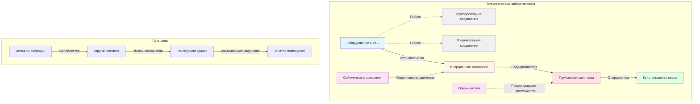

## Обзор

Виброизоляция представляет критически важный компонент акустического контроля в сборочных помещениях, где передача структурного шума от оборудования HVAC может нарушить производительность даже при надлежащем контроле воздушного шума. Оборудование HVAC генерирует вибрацию через вращающиеся компоненты (вентиляторы, двигатели, компрессоры) и турбулентность жидкости, которая передаётся через конструктивные соединения на элементы здания, излучающие звук в занятые помещения.

Эффективная изоляция требует снижения передачи вибрации от оборудования к несущей конструкции на 90-99%, что достигается через надлежащим образом выбранные и установленные упругие опоры, создающие механическое разрывов между источником вибрации и приёмником. Этот раздел предоставляет техническую основу для проектирования систем изоляции в требовательной акустической среде театров, концертных залов и аудиторий.

## Фундаментальные принципы изоляции

### Передаточная функция и эффективность изоляции

Передаточная функция (T) количественно выражает соотношение силы, передаваемой через изоляторы, к возмущающей силе, генерируемой оборудованием. Модель с одной степенью свободы дает управляющее соотношение:

$$T = \frac{1}{\sqrt{(1 - r^2)^2 + (2\zeta r)^2}}$$

Где:
- T = передаточная функция (безразмерное отношение)
- r = отношение частот = f/f_n (рабочая частота / собственная частота)
- ζ = коэффициент демпирования (обычно 0,05-0,10 для стальных пружин)
- f = возмущающая частота (Гц)
- f_n = собственная частота изолированной системы (Гц)

Эффективность изоляции (IE) выражает процентное снижение передаваемой силы:

$$IE = \left(1 - T\right) \times 100\%$$

Для эффективной изоляции отношение частот должно превышать √2 (r > 1,414), за пределами которого передаточная функция падает ниже единицы и происходит фактическая изоляция. Приложения в сборочных помещениях обычно требуют r ≥ 3-5 для эффективности изоляции 90-95%.

### Требования к собственной частоте

Собственная частота изолированной системы определяет производительность изоляции во всём диапазоне рабочих частот. Собственная частота зависит от статического прогиба:

$$f_n = \frac{3.13}{\sqrt{\delta_{st}}}$$

Где:
- f_n = собственная частота (Гц)
- δ_st = статический прогиб (см)

Это соотношение показывает обратную зависимость от квадратного корня: удвоение статического прогиба уменьшает собственную частоту на 29%.

| Статический прогиб | Собственная частота | Типовое применение |
|-------------------|-------------------|---------------------|
| 0,64 см | 6,3 Гц | Лёгкое оборудование, крышные блоки |
| 1,27 см | 4,4 Гц | Оборудование средней массы, воздухообработчики |
| 2,54 см | 3,1 Гц | Тяжёлое оборудование, крупные вентиляторы |
| 3,81 см | 2,6 Гц | Оборудование сборочных помещений, холодильные машины |
| 5,08 см | 2,2 Гц | Критические акустические приложения |

Для сборочных помещений (NC 15-25) указывайте изоляторы, обеспечивающие статический прогиб 3,81-5,08 см для достижения собственных частот 2,2-2,6 Гц. Это обеспечивает адекватную изоляцию при типовых скоростях вентиляторов (600-1800 об/мин = 10-30 Гц).

## Анализ производительности изоляции

### Расчёт отношения частот

Рассчитайте отношение частот для каждой значимой возмущающей частоты, чтобы проверить производительность изоляции:

**Пример расчёта:**
- Оборудование: вентилятор подачи, прямой привод 1200 об/мин
- Изолятор: пружины со статическим прогибом 3,81 см
- Рабочая частота: f = 1200 об/мин ÷ 60 = 20 Гц
- Собственная частота: f_n = 3.13 / √3.81 = 2,02 Гц
- Отношение частот: r = 20 / 2,02 = 9,90
- Передаточная функция: T = 1 / √[(1 - 9,90²)² + (2 × 0,05 × 9,90)²] = 0,010
- Эффективность изоляции: IE = (1 - 0,010) × 100% = 99,0%

Эта конфигурация обеспечивает превосходную изоляцию, передавая только 1,0% возмущающей силы на конструкцию.

### Многочастотные соображения

Оборудование HVAC генерирует вибрацию на несколько частотах:

1. **Основная частота** - об/мин вентилятора/двигателя
2. **Частота прохождения лопаток** - об/мин × количество лопаток
3. **Частоты ремня** - для конфигураций с приводом от ремня
4. **Частота скольжения двигателя** - для асинхронных двигателей

Оцените передаточную функцию на каждой значимой частоте, в частности на частоте прохождения лопаток, которая часто доминирует в спектре вибрации центробежных вентиляторов.

## Компоненты системы виброизоляции

### Требования к инерционному основанию

Инерционные основания обеспечивают жёсткую платформу, которая:

- Равномерно распределяет вес оборудования на несколько изоляторов
- Увеличивает общую массу системы для снижения собственной частоты
- Предотвращает режимы раскачивания оборудования с высоким центром тяжести
- Обеспечивает согласованную поддержку компонентов оборудования

Указывайте конструктивные стальные инерционные основания для:
- Оборудования с длиной/шириной более 1,8 м
- Оборудования с рабочей скоростью более 1000 об/мин
- Оборудования массой более 450 кг
- Всего оборудования в помещениях NC 15-20

Толщина основания обычно варьируется от 10-20 см в зависимости от массы оборудования и требований к жёсткости.

### Типы изоляторов и выбор

| Тип изолятора | Диапазон прогиба | Демпирование | Применение | Преимущества | Ограничения |
|---------------|------------------|---------|--------------|------------|-------------|
| Неопреновые подушки | 0,25-0,76 см | Высокое (0,15-0,20) | Малые вентиляторы, насосы | Низкая стоимость, простая установка | Ограниченный прогиб, умеренная изоляция |
| Резина на сдвиг | 0,51-1,27 см | Умеренное (0,10-0,15) | Оборудование, монтируемое на кровельный короб | Устойчивость к погодным условиям, стабильность | Деградация со временем |
| Ограниченная пружина | 2,54-10,16 см | Низкое (0,05-0,10) | Крупное оборудование, сборочные помещения | Высокая производительность, регулируемая | Более высокая стоимость, требует корпуса |
| Пневматические пружины | 5,08-15,24 см | Переменное | Сверхкритические приложения | Превосходная изоляция, настраиваемая | Сложность, требует обслуживания |
| Комбинированная пружина-неопрен | 2,54-5,08 см | Умеренное (0,10) | Общее применение в сборочных помещениях | Хорошая производительность, встроенное ограничение | Умеренная стоимость |

Для приложений в сборочных помещениях ограниченные пружинные изоляторы обеспечивают оптимальную производительность. Выбирайте изоляторы со следующими характеристиками:

- Свободностоящие или заключённые в корпус стальные пружины
- Неопреновые или эластомерные акустические подушки между основанием и конструкцией
- Вертикальные и горизонтальные ограничители для сейсмического соответствия
- Коррозионностойкое покрытие для долговечности
- Минимальная дополнительная ёмкость на 50% сверх статической нагрузки

### Гибкие соединения

Гибкие воздуховоды и трубопроводные соединения предотвращают передачу вибрации через подключённые системы:

**Воздуховодные соединения:**
- Ткань из холста или неопреном, минимум 10 унц/ярд²
- Длина: 20-30 см для адекватной гибкости
- Проволочное армирование для приложений с отрицательным давлением
- Класс давления/скорости, соответствующий рейтингу системы воздуховодов

**Трубопроводные соединения:**
- Гибкие разъёмы из нержавеющей стали в оплётке для водных систем
- Резиновые компенсационные швы для больших трубопроводов (>7,6 см)
- Длина: 30-46 см или 8-10 диаметров трубопровода
- Рейтинг давления 1,5× рабочее давление системы
- Управляющие стержни для предотвращения чрезмерного растяжения

## Методология выбора изолятора

### Шаг 1: Определение рабочих характеристик оборудования

Задокументируйте следующее для каждого элемента оборудования:
- Общая рабочая масса (оборудование + основание + аксессуары)
- Рабочая скорость (об/мин) и возмущающие частоты
- Конфигурация оборудования (размеры, центр тяжести)
- Тип основания (бетонная плита, конструктивная сталь, крышная конструкция)

### Шаг 2: Установление акустических критериев

На основе требований помещения:
- NC 15-20: 3,81-5,08 см прогиба, f_n ≤ 2,6 Гц
- NC 20-25: 2,54-3,81 см прогиба, f_n ≤ 3,1 Гц
- NC 25-30: 1,91-2,54 см прогиба, f_n ≤ 3,6 Гц

### Шаг 3: Расчёт требуемого прогиба пружины

Целевое отношение частот r ≥ 4 для приложений в сборочных помещениях:

$$\delta_{st} = \left(\frac{3.13 \times r}{f}\right)^2$$

Где f представляет самую низкую возмущающую частоту (обычно основную об/мин/60).

### Шаг 4: Выбор количества и расположения изоляторов

Распределите изоляторы для:
- Поддержки центра тяжести оборудования
- Предотвращения режимов раскачивания (минимум 4 изолятора)
- Обеспечения доступности для обслуживания
- Обеспечения равномерного распределения нагрузки (±10% вариация)

Типовые расположения:
- 4 изолятора: Прямоугольное оборудование, 1 в каждом углу
- 6 изоляторов: Длинное оборудование (Д/Ш > 2), дополнительная поддержка в середине пролёта
- 8+ изоляторов: Тяжёлое оборудование (>2300 кг), несколько рядов

### Шаг 5: Проверка ёмкости нагрузки

Рассчитайте нагрузку на изолятор с учётом распределения веса:

$$W_{изолятор} = \frac{W_{общая}}{N_{изоляторы}} \times DF$$

Где:
- W_общая = масса оборудования + основание + аксессуары
- N_изоляторы = количество изоляторов
- DF = коэффициент распределения (1,25-1,50 для неравномерного распределения)

Выбирайте изоляторы с номинальной ёмкостью ≥ 1,5 × расчётная нагрузка, чтобы обеспечить надлежащий прогиб и позволить вариации нагрузки.

## Координация сейсмических и ветровых ограничений

### Требования системы ограничений

Системы виброизоляции требуют боковых ограничений для предотвращения повреждений во время сейсмических событий или условий сильного ветра. Система ограничений должна:

- Обеспечить нормальную виброизоляцию во время работы
- Включиться во время сейсмического возбуждения (ускорение > 0,1 g)
- Обеспечить восстанавливающую силу для предотвращения перемещения изолятора
- Скоординироваться с сейсмической категорией проектирования здания

Для сборочных помещений указывайте:
- Встроенные сейсмические ограничители на всех пружинных изоляторах
- Многонаправленное ограничение (горизонтальное и вертикальное)
- Зазор разрыва: 0,64-1,27 см для нормальной работы
- Ёмкость ограничения: 2× масса оборудования горизонтально, 1× масса вертикально

### Типы сейсмических ограничителей

| Тип | Работа | Применение | Преимущества |
|------|-----------|--------------|------------|
| Эластомерный | Сжимается во время возбуждения | Лёгкое оборудование (<225 кг) | Простой, низкая стоимость |
| Механический упор | Жёсткое срабатывание в пределе хода | Оборудование средней массы (225-900 кг) | Положительный упор, надёжный |
| Тросовое ограничение | Натяжение в пределе прогиба | Тяжёлое оборудование (>900 кг) | Регулируемый, многоправленный |
| Интегрированный корпус | Комбинированная изоляция/ограничение | Все приложения в сборочных помещениях | Скоординированное проектирование, сертифицировано |

Проконсультируйтесь с конструктором для оборудования в сейсмических категориях D-F или с коэффициентом важности оборудования > 1,0.

## Установка и пусконаладка

### Критические детали установки

Надлежащая установка гарантирует производительность проекта:

1. **Выровненная поверхность монтажа** - В пределах 0,32 см на расстояние между изоляторами
2. **Выравнивание изолятора** - Вертикальный путь нагрузки через осевую линию изолятора
3. **Равномерный прогиб** - Проверьте, что все изоляторы прогибаются в пределах ±10% расчётного значения
4. **Проверка зазора** - Минимум 2,54 см зазора вокруг гибких соединений
5. **Проверка анкеровки** - Затяните якорные болты в соответствии со спецификациями производителя

### Проверка прогиба

После установки и запуска оборудования:
- Измерьте фактический статический прогиб в каждом месте изолятора
- Сравните с проектным прогибом (целевой ±15%)
- Отрегулируйте предварительное натяжение пружины, если прогиб превышает допуск
- Задокументируйте итоговые значения прогиба для операционных записей

### Проверка производительности

Для критических сборочных помещений (NC 15-20) рассмотрите вибрационные испытания:
- Измерьте вибрацию в точках монтажа оборудования (акселерометр)
- Измерьте вибрацию в точках интерфейса конструкции
- Рассчитайте фактическую передаточную функцию: T = V_конструкция / V_оборудование
- Проверьте, что эффективность изоляции соответствует проектным критериям (>90%)

## Типичные ошибки проектирования

### Недостаточный статический прогиб

Указание изоляторов с недостаточным прогибом остаётся наиболее распространённой ошибкой. Заблуждение о том, что "какая-то изоляция лучше, чем никакая" не срабатывает при низких отношениях частот, где передаточная функция может превышать единицу, усиливая, а не уменьшая передаваемую вибрацию.

**Решение:** Всегда проверяйте отношение частот ≥ 3 при самой низкой рабочей скорости.

### Жёсткие соединения

Установка гибких воздуховодных/трубопроводных соединений уничтожает изоляцию. Даже небольшие жёсткие соединения (электрический кабелепровод, управляющая проводка) могут создать боковые пути для передачи вибрации.

**Решение:** Используйте гибкие соединения для всех воздуховодов, трубопроводов и электрических соединений в пределах 3 м от изолированного оборудования.

### Недостаточное инерционное основание

Монтаж оборудования непосредственно на изоляторы без инерционного основания позволяет режимам раскачивания и неравномерному распределению нагрузки.

**Решение:** Указывайте конструктивные стальные инерционные основания для всего оборудования в сборочных помещениях.

### Неправильный выбор изолятора

Выбор изоляторов основан исключительно на ёмкости нагрузки без учёта требований к прогибу.

**Решение:** Выбирайте на основе требуемого статического прогиба в первую очередь, затем проверяйте ёмкость нагрузки.

## Интеграция с конструкцией здания

### Координация конструкции

Скоординируйте систему изоляции с проектом конструкции:

- Проверьте, что конструкция пола/крыши может выдержать нагрузки изолятора без чрезмерного прогиба
- Подтвердите, что собственная частота конструкции превышает 8 Гц для предотвращения резонанса
- Обеспечьте конструктивное усиление для сосредоточенных нагрузок изолятора
- Детализируйте подушки для уборки или подушки оборудования в каждом месте изолятора

### Проектирование помещения оборудования

Проектируйте механические помещения для минимизации излучения шума:

- Расположите помещения на расстоянии от сборочных помещений (минимум 15 м горизонтально)
- Указывайте конструкцию из бетона или CMU (минимум 20 см толщины)
- Обеспечьте акустическую обработку внутренних поверхностей
- Используйте двери, оценённые по акустике и герметичным уплотнениям

## Заключение

Виброизоляция оборудования HVAC в сборочных помещениях требует тщательного внимания к выбору собственной частоты, спецификации изолятора и деталям установки. Целевые статические прогибы 3,81-5,08 см обеспечивают собственные частоты 2,2-2,6 Гц, дающие эффективность изоляции, превышающую 95%, при типовых рабочих скоростях вентилятора. Скоординируйте проектирование изоляции с сейсмическими ограничениями, проверьте прогибы при установке и гарантируйте, что все соединения включают надлежащие гибкие элементы. При надлежащем проектировании и установке системы виброизоляции предотвращают передачу структурного шума, которая иначе скомпрометировала бы строгие акустические требования театров, концертных залов и аудиторий.

Обратитесь к ASHRAE Handbook—HVAC Applications, Chapter 49 (Noise and Vibration Control) для подробных процедур проектирования и каталогов производителей для конкретных данных производительности изолятора. Проконсультируйтесь с ASHRAE Handbook—Fundamentals, Chapter 8 (Sound and Vibration) для основной теории вибрации и принципов передачи.
