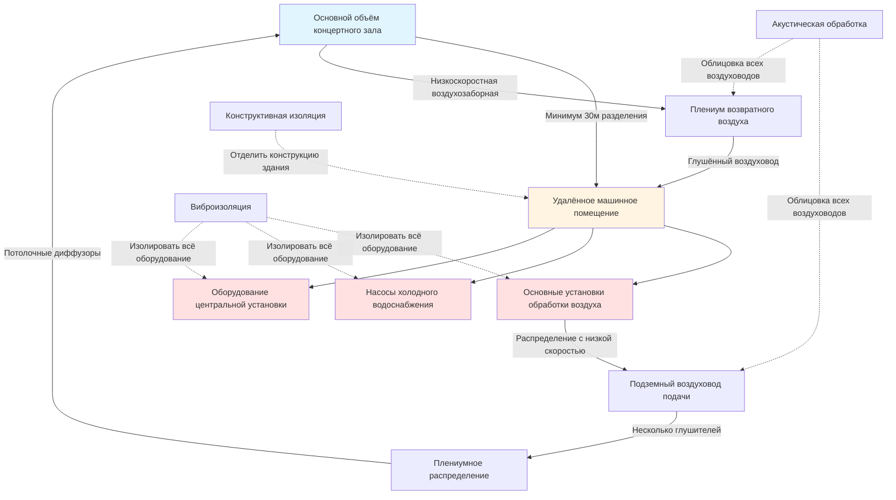

## Требования к фоновому шуму NC-20

Концертные залы требуют самого строгого акустического контроля среди всех типов зданий, с уровнями фонового шума, указанными на уровне NC-20 или ниже, чтобы обеспечить ясность музыки и динамический диапазон. На этом критерии системы HVAC должны производить менее 27 дBA общего уровня звукового давления, требуя экстраординарных мер проектирования, которые выходят далеко за пределы обычной коммерческой практики.

Кривая NC-20 представляет уровни звукового давления, которые варьируются по октавным полосам, с последовательно снижающимися пределами на более высоких частотах, где слух человека наиболее чувствителен. Это требует всестороннего контроля как низкочастотного гула от механического оборудования, так и высокочастотного шипения от движения воздуха.

## Пределы уровня звукового давления по октавным полосам

| Центральная частота октавной полосы (Гц) | Максимальный SPL NC-20 (дБ) | Типичный источник проблемы |
|-----------------------------------|------------------------|--------------------------|
| 63 | 47 | Вибрация вентилятора, гул в воздуховодах |
| 125 | 36 | Шум двигателя, резонанс низкой частоты |
| 250 | 29 | Турбулентность воздуха, шум заслонок |
| 500 | 22 | Выброс из диффузора, отводы ветвей |
| 1000 | 17 | Высокоскоростной воздух, конечные устройства |
| 2000 | 14 | Воздушные струи, шум решёток |
| 4000 | 12 | Турбулентный поток, резкие изгибы |
| 8000 | 11 | Высокочастотный шипение, малые отверстия |

## Взаимосвязь акустической мощности и звукового давления

Уровень звукового давления в помещении концертного зала, вызванный оборудованием HVAC, рассчитывается по формуле:

$$L_p = L_w - 10\log_{10}(4\pi r^2) + 10\log_{10}\left(\frac{4}{R}\right)$$

Где:
- $L_p$ = уровень звукового давления в месте прослушивания (дБ)
- $L_w$ = уровень звуковой мощности источника (дБ)
- $r$ = расстояние от источника до приёмника (м)
- $R$ = константа помещения = $\frac{S\alpha}{1-\alpha}$ (м²)
- $S$ = общая площадь поверхности помещения (м²)
- $\alpha$ = средний коэффициент звукопоглощения

Для концертных залов с высокоотражающими поверхностями ($\alpha$ ≈ 0,15–0,25) вклад константы помещения минимален, что делает расстояние основным механизмом затухания.

## Стратегия удалённого размещения оборудования

## Контроль скорости воздуховода и регенерируемого шума

Скорость воздуха должна быть резко ограничена, чтобы предотвратить регенерируемый шум от турбулентности. Соотношение между скоростью в воздуховоде и регенерируемым шумом:

$$L_w = 10\log_{10}(V^6 \cdot P \cdot d)$$

Где:
- $L_w$ = уровень звуковой мощности на единицу длины (дБ/м)
- $V$ = скорость воздуха (м/с)
- $P$ = периметр воздуховода (м)
- $d$ = гидравлический диаметр (м)

Для помещений NC-20 максимальные скорости составляют:

| Тип воздуховода | Максимальная скорость | Типичное применение |
|-----------|-----------------|---------------------|
| Главный ствол подачи | 3,0 м/с (600 CFM) | Первичное распределение |
| Ветвевые воздуховоды | 2,5 м/с (500 CFM) | Зональное распределение |
| Конечные развязки | 2,0 м/с (400 CFM) | Подключение конечного устройства |
| Возвратные воздуховоды | 3,5 м/с (700 CFM) | Низкопрессионный возврат |

Эти скорости на 60–75% ниже, чем в обычной коммерческой практике, что приводит к значительно большим сечениям воздуховодов и увеличенным расходам на установку.

## Требуемые расчёты затухания

Общее затухание, требуемое между машинным помещением и занимаемым пространством:

$$A_{required} = L_{w,source} - L_{p,target} + 10\log_{10}(4\pi r^2) - 10\log_{10}\left(\frac{4}{R}\right) - A_{duct}$$

Где:
- $A_{required}$ = требуемое общее активное затухание (дБ)
- $L_{w,source}$ = уровень звуковой мощности оборудования (дБ)
- $L_{p,target}$ = целевой уровень NC-20 по полосам (дБ)
- $A_{duct}$ = пассивное затухание от длины воздуховода (дБ)

Для типичного сценария со звуковой мощностью вентилятора 85 дБ на частоте 500 Гц и разделением 30 м:

$$A_{required} = 85 - 22 + 10\log_{10}(4\pi \times 30^2) - 2 - 12 = 85 - 22 + 36,5 - 2 - 12 = 85,5 \text{ дБ}$$

Это требует нескольких глушителей в серии плюс обширная облицованная воздуховодом.

## Критические параметры проектирования

**Выбор оборудования:**
- Общее статическое давление вентилятора: 750–1250 Па для преодоления потерь в глушителе
- Эффективность вентилятора: >85% для минимизации размера двигателя и тепла
- Изоляция двигателя: двухступенчатые пружинные крепления с эффективностью >95% на рабочих частотах
- Приводы переменной скорости: размещены удалённо с фильтруемым охлаждением
- Вибрация насоса: <0,1 мм/с RMS на изолированных фундаментах

**Конфигурация глушителя воздуховода:**
- Первичный глушитель: 3–4 м длины, 150–200 мм толщины носителя
- Вторичный глушитель: 2–3 м длины, 100–150 мм толщины носителя
- Минимум 10 диаметров воздуховода между глушителями для стабилизации потока
- Акустический носитель: стекловолокно плотностью 96–144 кг/м³, облицованное фольгой
- Бюджет перепада давления: 125–250 Па на глушитель

**Проектирование диффузора:**
- Скорость выброса: <0,75 м/с (150 CFM) на лице диффузора
- Дальность: спроектирована для конечной скорости 0,25 м/с
- Рейтинг NC: отдельный диффузор NC-15 или ниже
- Тип: перфорированная поверхность, большая свободная площадь, плавные переходы
- Плениум: минимум 300 мм глубины, внутренняя облицовка

## Конструктивная и виброизоляция

Машинные помещения должны быть конструктивно изолированы от конструкции концертного зала:

$$T_{isolation} = 20\log_{10}\left(\frac{f}{f_n}\right)^2$$

Где:
- $T_{isolation}$ = потери передачи виброизоляции (дБ)
- $f$ = частота вынуждающего действия (Гц)
- $f_n$ = собственная частота системы изоляции (Гц)

Целевая собственная частота должна быть <6 Гц для оборудования, работающего на частоте 25–60 Гц, обеспечивая >20 дБ изоляции.

**Требования к фундаменту:**
- Изолированные бетонные подушки: толщина 300–500 мм, разделённые неопреном
- Плавающие плиты пола: двухслойные с устойчивым слоем
- Изоляция стен: конструкция с зазором или эластичные соединения
- Проходы труб: пружинные проходы через втулки с акустическим уплотнением

## Измерение и проверка

Акустические испытания после ввода в эксплуатацию согласно ASHRAE Standard 189.1 и ISO 3382:

- Фоновый шум без занятости: анализ по октавным полосам в 5+ местах
- HVAC работает при расчётном расходе воздуха: все режимы протестированы
- Критерии приемлемости: на 3 дБ ниже кривой NC-20 во всех полосах
- Проверка времени реверберации: убедитесь, что RT60 соответствует акустическому проектированию
- Метрики разборчивости речи: STI >0,60 где применимо

## Контрольный список проектирования для достижения NC-20

1. Расположение оборудования минимум на 30 м от сценического пространства
2. Всё оборудование на двухступенчатой виброизоляции
3. Скорости в воздуховодах <3,0 м/с в магистралях, <2,0 м/с на конечных участках
4. Серийные глушители общей длиной 5–7 м
5. 100% облицованные воздуховоды с толщиной носителя 25–50 мм
6. Скорость выброса диффузора <0,75 м/с
7. Отсутствие установленных на воздуховоде конечных устройств в пределах 15 м от пространства
8. Гибкие соединения воздуховодов на всех элементах оборудования
9. Эластичные вешалки и опоры труб во всей системе
10. Акустически оценённые уплотнения проходов на всех отверстиях

Экстраординарные меры, требуемые для концертных залов NC-20, обычно увеличивают затраты HVAC на 200–400% по сравнению с обычным строительством, но это инвестирование необходимо для сохранения акустической ясности, которая определяет концертные залы мирового класса.

---

*Ссылки: ASHRAE Fundamentals Chapter 48 (Noise and Vibration Control), ASHRAE Applications Chapter 23 (Sound and Vibration), ISO 3382-1 (Acoustics of Performance Spaces), Beranek "Concert Halls and Opera Houses"*
