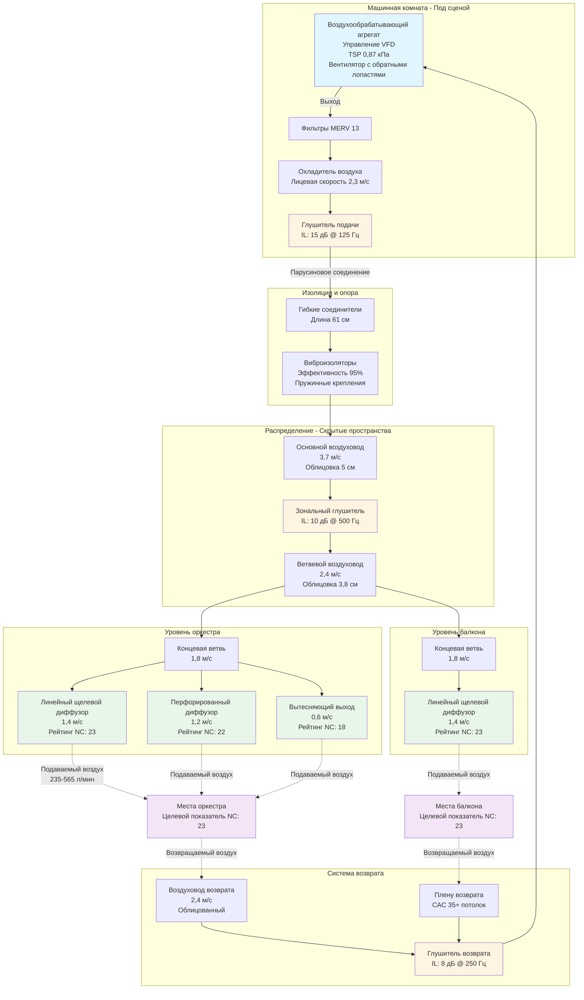

Театры требуют акустических характеристик NC-25 для сохранения разборчивости речи и драматического воздействия без крайних затрат конструкции концертных залов NC-20. Это снижение на 5 дБ от стандартов концертных залов позволяет использовать умеренные скорости воздуха и упрощенные стратегии затухания, при этом сохраняя акустическое качество, подходящее как для усиленных, так и для неусиленных театральных представлений.

## Требования NC-25 для октавных полос

NC-25 определяет максимально допустимые уровни звукового давления по всему слышимому частотному спектру. Форма кривой отражает слуховую чувствительность человека и типичные спектральные характеристики систем HVAC.

### Ограничения для конкретных частот

| Центральная частота октавной полосы (Гц) | Максимальное УЗД (дБ) | Проектный запас (дБ) | Критическая стратегия управления |
|-----------------------------------|------------------|-------------------|--------------------------|
| 63 | 47 | 3-5 | Изоляция оборудования, структурное развязывание |
| 125 | 39 | 3-5 | Глушители в воздуховодах, контроль разрушения |
| 250 | 33 | 2-3 | Облицованные воздуховоды, выбор диффузора |
| 500 | 29 | 2-3 | Снижение скорости воздуха, концевые устройства |
| 1000 | 25 | 2-3 | Производительность диффузора, затухание в плену |
| 2000 | 22 | 2-3 | Высокочастотное поглощение, конструкция решетки |
| 4000 | 20 | 2-3 | Выбор концевого устройства, облицовка воздуховода |
| 8000 | 18 | 2-3 | Конструкция лопастей диффузора, контроль турбулентности |

Проектный запас учитывает неопределенность измерения (±2 дБ), эффекты старения поглощающих материалов и вариации качества строительства. Целевой показатель NC-23 при проектировании обеспечивает выполнение требования NC-25 при эксплуатации.

## Вместимость театра и акустические последствия

Вместимость зрительного зала напрямую влияет на акустический дизайн HVAC через требования вентиляции, размеры воздуховодов и характеристики поглощения.

### Классификация по вместимости

**Малые театры (100-300 мест):**
- Вентиляция: 2,000-6,000 CFM (3,400-10,200 м³/ч) всего
- Скорости воздуха в воздуховодах: 800-1,000 fpm (2,4-3,0 м/с) достижимы
- Основная проблема: Ограниченное пространство для воздуховодов и оборудования
- Преимущество: Более высокое поглощение помещения на CFM
- Типичный подход: Несколько компактных воздухообрабатывающих агрегатов, вытесняющая вентиляция

**Средние театры (300-800 мест):**
- Вентиляция: 6,000-16,000 CFM (10,200-27,200 м³/ч) всего
- Скорости воздуха в воздуховодах: 1,000-1,200 fpm (3,0-3,7 м/с) максимум
- Основная проблема: Балансирование производительности и ограничений скорости
- Преимущество: Возможна отдельная машинная комната
- Типичный подход: Центральный воздухообрабатывающий агрегат, обширное глушение

**Крупные театры (800-2,000+ мест):**
- Вентиляция: 16,000-40,000+ CFM (27,200-68,000+ м³/ч) всего
- Скорости воздуха в воздуховодах: 1,200-1,500 fpm (3,7-4,6 м/с) максимум в основных воздуховодах
- Основная проблема: Шум разрушения воздуховода, регенерируемый шум
- Преимущество: Пропорционально большее поглощение помещением
- Типичный подход: Несколько воздухообрабатывающих агрегатов, распределение плену

### Акустическое поведение, зависящее от объема

Объем помещения влияет на уровень звукового давления через площадь поглощения. Соотношение между звуковой мощностью и результирующим УЗД следует:

$$\text{УЗД} = L_w - 10\log_{10}\left(\frac{A}{4}\right) + 10,5$$

Где:
- $L_w$ = уровень звуковой мощности (дБ отн. 10⁻¹² Вт)
- $A$ = полная площадь поглощения помещения (сабины)

Для театра на 500 мест с объемом 1,415 м³ и временем реверберации 1,2 секунды:

$$A = \frac{0.049 \times 1,415}{1,2} = 57,9 \text{ сабин}$$

$$\text{УЗД} = L_w - 10\log_{10}\left(\frac{57,9}{4}\right) + 10,5 = L_w - 16,6 \text{ дБ}$$

Более крупные театры с пропорционально большей площадью поглощения обеспечивают повышенное затухание, но это преимущество снижается по мере того, как объемы вентиляции масштабируются вместе с вместимостью.

## Требования разборчивости речи

Акустика театра отдает приоритет индексу передачи речи (STI) и потерям артикуляции (ALcons). Фоновый шум HVAC влияет на оба показателя.

### Соотношение сигнала к шуму

Эффективное голосовое общение требует соотношения сигнал-шум (SNR) минимум 25 дБ:

$$\text{SNR} = L_{\text{речь}} - L_{\text{фон}}$$

Неусиленная речь развивает 55-65 дBA на расстоянии 3 м. Для SNR ≥ 25 дБ:

$$L_{\text{фон}} \leq 55 - 25 = 30 \text{ дBA}$$

NC-25 соответствует приблизительно 29-31 дBA, удовлетворяя этому критерию с минимальным запасом. Усиленные представления допускают более высокие уровни фона, но проектировщики должны учитывать неусиленные репетиции и интимные постановки.

### Влияние индекса артикуляции

Фоновый шум снижает индекс артикуляции (AI) через маскировку частот речи (500-4,000 Гц). Расчет AI взвешивает октавные полосы:

$$\text{AI} = \sum_{i=1}^{n} W_i \times \left(\frac{\text{SNR}_i + 15}{30}\right)$$

Где $W_i$ представляет частотно-зависимые коэффициенты взвешивания. Пределы NC-25 в диапазоне 500-2,000 Гц сохраняют AI > 0,70, считающийся "хорошей" разборчивостью.

## Стратегии проектирования системы HVAC

Достижение NC-25 требует интегрированного акустического проектирования, охватывающего источник, путь и приемник.

### Управление источником

**Выбор вентилятора:**
Выбирайте центробежные вентиляторы с обратными изогнутыми или аэродинамическими лопастями, работающие при 60-70% от максимального давления. Звуковая мощность коррелирует с окружной скоростью:

$$L_w \propto 50\log_{10}(V_{\text{окр}}) + 10\log_{10}(Q) + K$$

Где:
- $V_{\text{окр}}$ = окружная скорость лопасти (м/с)
- $Q$ = воздушный поток (м³/ч)
- $K$ = константа, специфичная для вентилятора

Снижение окружной скорости с 3,0 м/с до 2,1 м/с снижает звуковую мощность на:

$$\Delta L_w = 50\log_{10}\left(\frac{2,1}{3,0}\right) = 50 \times (-0,155) = -7,7 \text{ дБ}$$

**Размещение оборудования:**
Отделите механическое оборудование от зрительских зон как минимум конструкцией STC-50. Предпочтительные расположения:

1. Механические комнаты под сценой со структурной изоляцией
2. Кровельные пристройки с виброизолирующими креплениями
3. Удаленные расположения в здании с соединяющимися воздуховодами

### Обработка пути

**Ограничения скорости воздуха в воздуховодах:**
Терминальная скорость на диффузорах управляет генерацией собственного шума:

| Расположение | Максимальная скорость (м/с) | Обоснование |
|----------|----------------------|-----------|
| Основные воздуховоды снабжения | 4,6 | Контроль разрушения, регенерируемый шум |
| Ветвевые воздуховоды | 3,0 | Снижение турбулентности |
| Концевые ветви | 1,8-2,1 | Условия подхода диффузора |
| Решетки/диффузоры | 1,2-1,5 | Предотвращение собственного шума |

**Применение глушителей:**

Установите глушители в воздуховодах, где передача звука превышает целевые показатели на >3 дБ при любой октавной полосе. Требуемое звукоизоляционное снижение:

$$\text{IL}_{\text{тр}} = L_{w,\text{ист}} - \text{Ослаб}_{\text{в/в}} - \text{ERL} - \text{УЗД}_{\text{цел}} + 10\log_{10}\left(\frac{A}{4}\right) - 10,5$$

Для системы 2,360 л/мин с $L_w$ = 75 дБ при 500 Гц, 15,2 м облицованного воздуховода (0,49 дБ/м), ERL = 8 дБ и целевое УЗД = 29 дБ:

$$\text{IL}_{\text{тр}} = 75 - (0,49 \times 15,2) - 8 - 29 + 10\log_{10}\left(\frac{57,9}{4}\right) - 10,5$$
$$= 75 - 7,4 - 8 - 29 + 11,6 - 10,5 = -20,5 \text{ дБ}$$

Глушитель не требуется; обработка пути адекватна. Пересчитайте для каждой октавной полосы.

**Передача звука через стенки воздуховода:**

Звук передается через стенки воздуховода, когда внутреннее давление превышает звукоизоляцию воздуховода. Уровень звука разрушения:

$$L_p = L_w + 10\log_{10}\left(\frac{S}{4\pi r^2}\right) - \text{TL}_{\text{в/в}}$$

Где:
- $S$ = площадь поверхности воздуховода (м²)
- $r$ = расстояние от воздуховода (м)
- $\text{TL}_{\text{в/в}}$ = звукоизоляция стенки воздуховода (дБ)

Необлицованный стальной лист 22-го калибра обеспечивает TL ≈ 25-30 дБ на средних частотах. Удвоение толщины стенки воздуховода увеличивает TL на 6 дБ. Внешняя изоляция добавляет 5-15 дБ в зависимости от массы и поглощения.

### Защита приемника

**Выбор диффузора:**
Указывайте диффузоры с опубликованными данными NC при рабочем воздушном потоке. Высокоиндукционные диффузоры генерируют меньше собственного шума, чем обычные решетки:

- Перфорированные лицевые диффузоры: NC 25-30 при 1,2-1,5 м/с
- Щелевые диффузоры: NC 30-35 при 0,9-1,2 м/с
- Линейные планчатые решетки: NC 35-40 при 0,9-1,2 м/с

**Системы плену:**
Подвесные пленумы служат камерами подачи или возврата воздуха. Акустическая производительность зависит от:

1. **Затухание плену:** 5-15 дБ в зависимости от объема и поглощения
2. **Звукоизоляция потолка:** Акустические плиты потолка обеспечивают STC 20-35
3. **Класс затухания потолка (CAC):** Измеряет передачу плену в плену; указывайте CAC ≥ 35

## Рассмотрения, специфичные для театра

### Легитимные театры в сравнении с кинотеатрами

**Легитимные (живые) театры:**
- Неусиленный диалог требует строгого соблюдения NC-25
- Переменная вместимость (репетиции до полного зала) влияет на поглощение
- Периодическая работа системы между актами приемлема
- Привлечение акустического консультанта существенно

**Кинотеатры:**
- Усиленный звук маскирует умеренный шум HVAC
- NC-30 часто приемлем во время показов
- NC-25 поддерживается при анонсах и антрактах
- Возможно скоординированное отключение во время критических сцен

### Акустика балконов и верхних ярусов

Многоуровневые театры представляют уникальные проблемы:

1. **Стратификация:** Теплый воздух поднимается на верхние уровни, требуя отдельного управления зоной
2. **Вариация поглощения:** Балконные места обеспечивают меньше поглощения на квадратный метр
3. **Маршрутизация воздуховодов:** Структурные конфликты в тонких конструкциях перекрытий
4. **Размещение диффузора:** Избегайте направления подачи воздуха на отражающие фасады балконов

При вместимости более 800 мест проектируйте раздельные воздухообрабатывающие агрегаты для уровней оркестра и балкона.

### Вестибюли и пространства циркуляции

Общественные зоны вне зрительного зала допускают NC-35 до NC-40. Обеспечьте акустическое разделение через:

- Дверные полотна с уплотнениями (STC ≥ 45)
- Отдельные системы HVAC, избегающие совместных воздуховодов
- Звуковые шлюзы при входах в зрительный зал
- Передаточные воздуховоды с глушителями, где кодекс требует передачи воздуха

## Измерение и проверка

Проверьте производительность NC-25 через анализ октавных полос в нескольких местах:

### Протокол измерения

1. **Условия:** Все системы HVAC при проектном воздушном потоке, незанятый театр
2. **Расположения:** Передний оркестр, центральный оркестр, задний оркестр, центр балкона, места в крайних боковых зонах (минимум 5 расположений)
3. **Оборудование:** Звукомер типа 1 с фильтрами октавных полос
4. **Длительность:** 30-секундное усреднение на расположение
5. **Фон:** Измерьте окружающий шум при отключенном HVAC; вычтите, используя логарифмические методы

### Анализ данных

Нанесите измеренные уровни октавных полос на график в сравнении с кривой NC-25. Определите превышения:

- **Низкие частоты (63-125 Гц):** Вибрация оборудования, разрушение воздуховода
- **Средние частоты (250-1,000 Гц):** Шум вентилятора, регенерируемый шум концевого устройства
- **Высокие частоты (2,000-8,000 Гц):** Собственный шум диффузора, турбулентный поток

Устраните превышения через балансировку системы, регулировку диффузора или дополнительную обработку перед принятием.

## Архитектура системы для достижения производительности NC-25

## Анализ стоимости и выгод: NC-25 в сравнении с NC-30

Достижение NC-25 вместо NC-30 увеличивает стоимость HVAC на 15-30%:

| Элемент проектирования | Подход NC-30 | Подход NC-25 | Премия за стоимость |
|----------------|----------------|----------------|--------------|
| Размеры воздуховодов | 4,6 м/с основных | 3,7 м/с основных | +20% материала воздуховода |
| Глушители | Только выход АХА | Выход + зона | +$8,000-15,000 |
| Облицовка воздуховода | 2,5 см стандартный | 3,8-5 см премиум | +30% стоимости облицовки |
| Диффузоры | Стандартные решетки | Высокопроизводительные низко-NC | +40% стоимости концевого устройства |
| Тестирование | Базовый ввод в эксплуатацию | Акустическая проверка | +$5,000-10,000 |

Акустическое улучшение обоснует премиум-инвестицию для легитимных театров, оперных домов и площадок с неусиленными представлениями. Кинотеатры и многоцелевые пространства могут принять NC-30 с существенной экономией затрат.

## Ссылки и стандарты

**ASHRAE Handbook—HVAC Applications, Chapter 49:** Полные данные кривых NC, методология расчета октавных полос и руководство по акустическому проектированию механических систем.

**ASHRAE Handbook—Fundamentals, Chapter 8:** Теория звука и вибрации, анализ частот и коэффициенты поглощения.

**ANSI/ASA S12.60-2010/Part 1:** Критерии акустической производительности для учебных пространств; применимо к лекционным и презентационным театрам.

**IES Lighting Handbook:** Координация между системами акустического потолка и конструкцией освещения, влияющая на значения CAC.

**ASTM E1130:** Стандартный метод испытания для объективного измерения конфиденциальности речи, обеспечивающий контекст для акустической приватности театра между пространствами.

Привлекайте квалифицированных акустических консультантов для театров, требующих NC-25 или более строгую производительность. Участие консультанта на этапе схематического проектирования предотвращает дорогостоящие корректировки во время строительства.
