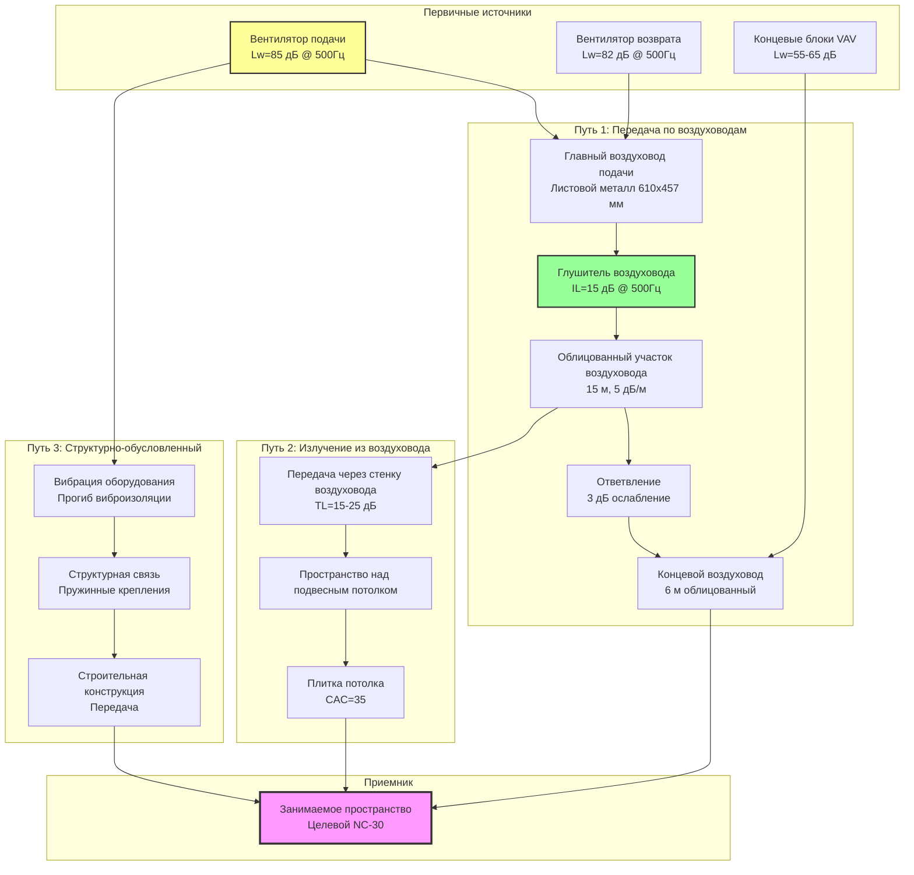

## Основы проектирования NC-30

Лекционные залы с целевым уровнем фонового шума NC-30 уравновешивают качество акустики с экономической целесообразностью. Критерий NC-30 допускает фоновый шум, генерируемый системой HVAC, приблизительно 30 дБ на частоте 1000 Гц при сохранении частотно-взвешенных пределов во всем слышимом спектре для обеспечения разборчивости речи и минимизации отвлечения внимания во время неусиленных презентаций.

NC-30 представляет снижение на 10 дБ по сравнению с требованиями концертных залов (NC-20), но обеспечивает значительно лучшие акустические условия, чем типичные офисные среды (NC-35 до NC-40). Такой компромисс позволяет рентабельное проектирование при поддержке основной педагогической миссии: четкое общение между преподавателем и студентами.

## Пределы октавных полос NC-30

### Уровни звукового давления, специфичные для частоты

NC-30 устанавливает максимально допустимые уровни звукового давления во всех восьми октавных полосах:

| Центральная частота октавной полосы (Гц) | Максимум SPL (дБ) | SPL с запасом проектирования (дБ) | Основной источник |
|-----------------------------------|------------------|------------------------|----------------|
| 63 | 57 | 54 | Гул вентилятора, излучение из воздуховода |
| 125 | 48 | 45 | Частота прохождения лопастей вентилятора |
| 250 | 41 | 38 | Турбулентность воздуха в воздуховодах |
| 500 | 35 | 32 | Регенерированный шум диффузора |
| 1000 | 31 | 28 | Шум воздушного потока системы |
| 2000 | 29 | 26 | Высокоскоростные воздушные потоки |
| 4000 | 28 | 25 | Шипение диффузора, шум заслонки |
| 8000 | 27 | 24 | Собственный шум концевого устройства |

Значения запаса проектирования представляют рекомендуемые целевые значения на 3 дБ ниже кривой NC-30 для учета неопределенности измерений, старения оборудования и одновременных множественных источников. Системы, разработанные едва соответствующие пределам NC-30, часто превышают критерии через 2–3 года эксплуатации из-за засорения фильтров, износа ремней и деградации заслонок.

### Математическое представление кривой NC-30

Кривая NC-30 следует эмпирическому соотношению, приблизительно:

$$\text{SPL}_f = 30 + 10\log_{10}\left(\frac{1000}{f}\right) - K_f$$

Где:
- $\text{SPL}_f$ = уровень звукового давления на частоте $f$ (дБ)
- $f$ = центральная частота октавной полосы (Гц)
- $K_f$ = частотно-специфичный коэффициент коррекции

Коэффициенты коррекции учитывают восприятие человеком и типичные спектральные характеристики HVAC:

$$K_f = \begin{cases}
-25 & f = 63 \text{ Гц} \\
-15 & f = 125 \text{ Гц} \\
-8 & f = 250 \text{ Гц} \\
-3 & f = 500 \text{ Гц} \\
0 & f = 1000 \text{ Гц} \\
+1 & f = 2000 \text{ Гц} \\
+2 & f = 4000 \text{ Гц} \\
+3 & f = 8000 \text{ Гц}
\end{cases}$$

## Требования к разборчивости речи

### Индекс артикуляции и индекс передачи речи

Разборчивость речи в лекционных залах зависит от отношения сигнал/шум (SNR) в речевых критических частотах (500–4000 Гц). Индекс артикуляции (AI) определяет разборчивость по шкале от 0 (неразборчиво) до 1 (идеальная разборчивость):

$$\text{AI} = \frac{1}{n}\sum_{i=1}^{n}\frac{\text{SNR}_i - \text{SNR}_{\text{min}}}{\text{SNR}_{\text{max}} - \text{SNR}_{\text{min}}}$$

Где:
- $n$ = количество частотных полос (обычно 7–20)
- $\text{SNR}_i$ = отношение сигнал/шум в полосе $i$ (дБ)
- $\text{SNR}_{\text{min}}$ = минимальное полезное отношение (обычно -3 дБ)
- $\text{SNR}_{\text{max}}$ = максимальное полезное отношение (обычно +18 дБ)

Для лекционных залов целевой AI ≥ 0,75, соответствующий "хорошей" разборчивости, при которой правильно понимаются 95–98% слогов. Фоновый шум NC-30 поддерживает эту цель в сочетании с адекватными уровнями голоса (60–65 дBA на расстоянии 1 м от преподавателя) и надлежащей акустикой помещения (время реверберации 0,6–0,8 секунд для речи).

### Критическое расстояние и отношение прямого звука к реверберирующему

Критическое расстояние ($D_c$) отмечает границу, где прямой звук равен реверберирующему звуку:

$$D_c = 0.141\sqrt{\frac{Q \cdot R_{\text{room}}}{\pi}}$$

Где:
- $Q$ = коэффициент направленности источника (2,0–3,0 для человеческой речи)
- $R_{\text{room}}$ = константа помещения = $\frac{S\bar{\alpha}}{1-\bar{\alpha}}$ (м²)
- $S$ = общая площадь поверхности помещения (м²)
- $\bar{\alpha}$ = средний коэффициент поглощения

В пределах критического расстояния разборчивость речи зависит в основном от уровней прямого звука и фонового шума. За пределами критического расстояния реверберация доминирует и разборчивость ухудшается независимо от контроля шума HVAC. Надлежащее проектирование лекционного зала расширяет критическое расстояние посредством акустической обработки поверхностей, гарантируя, что прямой звук достигает всех зон сидения.

## Анализ звуковых путей системы HVAC

### Расчет передачи звуковой мощности

Предсказывайте уровень звукового давления в занимаемом лекционном зале, учитывая все пути передачи:

**Путь 1 - Прямая передача по воздуховодам:**

$$\text{SPL}_{\text{duct}} = L_w - \text{ATT}_{\text{silencer}} - \text{ATT}_{\text{duct}} - \text{ATT}_{\text{end}} + \text{RC}$$

Где:
- $L_w$ = уровень звуковой мощности вентилятора (дБ)
- $\text{ATT}_{\text{silencer}}$ = потери на введение глушителя (дБ)
- $\text{ATT}_{\text{duct}}$ = ослабление в воздуховоде = $\alpha \cdot L$ (дБ)
- $\alpha$ = ослабление на метр (дБ/м)
- $L$ = длина воздуховода (м)
- $\text{ATT}_{\text{end}}$ = потери на отражение на конце (дБ)
- $\text{RC}$ = поправка помещения = $10\log_{10}\left(\frac{4}{R}\right) + 10.5$ (дБ)

**Путь 2 - Излучение из воздуховода:**

$$\text{SPL}_{\text{breakout}} = L_w - 10\log_{10}(S_{\text{duct}}) - \text{TL}_{\text{duct}} - \text{TL}_{\text{ceiling}} + \text{RC}$$

Где:
- $S_{\text{duct}}$ = излучающая площадь поверхности воздуховода (м²)
- $\text{TL}_{\text{duct}}$ = потери на передачу через стенку воздуховода (дБ)
- $\text{TL}_{\text{ceiling}}$ = потери на передачу через потолок (дБ)

**Комбинированный уровень:**

$$\text{SPL}_{\text{total}} = 10\log_{10}\left(10^{\text{SPL}_{\text{duct}}/10} + 10^{\text{SPL}_{\text{breakout}}/10} + 10^{\text{SPL}_{\text{structure}}/10}\right)$$

## Стратегии проектирования HVAC для NC-30

### Ограничения скорости воздуха

Поддерживайте консервативные скорости воздуха для минимизации регенерированного шума:

| Компонент системы | Максимальная скорость (м/с) | Типичная скорость (м/с) | Основание перепада давления |
|------------------|------------------------|------------------------|---------------------|
| Главные воздуховоды подачи | 7,6 | 6,1 | 5,9 Па/30 м |
| Ответвительные воздуховоды | 5,1 | 4,1 | 4,7 Па/30 м |
| Вертикальные воздуховоды | 6,1 | 5,1 | 5,2 Па/30 м |
| Концевые воздуховоды | 4,1 | 3,0 | 3,8 Па/30 м |
| Горловина диффузера | 2,0 | 1,5 | Данные производителя |
| Решетки возврата | 2,5 | 2,0 | 72 Па максимум |

Эти скорости представляют приблизительно 60–70% обычной коммерческой практики, в результате чего воздуховоды на 40–50% больше по площади поперечного сечения. Увеличенные первоначальные затраты (15–25% стоимости воздуховодов) компенсируются снижением энергии вентилятора, меньшими вентиляторами и исключением дополнительных мер звукоизоляции.

### Применение глушителей воздуховодов

**Первичные глушители:**
Установите глушители на выпуске сразу после вентиляторов подачи и возврата (в пределах 5 диаметров воздуховода). Выбирайте минимум 15 дБ потерь на введение на частоте прохождения лопастей вентилятора:

$$f_{\text{BPF}} = \frac{n_{\text{blades}} \cdot \text{RPM}}{60}$$

Для вентилятора с 10 лопастями, работающего при 1200 об/мин:
$$f_{\text{BPF}} = \frac{10 \cdot 1200}{60} = 200 \text{ Гц}$$

Это попадает в октавную полосу 125 Гц или 250 Гц, требуя выбора глушителя с акцентом на низкочастотные характеристики.

**Вторичные глушители:**
Рассмотрите зональные глушители, где расчетные уровни звука превышают пределы NC-30 на более чем 3 дБ. Расположите в местах основных ответвлений, обслуживающих лекционный зал, поддерживая скорости на входе ниже 5,1 м/с для предотвращения собственного генерируемого шума.

### Выбор оборудования и виброизоляция

**Критерии выбора вентилятора:**
- Центробежные вентиляторы с отогнутыми назад или профилированными лопастями (минимальная генерация звуковой мощности)
- Точка работы на 75–80% максимального каталогизированного CFM (пиковая эффективность, минимальный шум)
- Статическая эффективность вентилятора ≥70% для минимизации мощности двигателя и связанного шума
- Сертифицированные AMCA звуковые мощности согласно AMCA 300

**Требования к виброизоляции:**
- Пружинные виброизоляторы со статическим прогибом 25–38 мм для оборудования >450 кг
- Неопреновые виброизоляторы (13 мм прогиб) для меньших концевых блоков
- Гибкие воздуховодные соединения (254–305 мм длины) на всех соединениях оборудования
- Эффективность изоляции целевой ≥90% на самой низкой рабочей частоте

### Выбор концевого устройства

Концевые блоки VAV, выбранные для лекционных залов NC-30, требуют тщательного внимания к рейтингам звуковой мощности при минимальном и максимальном воздушном потоке:

**Приемлемые типы концевых блоков:**
- Бокс VAV с питанием от вентилятора с переднегнутыми лопастями (для постоянного фонового звукомаскирования)
- Блок VAV с регулированием давления с дросселяющими заслонками низкого перепада
- Блок VAV с двойным воздуховодом (избегайте, если не требуется для архитектуры системы)

**Неприемлемые типы концевых блоков:**
- Параллельные боксы VAV с питанием от высокого давления (чрезмерный шум вентилятора при низких нагрузках)
- Однопроводные дросселяющие боксы без звукоизоляции (регенерированный шум заслонки)

Укажите уровни звуковой мощности при выпуске концевого блока не превышающие:
- Максимальный воздушный поток: Lw ≤ 55 дБ на частоте 500 Гц
- Минимальный воздушный поток: Lw ≤ 48 дБ на частоте 500 Гц

## Проектирование диффузеров и решеток

### Низкоскоростные диффузеры

Выбирайте диффузеры из линеек продуктов производителя с NC-рейтингом, проверяя эффективность при фактических условиях работы:

**Линейные щелевые диффузеры:**
- Конфигурации 1-щели или 2-щели с акустическими камерами над ними
- Скорость в горловине ≤1,5 м/с
- Бросок отрегулирован для 0,76 м/с конечной скорости в занимаемой зоне
- NC-25 рейтинг при расчетном воздушном потоке (обеспечивает запас 5 дБ)

**Диффузеры с перфорированной лицевой панелью:**
- Перфорации 4,76 мм или 6,35 мм
- Скорость на лицевой панели ≤2,0 м/с на всей площади свободного сечения
- Встроенные дроссели громкости, установленные заводом и запечатанные (избегайте полевых регулируемых дросселей)

### Решетки возвратного воздуха

Системы возврата воздуха в равной степени способствуют фоновому шуму и требуют эквивалентного внимания к проектированию:

- Скорость на лицевой панели ≤2,0 м/с, измеренная на площади свободного сечения
- Акустически облицованные рамы или загрузочные боксы (минимум 25 мм стекловолокна)
- Камеры возврата воздуха герметизированы и изолированы от стороны подачи
- Воздуховоды возврата предпочтительны возврату через потолочное пространство

Возврат через потолочное пространство приемлем только если:
1. Плитки потолка достигают CAC ≥35 (класс затухания потолком)
2. Воздуховоды подачи в пространстве над потолком изолированы для термической эффективности (ограничение излучения)
3. Ни один блок концевого вентилятора не выходит в потолочное пространство возврата

## Пусконаладка и проверка

### Протокол акустического тестирования

Проводите измерения уровня звука в октавных полосах согласно ASHRAE Standard 189.1 и ASTM E1780:

1. **Установка оборудования:**
   - Звукомер типа 1 с фильтрами октавных полос
   - Калибратор с сертификацией NIST
   - Микрофон позиционирован на высоте 1,2–1,5 м над полом, на 0,9 м от стен

2. **Условия тестирования:**
   - Все системы HVAC работают при расчетном воздушном потоке
   - Лекционный зал незанят (измерение только фонового шума)
   - Двери и окна закрыты
   - Минимум 3 места измерения (передняя, центральная, задняя части зоны сидения)

3. **Критерии приемки:**
   - Все октавные полосы ≤пределы NC-30 во всех местах измерения
   - Ни одно место не превышает NC-30 более чем на 2 дБ в какой-либо полосе
   - Субъективная оценка подтверждает отсутствие тональных компонент или гула

### Распространенные режимы отказа и способы их устранения

**Чрезмерный низкочастотный шум (63–250 Гц):**
- **Причина:** Работа вентилятора рядом со структурным резонансом, неадекватная виброизоляция
- **Способ устранения:** Отрегулируйте скорость вентилятора через VFD, чтобы избежать резонансных частот, дополните виброизоляцию

**Высокочастотное шипение (2000–4000 Гц):**
- **Причина:** Чрезмерная скорость диффузера, трепетание лопастей заслонки
- **Способ устранения:** Снизьте воздушный поток, замените диффузеры на модели большего размера, зафиксируйте заслонки в оптимальном положении

**Тональные компоненты шума:**
- **Причина:** Излучение несущей частоты VFD, частота прохождения лопастей вентилятора
- **Способ устранения:** Установите линейные реакторы VFD, проверьте адекватность глушителя на частоте прохождения лопастей

## Последствия стоимости и инженерное упрощение

Проектирование лекционного зала NC-30 обычно добавляет 10–15% к первоначальной стоимости HVAC по сравнению с проектированием классного помещения NC-35:

| Категория премиальной стоимости | Типичное влияние | Факторы проектирования |
|----------------------|----------------|----------------|
| Больших размеров воздуховоды (увеличение на 40%) | +15–20% стоимости воздуховодов | Сниженные скорости |
| Глушители воздуховодов | +$4,500–$12,000 за единицу | Затухание на выпуске вентилятора |
| Улучшенная виброизоляция | +$2,250–$6,000 за единицу | Структурно-обусловленная изоляция |
| Низкоскоростные диффузеры | +25% стоимости диффузеров | NC-рейтинговые продукты |
| Дополнительное звуковое тестирование | +$3,750–$7,500 | Проверка пусконаладки |

Это инвестирование непосредственно поддерживает образовательные результаты. Исследования показывают, что фоновый шум в классах выше NC-35 снижает разборчивость речи на 15–25% и увеличивает когнитивную нагрузку на студентов, особенно для неносителей языка и студентов с нарушениями слуха.

## Ссылки и стандарты

- ASHRAE Handbook—HVAC Applications, Chapter 49: Noise and Vibration Control
- ANSI/ASA S12.60-2010: Acoustical Performance Criteria for Educational Facilities
- ASHRAE Standard 189.1: Design of High-Performance Green Buildings
- ASTM E1780: Standard Practice for Measuring Sound Pressure Levels in Buildings
- AHRI Standard 885: Procedure for Estimating Occupied Space Sound Levels

Лекционные залы, требующие производительности NC-25 или лучше, должны привлекать акустического консультанта во время проектирования концепции для установления геометрии помещения, обработки поверхностей и стратегий интеграции HVAC. Относительно скромная стоимость акустического консультирования (обычно $15,000–$37,500 для лекционного зала на 300 мест) предотвращает дорогостоящее устранение неполадок после завершения строительства.
