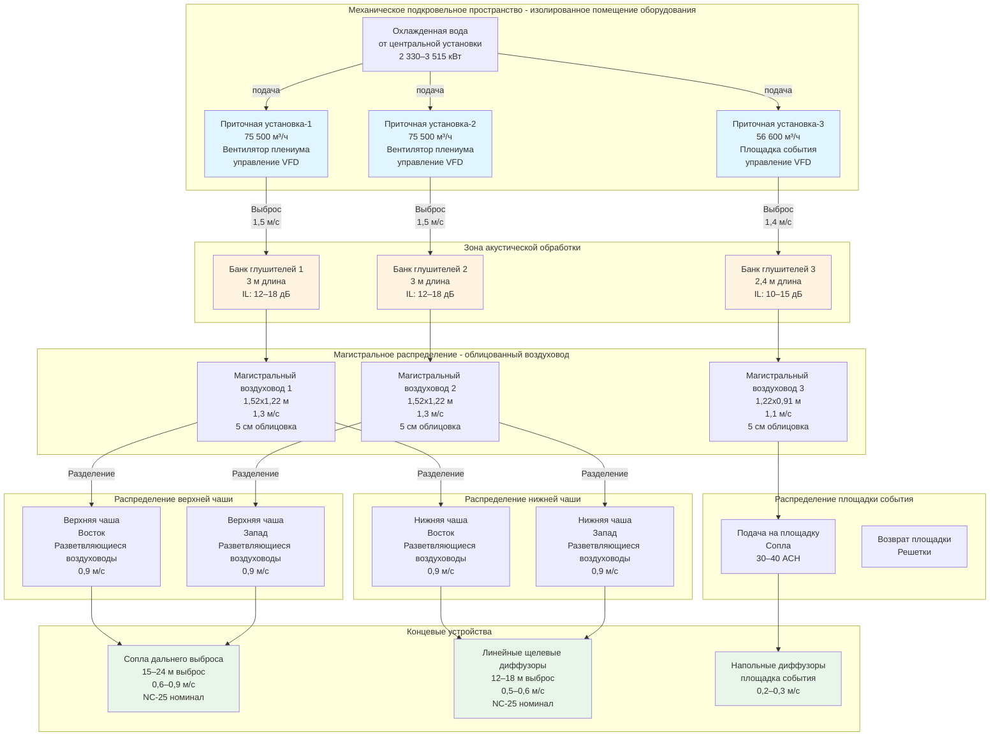

Спортивные арены и многофункциональные развлекательные объекты представляют уникальные акустические вызовы HVAC, существенно отличающиеся от концертных залов и театров. Хотя эти объекты нацелены на NC-35 — наиболее расслабленный критерий среди концертных залов — достижение этого стандарта требует тщательного внимания к огромным объемам воздуха, обширным сетям воздуховодов и высоким нагрузкам охлаждения, характерным для объектов на 10 000–20 000+ мест.

## Критерии NC-35 для крупных объектов

NC-35 представляет максимальный уровень фонового шума, приемлемый для объектов, где усиленный звук доминирует в акустической среде. Эта оценка признает, что спортивные события, концерты с усилением звука и публичные собрания генерируют уровни окружающего звука 70–90 дBA, что делает акустическое совершенство экономически неоправданным.

Кривая NC-35 допускает следующие уровни звукового давления в октавных полосах в незанятом пространстве:

| Центральная частота октавной полосы (Гц) | Максимальный SPL (дБ) | Допустимый диапазон (дБ) |
|-------------------------------------------|----------------------|--------------------------|
| 63 | 54 | ±2 |
| 125 | 47 | ±2 |
| 250 | 42 | ±2 |
| 500 | 38 | ±1 |
| 1000 | 35 | ±1 |
| 2000 | 33 | ±1 |
| 4000 | 31 | ±1 |
| 8000 | 30 | ±1 |

Взвешивание по частоте отражает чувствительность человека и типичные характеристики спектра HVAC. Низкочастотный гул ниже 250 Гц получает более высокие допуски SPL, тогда как средние и высокие частоты требуют более жесткого контроля для предотвращения раздражающего шипения во время тихих моментов.

## Сравнение требований NC для арен

Понимание акустических целей аренс требует контекста относительно других типов объектов и операционных различий, которые оправдывают расслабленные критерии:

| Тип объекта | Рейтинг NC | Типовая вместимость | Основное использование | м³/ч на человека | Обоснование проектирования |
|------------|-----------|-------------------|--------------------|--------------------|---------------------------|
| Концертные залы | NC-20 | 1 500–2 500 | Неусиленная оркестровая музыка | 8–11 | Сохранить пианиссимо на 40–50 dBA |
| Театры | NC-25 | 500–1 500 | Драматическое представление, диалог | 8–11 | Поддержать разборчивость речи без усиления |
| Лекционные залы | NC-30 | 200–800 | Образовательная презентация | 8–10 | Баланс четкости коммуникации и затрат |
| Арены | NC-35 | 10 000–20 000+ | Усиленные спорт, концерты, события | 5–7 | Приемлемый более высокий фоновый шум с усилением звука |
| Конгресс-центры | NC-40 | Переменная | Выставки, торговые выставки | 6–9 | Приемлемый более высокий фоновый шум от толпы |

Значения м³/ч на человека отражают акцент HVAC арен на охлаждение с высокой заполняемостью, а не на качество вентиляционного воздуха. Требования к вентиляции по стандарту ASHRAE 62.1 определяют минимальный наружный воздух, но общий подаваемый воздух намного превышает этот минимум для решения нагрузок явного охлаждения от освещения, людей и солнечного усиления.

## Характеристики нагрузок охлаждения крупного масштаба

Системы HVAC аренс должны обеспечивать нагрузки охлаждения, которые намного превышают типичные коммерческие приложения. 15 000-местная арена генерирует пиковые потребности охлаждения в 2 800–3 400 кВт, распределенные в трех отдельных зонах:

**Сидячая чаша (60–70% от общей нагрузки):**
Явное тепло от людей, солнечное усиление через световые люки или прозрачную кровлю, а также освещение создают нагрузки 88–123 кВт/м² площади пола. При площади сидячей чаши 11 150 м²:

$$Q_{\text{сидячая}} = A_{\text{площадь}} \times q_{\text{явное}} = 11{,}150 \, \text{м}^2 \times 105 \, \frac{\text{кВт}}{\text{м}^2} = 1{,}171 \, \text{кВт} \approx 333 \, \text{кВт}$$

**Игровая поверхность/площадка события (20–25% от общей нагрузки):**
Спортивные события и концерты требуют 30–40 ACH для контроля влажности и комфорта участников. Хоккейный корт 61 м × 26 м с высотой 12 м требует:

$$V_{\text{пол}} = 61 \times 26 \times 12 = 19{,}240 \, \text{м}^3$$

$$Q_{\text{пол}} = \frac{\text{ACH} \times V \times \rho \times c_p \times \Delta T}{60} = \frac{35 \times 19{,}240 \times 1.2 \times 1{,}006 \times 14}{60} = 526 \, \text{кВт}$$

**Коридоры и вспомогательные помещения (15–20% от общей нагрузки):**
Буфетные, уборные, раздевалки и вспомогательные помещения вносят вклад 440–735 кВт в зависимости от конфигурации и одновременных коэффициентов использования.

## Проектирование высокопроизводительных приточных установок

Воздухораспределение в аренах требует нескольких крупномасштабных установок, работающих параллельно для обеспечения резервирования и зонного управления. 15 000-местная арена типично использует 4–6 приточных установок номиналом 47 300–94 600 м³/ч каждая, в общей сложности 283 000–473 000 м³/ч системная производительность.

### Стратегии распределения воздуха

Распределение воздуха в аренах следует трем основным подходам, каждый с отдельными акустическими последствиями:

**Верхняя подача в сидячую чашу (наиболее распространено):**
Крупные магистральные воздуховоды диаметром 0,91–1,52 м распределяют воздух вокруг периметра сидячей чаши, питая разветвляющиеся воздуховоды с интервалом 6–9 м. Сопла дальнего выброса или линейные щелевые диффузоры, установленные 9–15 м выше пола, проецируют кондиционированный воздух в сидячие секции.

Акустические соображения включают:

- Скорости в магистральном воздуховоде ограничены 1,3–1,5 м/с для контроля регенерируемого шума
- Скорости в разветвляющихся воздуховодах снижены до 0,9–1,1 м/с при подходе к диффузорам
- Скорости выброса из сопел 0,6–0,9 м/с для дальностей выброса 15–24 м
- Минимум 5 см внутренней облицовки воздуховода в последних 9 м перед диффузорами

**Подача по подполью/вертикальным стоякам в сидячую чашу:**
Вертикальные стояки, заделанные в бетонную структуру сидячей чаши, доставляют воздух через напольные или крепящиеся на спинке кресла диффузоры непосредственно в занимаемую зону. Эта стратегия снижает воздействие воздуховодов в верхней чаше, но требует тщательной координации во время строительства.

Акустические преимущества включают:

- Более короткие трассы воздуховодов минимизируют кумулятивную передачу звука
- Низкоскоростной выброс (0,15–0,25 м/с) на уровне пола снижает шум диффузора
- Бетонное покрытие обеспечивает потери передачи 45–55 дБ

**Вытесняющая вентиляция (ограниченное применение):**
Подача низкоскоростного (0,25–0,75 м/с) воздуха на уровне пола с верхней вытяжкой подходит для арен в мягких климатах или ориентированных на устойчивость. Проблемы термической стратификации и высокая первоначальная стоимость ограничивают широкое распространение.

### Рассмотрения звуковой мощности оборудования

Крупные центробежные вентиляторы, обеспечивающие производительность 47 300–94 600 м³/ч, генерируют значительную звуковую мощность. Вентилятор плениума номиналом 75 500 м³/ч при общем статическом давлении 1,5 кПа производит уровни звуковой мощности в октавных полосах:

| Частота (Гц) | 63 | 125 | 250 | 500 | 1000 | 2000 | 4000 | 8000 |
|-------------|----|----|-----|-----|------|------|------|------|
| Lw (дБ) | 95 | 92 | 89 | 86 | 83 | 80 | 77 | 73 |

Для достижения NC-35 в сидячей чаше арены объемом 14 150 м³ (приблизительно 20 000 сабин поглощения), требуемый уровень звукового давления на 1000 Гц:

$$\text{SPL}_{1000} = L_w - 10\log_{10}\left(\frac{A}{4}\right) + 10.5$$

$$\text{SPL}_{1000} = 83 - 10\log_{10}\left(\frac{20{,}000}{4}\right) + 10.5 = 83 - 37 + 10.5 = 56.5 \, \text{дБ}$$

Это превышает целевой показатель NC-35 в 35 дБ на 1000 Гц на 21,5 дБ, требуя существенного ослабления звука в воздуховодах, глушителей и обработки пути передачи.

## Стратегии акустического контроля для HVAC арен

Достижение NC-35 с системами высокой производительности требует интегрированного управления источником, путем и приемником:

### Контроль источника

**Выбор вентилятора:**
Укажите центробежные вентиляторы с обратным изгибом или крыловидным профилем, работающие при скоростях на кончике лопасти ниже 3 050 м/с. Статическая эффективность вентилятора выше 70% коррелирует с меньшей генерацией звуковой мощности. Частотные преобразователи (VFDs) позволяют работу на основе спроса, снижая как потребление энергии, так и генерацию звука при событиях с низкой заполняемостью.

$$\text{звуковая мощность вентилятора} \propto \log_{10}(\text{TSP}) + 50\log_{10}(\text{м}^3/\text{ч})$$

10% снижение TSP за счет увеличенных теплообменников и низкосопротивляемых фильтров дает приблизительно 3–4 дБ более низкую звуковую мощность.

**Корпус приточной установки:**
Расположите воздухораспределительные установки в выделенных механических помещениях со стенами минимум STC-50. Внутренняя звукопоглощающая облицовка (5–10 см стекловолокна, плотность 48–96 кг/м³) на всех поверхностях механического помещения снижает реверберантное накопление и передачу в соседние помещения.

### Обработка пути передачи

**Глушители воздуховодов:**
Установите прямоугольные или цилиндрические глушители непосредственно ниже по потоку выхода приточной установки. Для магистральных воздуховодов 1,52 м × 1,22 м, пропускающих 75 500 м³/ч, 3-метровый параллельный экранный глушитель обеспечивает:

$$\text{Вносимое ослабление (IL)} = 5 + 2\log_{10}\left(\frac{L}{W}\right) + 10\log_{10}(f) - 20$$

Где L = длина глушителя (м), W = ширина проходного сечения (м), f = частота (Гц). На 500 Гц с L = 3 м и W = 0,46 м:

$$\text{IL}_{500} = 5 + 2\log_{10}\left(\frac{3}{0.46}\right) + 10\log_{10}(500) - 20 = 5 + 1.6 + 27 - 20 = 13.6 \, \text{дБ}$$

Критические параметры проектирования включают:

- Максимальная скорость на входе: 0,6 м/с для предотвращения самогенерируемого шума
- Минимальная толщина заполнителя 10 см для низкочастотного поглощения
- Потеря давления: 75–150 Па, учтенная при выборе вентилятора

**Ослабление в воздуховодах:**
Внутренне облицованные прямоугольные воздуховоды обеспечивают 5–8 дБ/м ослабления на средних частотах (500–2000 Гц). Для 30 м магистрального воздуховода 1,22 м × 0,91 м с 5 см облицовкой:

$$\text{Полное ослабление} = \alpha \times L = 6.5 \, \frac{\text{дБ}}{\text{м}} \times 30 \, \text{м} = 195 \, \text{дБ}$$

Это нереальное значение демонстрирует, что ослабление звука в воздуховодах ограничено геометрией. Фактические расчеты делят систему на:

- Прямые участки (5–8 дБ/м для первых 3–4,5 м, затем убывающий эффект)
- Колена с направляющими лопатками (10–16 дБ каждое)
- Ответвления и отводы (10 дБ на разделение из-за разделения энергии)
- Переходы и диффузоры (7–26 дБ в зависимости от геометрии)

**Передача звука через стенки воздуховода:**
Крупные воздуховоды в аренах представляют значительную поверхность для излучения звука в сидячие области. Потери передачи звука через стенку (TL) для прямоугольного воздуховода:

$$TL = 17.4 + 10\log_{10}(t) + 10\log_{10}(f) - 10\log_{10}(P/A)$$

Где t = толщина стенки воздуховода (см), f = частота (Гц), P = периметр воздуховода (см), A = площадь поперечного сечения воздуховода (см²).

Для воздуховода 1,52 м × 1,22 м (0,76 мм толщины = 0,076 см) на 500 Гц:

$$TL = 17.4 + 10\log_{10}(0.076) + 10\log_{10}(500) - 10\log_{10}\left(\frac{549}{18{,}709}\right)$$

$$TL = 17.4 - 11.2 + 27 - (-10.2) = 43.4 \, \text{дБ}$$

Внешняя изоляция воздуховода с 2,5–5 см стекловолокна и виниловым барьером с нагрузкой по массе улучшает TL на 10–15 дБ в местах, где воздуховоды проходят через сидячие области.

### Защита приемника

**Выбор диффузоров:**
Низкошумные диффузоры, оцениваемые для NC-25 до NC-30 при номинальном потоке воздуха, гарантируют, что шум концевого устройства не доминирует. Сопла дальнего выброса и линейные щели генерируют меньше турбулентности, чем обычные квадратные диффузоры.

Максимальные скорости выброса:

- Сопла: 0,9 м/с для дальности 18–24 м
- Линейные щели: 0,4–0,6 м/с
- Потолочные диффузоры: 0,2–0,3 м/с (коридоры)

**Потолочные системы:**
Акустические потолочные плитки с NRC 0,70–0,85 в коридорах и ложах поглощают отраженный шум HVAC и снижают реверберацию. Сидячая чаша типично остается открытой конструкцией, полагаясь на облицовку сидений и поглощение толпой для акустического демпфирования.

## Конфигурация системы HVAC арены

Следующая диаграмма иллюстрирует типовую компоновку HVAC арены, спроектированную для достижения акустической производительности NC-35 с высокопроизводительным охлаждением:

## Калибровка системы и акустическое воздействие

Калибровка HVAC арены балансирует требования тепловой нагрузки с акустическими ограничениями. Отношение между подаваемым потоком воздуха и генерацией шума следует:

$$\text{SPL диффузора} = L_w + 10\log_{10}(N) - 10\log_{10}(A/4) + 10.5$$

Где:
- Lw = уровень звуковой мощности диффузора (данные производителя)
- N = количество диффузоров
- A = поглощение помещения (сабины)

Для 100 сопел, каждое генерирующее Lw = 55 дБ на 1000 Гц в аренце с 20 000 сабин поглощения:

$$\text{SPL}_{1000} = 55 + 10\log_{10}(100) - 10\log_{10}(5{,}000) + 10.5$$

$$\text{SPL}_{1000} = 55 + 20 - 37 + 10.5 = 48.5 \, \text{дБ}$$

Это превышает NC-35 (35 дБ на 1000 Гц) на 13,5 дБ, требуя низкошумных диффузоров, сниженного потока воздуха на выход или дополнительных выходов для распределения нагрузки.

## Эксплуатационные соображения

Системы HVAC арен работают в высокопеременных условиях:

**График, основанный на событиях:**
Системы наращивают за 2–4 часа до событий для предварительного охлаждения пространства и стабилизации условий. VFD-управляемые вентиляторы снижают скорость до 40–60% во время незанятых периодов, снижая уровни звука и энергопотребление.

**Вентиляция на основе спроса:**
Датчики CO₂ в сидячих областях модулируют клапаны наружного воздуха для поддержания 800–1000 ppm, снижая излишнее охлаждение во время событий с частичной заполняемостью.

**Акустическая комиссионирование:**
Проверьте соответствие NC-35 посредством измерений в октавных полосах в нескольких местах сидения с системами на полной подаче воздуха. Проведите тесты во время незанятого состояния для исключения маскировки шума толпой. Обратитесь к превышениям через:

- Снижение скорости VFD (1–2 дБ на каждые 10% снижения скорости)
- Балансировка потока диффузора для снижения локализованных высокоскоростных выходов
- Дополнительная облицовка воздуховодов или внешняя изоляция в проблемных областях

## Стандарты проектирования и ссылки

Проектирование акустики арен ссылается на множество отраслевых стандартов:

**ASHRAE Applications Handbook, глава 49:** Предоставляет данные кривых NC, методы расчетов и рекомендуемые цели проектирования для мест общего пользования.

**ASHRAE Standard 62.1:** Устанавливает минимальные нормы вентиляции (2,35 м³/ч на человека + 0,36 м³/(ч·м²) для зон зрителей), влияющие на общий поток воздуха системы и связанное с ним акустическое воздействие.

**Руководства по проектированию спортивных сооружений:** Организации, включая Международную ассоциацию управления объектами (IAVM) и отдельные профессиональные спортивные лиги, публикуют рекомендации по акустике в диапазоне от NC-35 до NC-40 в зависимости от уровня объекта и предполагаемого использования.

**Участие акустического консультанта:** Пригласьте акустиков на этапе эскизного проекта для установления смет звуковой мощности, оценки альтернативных схем распределения воздуха и определения требований к испытаниям производительности. Независимое акустическое комиссионирование гарантирует, что цели NC-35 будут достигнуты до открытия объекта.

## Компромиссы стоимость-производительность

Достижение NC-35 в крупных аренах требует акустических инвестиций, уравновешенных в бюджетах строительства:

| Акустическая стратегия | Влияние на начальную стоимость | Акустическое преимущество | Рекомендуемый приоритет |
|----------------------|-------------------------------|-------------------------|----------------------|
| Увеличенные приточные установки (более низкое TSP) | +8–12% стоимости оборудования | 3–5 дБ снижение | Высокий - постоянное преимущество |
| Глушители выброса | +$1,160–2,330 на приточную установку | 12–18 дБ на проблемных частотах | Высокий - наиболее экономически эффективно |
| Облицовка воздуховодов (5 см vs без облицовки) | +$130–195/м² поверхности воздуховода | 5–8 дБ/м (первые 4,5 м) | Средний - убывающий эффект |
| Внешняя изоляция воздуховодов | +$85–155/м² в сидячих областях | 10–15 дБ снижение передачи | Средний - зонная специфичность |
| Низкошумные диффузоры | +15–25% стоимость диффузора | 5–8 дБ на концевых устройствах | Высокий - критично локальное воздействие |
| управление VFD (vs постоянный объем) | +$23,300–44,000 на вентилятор | Переменно - 1–2 дБ на каждые 10% снижения скорости | Высокий - преимущество энергии + акустики |

## Заключение

NC-35 системы HVAC для арен успешно балансируют акустическую производительность с практическими реальностями крупномасштабного охлаждения, высокопроизводительного воздухораспределения и экономичного строительства. Хотя менее строгий, чем требования NC-20 концертных залов, достижение NC-35 в объектах, обслуживающих 10 000–20 000 занятых мест, требует систематического внимания к выбору вентилятора, размеру воздуховодов, акустической обработке и производительности концевых устройств. Инвестиции в акустическое проектирование дают измеримые улучшения в комфорте зрителей, качестве события и конкурентоспособности объекта для привлечения премиум-программирования развлечений.
