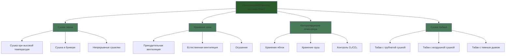

Сооружения для сушки и хранения сельскохозяйственной продукции требуют специализированных систем HVAC, которые контролируют температуру, влажность и воздушный поток для сохранения качества урожая при управлении содержанием влаги. Эти приложения требуют точного контроля окружающей среды для предотвращения порчи, сохранения стоимости продукции и минимизации энергопотребления в критический период после сбора урожая.

## Фундаментальная физика сушки

Процесс сушки включает одновременный теплопередачу и массопередачу, управляемые психрометрическими принципами и свойствами материала. Скорость сушки зависит от температуры воздуха, влажности, скорости и градиента влажности между продуктом и окружающим воздухом.

### Скорость сушки тонкого слоя

Скорость удаления влаги из сельскохозяйственных продуктов следует экспоненциальному затуханию:

$$MR = \frac{M - M_e}{M_0 - M_e} = \exp(-kt)$$

Где:
- $MR$ = Коэффициент влажности (безразмерный)
- $M$ = Содержание влаги в момент времени $t$ (доля, сухое основание)
- $M_e$ = Равновесное содержание влаги (доля, сухое основание)
- $M_0$ = Начальное содержание влаги (доля, сухое основание)
- $k$ = Константа сушки (1/ч)
- $t$ = Время сушки (ч)

### Равновесное содержание влаги

Модифицированное уравнение Хендерсона описывает равновесие влажности:

$$M_e = \left[\frac{-\ln(1-RH)}{A(T+C)}\right]^{1/B}$$

Где:
- $RH$ = Относительная влажность (доля)
- $T$ = Температура (°C)
- $A$, $B$, $C$ = Эмпирические константы, специфичные для каждой культуры

Для кукурузы: $A = 8.989 \times 10^{-5}$, $B = 2.098$, $C = 51.58$

## Применение систем

## Требования к сушке по культурам

### Характеристики температуры и воздушного потока

| Тип культуры | Безопасная т-ра сушки | Макс. т-ра | Расход воздуха | Целевая влажность |
|-----------|------------------|----------|--------------|-----------------|
| Кукуруза (семена) | 38-43°C | 43°C | 0.05-0.1 м³/с/м³ | 13-15% вв |
| Кукуруза (корм) | 60-71°C | 82°C | 0.15-0.25 м³/с/м³ | 15-16% вв |
| Пшеница | 43-60°C | 60°C | 0.05-0.1 м³/с/м³ | 13-14% вв |
| Соевые бобы | 43-49°C | 49°C | 0.05-0.08 м³/с/м³ | 11-13% вв |
| Рис | 43-49°C | 49°C | 0.08-0.12 м³/с/м³ | 12-14% вв |
| Сено (люцерна) | Окружающая + 5-8°C | 38°C | 0.02-0.05 м³/с/м³ | 16-18% вв |
| Арахис | 32-35°C | 35°C | 0.08-0.15 м³/с/м³ | 9-10% вв |
| Табак | 38-71°C (варьируется) | 71°C | 0.01-0.03 м³/с/м³ | 10-12% вв |

вв = влажное основание

### Требования к энергии

| Метод сушки | Энергетический ввод | Скорость испарения | Эффективность |
|---------------|--------------|------------------|------------|
| Сушка зерна при высокой т-ре (газ) | 4200-5600 кДж/кг H₂O | 50-150 кг/ч | 50-60% |
| Сушка в низкотемпературном бункере (электро) | 2800-3500 кДж/кг H₂O | 10-30 кг/ч | 60-75% |
| Вентиляция сена | 250-500 кДж/кг H₂O | 5-15 кг/ч | 70-85% |
| Осушение | 3000-4000 кДж/кг H₂O | 8-20 кг/ч | 200-300% COP |

## Системы сушки зерна

Сушилки зерна при высокой температуре работают при 60-82°C для коммерческих операций, быстро удаляя влагу для предотвращения порчи. Пропускная способность нагретого воздуха должна удовлетворять:

$$Q_{air} = \frac{\dot{m}_{grain} \times (M_i - M_f)}{(W_i - W_o) \times \rho_{air}}$$

Где:
- $Q_{air}$ = Требуемый расход воздуха (м³/с)
- $\dot{m}_{grain}$ = Пропускная способность зерна (кг/с)
- $M_i$, $M_f$ = Начальное и конечное содержание влаги (доля, сухое основание)
- $W_i$, $W_o$ = Входное и выходное соотношение влажности воздуха (кг/кг)
- $\rho_{air}$ = Плотность воздуха (кг/м³)

Стандарт ASABE S448.2 указывает требования к статическому давлению: 1.5-2.5 кПа для глубин колонн 6-12 м в непрерывных сушилках. Мощность вентилятора определяется по формуле:

$$P_{fan} = \frac{Q \times \Delta P}{\eta_{fan} \times \eta_{motor}}$$

Сушка в бункере использует окружающий или слегка нагретый воздух (окружающая + 3-6°C) с продолжительностью сушки 5-30 дней. Расходы воздуха 0.05-0.1 м³/с на м³ зерна поддерживают адекватные фронты сушки при минимизации энергетических затрат.

## Вентиляция при хранении сена

Сено, спрессованное при влажности 18-22%, требует принудительной вентиляции для снижения влажности до безопасных уровней хранения (14-16%). Система должна обеспечивать 0.02-0.05 м³/с на м³ сена с распределительными камерами, расположенными на расстоянии 2.4-3.6 м.

Критические параметры проектирования в соответствии с ASABE EP559:
- Минимальная скорость в камере: 10-15 м/с для обеспечения равномерного распределения
- Статическое давление: 750-1500 Па в зависимости от плотности тюков и высоты стопки
- Время сушки: 7-21 день в зависимости от начальной влажности и погодных условий
- Повышение температуры: ограничено 5-8°C для предотвращения теплового повреждения

Сено с влажностью превышающей 22% рискует самовозгоранием от выделения тепла при микробном дыхании. Мониторинг температуры критически важен; превышение 60°C требует немедленной вентиляции стопки.

## Хранение в контролируемой атмосфере

Хранение в контролируемой атмосфере (КА) продлевает срок хранения фруктов путем снижения содержания кислорода (1.0-3.0%) и повышения содержания углекислого газа (1.0-5.0%). Система поддерживает точную температуру (0-4°C для яблок, 1-2°C для груш) с контролем ±0.5°C.

Стандарт ASABE EP413.2 указывает:
- Скорость снижения O₂: 0.5-1.0% в день для предотвращения повреждения при низком O₂
- Очистка CO₂: Гидратированная известь или молекулярные сита
- Удаление этилена: Каталитическое окисление или перманганат калия
- Мониторинг газов: Точность ±0.1% для O₂ и CO₂

Охлаждающие нагрузки включают тепло дыхания (50-150 Вт/тонну в зависимости от продукции), инфильтрацию и охлаждение продукта. Змеевики испарителя требуют 5-8°C разности температур для минимизации потери влаги при обеспечении адекватного осушения.

## Сушка табака

Табак с трубчатой сушкой следует точному графику температуры-влажности в течение 5-7 дней:

1. Фаза пожелтения: 32-38°C, ОВ 85-90%, 24-48 часов
2. Сушка листьев: 38-54°C, ОВ 70-80%, 24-36 часов
3. Сушка стеблей: 54-71°C, ОВ 45-60%, 36-48 часов

Циркуляция воздуха 0.01-0.03 м³/с на м³ объема сарая обеспечивает однородные условия. Пропускная способность горелки 30-50 кВ на 100 м³ объема сарая обеспечивает контроль температуры с использованием демпферов для модулирования свежего воздуха для управления влажностью.

Табак с воздушной сушкой использует естественную вентиляцию через регулируемые настенные доски, требующую 4-8 недель при окружающих условиях с защитой от дождя. Табак с темным дымом объединяет воздушную сушку с воздействием дыма от тлеющей твердой древесины для развития вкуса.

## Стандарты и справочники

- ASABE S352.2: Измерение влажности - Немолотое зерно и семена
- ASABE D245.6: Отношения влажности для растительных сельскохозяйственных продуктов
- ASABE S448.2: Сушка в тонком слое сельскохозяйственных культур
- ASABE S593.1: Терминология и определения для сельскохозяйственного применения химических веществ
- ASABE EP559: Рекомендации по проектированию сушки и хранения сена и кормов
- ASABE EP413.2: Хранение фруктов и овощей в контролируемой атмосфере

Эти сельскохозяйственные приложения демонстрируют критическое пересечение инженерии HVAC и пищевого производства, где точный контроль окружающей среды напрямую влияет на качество продукции, безопасность и экономическую стоимость.
