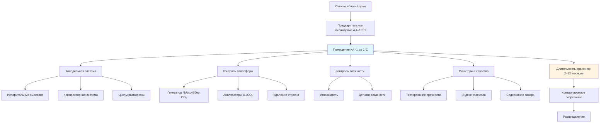

Хранение в контролируемой атмосфере (КА) продлевает коммерческий срок жизни яблок и груш путём снижения скорости дыхания и поддержания качества фруктов в течение до 12 месяцев. Этот метод хранения объединяет точный контроль температуры с изменённым составом атмосферы — пониженным содержанием кислорода и повышенным содержанием углекислого газа — для замедления метаболических процессов при поддержании оптимальной влажности.

## Требования к температуре

Контроль температуры является основой успешного хранения в КА. Большинство сортов яблок и груш требуют температуры хранения от -1 до 1°C (30–34°F), поддерживаемой в пределах ±0,3°C для предотвращения физиологических нарушений и повреждений от замораживания.

**Критические соображения по температуре:**

- **-1 до -0,5°C**: Оптимально для большинства сортов хранилищных яблок (Fuji, Gala, Honeycrisp)
- **0–1°C**: Требуется для чувствительных к охлаждению сортов (Granny Smith, некоторые груши)
- **Однородность температуры**: Максимальное колебание 0,6°C по всему хранилищу
- **Скорость охлаждения**: Начальное снижение на 0,6–1,2°C в день во избежание конденсационного стресса

Соотношение между температурой и скоростью дыхания описывается экспоненциальной функцией. Скорость дыхания $R$ при температуре $T$ может быть аппроксимирована следующим образом:

$$R(T) = R_0 \cdot Q_{10}^{(T-T_0)/10}$$

где $R_0$ — базовая скорость дыхания при референсной температуре $T_0$, а $Q_{10}$ обычно составляет от 2,0 до 2,5 для яблок и груш.

## Управление кислородом и углекислым газом

Эффективность хранения в КА зависит от поддержания специфических составов атмосферы, адаптированных к каждому сорту. Снижение кислорода и повышение углекислого газа работают синергически для подавления дыхания и производства этилена.

**Стандартные условия КА:**

- **Обычная КА (РКА)**: 1,5–3% O₂, 1–3% CO₂
- **Низкокислородная КА**: 1,0–1,5% O₂, 0,5–1% CO₂
- **Ультранизкокислородная (ULO)**: 0,7–1,0% O₂, <1% CO₂
- **Динамическая КА (DCA)**: O₂ адаптируется на основе отклика фруктов (0,4–0,6% O₂)

Респираторный коэффициент (RQ) указывает на соотношение выделяемого CO₂ к потребляемому O₂:

$$RQ = \frac{\text{выделённый CO}_2}{\text{потреблённый O}_2}$$

Обычное аэробное дыхание даёт RQ близко к 1,0. Значения выше 1,5 указывают на анаэробное дыхание и возможное повреждение фруктов.

## Требования по КА в зависимости от сорта

Различные сорта яблок и груш требуют отличающихся условий КА для оптимального хранения.

| Сорт | Температура (°C) | O₂ (%) | CO₂ (%) | Длительность хранения | Специальные примечания |
|---------|------------------|--------|---------|------------------|---------------|
| **Яблоки** |
| Fuji | -1 до -0,5 | 1,0–2,0 | 0,5–1,0 | 9–12 месяцев | Рекомендуется ULO |
| Gala | -1 до 0 | 1,5–2,5 | 2,5–3,0 | 5–7 месяцев | Чувствительны к этилену |
| Granny Smith | 0–1 | 1,0–1,5 | 0,5–1,0 | 10–12 месяцев | Хорошо переносят ULO |
| Honeycrisp | 2–3 | 2,5–3,0 | 1,0–1,5 | 4–6 месяцев | Более высокая температура |
| Red Delicious | -1 до -0,5 | 1,5–2,0 | 3,0–4,5 | 6–9 месяцев | Высокая устойчивость к CO₂ |
| Golden Delicious | -1 до -0,5 | 2,0–3,0 | 2,0–3,0 | 6–8 месяцев | Подверженны заболеванию |
| **Груши** |
| Bartlett | -1 до -0,5 | 2,0–3,0 | 0,5–1,0 | 2–3 месяца | Короткий срок хранения |
| Anjou | -1 до -0,5 | 1,0–2,0 | 0,5–1,0 | 6–9 месяцев | ULO продлевает хранение |
| Bosc | -1 до -0,5 | 1,5–2,5 | 0,5–1,5 | 3–5 месяцев | Умеренная польза КА |
| Comice | -1 до -0,5 | 2,0–3,0 | <0,5 | 2–4 месяца | Чувствительны к CO₂ |

## Системы контроля этилена

Этилен ускоряет созревание и старение как яблок, так и груш. Эффективное управление этиленом имеет решающее значение для поддержания качества фруктов при длительном хранении.

**Методы удаления этилена:**

- **Каталитическое окисление**: Превращает этилен в CO₂ и H₂O при 177–204°C с использованием катализаторов платина/палладий
- **Скрубберы с перманганатом калия**: Химическое поглощение в неподвижных слоях
- **Озоновая обработка**: Окисляет этилен при концентрации O₃ 0,1–0,3 ppm
- **1-MCP обработка**: Блокирует рецепторы этилена перед хранением в КА (0,625–1,0 μL/L в течение 24 часов)

Целевые концентрации этилена должны оставаться ниже 1 ppm для яблок и ниже 0,5 ppm для груш в течение всего периода хранения.

## Поддержание влажности

Относительная влажность должна поддерживаться на уровне 90–95% для минимизации потерь воды, избегая конденсации, которая способствует размножению патогенных организмов.

**Стратегии контроля влажности:**

- Высокоэффективные охлаждающие змеевики с минимальным температурным перепадом 1,7–2,8°C
- Ультразвуковые или центробежные увлажнители для дополнительной влаги
- Скорость циркуляции воздуха 0,5–1,0 CFM (0,85–1,7 м³/ч) на килограмм фруктов
- Управление конденсатом для предотвращения скопления свободной воды

Потеря веса при хранении описывается следующим образом:

$$\Delta W = k \cdot A \cdot (P_{sat} - P_{actual}) \cdot t$$

где $k$ — коэффициент массопередачи, $A$ — площадь поверхности, $(P_{sat} - P_{actual})$ — дефицит давления водяного пара, $t$ — время хранения.

## Конфигурация системы

## Протоколы мониторинга качества

Регулярная оценка гарантирует, что фрукты сохраняют коммерческое качество на протяжении всего периода хранения.

**Основные параметры мониторинга:**

- **Прочность**: Еженедельные показания пенетрометра (целевое значение: минимальная потеря <9 Н)
- **Растворимые вещества**: Тестирование рефрактометром раз в две недели (поддержание °Brix)
- **Деградация крахмала**: Окраска йодом для определения индекса зрелости
- **Обнаружение нарушений**: Визуальный осмотр на предмет заболеваний, разложения и повреждений от CO₂
- **Состав атмосферы**: Непрерывный мониторинг O₂/CO₂ (точность ±0,1%)
- **Концентрация этилена**: Еженедельный отбор проб (<1 ppm для яблок)

Возможности хранения значительно различаются в зависимости от сорта, варьируясь от 2–3 месяцев для груш Bartlett до 12 месяцев для яблок Granny Smith при оптимальных условиях ULO. Надлежащее управление КА может продлить коммерческий срок жизни в 3–4 раза дольше, чем обычное холодильное хранилище.

Экономические преимущества хранения в КА — включая расширенные маркетинговые окна и снижение потерь — должны быть уравновешены более высокими капитальными затратами на газонепроницаемую конструкцию, оборудование для контроля атмосферы и интенсивный мониторинг.
