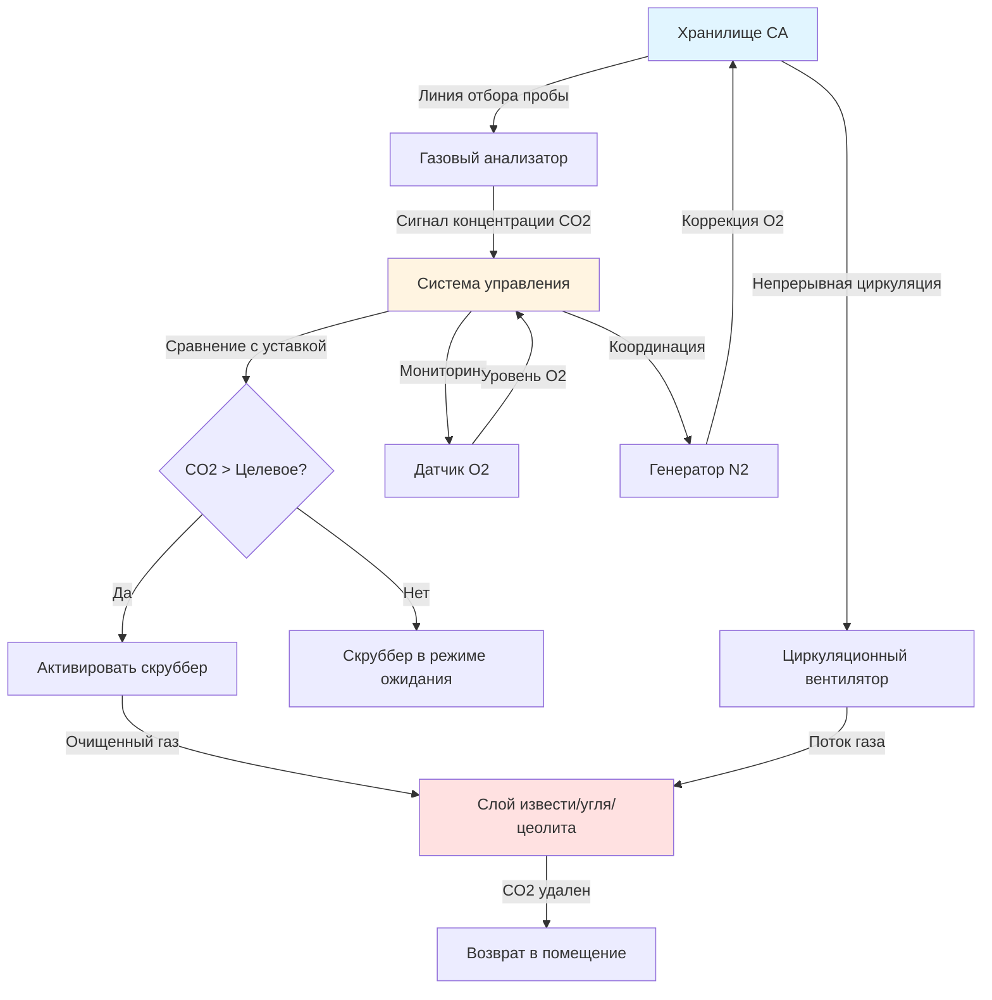

## Накопление CO2 в хранилищах с контролируемой атмосферой

Углекислый газ непрерывно накапливается в хранилищах с контролируемой атмосферой (CA) в результате дыхания продукции. Скорость образования CO2 зависит от типа продукции, температуры, уровня кислорода и продолжительности хранения. Без активного удаления концентрации CO2 могут достигать уровней, вызывающих физиологические повреждения хранимых культур.

Скорость образования CO2 следует дыхательным паттернам и может быть оценена по формуле:

$$Q_{CO2} = m \cdot R \cdot RQ$$

где $Q_{CO2}$ — скорость производства CO2 (кг/ч), $m$ — масса продукции (кг), $R$ — скорость дыхания (мг CO2/кг·ч), а $RQ$ — дыхательный коэффициент (обычно 0,9–1,1 для большинства видов продукции).

Для хранилища, содержащего 50 000 кг яблок при температуре 0,5°C со скоростью дыхания 3 мг CO2/кг·ч:

$$Q_{CO2} = 50000 \times 0,003 \times 1,0 = 150 \text{ г/ч} = 3,6 \text{ кг/сутки}$$

Это непрерывное образование требует активного удаления CO2 для поддержания целевых концентраций в диапазоне 1–5% в зависимости от хранимой продукции.

## Технологии скрубберов для удаления CO2

### Системы на активированном угле

Адсорберы на активированном угле удаляют CO2 за счет физической адсорбции на углеродном носителе с высокой удельной поверхностью. Эти системы работают в двухкамерной конфигурации с чередующимися циклами адсорбции и регенерации. Регенерация требует нагрева до 200–300°C для десорбции CO2.

**Ключевые характеристики:**
- Емкость по удалению CO2: 5–15% по массе
- Цикл регенерации: 4–8 часов
- Высокое энергопотребление из-за требований к нагреву
- Чувствительность к содержанию влаги в газовом потоке

### Скрубберы на гидратированной извести

Гидроксид кальция (гидратированная известь) вступает в химическую реакцию с CO2 с образованием карбоната кальция в необратимой реакции:

$$\text{Ca(OH)}_2 + \text{CO}_2 \rightarrow \text{CaCO}_3 + \text{H}_2\text{O}$$

Скрубберы на гидратированной извести являются расходными системами, требующими периодической замены извести, но обеспечивают простую и надежную работу без циклов регенерации.

**Эксплуатационные параметры:**
- Эффективность удаления CO2: 90–98%
- Расход извести: 1,7 кг Ca(OH)2 на 1 кг CO2
- Интервал замены слоя: обычно 2–4 недели
- Не требуется нагрев или энергия для регенерации

### Системы на молекулярных ситах

Цеолитные молекулярные сита селективно адсорбируют CO2 на основе молекулярного размера и полярности. Эти системы используют адсорбцию при переменном давлении (PSA) или адсорбцию при переменном температурном режиме (TSA) для регенерации.

**Преимущества:**
- Высокая селективность по CO2 относительно O2 и N2
- Более низкие температуры регенерации (100–150°C) по сравнению с активированным углем
- Более длительный срок службы цикла по сравнению с химическими скрубберами
- Возможность работы при более низких концентрациях CO2

## Оптимальные уровни CO2 и пороги повреждения

Различные культуры переносят различные концентрации CO2. Превышение порогов повреждения вызывает физиологические нарушения, включая потемнение мякоти, посторонние привкусы и ускоренное старение.

| Культура | Оптимальный CO2 (%) | Максимальный безопасный CO2 (%) | Симптомы повреждения |
|----------|---------------------|--------------------------------|----------------------|
| Яблоки (большинство сортов) | 0,5–3,0 | 5,0 | Потемнение сердцевины, изменение цвета мякоти |
| Груши (Бартлетт) | 0–1,0 | 2,0 | Разрушение сердцевины, коричневое ядро |
| Груши (д'Анжу) | 1,0–3,0 | 5,0 | Коричневое ядро, потемнение мякоти |
| Клубника | 10–20 | 25 | Посторонние привкусы, повышенная восприимчивость к грибкам |
| Салат | 0 | 2,0 | Коричневые пятна, ржавление |
| Брокколи | 5–10 | 15 | Пожелтение, посторонние запахи |
| Авокадо | 3–10 | 15 | Изменение цвета мякоти, посторонние привкусы |
| Киви | 3–5 | 8,0 | Размягчение мякоти, посторонние привкусы |

## Мониторинг и автоматизация управления CO2

Современные хранилища с контролируемой атмосферой оснащены системами непрерывного мониторинга CO2 с автоматическим управлением скрубберами для поддержания точных уставок.

### Элементы стратегии управления

**Частота измерений:** Анализаторы CO2 отбирают пробы с интервалом 1–5 минут с использованием инфракрасных (ИК) или электрохимических датчиков с точностью ±0,1%.

**Алгоритм управления:** Петли управления PID поддерживают уровень CO2 в пределах ±0,5% от заданного значения путем модуляции скорости циркуляции скруббера или циклического включения/выключения скруббера.

**Блокировки безопасности:** Сигнализация высокого уровня CO2 срабатывает при превышении целевого значения на 1–2% с автоматическим включением скруббера и уведомлением операторов.

## Интеграция с управлением кислородом

Системы скрубберов CO2 работают в координации с оборудованием для снижения содержания кислорода для поддержания полной среды контролируемой атмосферы (CA). Ключевые аспекты интеграции включают:

**Баланс газов:** Удаление CO2 без замещения объема может создать небольшое отрицательное давление. Системы впрыска азота компенсируют это, поддерживая давление в помещении при одновременном снижении содержания кислорода.

**Синхронное управление:** Независимые контуры управления регулируют O2 (обычно 1–3%) и CO2 (1–5%), при этом оба параметра непрерывно контролируются. Управление кислородом имеет приоритет в большинстве систем, поскольку дефицит кислорода вызывает более быстрое повреждение, чем повышенный уровень CO2.

**Селективность скруббера:** Скрубберы CO2 не должны удалять значительное количество кислорода. Молекулярные сита обеспечивают высокую селективность, тогда как системы на основе активированного угля и извести имеют минимальное сродство к кислороду.

**Оптимизация энергопотребления:** Координация работы скруббера с циклами работы генератора азота снижает энергопотребление. Запуск обеих систем в периоды низких тарифов на электроэнергию снижает эксплуатационные расходы.

**Реакция на дыхание:** По мере снижения уровня O2 дыхание замедляется, и выделение CO2 уменьшается. Системы управления динамически регулируют работу скруббера на основе фактических скоростей накопления CO2, а не по фиксированному графику.

Эффективное управление CO2 продлевает срок хранения, поддерживает качество продукции и максимизирует экономические выгоды от хранения в контролируемой атмосфере для высокоценных культур.
