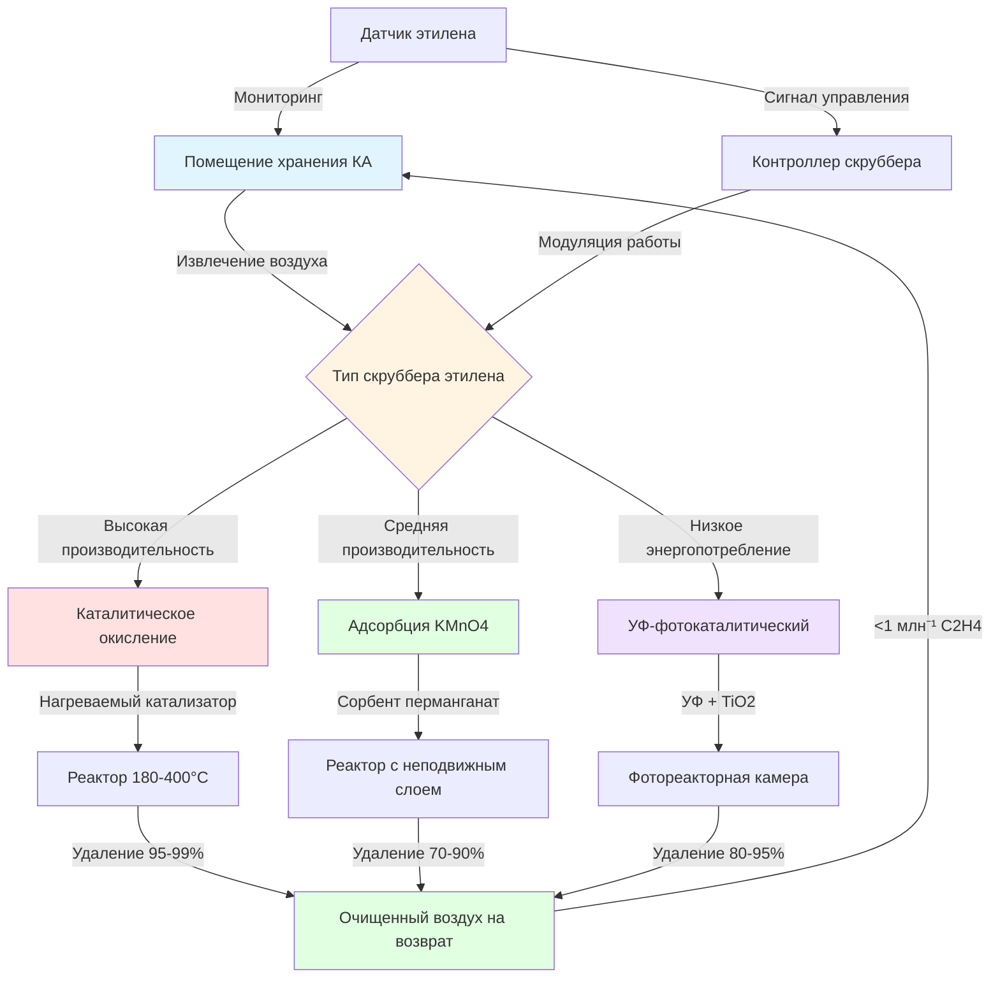

Удаление этилена представляет собой критически важный компонент систем хранения в контролируемой атмосфере (КА) климактерических фруктов и овощей. Этилен (C₂H₄), растительный гормон, который ускоряет созревание и старение, должен активно удаляться для продления сроков хранения и сохранения качества продукции при долгосрочных операциях холодного хранения.

## Производство этилена климактерическими фруктами

Климактерические фрукты демонстрируют характерный пик дыхания во время созревания, сопровождаемый значительным производством этилена. Автокаталитический характер биосинтеза этилена означает, что даже следовые количества могут вызвать ускоренное созревание всего хранящегося продукта.

Скорость образования этилена значительно варьируется в зависимости от типа продукции, температуры и стадии зрелости. Скорость образования этилена можно оценить с помощью:

$$E_p = E_0 \cdot Q_{10}^{(T-T_0)/10} \cdot f_m$$

Где:
- $E_p$ = скорость образования этилена (мкл/кг·ч)
- $E_0$ = базовая скорость образования при эталонной температуре
- $Q_{10}$ = температурный коэффициент (обычно 2,0-3,0)
- $T$ = температура хранения (°C)
- $T_0$ = эталонная температура (°C)
- $f_m$ = коэффициент зрелости (0,1-10,0)

### Скорости производства этилена по видам продукции

| Продукция | Скорость образования (мкл/кг·ч) | Температура | Чувствительность к хранению |
|-----------|-----------------------------------|-----------|-----------------------|
| Яблоки (зрелые) | 0,1-10,0 | 0-5°C | Высокая |
| Груши (Бартлетт) | 5,0-30,0 | 0-2°C | Очень высокая |
| Бананы (зелёные) | 0,1-0,5 | 13-15°C | Средняя |
| Бананы (спелые) | 10,0-50,0 | 13-15°C | Высокая |
| Киви | 1,0-5,0 | 0°C | Высокая |
| Помидоры (зелёно-зрелые) | 0,5-2,0 | 12-15°C | Средняя |
| Авокадо | 5,0-100,0 | 5-13°C | Очень высокая |
| Персики | 2,0-20,0 | 0-2°C | Высокая |
| Манго | 1,0-10,0 | 10-13°C | Высокая |

Требуемая производительность по удалению этилена для помещения хранения КА рассчитывается как:

$$C_{removal} = \frac{M_{produce} \cdot E_p \cdot 1,1}{V_{room}}$$

Где:
- $C_{removal}$ = требуемая производительность по удалению (мкл/м³·ч)
- $M_{produce}$ = масса хранящейся продукции (кг)
- $V_{room}$ = объем помещения (м³)
- 1,1 = коэффициент безопасности

## Системы каталитического окисления

Системы каталитического окисления обеспечивают непрерывное удаление этилена путём его превращения в углекислый газ и воду при повышенных температурах. Эти системы используют катализаторы из драгоценных металлов (платина, палладий) на керамических носителях.

Реакция каталитического окисления протекает как:

$$\text{C}_2\text{H}_4 + 3\text{O}_2 \xrightarrow{\text{катализатор, нагрев}} 2\text{CO}_2 + 2\text{H}_2\text{O}$$

**Параметры работы:**
- Температура катализатора: 180-400°C
- Время контакта: 0,5-2,0 секунды
- Расход воздуха: 50-150 м³/ч на 100 тонн хранящейся продукции
- Эффективность удаления: 95-99% за один проход
- Потребление электроэнергии: 0,5-1,5 кВт на 100 тонн

Каталитические системы превосходны в установках большой производительности, где требуется непрерывная работа. Слой катализатора требует периодической регенерации для удаления накопленных загрязнений, которые дезактивируют активные центры. Типичный срок службы катализатора составляет 3-5 лет при нормальных условиях работы.

## Системы адсорбции с перманганатом калия

Перманганат калия (KMnO₄), пропитанный в гранулы глинозёма, обеспечивает эффективное удаление этилена путём химического окисления при комнатной температуре. Этот пассивный подход не требует электроэнергии и предлагает простоту при модернизации существующих систем.

Механизм окисления предусматривает:

$$3\text{C}_2\text{H}_4 + 2\text{KMnO}_4 \rightarrow 2\text{MnO}_2 + 2\text{KOH} + 3\text{CH}_3\text{CHO}$$

**Характеристики системы:**
- Ёмкость сорбента: 100-200 г этилена на кг KMnO₄
- Скорость потока воздуха: 0,3-0,5 м/с через слой сорбента
- Время контакта: 2-4 секунды
- Эффективность удаления: 70-90% за один проход
- Замена сорбента: каждые 4-12 месяцев

Требуемая масса сорбента рассчитывается из:

$$M_{media} = \frac{M_{produce} \cdot E_p \cdot t_{storage}}{C_{media} \cdot \eta}$$

Где:
- $M_{media}$ = требуемая масса сорбента (кг)
- $t_{storage}$ = длительность хранения (часы)
- $C_{media}$ = ёмкость сорбента (г этилена/кг)
- $\eta$ = эффективность использования (обычно 0,7)

Системы с перманганатом работают лучше всего в небольших объектах (менее 500 тонн), где приоритизируется минимизация капитальных затрат над операционной эффективностью.

## Методы УФ-фотокаталитического окисления

УФ-фотокаталитическое окисление сочетает ультрафиолетовый свет с катализаторами диоксида титана (TiO₂) для разложения этилена при комнатной температуре. Эта технология обеспечивает низкое обслуживание и непрерывную работу без замены расходных материалов.

**Основы процесса:**
- Длина волны УФ: 254 нм (бактерицидный)
- Активация катализатора TiO₂
- Образование гидроксильных радикалов (·OH)
- Окисление этилена в CO₂ и H₂O

**Технические характеристики:**
- Эффективность удаления: 80-95% за один проход
- Время пребывания: 5-10 секунд
- Потребление электроэнергии: 0,3-0,8 кВт на 100 тонн
- Срок службы лампы: 10 000-20 000 часов
- Замена расходных материалов не требуется

Фотокаталитические системы обеспечивают преимущества в органическом производстве, где химические окислители запрещены. Отсутствие высокотемпературных компонентов снижает риск пожара на объектах, где используются легковоспламеняющиеся хладагенты или изоляционные материалы.

## Целевые уровни этилена при хранении в КА

Поддержание концентрации этилена ниже 1 млн⁻¹ представляет собой стандартную цель для большинства приложений хранения в КА. Отдельные виды продукции демонстрируют различные пороги чувствительности:

- Сверхчувствительные (киви, брокколи): <0,1 млн⁻¹
- Высокочувствительные (яблоки, груши): <0,5 млн⁻¹
- Среднечувствительные (цитрусовые, перцы): <1,0 млн⁻¹
- Низкочувствительные (лук, картофель): <5,0 млн⁻¹

Непрерывный мониторинг с использованием электрохимических или газохроматографических датчиков обеспечивает поддержание концентрации этилена в приемлемых диапазонах. Системы управления модулируют работу скруббера на основе обратной связи о концентрации в реальном времени.

## Интеграция с системами хранения в КА

Скрубберы этилена интегрируются с более широкой инфраструктурой хранения в КА через скоординированные стратегии управления. Система удаления этилена работает параллельно с системами деплеции кислорода, удаления углекислого газа и управления влажностью.

**Соображения по интеграции системы:**

1. **Координация расходов воздуха**: Расходы воздуха скруббера должны уравновешиваться с общей циркуляцией системы КА для поддержания единообразных условий по всему помещению хранения.

2. **Управление энергией**: Системы каталитического окисления получают преимущество от рекуперации тепловых отходов для предварительного нагрева поступающего воздуха, снижая требуемую электрическую мощность на 30-40%.

3. **Расположение датчика**: Датчики этилена должны располагаться в местах возврата воздуха, где концентрации максимальны перед скруббированием.

4. **Резервная производительность**: Критические установки включают резервную производительность по очистке (150-200% от проектной нагрузки) для учёта обслуживания системы и пиковых периодов.

5. **Предохранительные блокировки**: Высокотемпературные каталитические системы требуют элементов управления ограничением температуры и интеграции с системами пожаротушения.

Выбор технологии удаления этилена зависит от ёмкости хранилища, типа продукции, стоимости энергии и ограничений капитального бюджета. Крупные коммерческие установки обычно отдают предпочтение каталитическому окислению за надёжность и производительность, в то время как меньшие объекты используют системы с перманганатом для простоты и более низких начальных инвестиций.

Надлежащее управление этиленом продлевает период хранения на 2-4 месяца для чувствительной продукции, что прямо влияет на улучшение качества продукта, снижение потерь и повышение гибкости рынка для хранящейся продукции.
