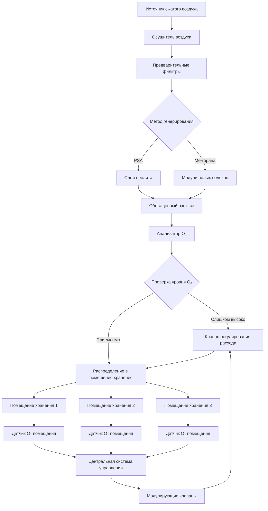

## Основы контроля кислорода

Точный контроль кислорода является краеугольным камнем эффективности хранения в контролируемой атмосфере (CA). За счет снижения концентрации кислорода с атмосферного уровня (20,9%) до целевых диапазонов 1-3% объекты значительно замедляют скорость дыхания хранящейся продукции, продлевая срок хранения в 2-4 раза по сравнению с традиционным холодильным хранением.

Взаимосвязь между концентрацией кислорода и скоростью дыхания следует кинетике Михаэлиса-Ментен:

$$R = \frac{R_{max} \cdot [O_2]}{K_m + [O_2]}$$

Где $R$ — скорость дыхания, $R_{max}$ — максимальная скорость дыхания при атмосферном кислороде, $[O_2]$ — концентрация кислорода и $K_m$ — константа Михаэлиса (обычно 0,5-2% для большинства фруктов).

## Методы генерирования низкокислородной атмосферы

### Системы адсорбционного разделения при колебании давления (PSA)

Генераторы азота PSA производят высокочистый азот путем избирательной адсорбции кислорода из сжатого воздуха с использованием молекулярных сит из углерода. Процесс работает в чередующихся циклах:

**Фаза адсорбции:** Сжатый воздух проходит через слои цеолита при 6-8 бар, которые избирательно удерживают молекулы кислорода, позволяя азоту пройти. Чистота продукта достигает 95-99,5% азота.

**Фаза регенерации:** Давление снижается до атмосферного уровня, высвобождая адсорбированный кислород в выхлоп. Типичные времена цикла составляют 30-120 секунд.

Системы PSA обеспечивают производительность от 10-10 000 SCFH с потреблением энергии 0,35-0,45 кВт·ч на 100 м³ азота. Начальные затраты выше, чем у мембранных систем, но эксплуатационные расходы снижаются для крупных установок.

### Системы мембранного разделения

Полые мембранные генераторы разделяют азот из воздуха на основе различных скоростей проникновения через полимерные мембраны. Кислород и водяной пар проникают быстрее, чем азот, создавая обогащенный азотом поток пермеата.

Мембранные системы работают непрерывно при входном давлении 7-10 бар, производя азот чистотой 95-99% в зависимости от регулировок расхода. Потребление энергии составляет примерно 0,25-0,35 кВт·ч на 100 м³ азота.

Эти системы отлично подходят для установок малого и среднего размера (5-500 SCFH) с низкими капитальными затратами, минимальными требованиями к обслуживанию и компактным размером. Срок службы мембран при надлежащей фильтрации воздуха обычно превышает 10 лет.

### Каталитическое удаление кислорода

Каталитические горелки потребляют остаточный кислород путем контролируемого сгорания с пропаном или природным газом над катализаторами на основе платины. Этот метод точно настраивает уровни кислорода на очень низкие концентрации (0,5-1%), которые недостижимы при использовании только генерирования азота.

Реакция сгорания:

$$O_2 + 2H_2 \rightarrow 2H_2O$$

или

$$O_2 + CH_4 \rightarrow CO_2 + 2H_2O$$

Скрубберы удаляют побочные продукты сгорания перед циркуляцией газа. Этот подход подходит для специальных применений, требующих экстремального снижения кислорода для долгосрочного хранения яблок или сохранения сухофруктов.

## Оптимальные уровни кислорода по типам урожая

| Культура | Кислород (%) | CO₂ (%) | Температура (°C) | Продолжительность хранения |
|----------|-------------|---------|------------------|---------------------------|
| Яблоки (Granny Smith) | 1,0-1,5 | 1,0-2,0 | 0-1 | 9-12 месяцев |
| Яблоки (Gala) | 1,5-2,5 | 2,5-3,0 | 0-1 | 6-9 месяцев |
| Груши (Bartlett) | 1,5-2,5 | 0-1,0 | -1-0 | 2-3 месяца |
| Груши (Anjou) | 1,0-2,0 | 0,5-1,5 | -1-0 | 6-8 месяцев |
| Киви | 1,0-2,0 | 3,0-5,0 | 0 | 5-6 месяцев |
| Авокадо | 2,0-5,0 | 3,0-10,0 | 5-13 | 2-8 недель |
| Капуста | 2,5-5,0 | 2,5-6,0 | 0 | 5-6 месяцев |
| Черника | 2,0-5,0 | 12,0-20,0 | 0-1 | 6-8 недель |

## Системы мониторинга и контроля кислорода

Современные объекты CA используют избыточное измерение кислорода с использованием электрохимических, парамагнитных или циркониевых датчиков. Электрохимические элементы обеспечивают точность 0,1% с временем жизни 6-24 месяца при стоимости 200-500 долл. США за датчик.

Системы управления поддерживают уставки через:

**Непрерывное введение азота:** Модулирующие клапаны регулируют расход азота на основе измеренных уровней кислорода с типичной мертвой зоной ±0,2%.

**Быстрое снижение:** Начальное снижение кислорода с атмосферного до целевых уровней происходит за 3-7 дней во избежание физиологических повреждений.

**Компенсация давления:** Герметизированные помещения требуют сброса давления во избежание структурных повреждений при вытеснении кислорода азотом.

Контроллеры на основе PLC регистрируют данные кислорода, диоксида углерода, температуры и влажности с интервалом 1-15 минут, вызывая тревоги при отклонении параметров от допускаемых диапазонов.

## Преимущества снижения скорости дыхания

Снижение кислорода с 21% до 2% уменьшает скорость дыхания на 40-70% в зависимости от товара и температуры. Комбинированный эффект с охлаждением обеспечивает мультипликативное преимущество:

$$Q_{10} = \left(\frac{R_2}{R_1}\right)^{\frac{10}{T_2-T_1}}$$

Где $Q_{10}$ представляет температурный коэффициент (обычно 2-3 для большинства продукции), демонстрируя, что снижение температуры на 10°C удваивает или утраивает скорость дыхания.

Низкокислородные атмосферы подавляют производство этилена, задерживают созревание, снижают потери влаги, минимизируют грибковый рост и поддерживают плотность, цвет и питательное качество на протяжении длительного периода хранения.

## Соображения безопасности для низкокислородных сред

Кислорододефицитные атмосферы (ниже 19,5%) представляют непосредственную опасность асфиксии. Критические протоколы безопасности включают:

**Процедуры входа:** Вентилируйте помещения до атмосферных уровней кислорода перед входом. Подтвердите >19,5% O₂ с помощью калиброванных портативных мониторов. Никогда не входите в одиночку.

**Системы предупреждения:** Мигающие огни и звуковые тревоги у входов в помещения, указывающие статус опасной атмосферы.

**Интерлоки вентиляции:** Открытие двери автоматически запускает вентиляторы выхлопа и отключает подачу азота.

**Аварийное оборудование:** Автономные дыхательные аппараты (SCBA) установлены вне каждого помещения. Спасательные штативы и системы извлечения для экстренного спасения.

**Требования обучения:** Ежегодная сертификация входа в ограниченное пространство для всего персонала с правом доступа в помещение.

Объекты обычно устанавливают датчики кислорода на нескольких высотах, так как расслоение азота может создавать локализованные очаги тяжелого истощения кислорода у уровня пола.

## Требования обнаружения утечек и герметизации

Эффективность хранения CA зависит от поддержания герметичных оболочек. Допустимые скорости утечек составляют 1-5% объема помещения за 24 часа при положительном давлении 0,25 см водяного столба.

**Тестирование спада давления:** Герметизируйте пустое помещение до 1 см водяного столба, измерьте падение давления в течение 30 минут. Рассчитайте скорость утечки:

$$L = \frac{V \cdot \Delta P}{P_{atm} \cdot t} \times 100\%$$

Где $L$ — процент утечки, $V$ — объем помещения, $\Delta P$ — падение давления, $P_{atm}$ — атмосферное давление и $t$ — продолжительность испытания.

**Стратегии герметизации:** Пароизоляционные материалы, двери с уплотнением, герметизированные проходы, герметичные стыки панелей и эпоксидные покрытия пола. Высокопроходные объекты устанавливают воздушные завесы или двойные дверные преддверия для минимизации инфильтрации во время доступа.

Регулярное тестирование утечек перед каждым сезоном хранения выявляет деградацию, требующую ремонта для поддержания экономической эффективности генерирования азота.
