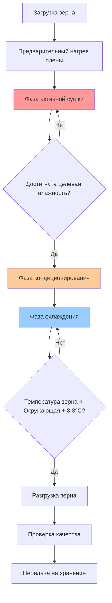

Камерные зерносушилки обрабатывают дискретные количества зерна через полные циклы сушки перед разгрузкой и перезагрузкой. Эти системы обеспечивают гибкость для хозяйств и зерновых элеваторов, обрабатывающих различные культуры или различные уровни влажности.

## Типы камерных сушилок

### Бункерные сушилки

Бункерные сушилки объединяют сушку и хранение в одной конструкции. Нагретый воздух течет через перфорированные полы или воздуховоды, движущиеся вверх через столб зерна. Типичная производительность варьируется от 18 до 177 м³. Глубина зерна влияет на равномерность сушки, при этом меньшие глубины (1,2–1,8 м) обеспечивают более равномерные результаты, чем более глубокие слои (3,7–4,9 м).

### Переносные камерные сушилки

Переносные установки обеспечивают мобильность для операций пользовательской сушки или ферм с несколькими местами хранения. Эти сушилки обычно обрабатывают 7–35 м³ за один цикл. Камера сушки имеет перфорированные стены или колонны, через которые нагретый воздух проходит горизонтально или радиально через массу зерна.

### Стационарные камерные сушилки

Крупные коммерческие камерные сушилки обрабатывают 35–354 м³ за один цикл с конфигурациями вертикального или горизонтального потока воздуха. Многозонное отопление позволяет ступенчатое изменение температуры с более высокими температурами в начальных зонах и более низкими температурами по мере приближения зерна к целевому содержанию влаги.

## Операция цикла сушки

Процесс камерной сушки следует определенной последовательности, управляемой временем, температурой и измерением влажности.

**Фаза нагрева**: Выход горелки повышает температуру воздуха до целевой температуры сушки. Температура плены достигает уставки перед включением полного потока воздуха, чтобы избежать теплового удара по зерну.

**Фаза активной сушки**: Нагретый воздух удаляет влагу из массы зерна. Фронт сушки движется через слой зерна со скоростью, определяемой скоростью потока воздуха, температурой и начальным содержанием влаги. Время сушки $t_d$ связано с удалением влаги:

$$t_d = \frac{M_g \cdot (MC_i - MC_f)}{Q_a \cdot \rho_a \cdot (W_o - W_i) \cdot 60}$$

где $M_g$ — масса зерна (кг), $MC_i$ и $MC_f$ — начальное и конечное содержание влаги (% на мокрой основе), $Q_a$ — расход воздуха (м³/ч), $\rho_a$ — плотность воздуха (кг/м³), и $W_o$ и $W_i$ — выходное и входное соотношение влажности воздуха (кг влаги/кг сухого воздуха).

**Фаза кондиционирования**: Поток воздуха продолжается с пониженным или нулевым вводом тепла, позволяя влаге внутри зерновых ядер уравниваться. Эта фаза обычно требует 2–4 часов и улучшает окончательную равномерность влажности.

**Фаза охлаждения**: Окружающий или охлажденный воздух снижает температуру зерна до 5,6–8,3 °C выше окружающей температуры перед хранением, чтобы предотвратить конденсацию и порчу.

## Контроль температуры для качества зерна

Максимально допустимые температуры сушки зависят от типа зерна и назначения. Превышение этих пределов вызывает стресс-трещины, потерю всхожести и снижение качества.

**Кукуруза**: Семенная кукуруза ограничивается 43,3 °C, пищевая кукуруза ограничивается 60 °C, а кормовая кукуруза допускает до 82,2 °C.

**Соевые бобы**: Семенные соевые бобы требуют температур ниже 43,3 °C, в то время как коммерческие соевые бобы допускают до 54,4 °C.

**Пшеница**: Мукомольная пшеница ограничивается 60 °C для сохранения качества глютена.

Системы контроля температуры используют модулирующие горелки или демпферы для поддержания уставки в пределах ±2,8 °C. Контроллеры пропорционально-интегрально-дифференциального типа (PID) регулируют подачу топлива и поток воздуха на основе датчиков температуры плены.

## Проблемы равномерности влажности

Неравномерная сушка результат неравномерного распределения потока воздуха, колебаний глубины зерна и различий начального содержания влаги. Зерно вблизи входных точек воздуха сохнет быстрее, создавая градиенты влажности.

**Решения распределения потока воздуха**:
- Расстояние перфорированных воздуховодов 1,2–1,8 м
- Мониторинг давления в пене для обнаружения ограничений потока
- Устройства выравнивания зерна для равномерной глубины слоя

**Смешивание и перемешивание**: Механические мешалки или системы пневматической рециркуляции перераспределяют зерно во время сушки. Перемешивание снижает колебания влажности с 4–6% до 1–2% в пределах партии.

**Мониторинг влажности**: Датчики влажности с несколькими точками обнаруживают колебания внутри массы зерна. Контроллеры регулируют время цикла на основе наиболее влажной зоны, а не средней влажности.

## Требования охлаждения

Зерно, выходящее из сушилки при 49–71 °C, должно охлаждаться до безопасной температуры хранения (4–16 °C для длительного хранения, 21–27 °C для краткосрочного хранения). Требования к расходу воздуха охлаждения:

$$Q_{cool} = \frac{M_g \cdot C_p \cdot (T_g - T_{final})}{60 \cdot \rho_a \cdot C_{p,a} \cdot (T_{out} - T_{in}) \cdot t_{cool}}$$

где $C_p$ — удельная теплоемкость зерна (обычно 1,676 кДж/кг·°C), $C_{p,a}$ — удельная теплоемкость воздуха (1,005 кДж/кг·°C), температуры в °C, и $t_{cool}$ — время охлаждения (минуты).

Охлаждение обычно требует 0,85–1,7 м³/ч на м³ и 1–3 часа в зависимости от условий окружающей среды.

## Рассмотрение производительности и пропускной способности

Пропускная способность камерной сушилки зависит от размера партии, времени сушки и эффективности обработки. Ежедневная производительность:

$$C_{daily} = \frac{B \cdot N_{cycles} \cdot (MC_i - MC_f)}{100 - MC_f}$$

где $B$ — размер партии (м³), $N_{cycles}$ — циклы в день, и содержание влаги в % на мокрой основе.

| Тип сушилки | Размер партии (м³) | Время сушки (ч) | Время охлаждения (ч) | Циклы/день | Ежедневная производительность (м³/день)* |
|------------|-----------------|------------------|-------------------|------------|--------------------------|
| Малый бункер | 18–35 | 4–8 | 2–3 | 2–3 | 35–106 |
| Переносная | 7–35 | 2–6 | 1–2 | 3–5 | 21–177 |
| Большой бункер | 71–177 | 6–12 | 2–4 | 1–2 | 71–354 |
| Стационарная коммерческая | 177–354 | 4–8 | 2–3 | 2–3 | 354–1,062 |

*При условии удаления 4% влаги из кукурузы

**Эффективность загрузки и разгрузки**: Производительность оборудования передачи должна соответствовать пропускной способности сушилки. Шнеки и ковшевые элеваторы, рассчитанные на 30–60 минут загрузки/разгрузки, минимизируют простои цикла.

**Энергетическая эффективность**: Системы рекуперации тепла улавливают энергию выходящего воздуха, используя пластинчатые теплообменники воздух-воздух, улучшая тепловую эффективность с 40–50% до 60–70%. Потребление топлива приблизительно:

$$Fuel = \frac{M_g \cdot (MC_i - MC_f) \cdot H_{fg}}{(100 - MC_f) \cdot \eta \cdot HHV}$$

где $H_{fg}$ — скрытая теплота испарения (2,429 кДж/кг), $\eta$ — эффективность горелки, и $HHV$ — высшая теплотворная способность топлива.

Камерные сушилки балансируют операционную гибкость с энергетической эффективностью, что делает их подходящими для операций с различными типами зерна, сезонными требованиями обработки и умеренной пропускной способностью.
