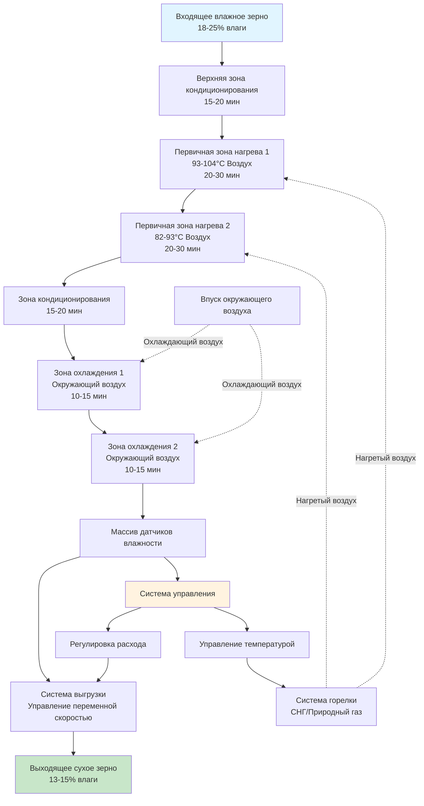

Зерносушилки непрерывного действия обеспечивают безперебойную работу сушки для высокопроизводительных сельскохозяйственных перерабатывающих предприятий, обрабатывая пропускную способность зерна от 3,5 до 52,5 т/ч. Эти системы поддерживают постоянное движение зерна через зоны нагретого воздуха, обеспечивая предсказуемое снижение влажности и постоянное качество продукции для коммерческих зерновых элеваторов, установок обработки семян и крупных сельскохозяйственных операций.

## Типы конфигурации сушилок

### Поперечная конструкция

Поперечные сушилки перемещают зерно вертикально вниз через прямоугольные колонны, при этом нагретый воздух проходит горизонтально через слой зерна. Воздух входит с одной стороны колонны, проходит перпендикулярно потоку зерна и выходит с противоположной стороны.

Ширина зерновой колонны обычно составляет 30–60 см, что ограничивает расстояние, которое воздух должен преодолеть через слой зерна. Данная конфигурация достигает скорости сушки 0,5–1,5 процентных пункта удаления влаги за проход, с температурой камеры статического давления от 82°C до 104°C в зависимости от типа зерна и начального содержания влаги.

Поперечные сушилки хорошо подходят для высокопроизводительных операций, где несколько проходов зерна через систему сушилки приемлемы. Конструкция максимизирует объемный расход воздуха относительно энергетического входа, достигая топливной эффективности 5,8–8,1 МДж на килограмм удаленной воды.

### Смешанная конструкция

Смешанные сушилки объединяют вертикальное движение зерна с угловым распределением воздуха через перфорированные каналы, расположенные в чередующихся схемах. Зерно движется вниз вокруг этих каналов, при этом нагретый воздух входит под углом 30–60° относительно направления потока зерна.

Данная конфигурация подвергает каждое зерно более равномерному нагреву по сравнению с поперечными конструкциями. Угловой паттерн воздуха создает турбулентное смешивание внутри слоя зерна, снижая градиенты влажности и улучшая однородность сушки. Типичная скорость удаления влаги достигает 1,0–2,0 процентных пункта за проход.

Расчет расхода для смешанных сушилок учитывает эффективную площадь воздействия:

$$Q_g = \frac{A_e \times V_g \times \rho_g}{60}$$

где $Q_g$ — расход зерна (т/ч), $A_e$ — эффективная площадь сечения (м²), $V_g$ — скорость зерна (м/мин), $\rho_g$ — объемная плотность зерна (кг/м³).

### Противоточная конструкция

Противоточные сушилки перемещают зерно вниз против восходящего потока нагретого воздуха, максимизируя эффективность теплопередачи благодаря прямому противоположению направлений потока. Данная схема создает наибольший перепад температуры между входящим воздухом и выходящим зерном, достигая топливной эффективности около 4,1–5,1 МДж на килограмм удаленной воды.

Конструкция требует тщательного управления, чтобы предотвратить избыточную сушку зерна в нижней части колонны, где самое сухое зерно встречается с самым горячим воздухом. Передовые системы включают градуированное управление температурой воздуха в нескольких зонах для оптимизации профиля сушки.

## Время пребывания и управление потоком

Время пребывания зерна внутри сушилки определяет емкость удаления влаги и пропускную способность системы. Связь между временем пребывания и расходом:

$$t_r = \frac{V_c}{Q_g}$$

где $t_r$ — время пребывания (часы), $V_c$ — объем колонны (т), $Q_g$ — расход зерна (т/ч).

Коммерческие сушилки непрерывного действия поддерживают время пребывания от 20 до 90 минут в зависимости от начального содержания влаги, целевой конечной влажности и типа зерна. Механизмы выгрузки с переменной скоростью управляют расходом зерна, при этом точные дозирующие валки или винтовые конвейеры регулируют поток в ответ на обратную связь датчика влажности.

## Многостадийная архитектура сушки

Высокоэффективные сушилки непрерывного действия включают несколько зон сушки и кондиционирования для оптимизации удаления влаги при сохранении качества зерна. Многостадийный подход предотвращает тепловой стресс и растрескивание, позволяя зерну уравновешивать градиенты влажности между циклами нагрева.

**Типичная конфигурация стадий:**

1. **Верхняя зона кондиционирования** — предварительно нагревает зерно до 32–43°C, инициируя испарение поверхностной влаги
2. **Первичные зоны нагрева** — две-четыре секции с постепенным снижением температуры воздуха
3. **Промежуточное кондиционирование** — обеспечивает внутреннюю миграцию влаги на поверхность зерна
4. **Зоны охлаждения** — снижают температуру зерна до величины в пределах 5,5°C от окружающей температуры перед хранением

Время кондиционирования обычно составляет 1,5–2,0 кратного времени нагрева для обеспечения полного уравновешивания влаги по всей структуре ядра.

## Расчеты емкости и пропускной способности

Номинальная емкость сушилки зависит от начального содержания влаги, целевой конечной влажности, типа зерна и условий окружающей среды. Фундаментальный расчет пропускной способности:

$$C = \frac{Q_g \times (M_i - M_f)}{100}$$

где $C$ — емкость удаления влаги (т-пункты/ч), $Q_g$ — расход зерна (т/ч), $M_i$ — начальное содержание влаги (%), $M_f$ — конечное содержание влаги (%).

Для сушки кукурузы с 20% до 15% влаги при пропускной способности 10,5 т/ч:

$$C = \frac{10,5 \times (20 - 15)}{100} = 0,525 \text{ т-пункты/ч}$$

Коммерческие спецификации сушилок указывают емкость в т-пункты/ч для учета различных требований к удалению влаги в различных условиях эксплуатации.

## Системы мониторинга влажности

Современные сушилки непрерывного действия используют мониторинг влажности в реальном времени с датчиками емкостного типа, инфракрасными анализаторами или системами микроволнового резонанса, установленными на выходе сушилки. Эти датчики обеспечивают обратную связь для систем управления, которые регулируют расход зерна и интенсивность нагрева.

**Функции системы управления:**

- Непрерывное измерение влажности с точностью ±0,3%
- Автоматическая модуляция расхода для поддержания целевой влажности
- Защита от превышения температурного предела, предотвращающая повреждение зерна
- Логирование данных для документирования обеспечения качества
- Удаленный мониторинг и оповещение об аварийных сигналах

Передовые системы включают предсказательные алгоритмы, которые предвосхищают необходимые корректировки на основе тенденций входящей влажности зерна, минимизируя вариацию выходной влажности до ±0,5% на протяжении производственных циклов.

## Сравнение конфигураций

| Конфигурация | Паттерн потока воздуха | Эффективность сушки | Потребление топлива | Однородность влажности | Наилучшее применение |
|---------------|----------------------|-------------------|------------------|----------------------|------------------|
| **Поперечная** | Горизонтально через вертикальный поток зерна | 5,8–8,1 МДж/кг воды | Выше | Хорошая (±1,0%) | Высокопроизводительные операции элеватора |
| **Смешанная** | Угловая (30–60°) через зерно | 5,1–6,5 МДж/кг воды | Средняя | Отличная (±0,5%) | Обработка семян, премиальное зерно |
| **Противоточная** | Восходящая против потока зерна | 4,1–5,1 МДж/кг воды | Ниже | Очень хорошая (±0,7%) | Операции, критичные к энергоэффективности |

## Преимущества для высокопроизводительных операций

Сушилки непрерывного действия обеспечивают отчетливые эксплуатационные преимущества для предприятий, перерабатывающих более 3,5 млн. т ежегодно. Постоянное движение зерна устраняет затраты труда на пакетную обработку, сокращает площадь помещения на единицу суточной производительности и обеспечивает автоматизированную интеграцию с системами обработки зерна.

Энергоэффективность улучшается благодаря системам рекуперации тепла, которые захватывают тепловую энергию выхлопного воздуха для предварительного нагрева воздуха горения или дополнительного нагрева зерна. Современные установки достигают среднего сезонного потребления топлива менее 5,8 МДж на килограмм удаленной воды при обработке кукурузы с 20% до 15% влаги.

Надежность системы превышает 95% времени безотказной работы в период уборки благодаря модульной конструкции компонентов, позволяющей быстрое техническое обслуживание без полной остановки. Мониторинг предиктивного обслуживания температуры подшипников, натяжения ремня и производительности горелки выявляет потенциальные сбои до наступления операционного перерыва.

Автоматизированная работа снижает требования к рабочей силе до периодического мониторинга и ежедневных проверок обслуживания, при этом один оператор может управлять сушильными системами, обрабатывающими более 17,5 т/ч на нескольких производственных линиях.
