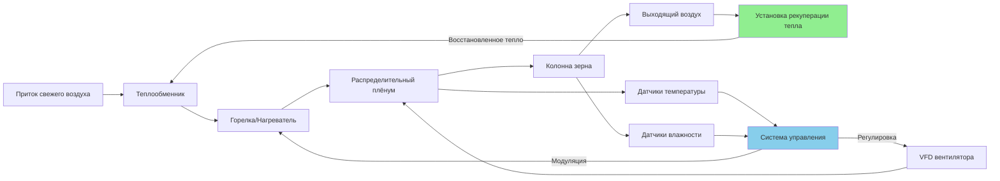

Системы сушки зерна нагретым воздухом используют источники тепла на ископаемом топливе, электричестве или биомассе для повышения температуры воздуха выше условий окружающей среды, что увеличивает дифференциал давления пара между зёрнами и сушильным воздухом. Это ускоряет скорость удаления влаги при требующем тщательного контроля управлении температурой, чтобы предотвратить термическое повреждение структуры зерна и снижение всхожести.

## Ограничения по температуре в зависимости от типа зерна

Максимально безопасные температуры сушильного воздуха зависят от вида зерна, назначения и начального содержания влаги. Превышение этих пределов вызывает растрескивание ядра, потерю всхожести и денатурацию белков.

| Тип зерна | Семенное назначение (°C) | Кормовое назначение (°C) | Пищевое/Солодовое (°C) | Критическая точка повреждения (°C) |
|-----------|-------------------------|--------------------------|------------------------|------------------------------------|
| Кукуруза | 43 | 60 | 54 | 66 |
| Соя | 43 | 54 | 49 | 60 |
| Пшеница | 43 | 60 | 54 | 66 |
| Ячмень (солодовый) | 38 | 54 | 43 | 49 |
| Рис (неочищенный) | 43 | 54 | 49 | 60 |
| Сорго | 43 | 60 | 54 | 66 |
| Овёс | 43 | 54 | 49 | 60 |
| Рапс/Канола | 35 | 43 | 40 | 49 |

Температура семенного зерна должна оставаться на 6-8°C ниже пределов для кормового зерна, чтобы сохранить показатели всхожести выше 85%. Высокостоимостные культуры, такие как солодовый ячмень, требуют самых низких температур для сохранения активности ферментов.

## Варианты источников тепла

### Горелки на сжиженном газе и природном газе

Прямые горелки впрыскивают продукты горения в поток сушильного воздуха, обеспечивая тепловой КПД 95-100%. Расход газа следует уравнению:

$$Q_{газ} = \frac{\dot{m}_{воздух} \times c_p \times \Delta T}{\eta_{горелка} \times LHV_{топливо}}$$

Где:
- $Q_{газ}$ = расход топлива (м³/ч)
- $\dot{m}_{воздух}$ = скорость потока воздуха (кг/мин)
- $c_p$ = удельная теплоёмкость воздуха (1.005 кДж/кг·°C)
- $\Delta T$ = повышение температуры (°C)
- $\eta_{горелка}$ = КПД горелки (0.95-1.0)
- $LHV_{топливо}$ = низшая теплота сгорания (кДж/м³)

Для природного газа с теплотой сгорания примерно 38 МДж/м³, система с расходом 4720 CFM (м³/ч) и повышением температуры на 27°C требует приблизительно 450 м³/ч расхода топлива.

### Косвенные теплообменники

Косвенные теплообменники разделяют продукты горения и сушильный воздух, предотвращая загрязнение, но снижая КПД до 70-85%. Теплопередача следует уравнению:

$$Q = UA \times LMTD$$

Где:
- $Q$ = скорость теплопередачи (кВт)
- $U$ = общий коэффициент теплопередачи (45-70 Вт/м²·°C для газ-воздух)
- $A$ = площадь поверхности теплообменника (м²)
- $LMTD$ = логарифмическая средняя разность температур (°C)

### Электрические нагревательные элементы

Электрические резистивные нагреватели обеспечивают 100% эффективность преобразования на сушилке, но страдают от высоких затрат на электроэнергию. Требуемая мощность:

$$P_{электр} = \frac{\dot{m}_{воздух} \times c_p \times \Delta T}{3.6}$$

Электрический нагрев экономически целесообразен только при субсидированных тарифах ниже 0.18 USD/кВч или для небольших операций менее 177 т в год.

### Сжигание биомассы

Древесная щепа, кукурузные качанки и растительные остатки предлагают возобновляемый нагрев стоимостью 24-37 USD/ГДж в сравнении с 62-75 USD/ГДж для пропана. Косвенные системы сжигания биомассы предотвращают загрязнение дымом при достижении общего КПД 65-75%.

## Расчёты повышения температуры воздуха

Повышение температуры, обеспечиваемое нагревательным оборудованием, зависит от расхода воздуха и тепловых поступлений:

$$\Delta T = \frac{Q_{вход}}{\dot{m}_{воздух} \times c_p \times 60}$$

Для горелки мощностью 146 кВт с расходом воздуха 4720 CFM (м³/ч) при стандартных условиях (плотность 1.2 кг/м³):

$$\Delta T = \frac{146}{(4720 \times 1.699/60) \times 1.005 \times 60} = 25.7°C$$

Более высокие температуры окружающей среды снижают достижимое повышение температуры из-за фиксированных тепловых поступлений, требуя модуляции расхода воздуха или многоступенчатого нагрева в многозонных сушилках.

## Эффективность сушки и энергопотребление

Тепловая эффективность при сушке нагретым воздухом зависит от использования тепла для испарения влаги в сравнении с чувствительным нагревом зерна и паразитными потерями. Энергопотребление на единицу удалённой воды:

$$E_{удельное} = \frac{Q_{всего}}{W_{испар} \times \eta_{использование}}$$

Где:
- $E_{удельное}$ = энергия на фунт удалённой воды (кДж/кг)
- $Q_{всего}$ = полные тепловые поступления (кДж)
- $W_{испар}$ = масса испарённой воды (кг)
- $\eta_{использование}$ = КПД использования тепла (0.40-0.65)

Высокотемпературная сушка при 60°C обычно потребляет 5100-6500 кДж/кг удалённой воды, в то время как низкотемпературные системы при 38-43°C достигают 4200-5100 кДж/кг благодаря улучшенному использованию тепла и сниженному пересушиванию.

## Риски пересушивания и предотвращение

Чрезмерная сушка ниже оптимальной влажности при хранении (13-14% для кукурузы, 12-13% для сои) вызывает экономические потери через потерю веса и увеличенную хрупкость. Снижение на 1% влажности ниже целевого значения представляет потерю веса продукта на 1.2-1.3%.

Стратегии предотвращения включают:

**Мониторинг влажности**: Автоматические датчики влажности с точностью ±0.5% предотвращают пересушивание путём циклирования горелки

**Контроль равновесной влажности**: Мониторинг относительной влажности выходящего воздуха поддерживает зерно при целевой влажности

**Ограничения температуры плёнума**: Максимальные температуры плёнума на 3-6°C ниже порогов повреждения зерна

**Распределение потока воздуха**: Равномерный поток воздуха предотвращает локальное пересушивание в высокоскоростных зонах

## Восстановление тепла и улучшения эффективности

Восстановление тепла из выходящего воздуха повышает эффективность на 15-25% за счёт:

**Пластинчатые теплообменники воздух-воздух**: Перекрёстные или ротационные тепловые колёса передают чувствительное тепло из выходящего воздуха 49-60°C входящему наружному воздуху

**Системы рециркуляции**: Частичная рециркуляция выходящего воздуха при низких температурах окружающей среды поддерживает целевую температуру плёнума с пониженным расходом топлива

**Конденсационное восстановление тепла**: Охлаждение выходящего воздуха ниже точки росы восстанавливает скрытое тепло при 18500-20800 кДж/кг конденсата

Эффективность восстановления тепла:

$$\epsilon = \frac{T_{подача} - T_{окружающая}}{T_{выход} - T_{окружающая}}$$

Хорошо спроектированные системы достигают 60-70% эффективности, снижая расход топлива на 20-30% в холодных климатах, где температуры окружающей среды остаются на 17-22°C ниже температуры выходящего воздуха.

В сочетании с регулируемыми по скорости вентиляторами, снижающими расход воздуха на завершающих стадиях сушки, комплексные улучшения эффективности снижают энергозатраты на 35-45% в сравнении с обычными системами с постоянной скоростью без рекуперации, сохраняя при этом качество зерна и производительность.
