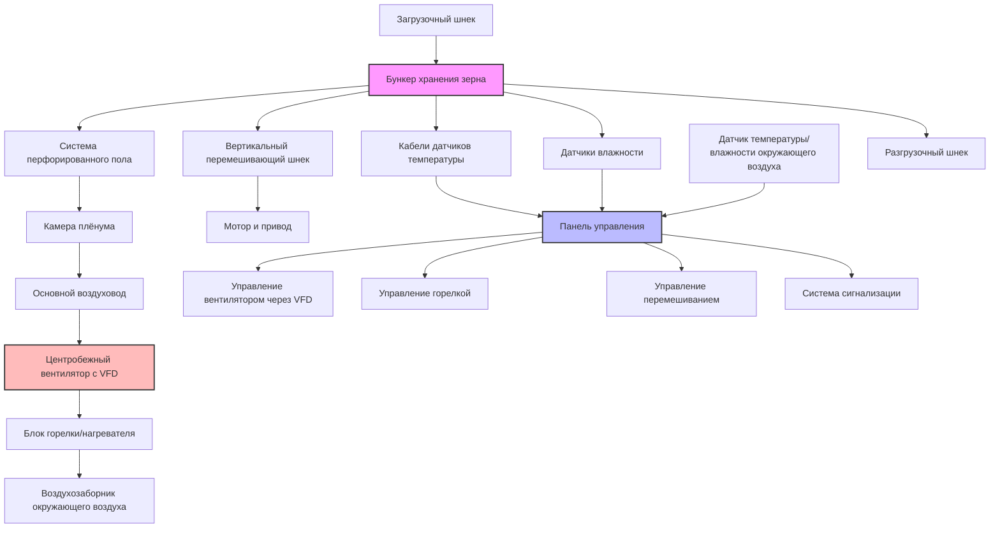

Системы сушки зерна в бункерах объединяют функции сушки и хранения в единой структуре, обеспечивая экономичное снижение влажности собранного зерна. Эти системы используют нагретый или окружающий воздух, пропускаемый через слой зерна через перфорированные полы, позволяя фермерам постепенно сушить зерно, пока оно остается в хранилищах.

## Сравнение подходов послойной сушки и сушки полного бункера

**Послойная сушка** включает частичное заполнение бункера (типично на глубину 0,9–1,8 м) и полную сушку этого слоя перед добавлением последующих слоев. Фронт сушки движется вверх через каждый слой по мере удаления влаги. Этот метод обеспечивает:

- Более быструю сушку первоначального количества зерна
- Возможность реализации зерна партиями
- Более низкие требования к начальному воздушному потоку
- Снижение риска порчи влажного зерна над зоной сушки

Время сушки при послойной сушке следует выражению:

$$t_{\text{layer}} = \frac{d \cdot \rho_b \cdot (M_i - M_f)}{q \cdot \Delta W \cdot 60}$$

где $t_{\text{layer}}$ — время сушки (часы), $d$ — глубина слоя (м), $\rho_b$ — плотность зерновой массы (кг/м³), $M_i$ и $M_f$ — начальное и конечное содержание влаги (% по влажному веществу), $q$ — расход воздуха (м³/ч на бушель), и $\Delta W$ — скорость удаления влаги (кг H₂O/кг сухого воздуха·ч).

**Сушка полного бункера** заполняет весь бункер до полной емкости перед началом процесса сушки. Фронт сушки прогрессирует от перфорированного пола вверх через колонну зерна. Этот подход:

- Максимизирует использование емкости хранилища
- Требует более высокой производительности вентилятора для адекватного воздушного потока
- Требует больше времени для завершения сушки
- Требует тщательного контроля для предотвращения порчи в верхних слоях

Сушка полного бункера требует расчетов статического давления:

$$\Delta P = K \cdot d \cdot V^n$$

где $\Delta P$ — перепад давления (Па), $K$ — коэффициент сопротивления, $d$ — глубина зерна (м), $V$ — поверхностная скорость воздуха (м/ч), и $n$ — показатель (обычно 1,8–2,0).

## Конструкция перфорированного пола и распределение воздушного потока

Перфорированные полы служат в качестве распределительного канала воздуха, обеспечивая равномерный воздушный поток через весь поперечный сечение зерна. Критические параметры конструкции включают:

**Спецификации перфорации:**
- Диаметр отверстия: 0,32–0,95 см
- Открытая площадь: 7–12% от общей площади пола
- Расстояние между отверстиями: 1,3–2,5 см от центра к центру
- Материал: оцинкованная сталь, алюминий или нержавеющая сталь

**Конструкция плёнума:**
- Глубина: минимум 0,3–0,45 м
- Переход от воздуховода к плёнуму: плавное расширение (угол 15–20°)
- Площадь поперечного сечения: рассчитана на поддержание скорости ниже 6,1 м/с
- Конструкция опоры: способна выдерживать нагрузку зерна (обычно 2,4–2,9 кПа)

Коэффициент однородности воздушного потока:

$$U = 1 - \frac{\sigma_V}{\bar{V}}$$

где $U$ — однородность (целевое значение > 0,85), $\sigma_V$ — стандартное отклонение измерений скорости, и $\bar{V}$ — средняя скорость.

## Перемешивающие устройства для равномерной сушки

Системы перемешивания перераспределяют зерно внутри бункера для улучшения однородности сушки и разрушения градиентов влажности. Существуют два основных типа:

**Вертикальные перемешивающие шнеки:**
- Центрально установленный шнек, вращающийся и движущийся вертикально
- Поднимает зерно со дна и выгружает на вершину
- Сокращает время сушки на 20–30%
- Работает прерывисто (типично 15 минут в час)

**Горизонтальные распределители:**
- Вращающиеся рычаги или лопасти на поверхности зерна
- Выравнивают зерно во время загрузки
- Предотвращают образование плотного ядра и улучшают распределение воздушного потока

Эффективность перемешивания увеличивает скорость сушки:

$$\frac{dM}{dt}_{\text{stirred}} = 1,25 \cdot \frac{dM}{dt}_{\text{unstirred}}$$

## Переход от сушки к хранению

После достижения целевого содержания влаги система переходит с активной сушки на режим хранения. Этот процесс включает:

1. **Фаза охлаждения:** Продолжить воздушный поток без тепла в течение 6–12 часов для охлаждения зерна до температуры в пределах 5–6°C от окружающей температуры
2. **Финальная проверка влажности:** Взять образцы зерна из нескольких мест для подтверждения однородной влажности (в пределах ±1% вариации)
3. **Остановка системы:** Постепенно снизить воздушный поток в течение 30–60 минут для предотвращения конденсации
4. **Настройка аэрации:** Переключиться на режим прерывистой аэрации для долгосрочного хранения

Требование охлаждения следует:

$$Q_{\text{cool}} = \rho_b \cdot V_{\text{bin}} \cdot c_p \cdot (T_{\text{grain}} - T_{\text{ambient}})$$

где $Q_{\text{cool}}$ — удаление тепла (кДж), $V_{\text{bin}}$ — объем бункера (м³), и $c_p$ — удельная теплоемкость (1,88 кДж/кг·°C для зерна).

## Интеграция аэрации для охлаждения

Интегрированные системы аэрации поддерживают качество зерна во время хранения путем:

- Охлаждения зерна до безопасных температур хранения (4–10°C)
- Устранения температурных градиентов, которые вызывают миграцию влаги
- Предотвращения горячих точек и активности насекомых
- Работы с окружающим воздухом (без дополнительного тепла)

Воздушный поток при аэрации значительно ниже, чем при сушке:

$$q_{\text{aeration}} = 0,17–0,34 \text{ м³/ч на бушель}$$

по сравнению с воздушным потоком при сушке:

$$q_{\text{drying}} = 1,70–4,24 \text{ м³/ч на бушель}$$

Система использует тот же перфорированный пол и вентилятор, управляемые автоматическими переключателями на основе условий окружающей среды.

## Системы автоматизации и мониторинга

Современные системы сушки зерна в бункерах используют комплексную автоматизацию:

**Контроль температуры:**
- Термопары или датчики сопротивления (RTD) на нескольких глубинах
- Типовое расположение: 3–5 кабелей с датчиками каждые 0,9–1,2 м по вертикали
- Пороги тревоги: на 5–6°C выше окружающей или 49°C в абсолютном значении

**Контроль влажности:**
- Емкостные или EMC-датчики в критических зонах
- Расчет равновесного содержания влаги из температуры и влажности
- Целевая точность: ±0,5% содержания влаги

**Управление вентилятором:**
- Частотные преобразователи (VFD) для модуляции воздушного потока
- Автоматический запуск/остановка на основе условий окружающей среды
- Отслеживание времени работы и планирование обслуживания

**Управление горелкой:**
- Управление уставкой температуры (обычно 38–60°C)
- Высокотемпературные отсечки для безопасности (максимум 82°C)
- Контроль расхода топлива

Логика автоматизированного управления оптимизирует:

$$\text{EMC} = f(T_{\text{ambient}}, \text{RH}_{\text{ambient}})$$

Работает только при равновесном содержании влаги ниже целевой влажности хранения.

## Параметры конструкции сушки в бункере

| Параметр | Послойная сушка | Сушка полного бункера | Единицы |
|-----------|--------------|-----------------|-------|
| Расход воздуха | 1,70–2,54 | 2,54–4,24 | м³/ч на бушель |
| Статическое давление | 50–100 | 100–200 | Па |
| Повышение температуры | 5–11 | 5–8 | °C |
| Глубина слоя | 0,9–1,8 | 4,6–9,1 | м |
| Время сушки | 6–12 | 24–72 | часы |
| Мощность вентилятора | 3,7–7,5 | 11–22 | кВ на 1000 бушелей |
| Открытая площадь перфорированного пола | 8–10 | 10–12 | % |
| Глубина плёнума | 0,3–0,38 | 0,38–0,45 | м |
| Максимальная температура зерна | 54 | 49 | °C |
| Целевое удаление влаги | 1–2 | 3–6 | процентные пункты |

## Конфигурация системы сушки в бункере

## Рассмотрения эффективности при эксплуатации

Эффективность сушки в бункере зависит от нескольких критических факторов:

**Начальное содержание влаги:** Системы работают оптимально при начальной влажности 18–22%. Более высокая влажность требует продленного времени сушки и повышенного потребления энергии.

**Условия окружающей среды:** Относительная влажность ниже 70% и температуры выше 4°C обеспечивают благоприятные условия сушки. Автоматизированное управление должно приостанавливать работу при неблагоприятных погодных условиях.

**Тип зерна:** Различные типы зерна требуют определенных расходов воздуха:
- Кукуруза: 2,54–3,39 м³/ч на бушель
- Соя: 1,70–2,54 м³/ч на бушель
- Пшеница: 1,70–2,54 м³/ч на бушель

**Потребление энергии:** Общее потребление энергии включает мощность вентилятора и топливо горелки:

$$E_{\text{total}} = E_{\text{fan}} + E_{\text{burner}} = \frac{\text{кВ} \cdot 1 \cdot t_{\text{dry}}}{0,9} + \frac{Q_{\text{heat}}}{\eta_{\text{burner}} \cdot \text{HHV}_{\text{fuel}}}$$

где $\eta_{\text{burner}}$ — эффективность горелки (0,75–0,85) и HHV — высшая теплота сгорания топлива.

Системы сушки в бункере обеспечивают гибкое и экономичное кондиционирование зерна при надлежащей конструкции с адекватным воздушным потоком, однородным распределением, автоматизированным управлением и интегрированным контролем. Двухцелевая инфраструктура служит как для первоначальной сушки, так и для долгосрочных потребностей аэрации, максимизируя окупаемость инвестиций для сельскохозяйственных операций.
