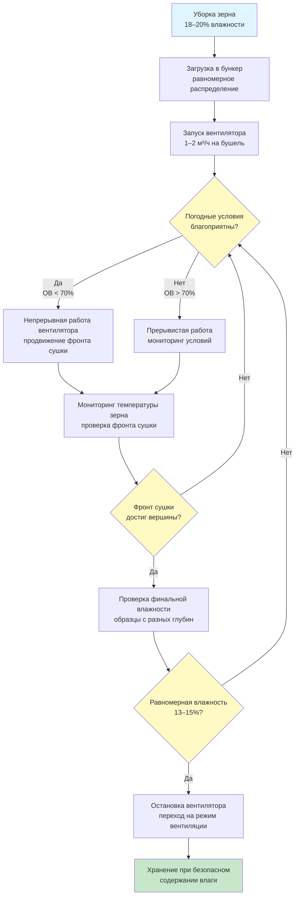

Сушка зерна с естественным воздухом использует неотапливаемый атмосферный воздух для удаления влаги из зерна, хранящегося в бункерах. Этот метод зависит от благоприятных атмосферных условий и требует продолжительного периода сушки в сравнении с системами сушки горячим воздухом. Когда влажность зерна при уборке находится в пределах 2–3 процентных пункта от безопасного уровня хранения, сушка с естественным воздухом обеспечивает наиболее энергоэффективный метод кондиционирования зерна из доступных.

## Принципы работы

Сушка с естественным воздухом использует разность давления пара между зернами и атмосферным воздухом. Когда относительная влажность воздуха ниже равновесной относительной влажности зерна при его текущей влажности, водяной пар переходит из зерна в воздух. Этот процесс происходит непрерывно в благоприятных погодных условиях, постепенно снижая влажность зерна до безопасного уровня хранения.

Фронт сушки движется вверх через слой зерна в виде отчетливой зоны. Зерно под фронтом сушки достигает равновесной влажности, а зерно выше остается на исходной влажности при уборке. Вентилятор должен работать до полного прохождения фронта сушки через всю глубину зерна, обеспечивая равномерное снижение влажности по всему бункеру.

### Соотношение равновесной влажности

Влажность зерна уравновешивается с воздухом в зависимости от температуры и относительной влажности:

$$M_e = a - b \ln[-(T + c) \ln(RH)]$$

Где:
- $M_e$ = равновесная влажность зерна (% по мокрому основанию)
- $T$ = температура воздуха (°C)
- $RH$ = относительная влажность (десятичная дробь)
- $a, b, c$ = константы, зависящие от типа зерна

Для кукурузы: $a = 4,85$, $b = 0,675$, $c = 54,6$

### Индекс потенциала сушки

Кумулятивный потенциал сушки определяет, поддерживают ли атмосферные условия сушку с естественным воздухом:

$$DPI = \sum (EMC_{target} - EMC_{ambient}) \times часы$$

Успешная сушка с естественным воздухом требует $DPI \geq 200$ градусо-часов в течение предполагаемого периода сушки. Местности с теплой и сухой осенней погодой обеспечивают превосходные условия для сушки с естественным воздухом по сравнению с влажными регионами.

## Требования к скорости воздушного потока

Надлежащий воздушный поток обеспечивает полную сушку в приемлемые сроки, предотвращая порчу несушеного зерна. Скорость воздушного потока прямо влияет на время сушки и энергопотребление.

### Стандартные спецификации воздушного потока

| Тип зерна | Минимальный воздушный поток (м³/ч на бушель) | Рекомендуемый воздушный поток (м³/ч на бушель) | Максимальная исходная влажность (%) |
|-----------|-----------------------------------------------|--------------------------------------------------|-------------------------------------|
| Кукуруза | 1,27 | 1,70–2,55 | 20 |
| Соя | 1,70 | 2,12–3,40 | 16 |
| Пшеница | 1,70 | 2,12–2,97 | 18 |
| Ячмень | 1,70 | 2,12–2,97 | 18 |
| Сорго | 1,27 | 1,70–2,55 | 19 |
| Подсолнечник | 2,55 | 3,40–4,25 | 12 |

Более высокие скорости воздушного потока сокращают время сушки, но повышают энергопотребление вентилятора. Экономический оптимум уравновешивает затраты на электроэнергию с рисками ухудшения качества зерна во время продолжительных периодов сушки.

### Расчет воздушного потока

Требуемая общая производительность вентилятора:

$$CFM_{total} = Volume_{grain} \times Density_{bulk} \times Rate_{cfm/bu} \times \frac{1}{60}$$

Где:
- $CFM_{total}$ = требуемая производительность вентилятора (м³/ч)
- $Volume_{grain}$ = объем зерна в бункере (м³)
- $Density_{bulk}$ = объемная плотность зерна (кг/м³)
- $Rate_{cfm/bu}$ = воздушный поток на бушель (м³/ч на бушель)
- Коэффициент пересчета бушелей (25,4 кг) на соответствующие единицы

## Выбор вентилятора и статическое давление

Вентиляторы для сушки с естественным воздухом должны преодолевать статическое давление от глубины зерна и сопротивления воздуховодов. Центробежные или осевые вентиляторы выбираются на основе требований по давлению и энергоэффективности.

### Оценка статического давления

Статическое давление зерна следует уравнению Шедда:

$$SP = k \times D \times (1 + \frac{D}{100})^2 \times (\frac{Q}{100})^{1.8}$$

Где:
- $SP$ = статическое давление (см вод. ст.)
- $k$ = коэффициент сопротивления зерна (кукуруза: 0,0026, соя: 0,0045, пшеница: 0,0052)
- $D$ = глубина зерна (м)
- $Q$ = скорость воздушного потока (м³/ч на бушель)

Добавить 5–13 см вод. ст. на сопротивление воздуховодов и пола.

### Требования к мощности вентилятора

Мощность электродвигателя вентилятора:

$$kW = \frac{m^3/ч \times SP}{6120 \times \eta_{fan}}$$

Где:
- $kW$ = мощность в киловаттах
- $\eta_{fan}$ = КПД вентилятора (обычно 0,50–0,70 для сельскохозяйственных вентиляторов)
- 6120 = константа пересчета

Осевые вентиляторы с направляющими обеспечивают более высокий КПД при более низком статическом давлении (<10 см вод. ст.), в то время как центробежные вентиляторы работают лучше при более высоком давлении (>10 см вод. ст.).

## Оценка времени сушки

Продолжительность сушки с естественным воздухом зависит от исходной влажности, целевой влажности, глубины зерна, скорости воздушного потока и кумулятивного количества благоприятных погодных часов.

### Эмпирическое время сушки

Для кукурузы с воздушным потоком 1,70–2,55 м³/ч на бушель:

$$t_{dry} = \frac{D \times \Delta M \times k_{weather}}{24 \times f_{favorable}}$$

Где:
- $t_{dry}$ = время сушки (дни)
- $D$ = глубина зерна (м)
- $\Delta M$ = количество процентных пункта влажности для удаления (%)
- $k_{weather}$ = коэффициент погоды (1,2–2,0, выше для влажного климата)
- $f_{favorable}$ = доля времени с благоприятными условиями сушки (обычно 0,4–0,6)

Типичное время сушки составляет 15–45 дней в зависимости от погодных условий и исходного содержания влаги.

## Ограничения глубины зерна

Чрезмерная глубина зерна увеличивает статическое давление, продлевает время сушки и повышает риск порчи несушеного зерна над фронтом сушки.

### Максимальные рекомендуемые глубины

**Для воздушного потока 1,70–2,55 м³/ч на бушель:**
- Кукуруза: максимальная глубина 6,1–6,7 м
- Соя: максимальная глубина 5,5–6,1 м
- Пшеница: максимальная глубина 6,1–7,3 м
- Высокая влажность (>18%): уменьшить глубину на 20–30%

Меньшая глубина зерна обеспечивает более быструю сушку при более низком статическом давлении, снижая энергопотребление вентилятора и риск порчи. Загружайте бункеры слоями, если условия при уборке неблагоприятны, работая с вентиляторами между циклами загрузки для начала сушки сразу после загрузки.

### Скорость перемещения фронта сушки

Фронт сушки движется вверх приблизительно со скоростью:

$$v_{front} = \frac{Q \times 24}{D \times \rho_{bulk} \times (M_i - M_f) \times 0,01}$$

Где:
- $v_{front}$ = скорость перемещения фронта сушки (м/день)
- $\rho_{bulk}$ = объемная плотность (кг/м³)
- $M_i$ = исходная влажность (%)
- $M_f$ = финальная влажность (%)

Для кукурузы при исходной влажности 18%, высушиваемой до 15% с воздушным потоком 2,12 м³/ч на бушель, фронт сушки продвигается приблизительно на 0,3–0,5 м в день в благоприятных условиях.

## Анализ энергоэффективности

Сушка с естественным воздухом потребляет минимальное количество энергии в сравнении с системами сушки горячим воздухом, при этом основные затраты энергии связаны с работой вентилятора.

### Потребление энергии

Общее электрическое энергопотребление:

$$E_{total} = kW \times t_{hours}$$

Где:
- $E_{total}$ = потребление энергии (кВт·ч)
- $t_{hours}$ = общее время работы вентилятора
- kW = мощность вентилятора

Типичное энергопотребление: 0,8–2,1 кВт·ч на бушель высушенного зерна, по сравнению с 3,9–7,8 кВт·ч/бушель для систем сушки низкотемпературным горячим воздухом.

### Сравнение операционных затрат

| Метод сушки | Потребление энергии (кВт·ч/бушель) | Типовая стоимость за бушель* | Время сушки |
|--------------|-------------------------------------|-------------------------------|------------|
| Естественный воздух | 0,8–2,1 | 0,08–0,21 руб. | 15–45 дней |
| Низкотемпературный горячий воздух | 3,9–7,8 | 0,39–0,78 руб. | 7–21 день |
| Высокотемпературная непрерывная | 10,4–20,8 | 1,04–2,08 руб. | <24 часа |

*На основе 10 руб./кВт·ч электроэнергии, 80 руб./м³ природного газа

## Достоинства и ограничения

**Достоинства:**
- Минимальное энергопотребление снижает операционные затраты на 70–90% в сравнении с сушкой горячим воздухом
- Сохраняет качество зерна благодаря низкотемпературной сушке с минимальным стрессом зерна
- Простой дизайн системы с низкими капитальными вложениями
- Уменьшенная опасность пожара без горелок или нагревателей
- Объединяет функции сушки и хранения в одном бункере

**Ограничения:**
- Зависимость от погоды требует благоприятных атмосферных условий
- Продолжительные периоды сушки (15–45 дней) повышают риск порчи
- Ограничивается зерном, убранным в пределах 2–3 процентных пункта от влажности хранения
- Географические ограничения ограничивают применимость регионами с сухой осенней погодой
- Часто необходима задержка уборки для достижения более низкого содержания влаги в поле
- Затраты на работу вентилятора накапливаются в течение продолжительных периодов сушки
- Риск порчи несушеного зерна при ухудшении погодных условий

## Стратегии управления

Успешная сушка с естественным воздухом требует активного управления и мониторинга погоды:

1. **Уборка при надлежащей влажности:** целевая влажность 18–20% для кукурузы, 14–16% для сои
2. **Быстрая загрузка бункеров:** завершить загрузку в течение 3–5 дней для минимизации риска порчи
3. **Запуск вентилятора немедленно:** начать работу, как только зерно поступит в бункер
4. **Мониторинг прогноза погоды:** планировать уборку на благоприятные периоды сушки
5. **Проверка прогресса сушки:** отбирать образцы зерна с разных глубин еженедельно
6. **Непрерывная работа вентилятора** в благоприятных условиях (ОВ <70%)
7. **Установка датчиков влажности:** автоматизировать мониторинг продвижения фронта сушки
8. **Резервная мощность:** иметь возможность сушки горячим воздухом для аварийной сушки при ухудшении погоды

Сушка с естественным воздухом остается наиболее экономичным методом сушки зерна, когда влажность зерна при уборке, глубина бункера и погодные условия благоприятно сочетаются. Надлежащий дизайн системы и управление минимизируют риски порчи, максимизируя преимущества энергоэффективности.
