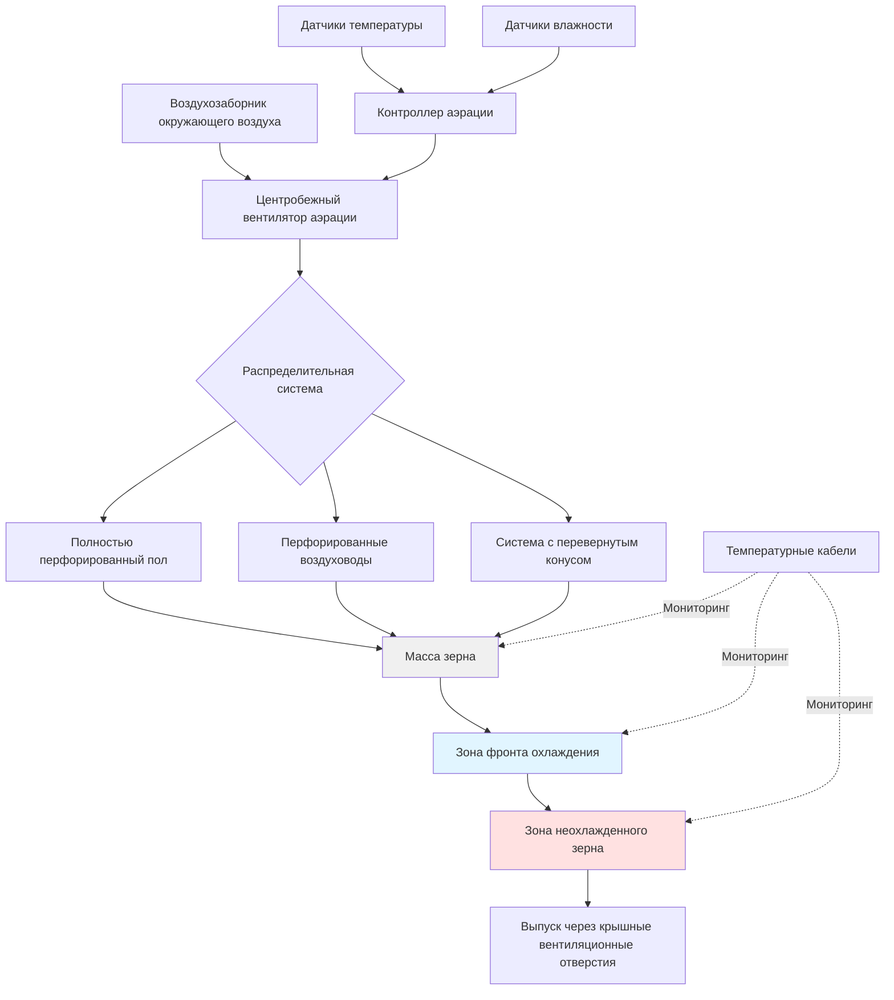

## Задачи системы аэрации

Системы аэрации зерна в хранилищах выполняют критические функции по сохранению качества зерна в период длительного хранения. К основным задачам относятся:

**Контроль температуры**: Охлаждение зерна до температур, подавляющих жизнедеятельность насекомых (ниже 15,5°C) и замедляющих рост плесени. Поддержание равномерной температуры по всему объему зерна предотвращает локальную порчу.

**Выравнивание влажности**: Перераспределение влаги в массе зерна для устранения участков с повышенной влажностью, способствующих развитию плесени и самонагреву. Аэрация перемещает влагу из более влажных зон в более сухие, достигая равновесия по всему объему бункера.

**Предотвращение конденсации**: Управление разностью температур между зерном и окружающим воздухом для предотвращения миграции влаги и образования конденсата на стенках бункера или в массе зерна.

**Сохранение качества**: Поддержание параметров качества зерна, включая всхожесть, тестовый вес и рыночный класс в течение всего периода хранения.

## Требования к расходам воздуха

Расходы воздуха при аэрации зерна существенно отличаются от процессов сушки и требуют значительно меньших объемов воздуха. Стандартные расходы аэрации составляют 0,1–0,25 CFM (м³/ч)/буш, в сравнении с 5–20 CFM/буш при высокотемпературной сушке.

### Рекомендуемые расходы воздуха

| Климатическая зона | Расход воздуха (CFM (м³/ч)/буш) | Применение |
|---|---|---|
| Северная (< 4000 HDD) | 0,10–0,15 | Стандартное охлаждение |
| Центральная (4000–6000 HDD) | 0,15–0,20 | Умеренный климат |
| Южная (> 6000 HDD) | 0,20–0,25 | Теплые и влажные регионы |
| Хранение с повышенной влажностью | 0,25–0,50 | Выравнивание влажности |

Общий требуемый расход воздуха для зернохранилища рассчитывается как:

$$Q = V \times \rho \times r$$

где $Q$ — общий расход воздуха (CFM (м³/ч)), $V$ — объем зерна (буш), $\rho$ — коэффициент коррекции объемной плотности зерна (обычно 1,0 для стандартного заполнения), $r$ — требуемый расход аэрации (CFM (м³/ч)/буш).

Для бункера на 10 000 буш, требующего 0,15 CFM (м³/ч)/буш:

$$Q = 10\,000 \times 1,0 \times 0,15 = 1\,500 \text{ CFM (2\,545 м³/ч)}$$

## Подбор вентилятора и воздуховода

Выбор вентилятора аэрации зависит от требуемого расхода воздуха и статического давления, которое должна преодолеть система. Статическое давление в системах аэрации значительно ниже, чем в системах сушки, из-за сниженных расходов воздуха.

### Расчет статического давления

Статическое давление для полностью перфорированных полов определяется по формуле:

$$P_s = k \times r^{1,8} \times d$$

где $P_s$ — статическое давление (см вод. ст.), $k$ — постоянная сопротивления зерна (зависит от вида), $r$ — расход воздуха (CFM (м³/ч)/буш), $d$ — глубина зерна (м).

Для кукурузы с $k = 0,22$ при 0,15 CFM (м³/ч)/буш и глубине 6,1 м:

$$P_s = 0,22 \times (0,15)^{1,8} \times 6,1 = 0,22 \times 0,052 \times 6,1 = 0,07 \text{ см вод. ст.}$$

### Подбор воздуховодов для перфорированных систем

При использовании перфорированных воздуховодов вместо полностью перфорированных полов общая площадь воздуховода должна быть:

$$A_d = \frac{Q}{v_d}$$

где $A_d$ — общая площадь воздуховода (м²), $Q$ — расход воздуха (CFM (м³/ч)), $v_d$ — скорость в воздуховоде (обычно 4–6 м/с для аэрации).

Перфорация должна составлять 8–12% от общей площади поверхности воздуховода для обеспечения надлежащего распределения воздуха при предотвращении попадания зерна.

## Стратегии управления контроллером аэрации

Современные контроллеры аэрации оптимизируют работу вентилятора на основе параметров окружающей среды и мониторинга температуры зерна.

**Контроллеры с дифференциалом температуры**: Включают вентиляторы, когда температура окружающего воздуха на 3–6°C ниже средней температуры зерна. Это предотвращает нагрев более холодного зерна при обеспечении адекватных температурных градиентов охлаждения.

**Контроллеры с компенсацией по влажности**: Учитывают как температуру, так и относительную влажность, рассчитывая равновесную влажность зерна для предотвращения добавления влаги в периоды высокой влажности.

**Программируемые контроллеры**: Позволяют устанавливать пользовательские графики работы, уставки температуры и ограничения по влажности. Передовые модели включают прогнозы погоды и тренды состояния зерна.

**Многозонные контроллеры**: Управляют несколькими бункерами или системами вентиляторов независимо, приоритизируя бункеры с наивысшей температурой или уровнем влажности.

## Прогрессирование фронта охлаждения

Фронт охлаждения представляет собой границу между охлажденным зерном у воздухозаборника и более теплым зерном выше. Понимание движения фронта охлаждения необходимо для эффективного управления аэрацией.

### Скорость фронта охлаждения

Скорость прогрессирования фронта охлаждения рассчитывается как:

$$v_c = \frac{r \times 60}{S_h}$$

где $v_c$ — скорость фронта охлаждения (м/день), $r$ — расход воздуха (CFM (м³/ч)/буш), $S_h$ — удельная теплоемкость зерна (примерно 15–20 для большинства зерновых при типичных уровнях влажности).

Для аэрации пшеницы с расходом 0,15 CFM (м³/ч)/буш при $S_h = 18$:

$$v_c = \frac{0,15 \times 60}{18} = 0,5 \text{ м/день}$$

Глубина зерна 6,1 м требует приблизительно 12 дней непрерывной работы для полного охлаждения. Мониторинг температурных кабелей на различных глубинах отслеживает прогрессирование фронта охлаждения.

## Сезонные графики аэрации

Эффективная аэрация следует сезонным стратегиям, согласованным с характерами температурных колебаний окружающей среды и целями хранения зерна.

**Осеннее охлаждение (Уборка – Декабрь)**: Интенсивное охлаждение для снижения температуры зерна с полевой температуры до −1–4°C. Работа вентиляторов при температуре окружающего воздуха на 3–6°C ниже температуры зерна с целью снижения температуры на 6–8°C за один цикл охлаждения.

**Зимнее обслуживание (Декабрь – Март)**: Ограниченная работа в северных климатических зонах для поддержания равномерно низких температур. В южных регионах продолжить охлаждение при холодных фронтах для достижения целевых температур хранения.

**Предотвращение весеннего нагрева (Март – Май)**: Минимизация аэрации для предотвращения нагрева. Работа только в наиболее прохладные периоды для противодействия солнечному нагреву и теплопередаче через нагревающиеся поверхности бункера.

**Летний мониторинг (Июнь – Август)**: Прекращение аэрации в большинстве климатических зон, если не развивается сильный нагрев. Тщательный мониторинг температуры зерна для выявления горячих точек, указывающих на жизнедеятельность насекомых или развитие плесени.

**Подготовка перед уборкой (Август – Сентябрь)**: При сценариях длительного хранения рассмотреть ограниченное охлаждение при наличии безопасных условий окружающей среды, если зерно останется в хранилище в течение следующего сезона.

Время работы вентилятора аэрации обычно составляет 200–400 часов в год в зависимости от климата, начального состояния зерна и длительности хранения. Энергопотребление остается скромным — 0,02–0,05 кВтч/буш при типичных периодах хранения, что делает аэрацию экономически эффективным способом сохранения качества.

Мониторинг температуры с интервалом минимум в 7–10 дней позволяет своевременно обнаружить проблемные зоны, требующие вмешательства. Кабельные системы мониторинга температуры с 3–5 кабелями на бункер обеспечивают надлежащее покрытие для бункеров объемом более 3000 буш.
