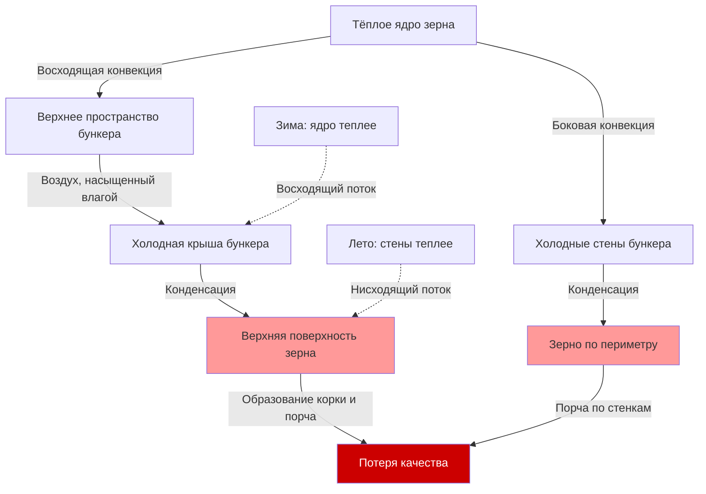

Миграция влаги в бункерах хранения зерна представляет собой один из наиболее деструктивных явлений, влияющих на качество хранящегося зерна. Понимание термодинамических механизмов, управляющих движением влаги, позволяет разработать эффективные стратегии предотвращения, которые сохраняют качество зерна и предотвращают экономические потери.

## Механизмы конвекционных потоков

Конвекционные потоки внутри бункеров зерна развиваются из-за перепадов температур между массами зерна и окружающим воздухом. Эти потоки переносят влажность пара через межзерновые воздушные пространства, концентрируя её в определённых зонах.

Движущая сила для естественной конвекции следует из:

$$Q_{conv} = h \cdot A \cdot \Delta T$$

где $Q_{conv}$ — теплопередача за счёт конвекции (кДж/ч), $h$ — коэффициент конвекции (2.1-8.4 кДж/ч·м²·°C для зерна), $A$ — площадь поверхности (м²), и $\Delta T$ — разница температур (°C).

Способность переносить влагу изменяется с температурой в соответствии с:

$$W_{sat} = 0.622 \cdot \frac{P_{sat}}{P_{atm} - P_{sat}}$$

где $W_{sat}$ — коэффициент насыщенной влажности (кг воды/кг сухого воздуха), $P_{sat}$ — давление насыщенного пара при температуре зерна, и $P_{atm}$ — атмосферное давление.

Когда тёплый, насыщенный влагой воздух контактирует с холодными поверхностями зерна, происходит конденсация при падении температуры воздуха ниже точки росы. Это фундаментальное соотношение создаёт зоны накопления влаги, которые способствуют порче.

## Сезонные перепады температур

Зимние условия создают классический сценарий миграции влаги. Низкие наружные температуры охлаждают стены и крышу бункера, в то время как ядро зерна сохраняет тепло урожая. Воздух, нагретый центром зерна, поднимается вверх за счёт конвекции, неся влажность пара. При контакте с холодными поверхностями на периферии бункера и сверху эта влага конденсируется.

Перепады температур в диапазоне 17-28°C между ядром зерна и стенками бункера часто встречаются зимой в северных климатических зонах. Эти градиенты устанавливают мощные конвекционные ячейки, которые могут транспортировать 0.045-0.135 кг воды на гектолитр зерна в зоны концентрации в течение сезона хранения.

Летняя миграция обращает направление движения. Солнечное нагревание крыши и стен бункера создаёт горячие зоны, в то время как внутренняя часть зерна остаётся прохладной из-за весенних температур. Тёплый наружный воздух, поступающий через вентиляционные отверстия на крыше или плохо герметичные люки, спускается вдоль стен бункера, охлаждается и отлагает влагу в верхних слоях зерна.

Интенсивность миграции влаги следует из:

$$\dot{m}_{migration} = \rho_{air} \cdot v \cdot A_{flow} \cdot (W_{warm} - W_{cool})$$

где $\dot{m}_{migration}$ — скорость миграции влаги (кг/ч), $\rho_{air}$ — плотность воздуха (1.2 кг/м³), $v$ — скорость конвекции (26-66 м³/м²·ч в зерне), $A_{flow}$ — эффективная площадь потока, и $W$ представляет коэффициенты влажности в тёплых и холодных местах.

## Зоны конденсации влаги

Конденсация концентрируется в предсказуемых местах на основе конвекционных схем и температур поверхностей. Верхняя поверхность бункера получает большинство зимней миграции влаги, с глубиной влажного зерна 15-45 см, обычной в неуправляемых бункерах. Эта зона «верхней порчи» показывает содержание влаги на 4-8 процентных пункта выше, чем в основной массе зерна.

Стены бункера создают вертикальные зоны конденсации, простирающиеся на 30-60 см внутрь от периметра. Эти зоны остаются активными всю зиму, постепенно увлажняя зерно, контактирующее с холодными металлическими поверхностями.

Стены, обращённые на юг, испытывают суточные колебания в умеренном климате, с дневным солнечным нагреванием, создающим нисходящую конвекцию, и ночным охлаждением, обращающим схему. Это цикличное воздействие ускоряет развитие порчи через повторяющееся увлажнение.

## Вентиляция крыши и управление верхним пространством

Надлежащая вентиляция крыши предотвращает накопление влаги в верхнем пространстве, избегая при этом избыточной конденсации. Непрерывные вентиляционные щели на коньке, рассчитанные на 1 см² на 5 м² площади дна бункера, обеспечивают пассивное удаление влаги без индуцирования сильных конвекционных потоков.

Свесные вентиляционные отверстия должны оставаться закрытыми в холодную погоду, чтобы предотвратить инфильтрацию холодного воздуха, которая ускоряет конденсацию на стенах. Открытие как щелей конька, так и свесных отверстий создаёт дымоходный эффект, который может увеличить скорость миграции влаги на 200-400%.

Объём верхнего пространства влияет на схемы конденсации. Бункеры с верхним пространством 45-60 см над поверхностью зерна разбавляют концентрацию влаги и снижают прямую конденсацию на зерне. Переполненные бункеры с верхним пространством менее 15 см испытывают серьёзное образование корки на верхней поверхности.

Изоляция крыши обеспечивает значительные преимущества, поддерживая температуру внутренней части крыши ближе к температуре зерна. Изоляция со значениями RSI 1.8-3.3 снижает скорость конденсации на 60-80% в сравнении с неизолированными стальными крышами.

## Стратегии сроков аэрации

Стратегическая аэрация предотвращает миграцию влаги путём устранения перепадов температур, которые управляют конвекцией. Фундаментальный принцип: поддерживать однородную температуру по всей массе зерна.

Осенняя аэрация охлаждения должна снизить температуру зерна до 2-4°C перед зимой. Это охлаждение устраняет тёплое ядро, которое управляет восходящей конвекцией. Эксплуатируйте вентиляторы аэрации, когда наружная температура на 5-8°C ниже температуры зерна, работайте непрерывно до достижения однородности температуры.

Объёмный расход воздуха аэрации для предотвращения миграции:

$$CFM = \frac{V_{grain}}{200 \text{ to } 300} \text{ (м³/ч = CFM × 1.699)}$$

где $V_{grain}$ — объём зерна (м³), обеспечивая 0.2-0.3 CFM (0.34-0.51 м³/ч)/гектолитр для поддержания температуры.

Весенняя аэрация потепления предотвращает летнюю миграцию путём повышения температуры зерна перед жарким периодом. Начните, когда наружные температуры последовательно превышают 10°C, ставя целью конечную температуру зерна 10-16°C, чтобы совпадать с летними условиями.

Контролируйте температуру зерна с помощью кабельных систем на различных глубинах и радиальных позициях. Перепады температур, превышающие 5°C, указывают на активную конвекцию, требующую немедленной аэрации.

## Оценка сезонного риска миграции влаги

| Сезон | Первичный риск | Схема температур | Критические зоны | Приоритет предотвращения |
|--------|--------------|---------------------|----------------|---------------------|
| Осень (Урожай) | Начальная стратификация | Переменная, нестабильная | Центральные области | Быстрая аэрация охлаждения |
| Начало зимы | Конденсация верхней поверхности | Холодная крыша, тёплое ядро | Верхние 30-45 см | Завершение однородного охлаждения |
| Середина зимы | Конденсация на стенах | Очень холодные стены | Зерно по периметру | Проверка герметичности, мониторинг |
| Конец зимы | Циклический ущерб | Суточные колебания температур | Стены, обращённые на юг, верхняя часть | Поддержание холодной однородности |
| Весна | Переходная конденсация | Прогревающиеся стены, холодное ядро | Верхние слои зерна | Постепенная аэрация потепления |
| Лето | Обратная миграция | Горячая крыша/стены, прохладное ядро | Верхняя поверхность, стены | Герметизация против поступления горячего воздуха |

## Индикаторы образования корки и порчи

Образование корки на зерне сигнализирует об углубленной миграции влаги. Поверхностное зерно связывается в твёрдые массы, варьирующиеся от хрупких листов до твёрдых как бетон слоёв, требующих механического удаления. Содержание влаги в покрытых коркой областях достигает 18-25%, значительно выше безопасных уровней хранения 13-14% для большинства зёрен.

Визуальные индикаторы включают потемнение зёрна на поверхности, комкование зерна при зондировании и видимый рост плесени, проявляющийся в виде белых, серых или чёрных пятен. Затхлые запахи, обнаруженные при открытии люков на крыше, указывают на активную порчу.

Мониторинг температуры выявляет порчу через локальное нагревание. Зоны порчи показывают температуры на 5-11°C выше окружающей среды из-за дыхания и микробной активности. Увеличения температуры на 3°C в неделю указывают на быстрое ухудшение, требующее немедленного вмешательства.

Конденсат, капающий с крыш бункеров в холодную погоду, определённо подтверждает активную миграцию влаги. Образование льда на внутренних поверхностях крыши во время экстремального холода демонстрирует нагрузку влажности, транспортируемую в зоны конденсации.

Предотвращение остаётся намного эффективнее, чем исправление. Зерно с установленной коркой требует полного удаления и сушки, часто с потерей качества 20-40% в поражённых областях. Систематическое внимание к однородности температуры посредством надлежащего сроков аэрации устраняет миграцию влаги и сохраняет качество зерна во время продолжительного хранения.
