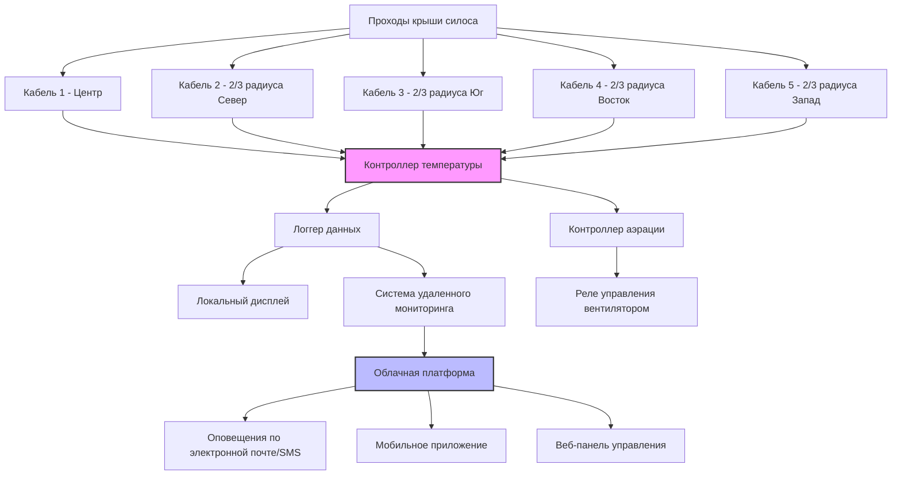

Эффективный мониторинг температуры является основой успешного управления хранением зерна. Датчики температуры обеспечивают раннее предупреждение о деградации, позволяя своевременно вмешаться путем аэрации или перемещения зерна до значительной потери качества или порчи.

## Типы кабелей температурных и их размещение

Кабели мониторинга температуры подвешиваются вертикально от крыши силоса через массу зерна для измерения температуры в нескольких точках. Три основных типа кабелей используются для хранения зерна:

**Термисторные кабели** обеспечивают высокую точность (±0,28°C) с выходными цифровыми сигналами. Каждый элемент термистора генерирует значение сопротивления, пропорциональное температуре, позволяя контроллерам опрашивать отдельные датчики вдоль кабеля. Эти кабели обычно включают 6-12 точек температурных с шагом 1,2-2,4 м по вертикали.

**Термопарные кабели** используют переходы разнородных металлов для генерирования сигналов напряжения, пропорциональных температуре. Хотя менее дорогие, чем системы на термисторах, термопары обеспечивают более низкую точность (±1,1°C) и требуют более сложной обработки сигналов.

**Распределенное температурное зондирование (DTS)** кабели используют волоконно-оптические технологии для измерения температуры непрерывно по всей длине кабеля. Системы DTS обеспечивают исключительное пространственное разрешение, но представляют наибольшие начальные затраты.

Кабели должны доходить до 0,6-0,9 м от дна силоса, с датчиками, сосредоточенными в верхней трети массы зерна, где обычно возникают проблемы температуры. Самый нижний датчик должен находиться на расстоянии не менее 0,6 м от пола, чтобы избежать охлаждающего эффекта пола, который скрывает температуру зерна.

## Требования к количеству датчиков и их расположению

Достаточное покрытие датчиками предотвращает опасные пробелы в мониторинге. Количество необходимых кабелей зависит от диаметра силоса:

| Диаметр силоса | Минимум кабелей | Схема расположения датчиков |
|---|---|---|
| До 5,5 м | 1 | Центр |
| 5,5-8,2 м | 3 | Центр + 2/3 радиуса |
| 8,2-11 м | 5 | Центр + 4 на 1/2 радиуса |
| 11-14,6 м | 7 | Центр + 6 на 2/3 радиуса |
| 14,6-18,3 м | 9 | Центр + 8 на 1/2 и 2/3 радиуса |
| Свыше 18,3 м | 12+ | Несколько радиальных позиций |

Размещайте кабели на равномерных радиальных расстояниях для создания зон мониторинга. Избегайте размещения кабелей у стенки силоса, где температурная стратификация отличается от внутренней части массы зерна. Для некруглых силосов разместите кабели по сетчатому паттерну с максимальным расстоянием 4,5-6 м между кабелями.

## Обнаружение горячих точек и их интерпретация

Горячие точки указывают на активную биологическую деятельность — метаболизм насекомых, рост грибков или оба процесса одновременно. Генерирование тепла в портящемся зерне следует уравнению:

$$Q = m \cdot r \cdot \Delta H$$

где $Q$ представляет генерирование тепла (кДж/ч), $m$ равна массе зерна, подвергающейся влиянию (кг), $r$ обозначает скорость дыхания (кг O₂/кг·ч), и $\Delta H$ — это теплота дыхания (приблизительно 7400 кДж/кг O₂).

Мониторинг температуры выявляет горячие точки двумя методами:

**Абсолютные пороги температуры** запускают сигналы тревоги, когда любой датчик превышает безопасные температуры хранения. Порог варьируется в зависимости от предполагаемой продолжительности хранения и влажности зерна.

**Температурные градиенты** между смежными датчиками выявляют развивающиеся проблемы. Разница, превышающая 5,6°C между датчиками на расстоянии 1,2-1,8 м друг от друга, указывает на активную порчу, даже если абсолютные температуры остаются ниже порогов тревоги. Горячие точки обычно развиваются следующим образом:

1. Начальное повышение температуры на 2,8-5,6°C выше температуры окружающей среды
2. Распространение на 0,15-0,45 м в сутки при отсутствии вмешательства
3. Пиковые температуры, достигающие 54-65°C в серьезных случаях
4. Последующее охлаждение по мере истощения зерна и миграции влаги

## Логирование данных и удаленный мониторинг

Современные системы мониторинга автоматически записывают данные температуры с определяемыми пользователем интервалами (обычно 1-4 часа). Логгеры данных сохраняют показания локально, одновременно передавая их на облачные платформы через сотовые или интернет-соединения.

Удаленный мониторинг обеспечивает несколько критических преимуществ:

- **Непрерывное наблюдение** без физических посещений силоса
- **Автоматические оповещения** через электронную почту, SMS или уведомления мобильного приложения
- **Анализ исторических трендов** для выявления постепенных изменений температуры
- **Управление несколькими объектами** с централизованной панели управления
- **Доказательство условий хранения** для претензий по качеству или страховки

Хранение данных должно охватывать весь период хранения плюс один дополнительный урожайный год для обеспечения исторических сравнений.

## Температурные тренды, указывающие на порчу

Температурные паттерны выявляют изменения состояния зерна до того, как произойдет видимая порча:

**Растущий температурный тренд**: Устойчивое увеличение на 0,6-1,1°C в неделю указывает на активные биологические процессы. Требуется немедленное расследование и принятие корректирующих мер.

**Температурная дивергенция**: Ранее однородные температуры, разделяющиеся на отдельные зоны, предполагают миграцию влаги или локальную порчу.

**Инвертированный температурный профиль**: Температуры на дне, превышающие температуры на верху (противоположно нормальной тепловой стратификации), указывают на серьезные проблемы, обычно вызванные протечками крыши, концентрирующими влагу.

**Температурные циклы**: Ежедневные колебания, превышающие 2,8°C, предполагают неадекватную защиту от погодных условий или структурные проблемы силоса, вызывающие конденсацию.

## Интеграция с системами управления аэрацией

Передовые системы интегрируют мониторинг температуры с управлением вентиляторами аэрации для автоматизированного охлаждения зерна. Контроллер запускает работу вентилятора при:

$$T_{grain} - T_{ambient} \geq \Delta T_{threshold}$$

где типичные значения $\Delta T_{threshold}$ варьируются от 5,6-8,3°C. Контроллеры рассчитывают среднюю температуру зерна из всех датчиков, исключая выбросы, которые могут указывать на локальные проблемы, требующие отдельного внимания.

Автоматизированная аэрация обеспечивает оптимальное охлаждение с минимизацией потребления энергии и чрезмерной сушки. Система останавливает вентиляторы, когда температура зерна приближается к температуре окружающей среды или когда условия окружающей среды становятся неблагоприятными (высокая влажность, теплая температура, осадки).

## Пороги температурной тревоги

Пределы температуры варьируются в зависимости от типа зерна, содержания влаги и предполагаемой продолжительности хранения:

| Тип зерна | Краткосрочное (< 6 мес) | Долгосрочное (> 6 мес) | Критическая тревога |
|---|---|---|---|
| Кукуруза | 15,6°C | 10°C | 26,7°C |
| Соевые бобы | 15,6°C | 10°C | 26,7°C |
| Пшеница | 18,3°C | 12,8°C | 29,4°C |
| Рис | 18,3°C | 12,8°C | 29,4°C |
| Сорго | 15,6°C | 10°C | 26,7°C |
| Ячмень | 15,6°C | 10°C | 26,7°C |

Эти пороги предполагают зерно с безопасным содержанием влаги (обычно 13-15% в зависимости от типа зерна). Зерно с более высокой влажностью требует более низких температурных порогов, в то время как более сухое зерно переносит несколько более высокие температуры.

Надлежащий мониторинг температуры в сочетании с своевременным реагированием предотвращает большинство потерь при хранении зерна. Инвестиция в качественное оборудование мониторинга окупается благодаря сохранению качества зерна, снижению потерь при хранении и поддержанию рыночной стоимости.
