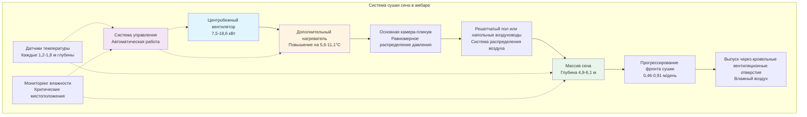

Системы сушки сена в амбарах используют принудительную вентиляцию для снижения влажности сена с уровней полевой сушки (25-35% влажности) до безопасных уровней хранения (18-20% влажности) при минимизации зависимости от погодных условий и сохранении питательной ценности. Надлежащее проектирование системы обеспечивает равномерное распределение воздушного потока, предотвращает рост плесени и оптимизирует энергопотребление.

## Проектирование системы принудительной сушки воздухом

Основная задача сушки сена в амбаре — обеспечить достаточный объем воздуха через массу сена для удаления влаги до начала порчи. Требуемый расход воздуха зависит от влажности сена, глубины слоя и условий окружающей среды.

**Расчет требуемого воздушного потока:**

$$Q = A \times v \times 60$$

Где:
- $Q$ = расход воздуха (CFM)
- $A$ = площадь поперечного сечения, перпендикулярного направлению воздушного потока (м²)
- $v$ = скорость воздуха через сено (м/мин)

Для глубин сена 4,9-6,1 м рекомендуемые скорости воздуха составляют 0,15-0,30 м/мин через массу сена. Это соответствует следующим расходам воздуха:

$$q = \frac{Q}{V} = 17-34 \text{ CFM/т}$$

Где $V$ представляет объем сена в тоннах. Более высокая влажность требует расходов воздуха на верхнем конце этого диапазона.

## Конфигурации напольных воздуховодов и решетчатых полов

Две основные системы распределения доставляют воздух к массе сена:

**Системы напольных воздуховодов:**
- Перфорированные круглые или прямоугольные воздуховоды, встроенные в пол амбара
- Расстояние между воздуховодами: 2,4-3,7 м для равномерного покрытия
- Площадь перфорации: 10-15% площади поверхности воздуховода
- Максимальная глубина сена над воздуховодами: 6,1 м

**Системы решетчатого пола:**
- Деревянные рейки (5×10 см или 5×15 см) с зазором 1,9-2,5 см
- Камера-плинум под полом, обеспечивающая равномерное распределение давления
- Покрытие всей площади пола амбара
- Превосходная равномерность по сравнению с системами воздуховодов
- Более высокая первоначальная стоимость, но лучшая производительность

Соотношение распределения давления:

$$\Delta P_{total} = \Delta P_{hay} + \Delta P_{duct} + \Delta P_{losses}$$

## Варианты сушки с подогревом и без подогрева воздуха

**Сушка без подогрева воздуха:**
- Использует температуру и относительную влажность окружающего воздуха
- Наиболее экономичные эксплуатационные затраты
- Требует благоприятных погодных условий
- Скорость сушки: 2-4% влажности в день
- Ограничивается поздней весной и ранней осенью

**Сушка с дополнительным подогревом:**
- Повышение температуры: 5,6-11,1°C выше температуры окружающей среды
- Значительно увеличивает способность сушки
- Снижает относительную влажность сушильного воздуха

Соотношение между температурой и способностью сушки:

$$RH_2 = RH_1 \times \frac{P_{sat,1}}{P_{sat,2}}$$

Где:
- $RH_1$ = начальная относительная влажность
- $RH_2$ = относительная влажность после подогрева
- $P_{sat}$ = давление насыщения при соответствующих температурах

Повышение температуры на 8,3°C снижает относительную влажность примерно на 50%, удваивая влагопоглощающую способность воздуха.

## Выбор вентилятора и требования к статическому давлению

Статическое давление через массу сена увеличивается экспоненциально с глубиной и линейно с скоростью воздушного потока:

$$SP = k \times d^{1.5} \times v^{1.2}$$

Где:
- $SP$ = статическое давление (Па)
- $k$ = коэффициент сопротивления сена (0,4-0,6)
- $d$ = глубина сена (м)
- $v$ = скорость воздуха (м/мин)

**Типовые параметры проектирования:**

| Глубина сена (м) | Воздушный поток (CFM/т) | Статическое давление (Па) | Мощность вентилятора (кВт/1000 CFM) |
|---|---|---|---|
| 3,7 | 15 | 37-50 | 0,37-0,52 |
| 4,9 | 18 | 62-87 | 0,60-0,82 |
| 6,1 | 20 | 99-137 | 0,90-1,27 |
| 7,3 | 25 | 149-199 | 1,34-1,87 |

Выбор вентилятора должен соответствовать точке работы, где кривая системы пересекает кривую характеристики вентилятора. Аксиальные вентиляторы лучше всего подходят для приложений с низким статическим давлением (менее 75 Па), в то время как центробежные вентиляторы более эффективно справляются с более высокими давлениями.

## Мониторинг прогрессирования фронта сушки

Фронт сушки представляет собой границу между высушенным сеном выше и невысушенным сеном ниже. Мониторинг прогрессирования обеспечивает полную сушку без пересушивания верхних слоев.

**Методы мониторинга:**
- Датчики температуры на разных глубинах (каждые 1,2-1,8 м)
- Датчики влажности в критических местах
- Визуальный осмотр цвета и текстуры сена
- Измерения электрического сопротивления

Фронт сушки продвигается примерно на:

$$v_{front} = \frac{q \times \Delta W}{d \times \rho_{hay}}$$

Где:
- $v_{front}$ = скорость продвижения фронта сушки (м/день)
- $\Delta W$ = скорость удаления влаги (кг воды/кг сухого воздуха)
- $\rho_{hay}$ = объемная плотность сена (кг/м³)

Типовые скорости прогрессирования колеблются от 0,46 до 0,91 м/день в зависимости от воздушного потока, температуры и начальной влажности сена.

## Рассмотрения энергоэффективности

Энергопотребление является наибольшей статьей эксплуатационных затрат для систем сушки сена в амбарах с подогревом:

$$E_{total} = E_{fan} + E_{heat}$$

**Энергия вентилятора:**

$$P_{fan} = \frac{Q \times SP}{6356 \times \eta_{fan} \times \eta_{motor}}$$

Где значения коэффициентов полезного действия обычно составляют 0,5-0,7 для вентиляторов и 0,85-0,95 для двигателей.

**Энергия подогрева:**

$$Q_{heat} = \dot{m}_{air} \times c_p \times \Delta T = 1,29 \times Q \times \Delta T$$

Для системы 9450 CFM (16 000 м³/ч) с повышением температуры на 8,3°C требуемая мощность нагрева составляет примерно 96 кВт.

**Стратегии оптимизации:**
- Работа при благоприятных условиях окружающей среды (низкая относительная влажность)
- Использование минимального повышения температуры, достаточного для сушки
- Установка частотных преобразователей для управления вентилятором
- Максимизация теплоизоляции для снижения потерь тепла
- Рассмотрение рекуперации тепла из выхлопного воздуха

**Расчет срока окупаемости:**

$$\text{Окупаемость} = \frac{\text{Начальные затраты}}{\text{Годовая экономия}}$$

Где годовая экономия включает снижение потерь в поле (10-20% урожая), улучшение качества сена (15-25% премия) и стоимость независимости от погодных условий. Типовые периоды окупаемости составляют 3-7 лет в зависимости от размера хозяйства и условий рынка сена.

Надлежащее проектирование системы сушки сена в амбаре балансирует капитальные инвестиции с эксплуатационными затратами, обеспечивая при этом постоянное качество сена и минимизируя потери, связанные с погодными условиями. Система должна обеспечивать достаточный воздушный поток при достаточном статическом давлении для достижения целевых скоростей сушки в безопасные сроки.
