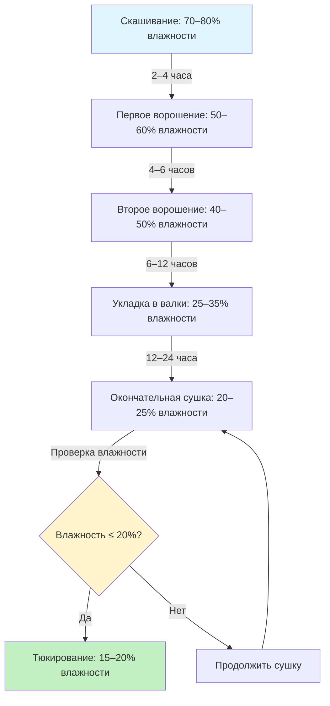

Полевая сушка остаётся наиболее экономичным методом сушки сена, использующим солнечную радиацию и ветер для снижения влажности с 70–80% в момент скашивания до 15–20%, пригодной для тюкирования. Понимание физических принципов удаления влаги и применение надлежащих методов управления полем минимизирует потери сухого вещества и сохраняет качество корма.

## Процесс естественной сушки и его этапы

Процесс полевой сушки включает три различные фазы сушки, каждая из которых управляется различными механизмами теплопередачи и массопередачи.

**Фаза 1: Испарение свободной влаги (70% до 40% влажности)**

Первоначальное удаление влаги происходит быстро, так как поверхностная вода испаряется. Скорость сушки зависит от:

- Интенсивности солнечной радиации (Вт/м²)
- Температуры воздуха и относительной влажности
- Скорости ветра над валком
- Площади поверхности растительного материала

Скорость испарения на этом этапе следует уравнению:

$$E = h_m \cdot A \cdot (P_{sat} - P_{air})$$

Где $E$ — скорость испарения (кг/ч), $h_m$ — коэффициент массопередачи, $A$ — площадь открытой поверхности (м²), $P_{sat}$ — давление насыщенного пара на поверхности растения, $P_{air}$ — парциальное давление влаги окружающего воздуха.

**Фаза 2: Переходная фаза (40% до 30% влажности)**

По мере истощения поверхностной влаги внутренняя влага должна мигрировать на поверхность растения. Скорость сушки значительно снижается, так как диффузия через стенки клеток становится лимитирующим фактором.

**Фаза 3: Удаление связанной влаги (30% до 15% влажности)**

Заключительный этап сушки предусматривает удаление воды, связанной в клеточных структурах. Эта фаза требует длительного пребывания в поле и благоприятных погодных условий. Соотношение влажности следует:

$$MR = \frac{M - M_e}{M_0 - M_e}$$

Где $M$ — текущая влажность, $M_e$ — равновесная влажность, $M_0$ — начальная влажность.

## Оборудование для кондиционирования для ускорения сушки

Механическое кондиционирование расплющивает или защипывает стебли растений для ускорения внутренней миграции влаги, сокращая время полевой сушки на 20–40%.

**Расплющивающие кондиционеры**

Стальные валки сжимают стебли между зацепляющимися поверхностями, раздавливая узлы и создавая трещины в восковой кутикуле. Зазоры между валками обычно находятся в диапазоне 3–6 мм в зависимости от спелости растений.

**Защипывающие кондиционеры**

Резиновые или полиуретановые валки защипывают стебли на регулярных интервалах без чрезмерного расплющивания. Этот метод вызывает меньше механических повреждений листьев, одновременно улучшая скорость сушки стеблей.

Эффективность кондиционирования зависит от:

- Разницы скоростей валков (обычно 10–20%)
- Пропускной способности материала
- Влажности стеблей при кондиционировании
- Вида растений и стадии спелости

## Ворошение и укладка в валки для равномерной сушки

Ворошение рыхлит и перераспределяет скошенный корм для подверженности свежих поверхностей движению воздуха и солнечной радиации.

**Частота ворошения**

- Первое ворошение: 2–4 часа после скашивания, когда верхний слой достигает 50–60% влажности
- Второе ворошение: Когда нижний слой приближается к 40–50% влажности
- Дополнительное ворошение, если сушка замедляется из-за погоды

Избыточное ворошение увеличивает потери листьев, особенно у бобовых, где листья содержат 60–70% общего белка.

**Операции укладки в валки**

Укладка в валки консолидирует частично высушенный корм в валки для окончательной сушки и тюкирования. Оптимальная укладка происходит при влажности 25–35%, когда стебли сохраняют гибкость, но листья достаточно высохли, чтобы сопротивляться осыпанию.

Широкие валки (1,2–1,5 м) способствуют прохождению воздуха через материал. Плотность валка должна позволять 30–40% пустого пространства для надлежащей вентиляции.

## Зависимость от погоды и факторы риска

Успех полевой сушки полностью зависит от благоприятных погодных условий. Критические факторы риска включают:

**Осадки во время сушки**

Осадки переувлажняют корм, вымывая растворимые углеводы и белки. Каждый цикл переувлажнения–сушки увеличивает потерю сухого вещества на 5–15%. Переувлажненное сено требует дополнительного времени на поле, что увеличивает потери от дыхания и микробной деградации.

**Относительная влажность**

Ночная относительная влажность выше 80% останавливает прогресс сушки и может вызвать переабсорбцию влаги. Соотношение равновесной влажности:

$$EMC = \frac{18.02}{27.3} \cdot \frac{1.8 \cdot 10^{-5} \cdot RH \cdot e^{\frac{8750}{T}}}{1 + 1.8 \cdot 10^{-5} \cdot RH \cdot e^{\frac{8750}{T}}}$$

Где $RH$ — относительная влажность (%), $T$ — температура (К).

**Условия ветра**

Неадекватное движение воздуха (<2 м/с) значительно продлевает время сушки. Оптимальные скорости ветра находятся в диапазоне 3–5 м/с, обеспечивая достаточный воздухообмен без чрезмерных механических потерь.

## Потери сухого вещества и питательных веществ

Полевая сушка неизбежно приводит к потерям сухого вещества за счёт дыхания, вымывания и механической обработки.

**Потери от дыхания**

Клетки растений продолжают метаболическую активность после скашивания, потребляя 2–6% сухого вещества во время типичной полевой сушки. Скорость дыхания удваивается при каждом увеличении температуры на 10°C до смерти клеток.

**Механические потери**

Осыпание листьев во время ворошения, укладки в валки и тюкирования составляет 3–15% потерь сухого вещества, наибольшие потери в переосушенных бобовых. Поскольку листья содержат большинство белка и переваримых питательных веществ, механические потери непропорционально снижают качество корма.

**Деградация питательных веществ**

- Сырой белок: 5–20% потерь в зависимости от времени пребывания в поле
- Каротин (предшественник витамина А): 50–80% потерь от УФ-облучения
- Водорастворимые углеводы: 10–25% потерь, больше при осадках

## Оптимальное время для тюкирования после полевой сушки

Тюкирование при правильной влажности предотвращает нагревание, рост плесени и самовозгорание, одновременно минимизируя потери в поле.

**Целевые значения влажности**

| Тип сена | Малые прямоугольные тюки | Большие прямоугольные тюки | Круглые тюки |
|----------|--------------------------|---------------------------|-------------|
| Травяное сено | 15–18% | 14–16% | 16–18% |
| Бобовое сено | 16–18% | 15–17% | 17–20% |
| Смешанное сено | 15–18% | 14–17% | 16–19% |

Крупные тюки требуют более низкой влажности из-за сниженного отношения поверхности к объёму и ограниченного рассеивания тепла.

**Тестирование влажности**

Методы определения влажности в поле:

- Метод микроволновой печи (точность ±2%)
- Электронные влагомеры (быстрое определение, точность ±3%)
- Тест скручивания (субъективный, опытные операторы)

Тюкируйте при влажности на 1–2 процентных пункта ниже целевого значения, чтобы учесть вариативность в поле и миграцию влаги при хранении.

## Сравнение методов сушки

| Параметр | Полевая сушка | Сушка в сарае | Искусственная сушка |
|----------|----------------|---------------|--------------------|
| Энергозатраты | Минимальные | Средние | Высокие |
| Зависимость от погоды | Полная | Отсутствует | Отсутствует |
| Время сушки | 1–5 дней | 0,5–2 дня | Часы |
| Потери СВ | 15–25% | 5–10% | 2–5% |
| Сохранение качества | Переменное | Хорошее | Отличное |
| Капитальные вложения | Низкие | Средние | Очень высокие |
| Операционные затраты/т | 15–35 USD | 45–90 USD | 135–225 USD |

Полевая сушка остаётся предпочтительным методом для большинства производителей сена при благоприятных погодных условиях, обеспечивая приемлемое качество при минимальных затратах. Понимание динамики влаги и применение надлежащих методов управления полем оптимизирует этот естественный процесс сушки, минимизируя потери.
