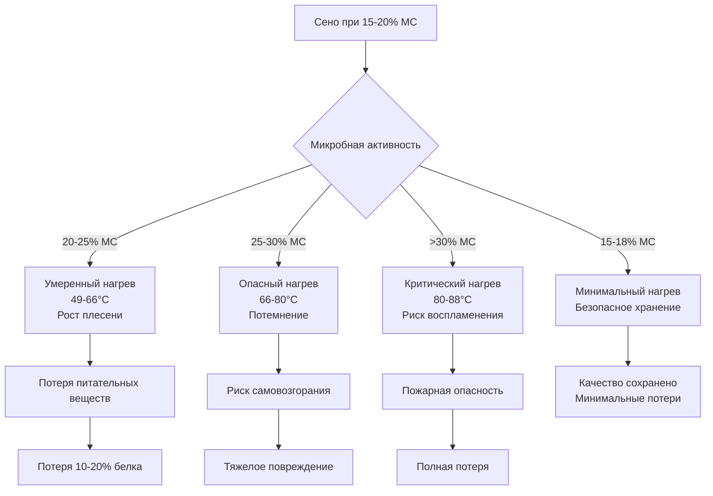

Содержание влаги представляет наиболее критический параметр при сохранении и безопасном хранении сена. Взаимосвязь между уровнем влаги и стабильностью сена определяет, остается ли сохраняемый материал безопасным питательным кормом или становится пожарной опасностью и источником потери питательных веществ.

## Безопасные уровни влажности при хранении

Безопасное содержание влаги при хранении зависит от типа сена и метода хранения. Целевой диапазон влажности балансирует качество сохранения против риска самопроизвольного нагрева.

| Тип сена | Максимальная безопасная влажность | Оптимальный диапазон | Метод хранения |
|----------|-------------------------------------|----------------------|-----------------|
| Люцерна (прессованные тюки) | 18% | 15-18% | Традиционный сарай |
| Люцерна (крупные тюки) | 16% | 13-16% | Традиционный сарай |
| Травяное сено (прессованные тюки) | 20% | 16-20% | Традиционный сарай |
| Травяное сено (крупные тюки) | 18% | 15-18% | Традиционный сарай |
| Смешанное сено (прессованные тюки) | 19% | 15-19% | Традиционный сарай |
| Смешанное сено (крупные тюки) | 17% | 14-17% | Традиционный сарай |
| Сено (упакованный силос) | 50-60% | 50-60% | Анаэробное хранилище |

Люцерна требует более низкой влажности, чем травяное сено, поскольку её более высокое содержание белка способствует более интенсивной микробной активности. Крупные тюки требуют более низкой влажности, чем прессованные тюки, из-за меньшей площади поверхности для рассеивания тепла и ограниченного движения воздуха через более плотный пакет.

## Методы измерения влажности

Точное определение влажности направляет время уборки и решения по хранению.

**Механические тестеры**: Электронные измерители сопротивления или емкости обеспечивают быстрые полевые измерения. Вставляйте датчики в несколько мест на тюке, измеряя 6-8 точек на тюке. Калибруйте приборы для конкретных типов сена, так как электрические свойства варьируются в зависимости от вида и соотношения стеблей и листьев.

**Метод сушки в печи**: Эталонный стандарт взвешивает образец, высушивает его при 57°C в течение 24 часов, затем повторно взвешивает. Содержание влаги на основе влажного образца:

$$MC_{wb} = \frac{W_{wet} - W_{dry}}{W_{wet}} \times 100\%$$

где $W_{wet}$ = начальная масса образца и $W_{dry}$ = масса после сушки в печи.

**Микроволновый метод**: Ускоренная сушка дает результаты за 10-15 минут. Взвесьте образец, микроволнируйте на 50% мощности с интервалом 1 минуту, повторно взвешивайте между циклами до стабилизации массы.

**Мониторинг температуры**: Внутренняя температура тюка указывает на нагрев, вызванный влажностью. Температуры выше 49°C сигнализируют об опасных условиях, требующих немедленных действий.

## Взаимосвязь влажности и риска нагрева

Взаимосвязь между содержанием влаги и самопроизвольным нагревом следует предсказуемым закономерностям, обусловленным микробным дыханием и химическим окислением.

При содержании влаги 15-18% аэробные бактерии и грибы не могут поддерживать значительные популяции. Респираторное тепло рассеивается быстрее, чем оно генерируется. При влажности 20-25% микробные популяции расширяются, генерируя тепло, которое повышает внутреннюю температуру до 49-66°C. Этот диапазон способствует росту плесени, пыльному сену и снижению аппетитности.

При влажности выше 25% химические реакции ускоряются с повышением температуры. Реакция Майяра приводит к потемнению белков, снижая усвояемость. Накопление тепла становится самоподдерживающимся, потенциально достигая температуры воспламенения около 80-88°C.

## Факторы, влияющие на скорость сушки

Скорость сушки сена зависит от условий окружающей среды и свойств материала. Уравнение скорости сушки:

$$\frac{dM}{dt} = -k \cdot A \cdot (P_{sat} - P_{air})$$

где $\frac{dM}{dt}$ = скорость удаления влаги, $k$ = коэффициент сушки, $A$ = площадь поверхности, $P_{sat}$ = давление насыщенного пара при температуре сена, и $P_{air}$ = давление водяного пара в воздухе.

**Температура**: Повышение температуры воздуха увеличивает разницу давлений пара, ускоряя передачу влаги. Каждое увеличение температуры на 5,6°C примерно удваивает скорость сушки в практическом диапазоне 27-49°C.

**Относительная влажность**: Более низкая влажность окружающей среды увеличивает градиент давления пара. Сушка фактически прекращается, когда влажность окружающей среды превышает 65-70%, независимо от температуры.

**Скорость воздушного потока**: Более высокий воздушный поток удаляет насыщенный влагой воздух с поверхностей сена. Минимальные эффективные скорости потока варьируются от 2-5 CFM (3,4-8,5 м³/ч) на кубический метр сена, в зависимости от начального содержания влаги. Взаимосвязь:

$$CFM_{required} = V_{hay} \cdot f \cdot (MC_{initial} - MC_{target})$$

где $V_{hay}$ = объем сена (м³), $f$ = коэффициент потока (2-5 CFM/м³ или 3,4-8,5 м³/ч на м³), $MC_{initial}$ = начальное содержание влаги (%), и $MC_{target}$ = желаемое содержание влаги (%).

**Плотность сена**: Прессованные тюки ограничивают воздушный поток, снижая эффективность сушки. Рыхлое сено в валках сохнет быстрее, чем прессованный материал, из-за большей площади поверхности и проникновения воздуха.

## Равновесная влажность

Равновесная влажность (EMC) представляет уровень влаги, который достигает сено при воздействии постоянных условий температуры и влажности. Сено не набирает и не теряет влагу при EMC.

Взаимосвязь следует изотермам сорбции, специфичным для типа сена и температуры. Для травяного сена при 20°C:

$$EMC = \frac{1800}{W} \cdot \frac{K \cdot RH}{1 - K \cdot RH} + \frac{18}{W} \cdot \frac{K \cdot k_1 \cdot K \cdot RH}{1 + k_1 \cdot K \cdot RH}$$

где $W$ = молекулярный вес воды (18), $K$ и $k_1$ = материальные константы.

Практические значения EMC направляют стратегии вентиляции. При 60% относительной влажности и 21°C травяное сено достигает равновесия примерно при 14% содержании влаги. Хранилища, поддерживающие условия ниже целевой EMC, естественным образом высушивают сено до безопасных уровней.

## Сохранение качества через управление влажностью

Надлежащее управление влажностью сохраняет питательную ценность, цвет и аппетитность. Сено, высушенное до 15-18% влаги, сохраняет 95-98% полевых питательных веществ. Витамин A (каротин) быстро деградирует выше 20% влаги из-за окисления, ускоренного нагревом и активностью плесени.

Усвояемость белка остается наиболее высокой при быстрой сушке до безопасных уровней влажности. Медленная сушка или повторное увлажнение позволяют ферментативной активности, которая преобразует белок в менее усвояемые формы. Целевое время сушки 24-48 часов от скашивания до прессования минимизирует потери дыхания.

Сохранение цвета указывает на надлежащее управление влажностью. Зеленое сено указывает на быструю сушку с минимальным нагревом. Коричневое сено указывает на чрезмерный нагрев от высокого содержания влаги или длительного хранения выше 49°C. Черное сено представляет тяжелый нагрев, приближающийся к условиям горения.

Надлежащий контроль влажности на протяжении всего цикла сушки и хранения поддерживает качество сена, обеспечивает безопасность и сохраняет инвестицию в операции уборки и обработки.
