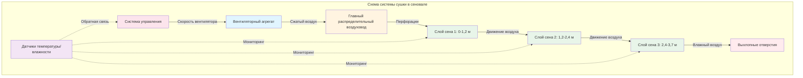

## Принципы и применение сушки в сеновалах

Сушка в сеновалах представляет контролируемый подход к консервации сена с использованием принудительной циркуляции воздуха через сено, хранящееся в амбарах или сеновалах. Система пропускает наружный или нагретый воздух через массу сена для удаления избыточной влаги, снижая влажность при тюковании с 25-35% до безопасного для хранения уровня 15-20%. Этот активный процесс сушки преобразует традиционное хранилище сена в сложную систему осушения.

Фундаментальный принцип заключается в создании перепада давления, который заставляет воздух проходить через упакованное сено. Воздух поступает через распределительные воздуховоды в нижней части сеновала и выходит сверху, унося водяной пар, удаленный из растительного материала. Фронт сушки прогрессирует вертикально через массу сена, при этом слой, ближайший к воздуховоду, сохнет первым, а последующие слои сохнут по мере прохождения кондиционированного воздуха через них.

Сушка в сеновалах особенно ценна во влажном климате или в периоды уборки с непредсказуемой погодой. Система позволяет фермерам тюковать сено при более высокой влажности без риска самовозгорания или развития плесени, расширяя период уборки и снижая потери, связанные с погодой.

## Проектирование воздуховодов для распределения воздуха

Правильное проектирование воздуховодов обеспечивает равномерное распределение воздуха по всей массе сена. Наиболее распространенная конфигурация использует перфорированный основной воздуховод, проходящий вдоль пола или немного выше него, с воздухом, поступающим через отверстия или щели, расположенные для обеспечения равномерного покрытия.

**Требования к размерам воздуховода:**

Площадь поперечного сечения воздуховода должна поддерживать скорость воздуха менее 549 м/с для предотвращения чрезмерной потери давления. Для главного воздуховода, обслуживающего сеновал шириной 9,1 м:

$$A_{воздуховод} = \frac{Q}{V_{макс}}$$

Где $A_{воздуховод}$ — площадь воздуховода (м²), $Q$ — общий расход воздуха (м³/ч), $V_{макс}$ — максимальная скорость (549 м/с).

Схемы перфорации соответствуют специальным рекомендациям для обеспечения равномерного выброса. Общая площадь перфораций должна быть в 1,5-2 раза больше площади поперечного сечения главного воздуховода, с отверстиями, сконцентрированными в конце воздуховода, чтобы компенсировать потерю давления по длине.

**Распространенные конфигурации воздуховодов:**

- **Напольные воздуховоды**: круглые или прямоугольные воздуховоды, уложенные на пол с отверстиями, обращенными вверх
- **Поднятые воздуховоды**: подвешены на высоте 30-61 см над уровнем пола для улучшения распределения воздуха
- **Боковые ответвления**: несколько перпендикулярных воздуховодов, подключенных к главной камере
- **Щелевые полы**: полнометровые перфорированные секции пола для крупных установок

Выбор материала учитывает долговечность и характеристики воздушного потока. Оцинкованная сталь обеспечивает долговечность, в то время как сельскохозяйственный ПВХ или полиэтилен обеспечивают устойчивость к коррозии и простоту установки.

## Подбор вентилятора и требования к воздушному потоку

Правильный выбор вентилятора определяет эффективность системы. Требуемый расход воздуха зависит от глубины сена, влажности и желаемого времени сушки.

### Требования к расходу воздуха

| Глубина сена (м) | Расход воздуха (м³/ч на т) | Статическое давление (Па) | Время сушки (дней) |
|------------------|---------------------------|---------------------------|-------------------|
| 1,2-1,8 | 4,2-5,7 | 124-249 | 3-5 |
| 1,8-2,4 | 2,8-4,2 | 249-373 | 5-7 |
| 2,4-3,0 | 2,1-3,5 | 373-621 | 7-10 |
| 3,0-3,7 | 1,4-2,8 | 621-871 | 10-14 |
| 3,7-4,9 | 1,1-2,1 | 871-1242 | 14-21 |

**Расчет мощности вентилятора:**

$$P = \frac{Q \times SP}{2098 \times \eta}$$

Где $P$ — мощность (кВт), $Q$ — расход воздуха (м³/ч), $SP$ — статическое давление (Па), $\eta$ — КПД вентилятора (обычно 0,60-0,75).

Для сеновала глубиной 3,7 м со 100 т сена, требующего 100 м³/ч·т при статическом давлении 745 Па:

$$P = \frac{10000 \times 745}{2098 \times 0,70} = 5,1 \text{ кВт}$$

Выберите электродвигатель мощностью 5,5 кВт, чтобы обеспечить адекватную производительность с запасом прочности.

Осевые вентиляторы подходят для большинства приложений сушки в сеновалах благодаря их способности перемещать большие объемы при умеренных давлениях. Центробежные вентиляторы справляются с более глубокими сеновалами, где статическое давление превышает 1000 Па.

## Рассмотрение температуры и влажности

Успешная сушка в сеновалах требует управления как температурой воздуха, так и относительной влажностью для оптимизации скорости удаления влаги без повреждения сена.

**Сушка неподогретым воздухом** опирается на условия окружающей среды и эффективна, когда температура воздуха превышает 10°C при относительной влажности ниже 70%. Способность воздуха поглощать влагу увеличивается с температурой в соответствии с психрометрическими соотношениями. Воздух при 21°C и 60% ОВ может поглотить значительно больше влаги, чем более холодный и более влажный воздух.

**Дополнительный нагрев** ускоряет сушку, когда условия окружающей среды оказываются предельными. Повышение температуры воздуха на 6-8°C обычно сокращает время сушки вдвое. Повышение температуры не должно превышать 11°C выше температуры окружающей среды, чтобы предотвратить чрезмерные энергетические затраты и потенциальное повреждение сена от пересушивания или теплового стресса.

**Критические пределы температуры:**

- Температура сена должна оставаться ниже 49°C для сохранения содержания белка и каротина
- Температура воздуха выше 60°C рискует повредить листовой материал и снизить питательность
- Контролируйте температуру сена в начальный период сушки, когда тепло дыхания добавляется к тепловыделению системы

Относительная влажность выхлопного воздуха указывает на ход сушки. Изначально влажность выхлопа приближается к насыщению (95-100% ОВ) по мере того, как влага свободно испаряется с поверхности сена. По мере прогресса сушки влажность выхлопа уменьшается, сигнализируя об окончании, когда она приближается к уровню окружающей среды.

## Преимущества перед полевой сушкой

Сушка в сеновалах обеспечивает значительные преимущества по сравнению с традиционными методами полевого высушивания:

**Независимость от погоды** устраняет основной переменный фактор в качестве сена. Фермеры могут тюковать во время коротких окон благоприятной погоды и завершать сушку в контролируемых условиях, снижая потери от повреждений дождем, осыпания листьев и длительного полевого воздействия.

**Расширение сезона уборки** позволяет проводить более раннюю уборку при достижении максимального содержания питательных веществ. Сено люцерны первого сбора, убранное в ранней стадии цветения, содержит максимум белка и ОДВ (Общие Переваримые Питательные вещества), но требует более продолжительной полевой сушки. Системы сеновалов позволяют проводить уборку при оптимальной спелости независимо от прогнозов погоды.

**Снижение потерь в поле** от механической обработки. Каждая полевая операция вызывает потерю сухого вещества на 2-5% в результате осыпания листьев. Сушка в сеновалах сокращает полевой период с 3-5 дней до однодневного тюкования, исключая несколько операций разбрасывания и сгребания.

**Эффективность труда** концентрирует уборку в более короткие периоды, позволяя лучше использовать оборудование и планировать работу персонала. Тюкование можно продолжать до вечера, так как немедленное полное высушивание не требуется.

**Управление земельными ресурсами** выигрывает от снижения уплотнения почвы и более быстрого освобождения полей для последующих культур или выпаса.

## Сохранение качества и сохранение питательных веществ

Сушка в сеновалах сохраняет качество сена посредством нескольких механизмов, защищающих питательную ценность и физические характеристики.

**Снижение потерь при дыхании** происходит потому, что тюкование при более высокой влажности сокращает время полевой сушки, когда растительное дыхание остается активным. Каждый день полевой сушки потребляет 2-4% углеводов за счет продолжающегося клеточного дыхания. Быстрая искусственная сушка минимизирует эти потери.

**Сохранение белка** результат снижения воздействия ультрафиолетового излучения и вымывания дождевой водой. Растворимые белки вымываются из растительных тканей во время дождевых событий, потери достигают 10-15% за цикл смачивания. Сушка в сеновалах исключает этот путь потерь.

**Сохранение каротина** (предшественника витамина А) улучшается значительно. Каротин быстро деградирует при воздействии УФ-излучения и окисления. Сено, высушенное в амбаре, сохраняет 50-80% исходного каротина по сравнению с 20-40% для обширно высушенного в поле сена.

**Цвет и питательность** остаются превосходными. Ярко-зеленый цвет указывает на сохраненные питательные вещества и повышает приемлемость животными. Выцветшее на солнце полевое сено теряет визуальную привлекательность и может быть отвергнуто домашним скотом, даже если оно питательно адекватно.

**Профилактика плесени** результат контролируемой сушки до безопасных уровней влажности. Полевое сено часто содержит карманы избыточной влаги, которые способствуют развитию плесени во время хранения, потенциально производя микотоксины, вредные для животных.

Инвестиция в системы сушки в сеновалах обычно окупается повышением питательной ценности корма на 15-25% благодаря улучшению качества с периодами окупаемости 3-5 лет для коммерческих операций. Комбинация защиты от погоды, сохранения качества и операционной гибкости делает сушку в сеновалах неотъемлемым инструментом для современного производства сена в регионах, где условия в поле ограничивают согласованное производство высококачественного сена.
