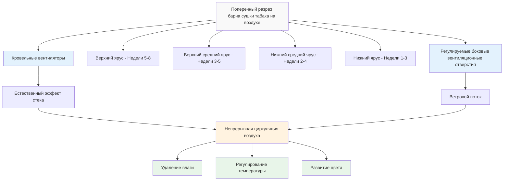

## Системы сушки табака на воздухе в барнах

Сушка на воздухе представляет собой наиболее древний и естественный метод переработки табака, полностью полагаясь на контролируемую естественную вентиляцию для снижения содержания влаги в листьях с 80-90% до 15-20% в течение продолжительного периода. Этот процесс развивает характерный цвет, аромат и химический состав, необходимый для сортов бёрлейского и сигарного табака.

## Принципы проектирования барнов с естественной вентиляцией

Барны для сушки табака на воздухе используют пассивные стратегии вентиляции, которые используют естественные силы плавучести и ветровые потоки для создания контролируемого движения воздуха через подвешенные листья табака.

**Конструктивная конфигурация**

Традиционные барны для сушки на воздухе имеют вертикальные щелевые стены с регулируемыми отверстиями, которые позволяют регулировать поток воздуха. Высота барна обычно варьируется от 6 до 12 м, обеспечивая несколько ярусов (4-8 уровней) для подвешивания палок табака. Расстояние между ярусами в 1,0-1,2 м обеспечивает адекватную циркуляцию воздуха вокруг каждой поверхности листа.

Площадь вентиляционного отверстия должна рассчитываться на основе объема барна и локальных климатических условий:

$$A_v = \frac{V_b \times N}{3600 \times v_a}$$

где $A_v$ – требуемая площадь вентиляционного отверстия (м²), $V_b$ – объем барна (м³), $N$ – желаемое количество воздухообменов в час (обычно 0,5-2 ACH), $v_a$ – средняя скорость воздуха через отверстия (м/с).

**Использование эффекта стека**

Естественный эффект стека обеспечивает основную движущую силу для движения воздуха. Скорость воздушного потока, вызванная плавучестью, можно оценить по следующей формуле:

$$Q = C_d A \sqrt{2gh\frac{\Delta T}{T_o}}$$

где $Q$ – объемный расход (м³/с), $C_d$ – коэффициент расхода (0,6-0,65 для отверстий в барне), $A$ – площадь отверстия (м²), $g$ – ускорение свободного падения (9,81 м/с²), $h$ – вертикальное расстояние между входом и выходом (м), $\Delta T$ – разница температур между внутренней и наружной средой (°C), $T_o$ – наружная абсолютная температура (К).

## Продолжительность сушки и фазы процесса

Сушка на воздухе обычно требует 4-8 недель в зависимости от начального содержания влаги в листьях, условий окружающей среды и типа табака. Процесс проходит через отчётливые физиологические фазы, требующие специфического управления вентиляцией.

| Стадия сушки | Продолжительность | Целевая ОВ | Скорость вентиляции | Изменение цвета | Критические параметры |
|--------------|----------|-----------|------------------|--------------|---------------------|
| Пожелтение | 3-7 дней | 80-85% | Минимальная (0,5 ACH) | Зеленый → Жёлтый | Поддерживайте высокую влажность |
| Фиксация цвета | 7-14 дней | 70-75% | Низкая (0,75 ACH) | Жёлтый → Загар/Коричневый | Постепенное снижение влажности |
| Сушка - Листовая пластина | 14-21 дней | 60-65% | Умеренная (1,0-1,5 ACH) | Развитие коричневого | Равномерная потеря влаги |
| Сушка - Стебель | 14-28 дней | 55-60% | Повышенная (1,5-2,0 ACH) | Коричневый зафиксирован | Полная сушка стебля |
| Кондиционирование | 3-7 дней | 65-70% | Сниженная (0,5-1,0 ACH) | Стабильный коричневый | Уравнивание |

## Управление вентиляцией во время фаз сушки

**Начальная фаза (дни 1-7)**

Во время пожелтения вентиляционные отверстия остаются почти закрытыми для поддержания высокой относительной влажности (80-85%). Это предотвращает чрезмерную сушку, которая могла бы остановить распад хлорофилла и ферментативную активность, необходимую для развития цвета. Регулировки открытия происходят только в периоды высокой влажности окружающей среды или угрозы осадков.

**Промежуточная фаза (дни 8-28)**

Постепенное открытие вентиляционных портов позволяет контролируемо удалять влагу. Оператор барна регулирует боковые вентиляционные отверстия и кровельные отверстия в зависимости от условий окружающей среды, ориентируясь на скорость сушки 2-3% потери влаги в день. Чрезмерная вентиляция на этом этапе вызывает укрепление корки — состояние, при котором поверхности листьев высыхают, а внутренние ткани остаются влажными.

**Заключительная фаза (дни 29-56)**

Максимальная вентиляция ускоряет сушку стебля — этап, определяющий скорость сушки на воздухе. Полная дегидратация стебля необходима для предотвращения плесени при хранении. Градиент влажности между листовой пластиной и стеблем приводит к продолжению сушки:

$$\frac{dM}{dt} = k(M_s - M_e)$$

где $\frac{dM}{dt}$ – скорость сушки, $k$ – константа сушки (на которую влияет скорость вентиляции), $M_s$ – содержание влаги в стебле, $M_e$ – равновесное содержание влаги.

## Требования к развитию цвета

Качество табака, сушимого на воздухе, критически зависит от контролируемого переходя цвета. Надлежащее развитие цвета требует:

- **Медленная начальная сушка**: Поддерживает ферментативную активность в течение 7-10 дней
- **Умеренная температура**: Температура окружающей среды 15-32°C оптимизирует химические реакции
- **Контроль влажности**: Предотвращает чрезмерную сушку, которая останавливает изменение цвета
- **Исключение света**: Тёмные интерьеры барнов предотвращают сохранение хлорофилла

Желаемый коричневый цвет является результатом окисления полифенолов и деградации каротиноидов, процессов, требующих 3-4 недель в контролируемых условиях.

## Мониторинг влажности во время сушки

Точная оценка влажности направляет решения по управлению вентиляцией во всем цикле сушки. Операторы контролируют:

**Содержание влаги в листе**

Физический осмотр обеспечивает качественную оценку — надлежащим образом высушенные листья имеют хрупкую текстуру с лёгкой гибкостью. Количественное измерение требует отбора проб и сушки в печи до постоянного веса:

$$MC = \frac{W_w - W_d}{W_d} \times 100\%$$

где $MC$ – содержание влаги (%), $W_w$ – вес во влажном состоянии, $W_d$ – вес в сухом состоянии.

**Условия окружающей среды**

Ежедневный мониторинг температуры и относительной влажности информирует о регулировках вентиляции. Психрометрический анализ определяет способность атмосферного воздуха удалять влагу.

## Специфические требования для бёрлейского и сигарного табака

**Бёрлейский табак**

Сорта бёрлейского табака требуют 6-8 недель сушки с тщательным контролем вентиляции. Лёгкий сушённый на воздухе лист требует равномерного коричневого цвета без зелёных остатков. Плотность загрузки барна не должна превышать 270-360 кг на 28 м³ для обеспечения адекватной циркуляции воздуха. Более низкое содержание сахара бёрлейского табака (1-2%) делает его более подверженным плесени во время медленных фаз сушки.

**Сигарный табак**

Сигарный табак для обёртки, внутреннего слоя и наполнителя требует 4-6 недель сушки на воздухе с акцентом на однородность цвета. Табак для обёртки требует наиболее тщательной обработки — любое изменение цвета или физическое повреждение значительно снижают стоимость. Плотность загрузки барна остаётся ниже (180-270 кг на 28 м³) для предотвращения контакта листьев и механического повреждения. Сигарный табак часто подвергается дополнительной ферментации после сушки на воздухе.

**Регулировки вентиляции**

Бёрлейский табак полезен от немного повышенных скоростей вентиляции во время фазы сушки стебля из-за более толстой структуры стебля. Табак для сигарной обёртки требует более консервативной вентиляции для сохранения деликатной целостности листа и предотвращения разрывов.

## Операционные соображения

Успешная сушка на воздухе зависит от опыта оператора в чтении условий окружающей среды и ответа табака. Современные операции дополняют традиционные методы электронными датчиками, контролирующими температуру, влажность и уровни влажности в нескольких местах в барне. Этот управляемый данными подход улучшает согласованность при соблюдении фундаментального опоры на принципы естественной вентиляции, которые определяли сушку на воздухе на протяжении веков.

Надлежащее обслуживание барна — включая структурную целостность, работоспособность вентиляционных отверстий и исключение осадков — остаётся необходимым для производства высококачественного табака, сушённого на воздухе, соответствующего спецификациям рынка.
