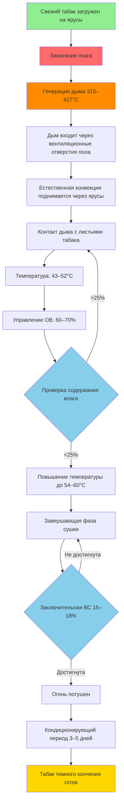

Отверждение табака темного копчения представляет собой один из старейших и наиболее отличительных методов обработки табака, использующий контролируемое воздействие дыма и повышенные температуры для развития характерных профилей вкуса и аромата. Этот процесс требует специализированных конструкций сушилок и тщательного управления огнем, дымом и условиями окружающей среды в течение длительных периодов отверждения.

## Процесс копчения огнем и воздействие дыма

Процесс отверждения темного копчения сочетает тепло, дым и время для преобразования свежего табака в готовый продукт с отличительными ароматическими и вкусовыми характеристиками.

**Этапы отверждения:**

1. **Фаза пожелтения (3–5 дней):** начальное снижение влажности при 32–38°C с минимальным воздействием дыма
2. **Фиксация цвета (5–7 дней):** постепенное повышение температуры до 38–43°C с легким введением дыма
3. **Основное копчение (20–30 дней):** поддерживаемые температуры 43–52°C с непрерывным воздействием дыма
4. **Завершающая сушка (5–10 дней):** повышение температуры до 54–60°C для завершения удаления влаги

Система генерации дыма должна обеспечивать постоянный низкотемпературный дым из костров лиственных пород, поддерживаемых в земляных ямах или специальных топках, расположенных по периметру сушилки. Оптимальное производство дыма происходит при температурах горения древесины 315–427°C, что генерирует дым без избыточного отложения смолы на листьях табака.

**Требования к воздействию дыма:**

Общая продолжительность воздействия дыма: 480–720 часов (20–30 дней) непрерывного или прерывистого применения дыма. Дым обеспечивает трансформацию цвета с желто-коричневого на темно-коричневый или черный, в зависимости от сорта и требований рынка.

## Контроль температуры и влажности во время копчения

Поддержание стабильных условий температуры и влажности представляет основную проблему управления при отверждении табака темного копчения.

**Контроль температуры:**

Требуемая тепловая нагрузка для типичной сушилки размером 7,3 м × 7,3 м, вмещающей 1360–1815 кг свежего табака:

$$Q_{total} = Q_{evap} + Q_{air} + Q_{structure}$$

Где нагрузка испарения доминирует:

$$Q_{evap} = \frac{m_{water} \times h_{fg}}{\Delta t}$$

Для удаления 1090 кг воды за 40 дней:

$$Q_{evap} = \frac{1090 \text{ кг} \times 2500 \text{ кДж/кг}}{40 \text{ дней} \times 24 \text{ ч/день}} = 2840 \text{ кДж/ч}$$

**Управление влажностью:**

Относительная влажность должна контролироваться в определенных диапазонах на протяжении всего цикла отверждения:

- Фаза пожелтения: 80–85% ОВ поддерживает упругость листа
- Фиксация цвета: 70–75% ОВ позволяет контролируемую сушку
- Основное копчение: 60–70% ОВ уравновешивает удаление влаги с абсорбцией дыма
- Завершающая сушка: 50–60% ОВ завершает твердение оболочки

Управление влажностью достигается путем управления вентиляцией, а не механической осушкой, так как требования циркуляции дыма требуют значительного движения воздуха.

## Управление вентиляцией для распределения дыма

Эффективное распределение дыма обеспечивает равномерное отверждение по всему объему сушилки, предотвращая чрезмерное накопление смолы.

**Естественная конструкция вентиляции:**

- Нижние вентиляционные отверстия: 0,37–0,56 м² на 28,3 м³ объема сушилки
- Верхние вентиляционные отверстия: 0,56–0,74 м² на 28,3 м³ объема сушилки
- Регулируемые заслонки на всех отверстиях для управления потоком воздуха

**Схема циркуляции дыма:**

Дым входит через открытия на уровне пола рядом с очагами, поднимается через ярусы с табаком естественной конвекцией и выходит через вентиляционные отверстия конька. Разница температур между входом дыма (52°C) и внутренней частью сушилки (43–46°C) обеспечивает циркуляцию примерно на 1–2 воздухообмена в час во время активного копчения.

**Расчет скорости вентиляции:**

$$ACH = \frac{Q_{smoke}}{V_{barn}} = \frac{A_{vent} \times v_{air} \times 60}{V_{barn}}$$

Для эффективного распределения дыма:

$$v_{air} = \sqrt{2 \times g \times H \times \frac{\Delta T}{T_{avg}}}$$

Где $H$ — высота сушилки, $\Delta T$ — разница температур.

## Дизайн табачной сушилки для темного копчения

Сушилки для табака темного копчения включают специфические конструктивные элементы для размещения управления огнем и циркуляции дыма.

**Конструктивная конфигурация:**

| Компонент | Спецификация | Назначение |
|-----------|--------------|---------|
| План этажа | 6,1 м × 6,1 м до 9,1 м × 9,1 м | Размещение очагов и вместимости табака |
| Высота | 4,9–6,1 м до пика | Обеспечивает стратификацию дыма и расстояние между ярусами |
| Уровни ярусов | 4–6 горизонтальных ярусов | Максимизирует вместимость при сохранении доступа |
| Расстояние между ярусами | 1,1–1,2 м по вертикали | Позволяет циркуляцию дыма и равномерное воздействие |
| Конструкция стен | Вертикальная обшивка из досок | Обеспечивает регулируемую вентиляцию через зазоры |
| Очаги | 2–4 земляные или кирпичные ямы | Расположены вдоль противоположных стен для распределения |

**Рассмотрение материалов:**

- Огнестойкий фундамент и нижние стены (кирпич или бетон до 0,9 м высоты)
- Деревянная верхняя конструкция, обработанная огнезащитными покрытиями
- Металлическая или плиточная кровля для предотвращения воспламенения от искр
- Бетонный или земляной пол для содержания очага

## Соображения безопасности при копчении открытым огнем

Операции копчения открытым огнем представляют значительные опасности безопасности, требующие строгих протоколов управления.

**Меры пожарной безопасности:**

1. **Изоляция очага:** кирпичные или земляные ямы минимум 30 см глубиной с зазором 45 см от горючих материалов
2. **Экраны от искр:** проволочные сетчатые барьеры предотвращают выход искр из очагов
3. **Оборудование для тушения пожара:** огнетушители типа А и водоснабжение доступны при всех входах сушилки
4. **Зоны безопасности:** минимум 7,6 м очищенный периметр вокруг конструкций сушилки
5. **Требования к мониторингу:** посещение огня каждые 2–4 часа во время активного копчения

**Безопасность персонала:**

- Обнаружение и мониторинг монооксида углерода (поддерживайте <35 ppm в занятых зонах)
- Защита дыхания для рабочих, входящих в дымонаполненные сушилки
- Профилактика теплового стресса при летних операциях отверждения
- Надлежащие методы подъема при обработке табака (23–27 кг связок)

## Факторы качества, на которые влияет процесс отверждения

Процесс отверждения табака темного копчения непосредственно влияет на несколько параметров качества, определяющих рыночную стоимость и пригодность для конечного использования.

**Атрибуты физического качества:**

- **Однородность цвета:** постоянная темно-коричневая или черная окраска по всему листу
- **Тело и структура:** упругие листья с соответствующим содержанием масла
- **Целостность стебля:** надлежащо высушенные стебли без хрупкости или избыточной влаги

**Изменения химического состава:**

- Содержание никотина: обычно 2,5–4,5% (выше, чем воздушно-сушеные сорта)
- Снижение сахара: крахмалы превращаются в сахара, а затем метаболизируются во время продолжительного отверждения
- Окисление полифенолов: создает характерный темный цвет и вяжущий вкус

**Развитие вкуса:**

Воздействие дыма придает отличительные дымные, креозотоподобные ароматы из фенольных соединений в дыме лиственных пород. Контроль температуры и влажности во время копчения влияет на:

- Интенсивность абсорбции дымного вкуса
- Развитие выдержанных, ферментированных характеристик
- Баланс между дымностью и естественным табачным вкусом

Оптимальное отверждение достигает конечного содержания влаги 15–18%, равномерной темной окраски и характерного профиля дымного аромата, требуемого производителями жевательного табака, нюхательного табака и специальных курительных продуктов.

## Сравнение методов отверждения табака

| Параметр | Темное копчение | Воздушная сушка | Дымоходная сушка | Темная воздушная сушка |
|-----------|------------|-----------|------------|----------------|
| **Продолжительность** | 40–60 дней | 45–60 дней | 5–8 дней | 30–45 дней |
| **Температура** | 43–60°C | Окружающая | 49–82°C | Окружающая |
| **Воздействие дыма** | Непрерывное | Отсутствует | Отсутствует | Отсутствует |
| **Управление влажностью** | Вентиляция | Естественное | Контролируемое | Естественное |
| **Источник энергии** | Костры лиственных пород | Отсутствует | Газо-/масляные печи | Отсутствует |
| **Финальный цвет** | Темно-коричневый/черный | Светло-коричневый | Желтый/оранжевый | Темно-коричневый |
| **Содержание никотина** | 2,5–4,5% | 1,5–3,5% | 1,0–2,5% | 2,0–4,0% |
| **Основное использование** | Жевательный табак, нюхательный | Сигары, жевательный | Сигареты | Сигары, трубочный |
| **Интенсивность труда** | Очень высокая | Средняя | Высокая | Средняя |
| **Риск пожара** | Высокий | Низкий | Средний | Низкий |

Это сравнение подчеркивает уникальное положение отверждения темного копчения как наиболее трудоемкого и наиболее рискованного метода, оправданного отличительными характеристиками продукта, которые он производит для специализированных сегментов рынка.
