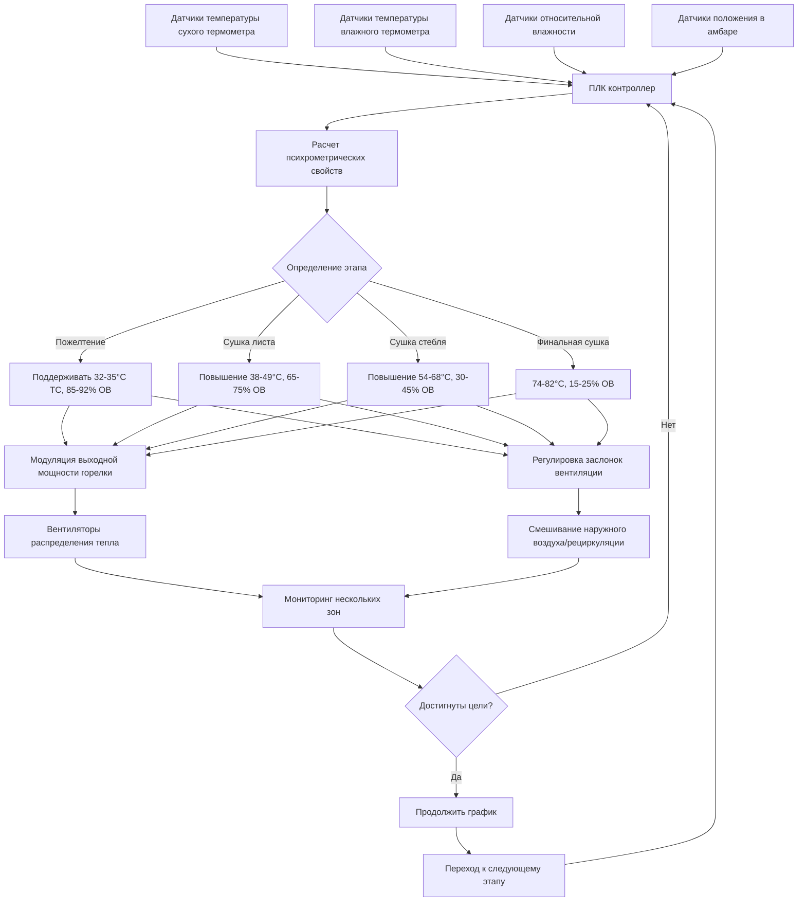

Контроль температуры и влажности представляет наиболее критическую часть операций по сушке табака, напрямую определяя качество листа, развитие цвета, химический состав и рыночную стоимость. Надлежащий контроль требует точного понимания психрометрических соотношений и внедрения сложных систем автоматизации.

## Требования к температуре и влажности на этапах сушки

Процесс сушки следует точному графику с отчетливыми целевыми показателями температуры и влажности для каждого этапа:

| Этап сушки | Продолжительность | Температура сухого термометра (°C) | Температура влажного термометра (°C) | Относительная влажность (%) | Депрессия влажного термометра (°C) |
|--------------|----------|--------------------|--------------------|----------------------|--------------------------|
| Пожелтение | 36-48 ч | 32-35 | 31-33 | 85-92 | 1-2 |
| Сушка листа | 24-36 ч | 38-49 | 33-37 | 65-75 | 4-12 |
| Сушка стебля | 24-48 ч | 54-68 | 36-40 | 30-45 | 18-28 |
| Финальная сушка | 12-24 ч | 74-82 | 38-43 | 15-25 | 36-39 |

## Психрометрические соотношения

Соотношение между температурой сухого термометра, температурой влажного термометра и относительной влажностью определяет скорость удаления влаги. Депрессия влажного термометра (разница между показаниями сухого и влажного термометров) указывает на потенциал сушки:

$$\Delta T_{wb} = T_{db} - T_{wb}$$

где $\Delta T_{wb}$ — депрессия влажного термометра, $T_{db}$ — температура сухого термометра, $T_{wb}$ — температура влажного термометра.

Скорость удаления влаги из листьев табака следует уравнению:

$$\dot{m}_w = h_m A_s (W_s - W_a)$$

где $\dot{m}_w$ — скорость испарения влаги, $h_m$ — коэффициент массопередачи, $A_s$ — площадь поверхности листа, $W_s$ — коэффициент влажности на поверхности листа, $W_a$ — коэффициент влажности воздуха.

Соотношение для удельной влажности:

$$W = 0.622 \frac{P_v}{P_{atm} - P_v}$$

где $W$ — коэффициент влажности (кг воды/кг сухого воздуха), $P_v$ — парциальное давление водяного пара, $P_{atm}$ — атмосферное давление.

## Требования к управлению температурой

### Точность на этапе пожелтения

Во время пожелтения температура должна оставаться в пределах ±1°C от уставки. Более высокие температуры (>37°C) вызывают преждевременную сушку до завершения деградации хлорофилла, что приводит к зеленому табаку. Более низкие температуры (<31°C) замедляют ферментативную активность, продлевая время сушки и увеличивая затраты топлива.

Процесс пожелтения требует поддержания высокой относительной влажности (85-92%) для предотвращения сушки листа при одновременном разрешении метаболических процессов преобразования крахмала в сахара и деградации хлорофилла. Точность контроля температуры ±0,5°C оптимизирует эти биохимические реакции.

### Постепенное повышение температуры при сушке листа

Повышение температуры с 38°C до 49°C должно происходить постепенно со скоростью 1-2°C в час. Быстрое повышение температуры создает твердую поверхность—сухая поверхность листа задерживает внутреннюю влагу, вызывая порчу при хранении.

Контролируемое повышение температуры позволяет миграции влаги из внутренней части листа на поверхность со скоростью, соответствующей емкости испарения:

$$\frac{dT}{dt} \leq k \cdot f(W_{leaf})$$

где $\frac{dT}{dt}$ — скорость повышения температуры, $k$ — эмпирическая константа (1-2°C/ч), $f(W_{leaf})$ — функция влажности листа.

### Контроль температуры при сушке стебля

Сушка стебля требует температур от 54-68°C с тщательным мониторингом. Превышение 71°C вызывает химическую деградацию—обугливание снижает качество и рыночную стоимость значительно. Однородность температуры в пределах ±2°C по всему амбару обеспечивает согласованную сушку всего табака.

## Стратегии управления влажностью

### Управление вентиляцией

Контроль влажности зависит от точного перемешивания вентиляционного воздуха. Забор свежего воздуха снижает влажность в амбаре на этапах высокого влагосодержания, тогда как рециркуляция поддерживает влажность во время пожелтения:

$$\dot{m}_{OA} = \dot{m}_{total} \cdot X_{OA}$$

где $\dot{m}_{OA}$ — массовый расход наружного воздуха, $\dot{m}_{total}$ — общий массовый расход воздуха, $X_{OA}$ — доля наружного воздуха (0-100%).

Во время пожелтения: $X_{OA}$ = 10-20%
Во время сушки листа: $X_{OA}$ = 40-60%
Во время сушки стебля: $X_{OA}$ = 70-90%

### Контроль депрессии влажного термометра

Поддержание надлежащей депрессии влажного термометра обеспечивает оптимальные скорости сушки. Недостаточная депрессия (<1°C во время пожелтения) предотвращает удаление влаги. Чрезмерная депрессия (>2°C во время пожелтения) вызывает быструю сушку и появление зеленого табака.

Регуляторы модулируют заслонки вентиляции для поддержания целевой депрессии влажного термометра путем регулировки доли наружного воздуха на основе непрерывных психрометрических измерений.

## Автоматизированные системы управления

### Размещение датчиков и точность

Датчики температуры должны достичь точности ±0,3°C с размещением на нескольких вертикальных уровнях (нижний, средний, верхний) и горизонтальных позициях. Датчики влажного термометра требуют непрерывного водоснабжения фитильного материала и защиты от прямого теплового излучения.

Датчики относительной влажности (емкостные или резистивные) предоставляют дополнительные измерения с точностью ±2% ОВ. Избыточные датчики в критических местах предотвращают отказы сушки из-за неисправности датчика.

### Алгоритмы управления ПЛК

Современные системы используют пропорционально-интегрально-дифференциальное (ПИД) управление:

$$u(t) = K_p e(t) + K_i \int_0^t e(\tau)d\tau + K_d \frac{de(t)}{dt}$$

где $u(t)$ — выходной сигнал управления, $e(t)$ — ошибка от уставки, $K_p$ — коэффициент пропорционального усиления, $K_i$ — коэффициент интегрального усиления, $K_d$ — коэффициент дифференциального усиления.

Отдельные циклы ПИД контролируют скорость срабатывания горелки (температура) и положение заслонки вентиляции (влажность), с перекрестным ограничением для предотвращения конфликтующих действий.

## Влияние качества при неправильном управлении

### Отклонения температуры

**Высокая температура во время пожелтения:** Производит зеленый табак—листья сохнут до деградации хлорофилла, снижая стоимость на 30-50%.

**Низкая температура при сушке стебля:** Неполное удаление влаги вызывает загнивание стебля при хранении, полную потерю урожая.

**Температурные скачки >82°C:** Обугливание создает хрупкие коричневые листья с резким вкусом дыма.

### Отказы управления влажностью

**Чрезмерная влажность (>95% ОВ):** Поражение в доме—рост бактерий во время продленного пожелтения уничтожает весь амбар.

**Недостаточная влажность при пожелтении:** Задержание твердой оболочки задерживает влагу, вызывая плесень и бактериальную порчу.

**Быстрое снижение влажности:** Листопад—хрупкие, поломанные листья снижают качество сортировки.

## Вентиляция для регулировки влажности

Скорость вентиляции должна соответствовать эволюции влаги из табака. Пиковое удаление влаги происходит на этапе сушки листа, требуя максимального забора свежего воздуха:

$$\dot{V}_{req} = \frac{\dot{m}_{water}}{\rho_{air}(W_{exhaust} - W_{intake})}$$

где $\dot{V}_{req}$ — требуемый расход вентиляции (CFM, м³/ч), $\dot{m}_{water}$ — скорость удаления влаги (кг/ч), $\rho_{air}$ — плотность воздуха, $W_{exhaust}$ — коэффициент влажности на выходе, $W_{intake}$ — коэффициент влажности на входе.

Типовые амбары требуют производительности 13500-20000 CFM (6400-9500 м³/ч) с вентиляторами переменной скорости, реагирующими на измерения влажности в реальном времени. Недостаточная вентиляция создает чрезмерную влажность в амбаре, тогда как чрезмерная вентиляция тратит энергию тепла и продлевает время сушки.

Надлежащий контроль температуры и влажности преобразует биологический процесс в предсказуемую, повторяемую производственную операцию, максимизируя качество табака и экономическую прибыль.
