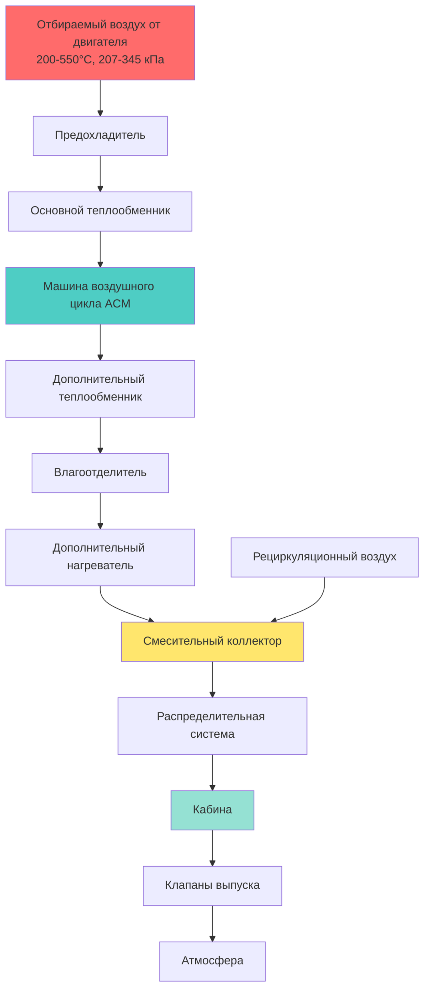
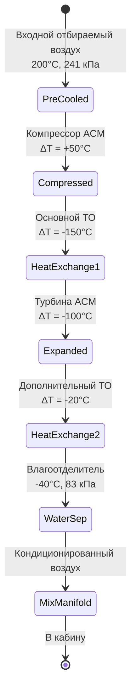

# Системы управления окружающей средой в самолётах

Системы управления окружающей средой в самолётах (ECS) обеспечивают критические функции жизнеобеспечения для пассажиров и экипажа при работе в экстремальных атмосферных условиях. Эти системы поддерживают давление в кабине, температуру, влажность и качество воздуха на уровне моря до крейсерских высот, превышающих 12 000 м, где окружающие температуры достигают -56°C, а атмосферное давление снижается до 0,2 атм.

## Архитектура системы ECS

Современные ECS самолётов интегрируют несколько подсистем для подачи кондиционированного воздуха в различных условиях полёта. Основная архитектура зависит от размера самолёта, профиля миссии и конфигурации энергетической установки.

## Системы отбора воздуха

Отбор воздуха из ступеней компрессора двигателя обеспечивает основной источник воздуха для ECS. Высокотемпературный воздух высокого давления (200-550°C при 207-345 кПа) требует тщательной подготовки перед распределением.

**Источники отбираемого воздуха:**

- **Отбор на низких ступенях:** 5-9-я ступень компрессора, более низкие температура и давление
- **Отбор на высоких ступенях:** 10-14-я ступень, более высокое энергетическое содержание
- **Отбор от ВСУ:** Наземные операции и резервное копирование в чрезвычайных ситуациях

Архитектура системы отбора воздуха уравновешивает влияние на производительность двигателя с требованиями ECS. Каждый 1% отбора воздуха снижает тягу двигателя примерно на 1-1,5%, создавая проблемы оптимизации во время критических этапов полёта.

## Работа машины воздушного цикла

Машина воздушного цикла (ACM) формирует основной охлаждающий компонент в большинстве коммерческих ECS самолётов. В отличие от систем парокомпрессионного цикла, ACM использует термодинамическое расширение для охлаждения без холодильных агентов.

### Трёхколёсный цикл начальной загрузки

Стандартный в отрасли цикл начальной загрузки включает три турбомашины на общем валу:

1. **Компрессор:** Повышает давление отбираемого воздуха перед теплообменом
2. **Турбина:** Расширяет воздух для производства охлаждения и мощности вала
3. **Вентилятор:** Прогоняет воздух напора через теплообменники

**Термодинамический процесс:**

Цикл начальной загрузки достигает температур до -40°C путём поэтапного отвода тепла и расширения. Воздух, поступающий в компрессор ACM при 200°C, проходит сжатие (степень сжатия 1,5-2,0), теплообмен с воздухом напора, расширение через турбину (степень расширения 2,5-3,5) и вторичный теплообмен перед влагоотделением.

## Контроль герметизации кабины

Системы герметизации поддерживают высоту кабины между 1 830-2 440 м во время крейсерского полёта на высоте 10 700-13 100 м. Это требует непрерывного управления перепадом давления поперёк конструкции фюзеляжа.

**Ключевые параметры:**

| Параметр | Типовое значение | Предельное значение |
|-----------|------------------|-------------------|
| Высота кабины | 1 830-2 440 м | 2 440 м макс. |
| Перепад давления | 59-63 кПа | 65 кПа макс. |
| Скорость набора высоты | 2,5-4,2 м/мин | 4,2 м/мин макс. |
| Скорость снижения | 2,5-4,2 м/мин | 2,5 м/мин макс. |

Системы контроля герметизации модулируют клапаны выпуска для поддержания запланированной высоты кабины во время полёта. Цифровые контроллеры изменяют положение клапана на основе высоты самолёта, скорости набора/снижения высоты и выбранной высоты посадки.

## Системы температурного контроля

Зональный температурный контроль обеспечивает комфорт пассажиров по нескольким участкам кабины. Коммерческие самолёты обычно делят кабину на 2-4 температурные зоны с отдельным контролем смешивающего воздуха.

**Метод температурного контроля:**

Холодный воздух из ACM (приблизительно 2°C) смешивается с горячим отбираемым воздухом через электрически управляемые клапаны смешивания. Это смешивание достигает температур в зонах между 18-30°C с точностью контроля ±1°C.

**Компоненты тепловой нагрузки:**

- Солнечная радиация: 159-477 Вт/м² в зависимости от угла солнца и площади окна
- Метаболическое тепло: 79-105 Вт на одного пассажира
- Тепло оборудования: 26-53 Вт на одного пассажира (камбуз, ИФЕ, освещение)
- Инфильтрация: 0,1-0,3 кратная смена воздуха в час через уплотнения дверей и выпуск герметизации

## Управление влажностью и качеством воздуха

Влажность кабины самолёта естественным образом остаётся низкой (5-15% ОВ) из-за подаваемого из ECS воздуха без влаги. Водяной пар от пассажиров и камбузов обеспечивает единственный источник влаги.

**Требования к вентиляции согласно SAE ARP1270:**

- Свежий воздух: минимум 4,7 л/мин на одного человека
- Общий расход воздуха: 7,1-9,4 л/мин на одного человека
- Коэффициент рециркуляции: 50% типовой (варьируется в зависимости от самолёта)
- Фильтрация HEPA: 99,97% эффективность при 0,3 мкм для рециркулируемого воздуха

## Рекомендуемые нормативы SAE Aerospace

Проектирование ECS самолётов следует Рекомендуемым нормативам Aerospace SAE (ARP) для стандартизации:

- **SAE ARP85:** Системы кондиционирования воздуха для дозвуковых самолётов
- **SAE ARP1270:** Качество воздуха в кабине самолёта
- **SAE ARP4418:** Системы управления тепловыми процессами
- **SAE ARP4754:** Разработка систем гражданских самолётов

Эти стандарты устанавливают пределы окружающей среды, процедуры испытаний и требования безопасности для сертификации в соответствии с нормами FAA Part 25 или EASA CS-25.

## Надёжность системы и резервирование

Коммерческие ECS самолётов включают двойное или тройное резервирование для критических функций. Типовые конфигурации включают:

- Два независимых кондиционирующих агрегата (каждый со 100% производительностью)
- Несколько источников отбираемого воздуха (левый двигатель, правый двигатель, ВСУ)
- Двойные контроллеры герметизации с автоматическим переключением
- Резервные системы кислорода для чрезвычайной разгерметизации

Это резервирование обеспечивает продолжение безопасной работы после любого отказа одной системы, отвечая требованиям надёжности доставки, превышающим 99,5%.

## Оптимизация производительности

Работа ECS значительно влияет на расход топлива самолётом. Стратегии оптимизации включают:

1. **Модуляция отбираемого воздуха:** Минимальное извлечение во время набора и крейсерского полёта
2. **Режимы работы агрегатов:** Работа одного агрегата, когда это возможно
3. **Использование воздуха напора:** Максимальное использование во время снижения и наземных операций
4. **Предкондиционированный воздух:** Наземное подключение для избежания работы ВСУ

Продвинутые самолёты, такие как Boeing 787, используют электрически приводимые компрессоры вместо отбора воздуха от двигателя, повышая общую эффективность движителя на 3-5% при сохранении идентичной производительности окружающей среды кабины.

## Будущие разработки

Архитектуры ECS нового поколения подчёркивают:

- Электрические системы парокомпрессионного цикла, исключающие отбор воздуха от двигателя
- Продвинутые материалы для улучшения эффективности теплообменников
- Интегрированное управление тепловыми процессами, объединяющее ECS и охлаждение электроники
- Улучшенный мониторинг качества воздуха и адаптивное управление вентиляцией

Эти разработки продолжают развитие в направлении более эффективных, лёгких и надёжных систем управления окружающей средой, поддерживающих требовательные характеристики современной авиации.
