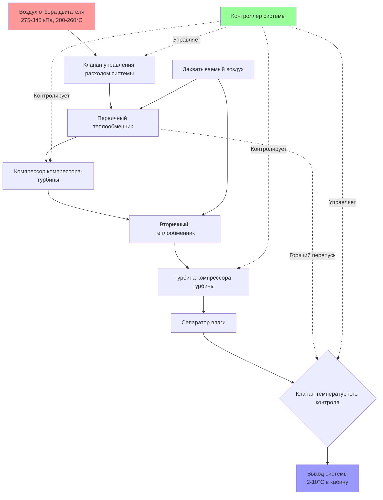
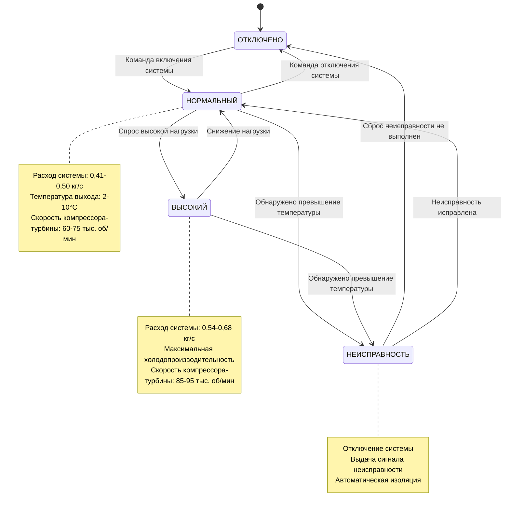

Эксплуатация авиационной системы кондиционирования воздуха включает точный термодинамический контроль процесса воздушного цикла охлаждения для подачи кондиционированного воздуха в широком диапазоне условий полета. Контроллер системы управляет несколькими взаимозависимыми переменными, включая давление воздуха отбора двигателя, эффективность теплообменников, коэффициент расширения турбины и удаление влаги для поддержания комфорта в кабине при предотвращении образования льда и обеспечении защиты системы. Понимание режимов работы системы и стратегий управления необходимо для оптимизации системы, устранения неисправностей и анализа производительности.

## Анализ эксплуатационного цикла

Полный цикл работы системы кондиционирования воздуха преобразует воздух высокого давления отбора двигателя в кондиционированный воздух подачи в кабину посредством серии термодинамических процессов, регулируемых фундаментальными газовыми законами и принципами теплопередачи.

### Полный термодинамический процесс

Система кондиционирования воздуха выполняет следующую последовательность процессов во время нормальной эксплуатации:

**Этап 1: Кондиционирование воздуха отбора двигателя**
- Воздух высокого давления отбора (275-345 кПа, 200-260°C) из ступеней компрессора двигателя
- Регулирование расхода через клапан управления расходом системы (FCV)
- Снижение давления через отверстие или управляющий клапан для оптимизации условий входа компрессора-турбины
- Температура остается повышенной из-за дросселирования

**Этап 2: Первичное отклонение тепла**
- Горячий воздух отбора двигателя поступает в первичный теплообменник (PHX)
- Воздух захвата или охлаждаемый вентилятором воздух обеспечивает теплоприемник
- Эффективность обычно 60-75% в зависимости от условий захвата воздуха
- Температура снижена до 65-120°C в зависимости от режима полета

**Этап 3: Сжатие (бутстраповый цикл)**
- Предварительно охлажденный воздух поступает в компрессор компрессора-турбины
- Коэффициент давления 1,8-2,2:1 увеличивает давление и температуру воздуха
- Работа сжатия обеспечивается турбиной через общий вал
- Изэнтропический КПД 75-85% для современных компрессоров-турбин

Соотношение работы компрессора:

$$W_c = \dot{m} \cdot c_p \cdot (T_{c,out} - T_{c,in})$$

Где температура на выходе компрессора для изэнтропического сжатия:

$$T_{c,out} = T_{c,in} \cdot \left(\frac{P_{c,out}}{P_{c,in}}\right)^{\frac{\gamma-1}{\gamma}} \cdot \frac{1}{\eta_c}$$

**Этап 4: Вторичное отклонение тепла**
- Сжатый воздух (теперь 120-175°C) поступает во вторичный теплообменник
- Дополнительное отклонение тепла в поток воздуха захвата
- Критично для достижения подледниковых температур на входе турбины
- Температура на выходе 35-80°C в зависимости от условий

**Этап 5: Расширение турбины**
- Воздух высокого давления расширяется через колесо турбины
- Коэффициент давления 2,5-3,5:1 преобразует тепловую энергию в работу вала
- Температура резко падает из-за расширения охлаждения
- Изэнтропический КПД турбины 80-90%

Процесс расширения следует:

$$T_{t,out} = T_{t,in} \cdot \left[1 - \eta_t \cdot \left(1 - \left(\frac{P_{t,out}}{P_{t,in}}\right)^{\frac{\gamma-1}{\gamma}}\right)\right]$$

**Этап 6: Разделение влаги**
- Воздух на выходе турбины (2-10°C) поступает в высокоэффективный сепаратор влаги
- Центробежные и коалесцирующие силы извлекают конденсированную влагу
- Предотвращает образование льда в распределительных воздуховодах
- Система удаления воды удаляет собранную жидкость

**Этап 7: Обрезка температуры и смешивание**
- Холодный воздух турбины может смешиваться с горячим перепускаемым воздухом через клапан температурного контроля
- Обеспечивает точный контроль температуры на выходе независимо от производительности системы
- Предотвращает чрезмерное охлаждение и риски образования льда
- Окончательная температура на выходе системы подается в смесительный коллектор

### Энергетический баланс и коэффициент производительности

Эффективность термодинамической системы может быть выражена как коэффициент производительности (COP), сравнивающий эффект охлаждения с входной энергией:

$$COP_{pack} = \frac{Q_{cooling}}{\Delta h_{bleed}}$$

Где эффект охлаждения представляет снижение энтальпии от воздуха отбора до выхода системы, а входная энергия — энтальпия воздуха, извлеченного из двигателя. Типичные значения COP авиационной системы кондиционирования варьируются от 0,5 до 0,8, что значительно ниже, чем парокомпрессионные системы, но приемлемо с учетом ограничений авиационной эксплуатации.

Полная холодопроизводительность:

$$Q_{total} = \dot{m}_{pack} \cdot c_p \cdot (T_{bleed} - T_{pack,out})$$

Для типичной системы узкофюзеляжного летательного аппарата с расходом 0,45 кг/с, температурой воздуха отбора 232°C и температурой на выходе системы 7°C, холодопроизводительность равна примерно 109 кВт на одну систему.

## Режимы управления системой и стратегии

Современные контроллеры системы реализуют сложные алгоритмы управления для оптимизации производительности в диапазоне полетного режима при обеспечении защиты системы и комфорта пассажиров.

### Режимы управления расходом

Управление расходом системы представляет основной метод модуляции производительности, регулирующий массовый расход воздуха, обрабатываемого системой.

| Режим расхода | Типичный расход | Применение | Влияние на отбор |
|-----------|------------------|-------------|--------------|
| ОТКЛЮЧЕНО | 0 кг/с | Отключение системы, запуск ВСУ | Нулевой отбор воздуха |
| НИЗКИЙ | 0,27-0,36 кг/с | Легкая нагрузка пассажиров, холодная наружная температура | Минимальное влияние на производительность двигателя |
| НОРМАЛЬНЫЙ | 0,41-0,50 кг/с | Стандартная эксплуатация | Нормальный отбор воздуха |
| ВЫСОКИЙ | 0,54-0,68 кг/с | Высокая нагрузка, горячая наружная температура, одна система | Максимальный отбор воздуха |

Управление расходом достигается путем позиционирования клапана управления расходом системы, который модулирует перепад давления перед системой для управления массовым расходом. Соотношение между перепадом давления и расходом следует:

$$\dot{m} = C_d \cdot A \cdot \sqrt{\rho \cdot \Delta P}$$

Где $C_d$ — коэффициент расхода, $A$ — площадь потока, $\rho$ — плотность воздуха и $\Delta P$ — перепад давления на управляющем клапане.

### Стратегии управления температурой

Управление температурой на выходе системы использует несколько управляющих контуров для поддержания требуемой температуры выхода несмотря на изменяющиеся условия окружающей среды и нагрузки системы.

**Основной управляющий контур:**
- Контролирует датчик температуры на выходе системы
- Сравнивает с сигналом спроса температуры (обычно 2-10°C)
- Модулирует двери захвата воздуха или клапан температурного контроля
- Время отклика 2-5 секунд для типичных возмущений

**Управление перепускаемым смешиванием:**
Клапан температурного контроля (TCV) смешивает горячий перепускаемый воздух с холодным выходом турбины для достижения точного контроля температуры:

$$T_{pack,out} = T_{turbine} \cdot (1 - x) + T_{bypass} \cdot x$$

Где $x$ представляет долю перепуска (0-0,3 типичный диапазон). Это позволяет независимо управлять температурой системы от холодопроизводительности, обеспечивая эксплуатацию при максимальной холодопроизводительности при подаче более теплого воздуха при необходимости.

**Модуляция захвата воздуха:**
Альтернативный метод управления изменяет эффективность теплообменника посредством управления расходом захватываемого воздуха:
- Двери захвата модулируют от полностью закрытого до полностью открытого
- Сниженный расход захватываемого воздуха снижает отклонение тепла
- Увеличивает температуру на входе турбины, снижая эффект охлаждения
- Обычно на старых конструкциях летательных аппаратов

### Управление скоростью компрессора-турбины

Скорость вала турбины представляет ключевую переменную производительности, управляемую посредством регулирования давления на входе и управления нагрузкой.

**Параметры управления скоростью:**

| Условие | Типичная скорость компрессора-турбины | Управляющее действие |
|-----------|------------------|----------------|
| Наземная эксплуатация, высокая наружная температура | 85000-95000 об/мин | Максимальный спрос охлаждения |
| Крейсерский полет, умеренная нагрузка | 60000-75000 об/мин | Нормальная эксплуатация |
| Снижение, низкая нагрузка | 45000-60000 об/мин | Сниженный спрос охлаждения |
| Режим защиты от льда | Переменная | Предотвращение подледниковой температуры на выходе турбины |

Более высокие скорости компрессора-турбины увеличивают как коэффициент давления компрессора, так и коэффициент расширения турбины, повышая холодопроизводительность. Скорость управляется путем регулирования давления на входе системы через клапан управления расходом и через давление на входе турбины через перепускные клапаны теплообменников на некоторых системах.

Центробежное напряжение на компонентах компрессора-турбины увеличивается с квадратом скорости:

$$\sigma = \rho \cdot \omega^2 \cdot r^2$$

Это ограничивает максимальные рабочие скорости и требует тщательного контроля скорости для предотвращения условий избыточной скорости, которые могут вызвать механический отказ.

## Логика защиты системы

Контроллеры системы реализуют несколько схем защиты для предотвращения повреждения от выходящих за пределы условий при поддержании максимальной эксплуатационной готовности.

### Защита от превышения температуры

**Превышение температуры на выходе компрессора:**
- Лимит: 200-205°C (варьируется в зависимости от типа летательного аппарата)
- Причина: Чрезмерная температура воздуха отбора, недостаточное охлаждение захватываемым воздухом
- Реакция: Система автоматически отключается, выдается сигнал неисправности
- Восстановление: Автоматический перезапуск после нормализации температуры

**Пределы температуры на выходе турбины:**
- Верхний лимит: 24-29°C (предотвращение образования льда)
- Нижний лимит: -12 до 0°C (риск чрезмерного охлаждения, блокирования льдом)
- Реакция: Модуляция TCV, регулирование двери захвата воздуха
- Если лимиты не могут быть поддержаны: Снижение расхода системы или отключение

**Превышение температуры воздуховода:**
- Лимит: 107-121°C в распределительных воздуховодах
- Указывает на отказ управляющего клапана или утечку горячего воздуха
- Триггер: Отключение системы и оповещение датчика обнаружения пожара

### Защита от давления

**Защита от помпажа компрессора:**
Помпаж компрессора происходит при превышении коэффициента давления пределов стабильного функционирования компрессора, вызывая изменение направления потока и механическую вибрацию. Защита включает:
- Регулирование давления на входе для поддержания рабочей точки
- Перепускные клапаны компрессора на некоторых конструкциях
- Автоматическое снижение расхода при обнаружении помпажа

**Защита от превышения давления:**
- Предохранительные клапаны системы защищают от чрезмерного роста давления
- Обычно установлены на 10-15% выше нормального максимального рабочего давления
- Предотвращает структурные повреждения компонентов системы и воздуховодов

### Предотвращение образования льда

Лед может образовываться в нескольких местах в системе при падении температуры воздуха ниже точки замерзания при наличии влаги:

**Блокирование льдом сепаратора влаги:**
- Наиболее распространенное место образования льда
- Происходит при температуре на выходе турбины <0°C с высокой влажностью
- Предотвращение: Поддерживание температуры на выходе турбины >2°C через TCV
- Некоторые системы используют подогреватели сепаратора влаги

**Обледенение теплообменника:**
- Может происходить на стороне захватываемого воздуха во время наземной эксплуатации
- Снижает эффективность теплопередачи
- Предотвращение: Позиционирование двери захвата, циклирование системы

**Накопление льда в конденсаторе:**
Системы с конденсирующими теплообменниками требуют:
- Периодических циклов разморозки
- Температурного циклирования для предотвращения накопления инея
- Защита дренажной системы от замерзания

## Операционные диаграммы

## Оптимизация производительности в диапазоне полетного режима

Требования производительности системы значительно варьируются в различных этапах полета, требуя адаптивных стратегий управления.

### Наземная эксплуатация

**Проблемы:**
- Высокие температуры окружающей среды (до 52°C)
- Нулевая или низкая скорость захватываемого воздуха
- Ограничения воздуха отбора ВСУ (более низкие давление/температура, чем отбор двигателя)
- Максимальная тепловая нагрузка пассажиров во время посадки

**Стратегии оптимизации:**
- Эксплуатация обеих систем в режиме ВЫСОКИЙ расход
- Максимизация скорости вентилятора захватываемого воздуха (трех-колесный, четырех-колесный компрессор-турбина)
- Позиционирование летательного аппарата для максимизации естественного ветрового воздействия на входные отверстия захватываемого воздуха
- Предварительное охлаждение кабины перед посадкой в экстремальную жару

### Взлет и набор высоты

**Характеристики:**
- Высокая доступность воздуха отбора двигателя на высокой мощности
- Увеличивающаяся скорость захватываемого воздуха повышает производительность теплообменника
- Снижение высоты кабины требует максимального расхода системы
- Приоритет производительности двигателя может ограничить отбор воздуха

**Подход управления:**
- Системы обычно в режиме НОРМАЛЬНЫЙ или ВЫСОКИЙ расход
- Автоматическое отключение системы при отказе двигателя для восстановления производительности
- Прогрессивное улучшение холодопроизводительности по мере увеличения скорости полета

### Крейсерский полет

**Условия:**
- Стабильная температура окружающей среды (-40 до -65°C на высоте)
- Максимальная эффективность теплообменника благодаря скорости полета
- Сниженная нагрузка в кабине после первоначального охлаждения
- Оптимальный регион эффективности системы

**Оптимизация:**
- Системы эксплуатируются в режиме НОРМАЛЬНЫЙ расход
- Минимальный перепуск TCV требуется благодаря холодной окружающей среде
- Наиболее низкий уровень отбора воздуха, минимальное влияние на производительность двигателя
- Некоторые системы снижаются до эксплуатации одной системы для экономии топлива

### Снижение и посадка

**Соображения:**
- Увеличивающаяся температура окружающей среды по мере снижения высоты
- Потенциальные быстрые изменения давления в кабине
- Снижающаяся скорость полета снижает эффективность захватываемого воздуха
- Необходимость поддержания комфортной температуры в кабине

**Стратегия управления:**
- Прогрессивная регулировка TCV для потепления окружающей среды
- Поддержание достаточного расхода системы для управления давлением в кабине
- Подготовка к наземной эксплуатации путем увеличения расхода при необходимости

## Интеграция с системой управления полетом

Продвинутые летательные аппараты интегрируют управление системой с системой управления полетом (FMS) для оптимизированной производительности:

**Автоматическое управление нагрузкой:**
- FMS передает информацию о количестве пассажиров, грузе и продолжительности полета
- Контроллер системы регулирует режим расхода и температуру на основе прогнозируемых нагрузок
- Снижает ненужную эксплуатацию системы при легких нагрузках

**Оптимизация топлива:**
- Отбор воздуха снижает эффективность двигателя
- FMS рассчитывает оптимальное расписание системы для минимального расхода топлива
- Может рекомендовать эксплуатацию одной системы во время крейсерского полета, когда приемлемо

**Прогнозирующее управление:**
- Данные о погоде обеспечивают предварительное уведомление об изменениях температуры окружающей среды
- Контроллер системы предварительно регулирует настройки для плавных переходов
- Предотвращает дискомфорт пассажиров от быстрых изменений температуры

## Устранение неисправностей операционных проблем системы

Распространенные операционные проблемы и подходы к диагностике:

| Симптом | Вероятная причина | Диагностическое действие |
|---------|----------------|-------------------|
| Недостаточная холодопроизводительность | Ограниченный поток захватываемого воздуха, загрязнение теплообменника | Проверка входных/выходных отверстий захватываемого воздуха, измерение перепадов давления |
| Чрезмерное циклирование температуры в кабине | Охота TCV, отказ датчика температуры | Мониторинг позиции TCV, проверка калибровки датчика |
| Спроектированные отключения компрессора-турбины по превышению температуры | Недостаточное охлаждение теплообменником, высокая температура воздуха отбора | Проверка системы захватываемого воздуха, проверка эксплуатации предварительного охладителя отбора |
| Образование льда в сепараторе влаги | Температура на выходе турбины слишком низкая | Проверка эксплуатации TCV, контроль логики защиты от льда |
| Высокий шум подшипника компрессора-турбины | Износ подшипника, недостаточная смазка | Анализ вибрации, проверка количества и качества масла |
| Системе не удается поддерживать расход | Неисправность FCV, блокирование перед системой | Проверка работы клапана, проверка давления подачи воздуха отбора |

Эффективное устранение неисправностей системы требует понимания взаимозависимостей между подачей воздуха отбора, производительностью теплообменника, термодинамической эксплуатацией компрессора-турбины и логикой управляющей системы. Деградация производительности часто является результатом кумулятивных эффектов обрастания теплообменника, износа компонентов и детериорации уплотнений, а не отказов отдельных точек.

Эксплуатация авиационной системы кондиционирования воздуха представляет практическое применение термодинамики газовой турбины для экологического управления, требующее точного управления процессами сжатия, отклонения тепла, расширения и удаления влаги для обеспечения надежного кондиционирования кабины в экстремальных условиях эксплуатации от арктического холода до пустынной жары.
