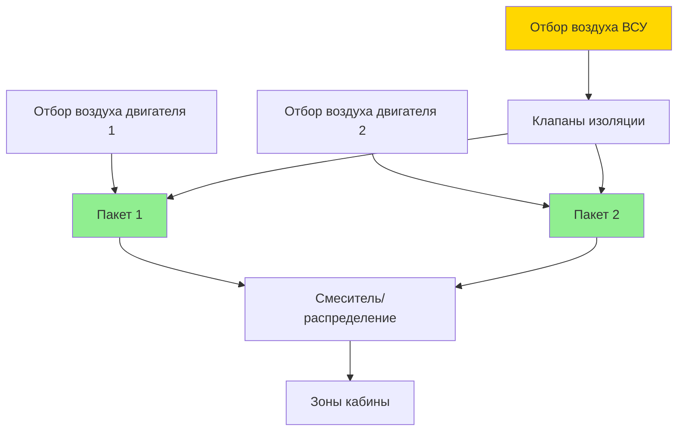
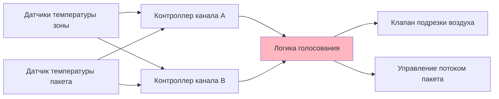

Пакеты кондиционирования воздуха воздушных судов работают в критически важной с точки зрения безопасности среде, где доступность системы напрямую влияет на операции полетов, комфорт пассажиров и соответствие нормативным требованиям. Архитектуры избыточности и принципы инженерии надежности обеспечивают непрерывный экологический контроль при различных сценариях отказов.

## Архитектуры избыточности

Коммерческие воздушные суда обычно используют несколько пакетов кондиционирования воздуха для обеспечения отказоустойчивости и поддержания герметизации кабины при отказах по одной точке отказа.

### Двухпакетная конфигурация

Стандартная конфигурация двигуньевых воздушных судов:

| Пакет | Источник отбора воздуха | Нормальная мощность | Мощность при чрезвычайной ситуации |
|-------|------------------------|-------------------|----------------------------------|
| Пакет 1 | Двигатель 1 | 50% нагрузка кабины | 100% существенные зоны |
| Пакет 2 | Двигатель 2 | 50% нагрузка кабины | 100% существенные зоны |
| ВСУ | Вспомогательный | Земля/резервный | 70% нагрузка кабины |

Каждый пакет рассчитан на 100% мощность кабины при одиночной работе пакета, с пониженной вместимостью пассажиров или ограничениями высоты полета.

### Трехпакетная конфигурация

Широкофюзеляжные воздушные суда с повышенной избыточностью:

- Три независимых пакета, обслуживающих зоны кабины
- Любые два пакета обеспечивают полное кондиционирование кабины
- Одиночная работа пакета ограничивает высоту полета и загрузку пассажиров
- Перекрестное соединение между всеми двигателями и ВСУ

## Анализ надежности

### Среднее время между отказами (MTBF)

Цели надежности пакета кондиционирования воздуха:

$$MTBF = \frac{\text{Общее время эксплуатации (ч)}}{\text{Количество отказов}}$$

Типичное MTBF пакета коммерческого воздушного судна: 8000–12000 полетных часов.

### Доступность системы

Для двухпакетной конфигурации с независимыми режимами отказа:

$$A_{system} = 1 - (1 - A_{pack})^2$$

Где $A_{pack}$ представляет доступность отдельного пакета (обычно 0,995–0,999).

Для $A_{pack} = 0,998$:

$$A_{system} = 1 - (1 - 0,998)^2 = 1 - 0,000004 = 0,999996$$

Это соответствует 99,9996% доступности системы, что соответствует нормативным требованиям для надежности допуска к полетам.

## Режимы отказов и их влияние

### Отказы на уровне компонентов

| Компонент | Режим отказа | Влияние на пакет | Влияние на систему |
|-----------|--------------|------------------|-------------------|
| Первичный теплообменник | Утечка в трубке | Сниженная мощность охлаждения | Одиночная работа пакета |
| Компрессор | Заклинивание подшипника | Полный отказ пакета | Немедленное переключение |
| Турбина | Повреждение ОЧ | Сниженная эффективность | Постепенная деградация |
| Клапан регулирования температуры | Застревание закрыто | Отсутствие модуляции температуры | Фиксированный выход холодного воздуха |
| Дверь входного отверстия для воздуха торможения | Заклинивание закрыто | Недостаточное охлаждение на земле | Работа от ВСУ пакета |

### Работа в режиме деградации

Производительность пакета при частичных отказах:

$$Q_{degrade} = Q_{nominal} \times \eta_{degradation}$$

Где $\eta_{degradation}$ изменяется от 0,3 до 0,8 в зависимости от серьезности отказа.

## Руководство по отклонениям от минимального комплекта оборудования

Положения списка минимально необходимого оборудования (MEL) для отказов пакета кондиционирования воздуха:

### Воздушные суда категории A (>180 пассажиров)

- **Оба пакета работают**: Нормальная эксплуатация, без ограничений
- **Один пакет неработоспособен**: Максимальная высота 7600 м, снижение загрузки пассажиров 30%
- **Оба пакета неработоспособны**: Только операции на земле, 30-минутный лимит

### Воздушные суда категории B (100–180 пассажиров)

- **Одиночная работа пакета**: Максимальная высота 9450 м, снижение загрузки пассажиров 20%
- **Ограничения по времени**: 10-дневное расширение для ремонта пакета

### Соображения ETOPS

Двигуневые операции дальнего радиуса действия требуют повышенной надежности:

- Оба пакета должны быть работоспособны для допуска к полетам ETOPS
- Нет льготы MEL для отказов пакетов при полетах ETOPS
- Подтвержденная надежность допуска >99,5% за 12-месячный период

## Резервные системы управления

### Двухканальная архитектура

Управление температурой использует резервное зондирование и приведение в действие:

Логика голосования использует выбор медианы для отклонения отказов одного датчика.

### Мониторинг между каналами

Непрерывное сравнение выходов каналов:

$$\Delta T_{channels} = |T_{channel A} - T_{channel B}|$$

Если $\Delta T_{channels} > 2,8°C$ в течение >30 секунд, возникает сигнал о неисправности с автоматическим переключением на исправный канал.

## Мониторинг при техническом обслуживании

### Системы мониторинга состояния и использования (HUMS)

Отслеживание производительности пакета в реальном времени:

- Отклонение температуры выхода от уставки
- Тренды давления на выходе компрессора
- Мониторинг температуры на входе турбины
- Отклонения расхода

### Триггеры предиктивного обслуживания

| Параметр | Нормальный диапазон | Пороговое значение осторожности | Требуемое действие |
|----------|-------------------|-------------------------------|-------------------|
| Температура выхода | ±1,7°C от уставки | ±3,3°C от уставки | Проверка калибровки |
| Коэффициент давления компрессора | 2,8–3,2 | <2,5 или >3,5 | Проверка компрессора |
| Эффективность турбины | >80% | <75% | Капитальный ремонт турбины |
| Эффективность теплообменника | >85% | <80% | Очистка или замена |

## Операционные соображения

### Ограничения одиночной работы пакета

Физические ограничения в условиях деградации:

$$\dot{m}_{required} = \frac{Q_{cabin}}{c_p (T_{supply} - T_{cabin})}$$

При неработоспособности одного пакета, сниженный массовый расход требует либо:
- Сниженной вместимости кабины (сниженная $Q_{cabin}$)
- Сниженной высоты полета (большая плотность отбираемого воздуха)
- Более высокой температуры подачи (сниженный комфорт)

### Избыточность охлаждения на земле

Пакет ВСУ обеспечивает резервный вариант для операций на земле:

- Мощность: 70–80% от пакета с приводом двигателя
- Время отклика: 90 секунд от запуска ВСУ
- Автоматическое переключение при отказе пакета двигателя

## Техническое обслуживание, ориентированное на надежность

### Мониторинг по состоянию

Компоненты пакета переходят от регулярной замены к техническому обслуживанию на основе состояния:

- Постоянный мониторинг вибрации выявляет деградацию подшипников
- Анализ качества масла предсказывает отказы системы смазки
- Тренды производительности выявляют постепенную потерю эффективности

Этот подход снижает ненужное техническое обслуживание, улучшая при этом надежность допуска к полетам благодаря раннему обнаружению аномалий.

## Требования сертификации

FAR 25.831 требует надежности системы экологического контроля:

- Двойные независимые системы для герметичных воздушных судов
- Любой одиночный отказ не должен препятствовать продолжению безопасного полета
- Подтвержденная надежность благодаря обширному испытанию в полете
- Руководства по отклонениям от минимального комплекта оборудования, одобренные нормативными органами

Архитектуры избыточности пакетов и прочная инженерия надежности гарантируют, что системы кондиционирования воздуха воздушных судов поддерживают комфорт и безопасность пассажиров во всех операционных сценариях, от обычных полетов до операций дальнего радиуса действия над отдаленными районами.
