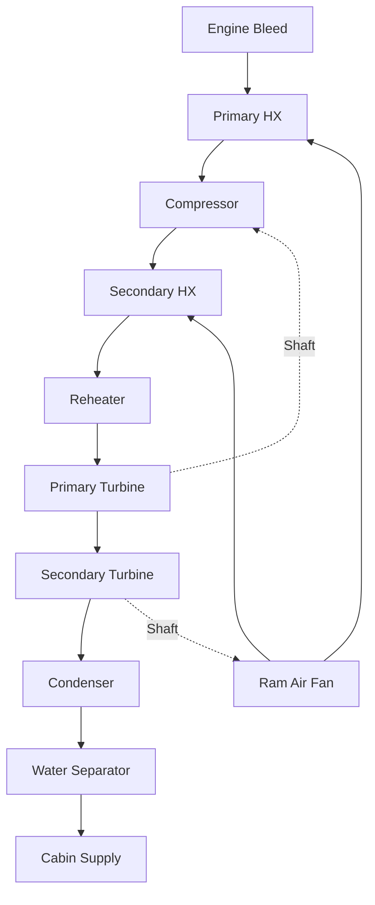

## Фундаментальные принципы работы

Системы воздушного цикла доминируют в системах экологического контроля летательных аппаратов благодаря их высокой надёжности, лёгкой конструкции и отсутствию воспламеняющихся хладагентов. Эти системы работают по обратному циклу Брэйтона, используя воздух в качестве рабочей жидкости и достигая охлаждения за счёт расширения в турбине.

Фундаментальный механизм охлаждения основан на снижении температуры, которое происходит при расширении сжатого воздуха через турбину. В отличие от систем парокомпрессионного охлаждения, машины воздушного цикла (ACM) поддерживают рабочую жидкость в газообразном состоянии на протяжении всего цикла, что упрощает конструкцию системы и повышает безопасность в авиационных приложениях.

### Термодинамическое основание

Процесс изотропического расширения в турбине следует соотношению:

$$
\frac{T_2}{T_1} = \left(\frac{P_2}{P_1}\right)^{\frac{\gamma-1}{\gamma}}
$$

где T₁ и P₁ представляют условия на входе, T₂ и P₂ представляют условия на выходе, а γ — отношение удельных теплоёмкостей для воздуха (1,4).

Фактическое расширение учитывает эффективность турбины:

$$
T_2 = T_1 - \eta_t(T_1 - T_{2s})
$$

где η_t — изотропическая эффективность турбины (обычно 0,75–0,85) и T₂ₛ — температура выхода при изотропическом процессе.

## Конфигурация цикла с бутстреп

Цикл с бутстреп представляет собой наиболее распространённую систему воздушного цикла летательного аппарата, включающую две ступени компрессора и одну турбину. Эта конфигурация достигает превосходной производительности охлаждения благодаря извлечению работы из турбины для привода вспомогательного компрессора.

### Анализ цикла с бутстреп

Коэффициент производительности для цикла с бутстреп:

$$
COP = \frac{h_5 - h_6}{(h_3 - h_2) - (h_4 - h_5)}
$$

где индексы соответствуют точкам состояния по всему циклу. Компрессор бутстреп повышает давление после первоначального отвода тепла, что позволяет произвести второй теплообмен, значительно улучшающий производительность охлаждения.

Чистый эффект охлаждения:

$$
Q_{cooling} = \dot{m}_{air}(h_1 - h_6) - W_{fan}
$$

Эта конфигурация обычно достигает температур на выходе от −20 °C до 5 °C из воздуха отбора при 200–250 °C.

## Простая система воздушного цикла

Простой цикл представляет собой самую базовую конфигурацию, состоящую из одного теплообменника, за которым следует расширение в турбине. Хотя менее эффективна, чем системы с бутстреп, простые циклы обеспечивают преимущества по весу и механической простоте для меньших летательных аппаратов.

### Характеристики производительности

| Параметр | Простой цикл | Цикл с бутстреп | Трёхколёсная |
|-----------|-------------|-----------------|-------------|
| COP охлаждения | 0,3–0,5 | 0,5–0,8 | 0,7–1,0 |
| Температура выхода | 0–15 °C | −20–5 °C | −30–0 °C |
| Вес (кг/кВт) | 2,3–3,4 | 3,4–5,1 | 5,1–7,1 |
| Сложность | Низкая | Средняя | Высокая |
| Типичное применение | Региональные самолёты | Узкофюзеляжные | Широкофюзеляжные |

Производительность охлаждения простого цикла:

$$
Q_{simple} = \dot{m}_{air} c_p (T_{in} - T_{out})
$$

где перепад температуры в основном зависит от коэффициента расширения и эффективности теплообменника.

## Трёхколёсная машина воздушного цикла

Передовые трёхколёсные системы включают дополнительную турбину, приводящую в действие специальный охлаждающий вентилятор, что максимизирует производительность теплообменника на низких скоростях летательного аппарата. Эта конфигурация обеспечивает превосходное охлаждение на земле, когда воздушного потока недостаточно.

### Передовые показатели производительности

Трёхколёсная система достигает улучшенного осушения воздуха благодаря контролируемой конденсации. Скорость удаления влаги:

$$
\dot{m}_{condensate} = \dot{m}_{air}(\omega_1 - \omega_2)
$$

где ω представляет отношение влажности на входе (1) и выходе (2).

## Эффективность теплообменника

Производительность теплообменника критически влияет на эффективность системы воздушного цикла. Параметр эффективности:

$$
\varepsilon = \frac{T_{air,in} - T_{air,out}}{T_{air,in} - T_{ram,in}}
$$

Современные теплообменники летательных аппаратов достигают значений эффективности 0,85–0,95, используя конструкцию с пластинчатым оребрением из алюминиевых сплавов. Метод числа единиц передачи (NTU) прогнозирует производительность:

$$
\varepsilon = 1 - \exp\left[\frac{NTU^{0.22}}{C_r}\left(\exp(-C_r \cdot NTU^{0.78}) - 1\right)\right]
$$

для перекрёстно-точечных конфигураций с обоими потоками несмешиваемыми, где C_r — отношение тепловой ёмкости.

## Проектирование блока турбина-компрессор

Механический дизайн блока турбина-компрессор (TCU) определяет надёжность и эффективность системы. Частоты вращения варьируются от 40 000 до 80 000 об/мин, требуя прецизионных воздушных подшипников и динамической балансировки.

### Извлечение работы турбиной

Удельная работа, извлекаемая турбиной:

$$
w_t = c_p T_1 \left[1 - \left(\frac{P_2}{P_1}\right)^{\frac{\gamma-1}{\gamma}}\right] \eta_t
$$

Эта работа непосредственно приводит в действие компрессор бутстреп, с избыточной ёмкостью, поглощаемой генератором переменного тока или рассеиваемой через потери в системе.

## Требования к разделению воды

Охлаждение воздуха ниже точки росы производит жидкую воду, которая должна быть удалена перед распределением в кабину. Стандарт ASHRAE 161 (Качество воздуха внутри коммерческих летательных аппаратов) требует эффективного разделения влаги для предотвращения образования льда и поддержания комфорта.

Скорость образования конденсата зависит от психрометрических условий:

$$
\dot{m}_{water} = \dot{m}_{air} \frac{(h_{vapor,in} - h_{vapor,out})}{h_{fg}}
$$

Центрифугальные разделители воды достигают эффективности удаления 95–99 % благодаря высокоскоростному вращению (10 000–15 000 об/мин).

## Рассмотрение производительности на высоте

Производительность системы воздушного цикла варьируется в зависимости от высоты полёта из-за изменения условий воздуха отбора и доступности воздушного потока. На крейсерской высоте (10 600–13 100 м), сниженная плотность окружающей среды снижает производительность теплообменника на 40–60 % по сравнению с уровнем моря.

Коэффициент коррекции высоты для производительности охлаждения:

$$
Q_{altitude} = Q_{sea\_level} \left(\frac{\rho_{altitude}}{\rho_{sea\_level}}\right)^{0.8}
$$

Это требует увеличения воздушного потока отбора на высоте, снижая эффективность двигателя на 2–5 % во время полёта на крейсерской высоте.

## Сравнение с системами парокомпрессионного цикла

| Характеристика | Воздушный цикл | Парокомпрессионный цикл |
|----------------|-----------|-------------|
| Рабочая жидкость | Воздух | R-134a, R-1234yf |
| Рабочее давление | 138–345 кПа | 1034–2413 кПа |
| COP | 0,3–1,0 | 2,0–4,0 |
| Вес/Производительность | Высокий | Низкий |
| Риск воспламеняемости | Отсутствует | Низкий–средний |
| Интервал техническогообслуживания | 5000 ч | 2000 ч |
| Чувствительность к высоте | Высокая | Низкая |

Системы воздушного цикла принимают более низкую эффективность в обмен на безопасность, надёжность и преимущества по весу, критичные в авиационных приложениях.

## Интеграция с системами отбора воздуха

Машины воздушного цикла получают сжатый воздух из ступеней компрессора двигателя при 200–450 °C и 207–345 кПа. Отбор воздуха снижает тягу двигателя на 1–3 % и удельный расход топлива на 0,5–1,5 %.

Современные системы без отбора воздуха с использованием электрических компрессоров исключают этот штраф, но увеличивают вес электрической системы и сложность. Выбор зависит от размера летательного аппарата, дальности полёта и требований профиля выполняемой задачи
