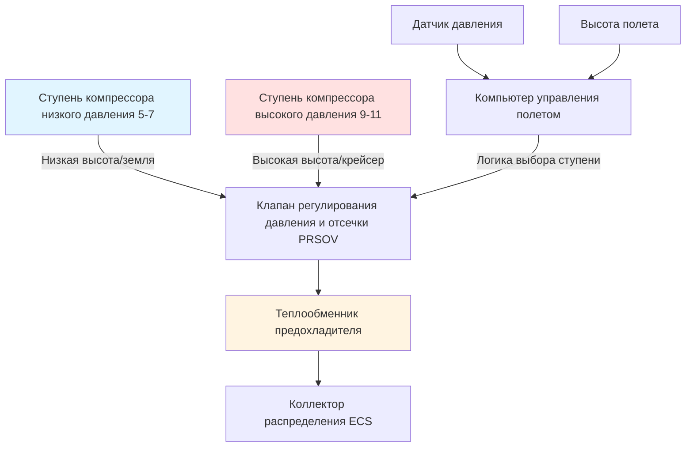

## Интеграция отбора воздуха с системами управления окружающей средой

Системы управления окружающей средой (ECS) летательных аппаратов, использующие отбор воздуха от двигателя, извлекают пневматическую энергию из ступеней компрессора газотурбинного двигателя для привода машин цикла воздуха, обеспечения герметизации кабины и подачи кондиционированного воздуха. Эта интеграция представляет фундаментальную связь между термодинамикой силовой установки и требованиями управления окружающей средой, требующую тщательного баланса производительности двигателя, эффективности системы и эксплуатационных ограничений.

Система отбора воздуха служит основным источником энергии для традиционных ECS летательных аппаратов, подавляя высокое давление, высокотемпературный воздух, который подвергается термодинамическому кондиционированию перед поступлением в цикл загрузки машины цикла воздуха. Проектирование системы должно обеспечивать экстремальные колебания в условиях окружающей среды, этапах полета и режимах работы двигателя при сохранении запасов безопасности и долговечности компонентов.

## Термодинамика извлечения воздуха из ступеней компрессора

### Выбор ступени и доступность давления

Извлечение отбора воздуха происходит на определенных ступенях компрессора, определяемых требованиями к давлению, ограничениями температуры и пределами работоспособности двигателя. Распределение коэффициента давления компрессора по ступеням подчиняется следующему:

$$P_n = P_{inlet} \times \pi_{overall}^{(n/N)}$$

Где:
- $P_n$ = давление на ступени $n$
- $P_{inlet}$ = давление на входе компрессора (варьируется с высотой)
- $\pi_{overall}$ = коэффициент общего давления компрессора (25:1 до 40:1)
- $n$ = номер ступени компрессора
- $N$ = общее количество ступеней компрессора

Для типичного высокообойного турбовентилятора с $\pi_{overall}$ = 30:1 и $N$ = 14 ступеней, 9-я ступень обеспечивает коэффициент давления приблизительно 6,5:1 относительно условий на входе. На крейсерской высоте (10668 м, $P_{ambient}$ = 23,8 кПа), это дает:

$$P_{bleed,stage9} = 23,8 \times 6,5 = 154,7 \text{ кПа (53,7 кПа изб.)}$$

Это давление оказывается недостаточным для требований ECS, что требует извлечения из более высоких ступеней или систем отбора воздуха с двойной ступенью, которые переключают точки извлечения в зависимости от этапа полета.

### Повышение температуры при сжатии

Температура ступени компрессора подчиняется отношениям изэнтропического сжатия с поправками эффективности:

$$T_{n} = T_{inlet} \times \left[1 + \frac{1}{\eta_{c}} \left(\pi_{n}^{(\gamma-1)/\gamma} - 1\right)\right]$$

Где:
- $\eta_{c}$ = политропная эффективность компрессора (0,85-0,92)
- $\gamma$ = коэффициент удельной теплоты для воздуха (1,4)
- $\pi_{n}$ = коэффициент давления на ступени $n$

Для извлечения из 9-й ступени на крейсерской высоте с $T_{inlet}$ = -56,5°C и $\pi_{9}$ = 6,5:

$$T_{9} = 216,65 \times \left[1 + \frac{1}{0,88} \left(6,5^{0,286} - 1\right)\right] = 403 \text{ K (130°C)}$$

Эта температура превышает предельные значения материалов для последующих трубопроводов и компонентов ECS, требуя немедленного отвода тепла через теплообменники предохладителя.

### Архитектура отбора воздуха с двойной ступенью

Современные летательные аппараты используют извлечение с двойной ступенью для оптимизации доступности давления по диапазону полета:

Логика выбора ступени переключает точки извлечения на основе:

| Этап полета | Ступень извлечения | Давление (кПа изб.) | Температура (°C) | Обоснование |
|--------------|------------------|-----------------|-------------------|-----------|
| Земля/взлет | Ступень НД 5-7 | 310-450 | 175-230 | Высокое давление окружающей среды, нижняя ступень достаточна |
| Набор высоты | Переход | 240-380 | 150-200 | Постепенный переход для поддержания давления |
| Крейсер | Ступень ВД 9-11 | 240-345 | 200-260 | Низкое давление окружающей среды требует более высокую ступень |
| Снижение | Переход | 275-415 | 175-230 | Возврат к ступени НД при увеличении давления окружающей среды |

## Проектирование теплообменника предохладителя

### Требования к теплопередаче

Предохладитель (основной теплообменник) снижает температуру отбираемого воздуха с 200-260°C до 90-120°C перед поступлением в машину цикла воздуха. Производительность отвода тепла должна соответствовать максимальным условиям расхода отбираемого воздуха:

$$\dot{Q}_{precooler} = \dot{m}_{bleed} \times c_{p,air} \times (T_{bleed,in} - T_{bleed,out})$$

Для типичного пакета широкофюзеляжного летательного аппарата при максимальном спросе на охлаждение:
- $\dot{m}_{bleed}$ = 0,82 кг/с
- $c_{p,air}$ = 1005 Дж/(кг·K)
- $T_{bleed,in}$ = 232°C
- $T_{bleed,out}$ = 104°C

$$\dot{Q}_{precooler} = 0,82 \times 1005 \times (232 - 104) = 107 \text{ кВт}$$

### Термодинамика стороны воздуха набега

Предохладитель использует воздух набега или воздух обхода вентилятора в качестве охлаждающей среды. Эффективность теплообменника зависит от конфигурации потока и площади поверхности:

$$\epsilon = \frac{T_{bleed,in} - T_{bleed,out}}{T_{bleed,in} - T_{ram,in}}$$

Для условий крейсера с $T_{ram,in}$ = -56,5°C и целевой эффективностью $\epsilon$ = 0,80:

$$0,80 = \frac{232 - T_{bleed,out}}{232 - (-56,5)}$$

$$T_{bleed,out} = 232 - 0,80(288,5) = 2,2°C$$

Этот расчет показывает, что высокая эффективность при крейсере приводит к чрезмерному охлаждению, требуя модулируемого потока воздуха набега для поддержания целевой температуры отбираемого воздуха 90-120°C. Фактическая эффективность крейсера работает при 0,60-0,70 для предотвращения переохлаждения и образования льда.

### Конструкция теплообменника

Предохладители летательных аппаратов используют пластинчатый или первичный поверхностный теплообменники с:

| Параметр | Спецификация | Обоснование проектирования |
|-----------|--------------|------------------|
| Тип сердцевины | Пластинчато-реберный, перекрестный поток | Максимальная площадь поверхности на единицу объема |
| Материал | Алюминиевый сплав 3003-H14 | Коррозионная стойкость, теплопроводность |
| Плотность оребрения | 4,7-7,1 ребер/см | Баланс падения давления и теплопередачи |
| Эффективность | 0,60-0,85 | Варьируется при модуляции воздуха набега |
| Падение давления (сторона отбора) | 10,3-20,7 кПа | Минимизировать потери давления в системе |
| Падение давления (сторона набега) | 3,4-10,3 кПа | Критично при наземной работе |
| Масса | 11-20 кг на пакет | Минимизировать штраф по массе летательного аппарата |

Модуляция потока воздуха набега использует дверцы входа воздуха набега переменной геометрии, управляемые обратной связью по температуре отбираемого воздуха, поддерживая целевую температуру на выходе предохладителя во всех условиях полета.

## Регулирование давления и управление

### Клапан регулирования давления и отсечки (PRSOV)

PRSOV выполняет двойные функции: изоляция и регулирование давления. Работа клапана поддерживает постоянное давление ниже по потоку несмотря на колебания давления выше по потоку:

$$P_{downstream} = P_{setpoint} = 310 \text{ кПа (типично)}$$

Клапан модулирует положение на основе пневматической обратной связи от регулируемого давления в коллекторе. Динамика контрольного цикла следует:

$$\frac{dA_{valve}}{dt} = K_{p} (P_{setpoint} - P_{measured}) + K_{i} \int (P_{setpoint} - P_{measured}) dt$$

Где:
- $A_{valve}$ = эффективная площадь потока клапана
- $K_{p}$ = коэффициент усиления пропорциональности
- $K_{i}$ = коэффициент интегрального усиления

Быстрый отклик (постоянная времени 100-200 миллисекунд) предотвращает колебания давления при быстрых изменениях нагрузки, таких как запуск пакета или переключение ступеней извлечения.

### Защита от избыточного давления и температуры

Система отбора воздуха включает несколько защитных устройств:

**Клапан сброса избыточного давления:**
- Давление срабатывания: 415-520 кПа
- Пропускная способность: 150% от максимального расхода отбираемого воздуха
- Путь сброса: выброс за борт

**Обнаружение избыточной температуры:**
- Температура срабатывания: 127-143°C
- Тип датчика: Термопары (тип K)
- Реакция: Автоматическое закрытие PRSOV

**Обнаружение утечки:**
- Метод: Мониторинг температуры трубопровода
- Логика срабатывания: Повышение температуры в нормально холодных зонах
- Реакция: Предупреждение на палубе управления, возможность изоляции

## Распределение и прокладка трубопроводов отбираемого воздуха

### Требования к проектированию трубопровода

Трубопроводы отбираемого воздуха должны выдерживать непрерывную высокотемпературную работу при минимизации потерь тепла и сохранении структурной целостности:

$$\sigma_{thermal} = E \times \alpha \times \Delta T$$

Где:
- $\sigma_{thermal}$ = термальное напряжение (МПа)
- $E$ = модуль упругости (207 ГПа для нержавеющей стали)
- $\alpha$ = коэффициент теплового расширения (10,6 × 10⁻⁶ /K для SS321)
- $\Delta T$ = разница температур от установки

Для трубопровода, нагреваемого с 21°C до 232°C:

$$\sigma_{thermal} = 207 \times 10^{9} \times 10,6 \times 10^{-6} \times (232 - 21) = 461 \text{ МПа}$$

Это напряжение приближается к пределу текучести нержавеющей стали, требуя компенсирующих швов каждые 0,9-1,5 м прямого участка для размещения теплового роста без чрезмерного механического напряжения.

### Изоляция и потери тепла

Трубопроводы отбираемого воздуха требуют изоляции для предотвращения теплопередачи к окружающей конструкции летательного аппарата:

$$\dot{Q}_{loss} = \frac{2\pi L k}{\ln(r_{o}/r_{i})} (T_{duct} - T_{ambient})$$

Где:
- $L$ = длина трубопровода (м)
- $k$ = теплопроводность изоляции (0,052-0,087 Вт/(м·K) для стекловолокна)
- $r_{o}$ = внешний радиус изоляции (см)
- $r_{i}$ = внутренний радиус трубопровода (см)

Для секции трубопровода длиной 6,1 м при 232°C с толщиной изоляции 2,54 см:

$$\dot{Q}_{loss} = \frac{2\pi (6,1) (0,069)}{\ln(6,35/3,81)} (232 - 21) = 70 \text{ Вт}$$

Общие потери тепла системы отбора воздуха летательного аппарата составляют 2-5 кВт, что представляет пренебрежимый термальный штраф, но требует осторожной прокладки для избежания горячих зон рядом с электрическими системами и гидравлическими линиями.

## Интеграция с машиной цикла воздуха

### Последовательность кондиционирования отбираемого воздуха

Кондиционированный отбираемый воздух поступает в машину цикла воздуха при точно контролируемых давлении и температуре:

### Модуляция расхода отбираемого воздуха

Производительность охлаждения машины цикла воздуха напрямую зависит от массового расхода отбираемого воздуха. Система модулирует расход через:

1. **Положение дверцы воздуха набега** (основное управление при высоких нагрузках)
2. **Клапан управления температурой** (корректирующее управление)
3. **Клапан управления расходом пакета** (дискретные установки высокий/средний/низкий)

Зависимость между расходом отбираемого воздуха и производительностью охлаждения подчиняется:

$$\dot{Q}_{cooling} = \dot{m}_{bleed} \times c_{p} \times (T_{cabin,return} - T_{supply})$$

Для типичного повышения температуры кабины 11 K и температуры подачи 13°C:

$$\dot{Q}_{cooling} = \dot{m}_{bleed} \times 1005 \times 11 = 11055 \dot{m}_{bleed} \text{ (Вт)}$$

Максимальный расход пакета 0,91 кг/с обеспечивает производительность охлаждения 10 кВт, достаточную для управления зоной полукабины на широкофюзеляжном летательном аппарате (два пакета всего).

## Качество отбираемого воздуха и загрязнение

### Источники загрязнения

Загрязнение отбираемого воздуха происходит через утечку уплотнения подшипника, вводя машинное масло в поток отбираемого воздуха. Состав масла включает:

- Синтетическую эфирную базу
- Трикрезилфосфат (TCP) присадки
- Антиоксиданты фенил-альфа-нафтиламина

Концентрации загрязнения обычно остаются ниже 0,01 мг/м³ при нормальной работе, но могут скачкообразно возрасти при деградации уплотнения до 1-10 мг/м³.

### Ограничения фильтрации

Традиционные системы отбора воздуха не имеют фильтрации из-за:
- Высоких рабочих температур (>204°C), превышающих пределы фильтровального материала
- Распределения размеров частиц (субмикронные аэрозоли), требующие фильтрации класса HEPA
- Ограничений падения давления в высокопроточных пневматических системах
- Штрафов по массе и техническому обслуживанию

Возникающие системы мониторинга качества отбираемого воздуха используют:
- **Масс-спектрометрия** (детектирование летучих органических соединений в реальном времени)
- **Датчики CO/CO₂** (мониторинг продуктов сгорания)
- **Фотоионизационные детекторы** (измерение общего органического соединения)

## Компромиссы производительности и влияние на топливо

### Штраф расхода топлива при извлечении отбираемого воздуха

Извлечение отбираемого воздуха снижает массовый расход сердцевины, доступный для генерации тяги, налагая прямой штраф на расход топлива:

$$\Delta SFC = k_{bleed} \times \frac{\dot{m}_{bleed}}{\dot{m}_{core}}$$

Где:
- $\Delta SFC$ = увеличение удельного расхода топлива (%)
- $k_{bleed}$ = коэффициент штрафа отбора (1,5-2,0)
- $\dot{m}_{bleed}$ = скорость извлечения отбираемого воздуха (кг/с)
- $\dot{m}_{core}$ = массовый расход сердцевины двигателя (кг/с)

Для двухмоторного летательного аппарата, извлекающего 0,82 кг/с с каждого двигателя с расходом сердцевины 54 кг/с:

$$\Delta SFC = 1,8 \times \frac{0,82}{54} = 2,7\%$$

Этот непрерывный штраф топлива стимулирует переход на архитектуры ECS без отбора воздуха на новых платформах летательных аппаратов, где электромоторные компрессоры исключают извлечение отбора воздуха от двигателя ценой повышенных требований к электрогенерации.

## Применимые стандарты и нормативные требования

Системы отбора воздуха летательных аппаратов должны соответствовать:

- **SAE AS8908:** Терминология системы отбора воздуха
- **SAE ARP85F:** Системы кондиционирования воздуха для дозвуковых самолетов (требования интерфейса отбора)
- **FAA 14 CFR 25.1309:** Оборудование, системы и установки (требования вероятности отказа)
- **FAA 14 CFR 25.831:** Вентиляция (требования к качеству воздуха)
- **SAE ARP1826:** Качество воздуха кабины (пределы загрязнения)
- **DO-160G:** Условия окружающей среды и методы испытаний (температура, вибрация, EMI)

Надежность системы должна достигать вероятности отказа менее 10⁻⁵ в час полета для опасных состояний, требуя резервных источников отбора (извлечение от двойных двигателей) и автоматической изоляции при обнаружении загрязнения.

## Заключение

Системы отбора воздуха летательных аппаратов представляют термодинамически эффективный метод извлечения пневматической энергии из газотурбинных двигателей для привода систем управления окружающей средой. Извлечение, кондиционирование и распределение высокого давления, высокотемпературного воздуха требует осторожной интеграции теплообменников, регулирования давления и систем управления для поддержания производительности по диапазону полета.

Фундаментальный компромисс между штрафом производительности двигателя и возможностью ECS стимулирует постоянную эволюцию в направлении архитектур без отбора воздуха с электроприводом. Однако традиционные системы отбора воздуха остаются доминирующими благодаря доказанной надежности, сниженной сложности электрической системы и зрелой нормативной базе. Понимание термодинамики ступеней компрессора, проектирования теплообменников и принципов регулирования давления незаменимо для оптимизации ECS и поиска неисправностей на летательных аппаратах текущего поколения.
