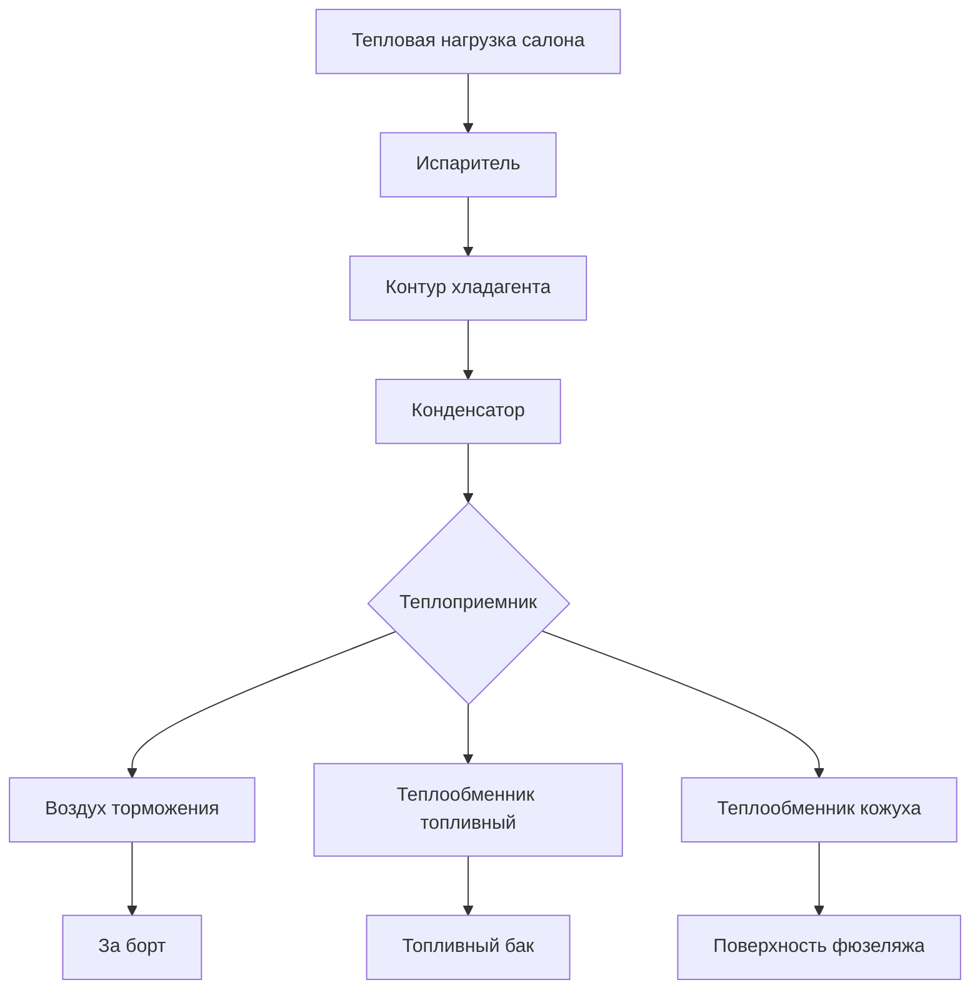

## Обзор

Электрические системы управления окружающей средой (E-ECS) представляют смену парадигмы с традиционных систем на основе перепуска воздуха из двигателя, используя электрически приводимые холодильные циклы с парами и электрические тепловые насосы для кондиционирования воздуха салона. Такая архитектура исключает извлечение воздуха перепуска из двигателя, повышая топливную эффективность на 2-5% при обеспечении точного контроля температуры и повышенной надежности. Электрические системы доминируют в конструкции современных пассажирских самолётов, включая платформы Boeing 787 и Airbus A350.

## Принципы фундаментального функционирования

### Холодильный цикл с парами

Электрические ECS используют обычное парокомпрессионное холодоснабжение, адаптированное для условий авиации:

$$Q_c = \dot{m}_r \left[ h_1 - h_4 \right]$$

Где:
- $Q_c$ = мощность охлаждения (кВ)
- $\dot{m}_r$ = расход массы хладагента (кг/с)
- $h_1$ = энтальпия на выходе испарителя (кДж/кг)
- $h_4$ = энтальпия на выходе дроссельного вентиля (кДж/кг)

Коэффициент производительности для электрических систем холодильного цикла с парами:

$$COP = \frac{Q_c}{W_{comp}} = \frac{h_1 - h_4}{h_2 - h_1}$$

Где $W_{comp}$ представляет входную мощность компрессора, а индекс 2 обозначает состояние на выходе компрессора.

### Архитектура электроснабжения

Электрические ECS интегрируются с системой распределения электроэнергии воздушного судна:

$$P_{total} = P_{comp} + P_{fans} + P_{controls} + P_{aux}$$

Типичное охлаждение салона требует 40-60 кВ электрической мощности на эквивалент воздушной машины цикла, при этом мощность компрессора составляет 70-80% от общего потребления.

## Компоненты системы и конфигурация

### Основное оборудование

| Компонент | Функция | Диапазон мощности | Критические параметры |
|-----------|---------|-------------------|----------------------|
| Электрический компрессор | Сжатие хладагента | 25-45 кВ | Скорость 15000-45000 об/мин, КПД 85-92% |
| Воздухоохлаждаемый конденсатор | Отвод тепла | N/A | Разность температур на воздушной стороне 20-35°C, эффективность 0,75-0,85 |
| Дроссельный вентиль | Снижение давления | <0,5 кВ | Управление перегревом 3-8°C |
| Испаритель | Охлаждение воздуха | N/A | Подход 2-5°C, предел обледенения 0°C |
| Инвертор/контроллер | Преобразование мощности | 2-5 кВ | КПД 96-98%, THD <5% |

### Выбор хладагента

Современные электрические ECS используют хладагенты, оптимизированные для авиационных приложений:

- **R-134a**: Старые системы, ПГП 1430, диапазон работы -40°C до +70°C
- **R-1234yf**: Альтернатива с низким ПГП (ПГП <1), сходные термофизические свойства
- **R-515B**: Перспективная замена, ПГП 299, азеотропная смесь

Количество зарядки хладагента составляет 3-8 кг на блок, при годовых утечках, поддерживаемых ниже 2%.

## Архитектура управления тепловыми потоками

### Методы отвода тепла

Электрические системы используют несколько путей отвода тепла:

Требования к мощности отвода тепла:

$$Q_{rej} = Q_c + W_{comp} = Q_c \left(1 + \frac{1}{COP}\right)$$

Для типичных условий крейсерского полёта с COP = 3,5 отводимое тепло равно 1,29 мощности охлаждения.

### Выбор размера системы воздуха торможения

Требования к расходу воздуха торможения зависят от высоты и режима полёта:

$$\dot{m}_{ram} = \frac{Q_{rej}}{c_p \Delta T_{ram}}$$

На крейсерской высоте (10700-13100 м) плотность воздуха торможения снижается до 0,25-0,30 кг/м³, требуя входных площадей 0,15-0,25 м² на блок охлаждения для достижения необходимого массового расхода при допустимом перепаде давления (150-250 Па).

## Характеристики производительности

### Диапазон работы

Электрические ECS должны функционировать при экстремальных условиях полёта:

| Этап полёта | Высота (м) | Температура наружного воздуха (°C) | Нагрузка (кВ) | Диапазон COP |
|--------------|-----------|-----------------------------------|--------------|-------------|
| Операции на земле | 0 | -40 до +50 | 60-80 | 2,0-2,8 |
| Взлёт | 0-3000 | -30 до +45 | 50-70 | 2,5-3,2 |
| Набор высоты | 3000-12200 | -55 до +20 | 40-60 | 3,0-3,8 |
| Крейсерский полёт | 10700-13100 | -55 до -45 | 30-45 | 3,2-4,0 |
| Снижение | 12200-0 | -50 до +30 | 35-55 | 2,8-3,5 |

### Оптимизация эффективности

Модуляция скорости компрессора обеспечивает оптимизацию эффективности:

$$\eta_{system} = \eta_{comp} \times \eta_{motor} \times \eta_{inverter} \times \frac{COP}{COP + 1}$$

Работа с переменной скоростью поддерживает эффективность системы выше 60% в диапазоне 30-100% мощности, в сравнении с 45-70% для систем с фиксированной скоростью на основе перепуска воздуха.

## Стратегии управления

### Регулирование температуры

Электрические ECS используют каскадную архитектуру управления:

1. **Первичный контур**: Обратная связь по температуре салона с мёртвой зоной ±0,5°C
2. **Вторичный контур**: Управление температурой на выходе испарителя (уставка 5-12°C)
3. **Третичный контур**: Регулирование скорости компрессора (15000-45000 об/мин)

Время отклика управления достигает 30-60 секунд при изменении уставки на 2°C, что превосходит 90-180 секунд для пневматических систем.

### Управление неисправностями

Электрические системы включают комплексную диагностику:

- Мониторинг давления хладагента (верхний/нижний пределы)
- Защита по температуре электромотора компрессора (<155°C обмотки)
- Защита инвертора от перетока/перенапряжения
- Защита испарителя от обледенения (температура змеевика >-2°C)
- Проверка воздушного потока конденсатора

## Интеграция с системами воздушного судна

### Управление электрической нагрузкой

Электрические ECS представляют 8-12% от общей электрической нагрузки воздушного судна при крейсерском полёте. Иерархия отключения нагрузки приоритизирует системы, критичные для полёта:

1. Системы управления полётом, авионика (никогда не отключаются)
2. Противообледенение, герметизация (отключаются только в чрезвычайной ситуации)
3. Охлаждение ECS (отключаются до 50% мощности)
4. Камбуз, развлечения (полностью отключаются)

### Компромиссы массы и объёма

Сравнение оборудования электрических ECS:

| Тип системы | Удельная масса (кг/кВ) | Объём (л/кВ) | Надежность (MTBF часов) |
|------------|------------------------|------------|-------------------------|
| Система перепуска воздуха ACM | 1,2-1,8 | 8-12 | 8000-12000 |
| Электрические пары | 2,5-3,5 | 12-18 | 15000-25000 |
| Гибридная система | 1,8-2,8 | 10-15 | 10000-18000 |

Несмотря на повышенную удельную массу, электрические системы исключают воздуховоды перепуска (200-350 кг), системы предварительного охлаждения (150-200 кг) и пневматические элементы управления (50-80 кг), достигая чистого снижения массы 150-300 кг на воздушное судно.

## Стандарты и сертификация

Проектирование электрических ECS следует стандартам управления окружающей средой в авиации:

- **SAE AS5127**: Терминология систем управления окружающей средой
- **SAE ARP85**: Системы кондиционирования воздуха для дозвуковых самолётов
- **RTCA DO-160**: Условия окружающей среды и процедуры испытания бортового оборудования
- **MIL-STD-810**: Соображения инженерного анализа окружающей среды

Протоколы испытания проверяют работу при температуре окружающей среды от -55°C до +70°C, способность на высоте до 15500 м и электромагнитную совместимость в соответствии с разделом 15-21 DO-160.

## Направления будущего развития

Передовые технологии электрических ECS в разработке:

- **Компрессоры с магнитными подшипниками**: Исключение смазки, повышение надежности
- **Теплообменники микроканального типа**: Снижение объёма на 30-40%
- **Трансритические циклы CO₂**: Высокая эффективность на высоте, природный хладагент
- **Дополнительное термоэлектрическое охлаждение**: Локализованный контроль температуры, без движущихся частей
- **Интегрированное управление тепловыми потоками**: Совмещённое охлаждение салона, авионики и силовой электроники

Исследования сосредоточены на достижении COP >4,5 при условиях крейсерского полёта при одновременном снижении удельной массы ниже 2,0 кг/кВ за счёт передовых материалов и оптимизации управления.
