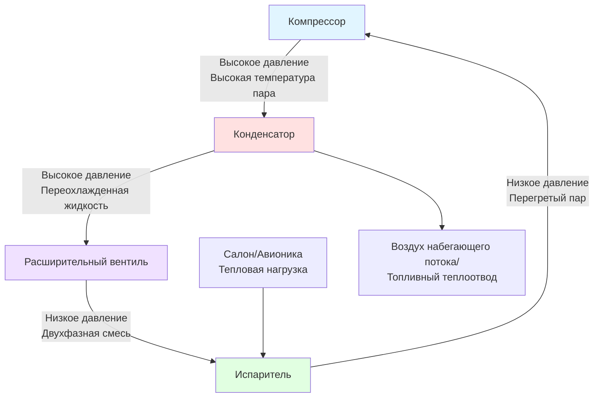
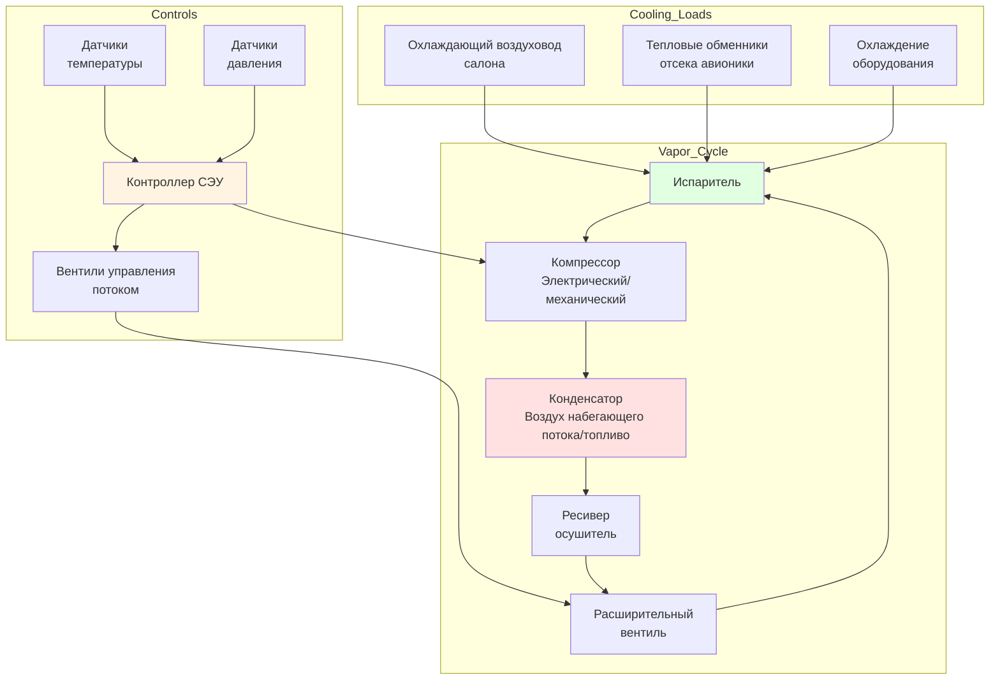

# Системы кондиционирования воздуха с паровым циклом

Системы кондиционирования воздуха с паровым циклом представляют основную технологию охлаждения для современных коммерческих и военных воздушных судов, где управление тепловым режимом салона и авионики требует эффективной и надежной холодильной установки, независимой от доступности воздуха отбора. Эти системы работают на основе стандартного цикла паровой компрессии, адаптированного для аэрокосмических ограничений, включая вес, объем, надежность и работу в широком диапазоне высот и температур.

## Анализ термодинамического цикла

Системы паровых циклов воздушных судов следуют фундаментальному холодильному циклу со специализированными адаптациями для аэрокосмических приложений.

### Основной холодильный цикл

Идеальный цикл паровой компрессии состоит из четырех процессов:

**Холодопроизводительность:**

$$Q_c = \dot{m}_r \cdot (h_1 - h_4)$$

Где:
- $Q_c$ = холодопроизводительность (Вт)
- $\dot{m}_r$ = массовый расход хладагента (кг/с)
- $h_1$ = удельная энтальпия на выходе испарителя (кДж/кг)
- $h_4$ = удельная энтальпия на выходе расширительного вентиля (кДж/кг)

**Коэффициент производительности:**

$$COP = \frac{Q_c}{W_{comp}} = \frac{h_1 - h_4}{h_2 - h_1}$$

Где:
- $W_{comp}$ = мощность, подводимая компрессором (Вт)
- $h_2$ = удельная энтальпия на выходе компрессора (кДж/кг)

**Отвод тепла:**

$$Q_h = Q_c + W_{comp} = \dot{m}_r \cdot (h_2 - h_3)$$

Где:
- $Q_h$ = отвод тепла конденсатором (Вт)
- $h_3$ = удельная энтальпия на выходе конденсатора (кДж/кг)

## Компоненты системы

### Типы компрессоров

Системы паровых циклов воздушных судов используют специализированные компрессоры, оптимизированные для аэрокосмических требований:

| Тип компрессора | Диапазон мощности | Скорость (об/мин) | Масса/кВт | Применение |
|----------------|-------------|-----------|-----------|--------------|
| Спиральный | 3-15 кВ | 3000-6000 | 2,5-3,5 кг/кВ | Региональные самолеты, бизнес-джеты |
| Роторный пластинчатый | 5-25 кВ | 4000-8000 | 2,0-3,0 кг/кВ | Коммерческие самолеты, военные |
| Поршневой | 2-10 кВ | 1500-3000 | 3,0-4,0 кг/кВ | Малые самолеты, устаревшие системы |
| Центробежный | 25-150 кВ | 15000-40000 | 1,5-2,5 кг/кВ | Крупные коммерческие самолеты |

Методы привода включают:
- **Привод от двигателя:** Соединение с редукционным редуктором аксессуаров, механический КПД 85-92%
- **Электромоторный привод:** Двигатели переменного или постоянного тока, КПД 90-95%, тенденция развития более электрических самолетов
- **Гидромоторный привод:** Используется в некоторых военных приложениях, КПД 75-85%

### Конструкция конденсатора

Конденсаторы воздушных судов отводят тепло доступным теплоотводам в сложных условиях.

**Эффективность теплопередачи:**

$$\epsilon = \frac{Q_h}{Q_{max}} = \frac{Q_h}{\dot{m}_{air} \cdot c_p \cdot (T_{cond} - T_{amb})}$$

Типы конденсаторов:
- **Конденсаторы с воздухом набегающего потока:** Первичный теплоотвод на высоте, эффективность 0,6-0,8
- **Конденсаторы, охлаждаемые топливом:** Используют топливо как теплоотвод перед сгоранием, эффективность 0,7-0,85
- **Гибридные системы:** Комбинируют охлаждение воздухом набегающего потока и топливом для оптимизации

### Конфигурация испарителя

Испарители обеспечивают охлаждение воздуха салона или оборудования авионики с минимальным перепадом давления и весом.

**Теплопередача со стороны воздуха:**

$$Q_c = \dot{m}_{air} \cdot c_p \cdot (T_{in} - T_{out}) = U \cdot A \cdot LMTD$$

Где:
- $U$ = общий коэффициент теплопередачи (Вт/м²·К), типично 25-50 для испарителей воздушных судов
- $A$ = площадь теплопередачи (м²)
- $LMTD$ = логарифмическое среднее температурное напряжение (К)

Типы испарителей:
- **Пластинчато-ребристые:** Высокая плотность поверхности, 800-1200 м²/м³
- **Микроканальные:** Уменьшенный заряд хладагента, экономия массы 20-30%
- **Трубчатые:** Устаревшие системы, выше надежность

### Выбор устройства расширения

| Тип устройства | Диапазон управления | Время отклика | Управление перегревом | Применение |
|------------|---------------|---------------|-------------------|--------------|
| Термостатический расширительный вентиль | 3:1 | 10-30 с | ±2-4 К | Большинство систем воздушных судов |
| Электронный расширительный вентиль | 10:1 | 1-5 с | ±0,5-1 К | Передовые системы, точное управление |
| Капиллярная трубка | Фиксированное | Н/Д | Без управления | Простые системы, постоянная нагрузка |
| Дроссель | Фиксированное | Н/Д | Без управления | Военные, высокая надежность |

## Выбор хладагента

Системы паровых циклов воздушных судов используют хладагенты, выбранные для безопасности, производительности и экологических соображений.

### Сравнение хладагентов

| Хладагент | ОДП | ПГП | Критическая температура (°C) | Класс безопасности | Статус |
|-------------|-----|-----|-------------------|--------------|--------|
| R-134a | 0 | 1430 | 101,1 | A1 | Текущий стандарт |
| R-1234yf | 0 | 4 | 94,7 | A2L | Развивающаяся коммерческая |
| R-744 (CO₂) | 0 | 1 | 31,0 | A1 | Исследования/военные |
| R-407C | 0 | 1774 | 86,0 | A1 | Ограниченное использование |
| R-410A | 0 | 2088 | 71,3 | A1 | Не типичен для воздушных судов |

R-134a остается доминирующим хладагентом в приложениях воздушных судов благодаря:
- Негорючести (рейтинг безопасности A1)
- Установленной истории обслуживания
- Совместимости со стандартными материалами
- Хорошим термодинамическим свойствам в диапазоне полета

### Рабочие характеристики

**Влияние высоты на производительность цикла:**

По мере увеличения высоты полета воздушного судна:
- Давление окружающей среды снижается, снижая эффективность конденсатора
- Температура воздуха набегающего потока снижается (стандартная атмосфера: -56,5°C на 11 км)
- Доступный массовый расход воздуха набегающего потока может быть ограничен
- Требования мощности компрессора варьируются в зависимости от давления на всасывании

**Модуляция производительности системы:**

$$\dot{m}_r = \eta_v \cdot \frac{V_d \cdot N \cdot \rho_1}{60}$$

Где:
- $\eta_v$ = объемный КПД (0,75-0,90)
- $V_d$ = рабочий объем компрессора (м³/об)
- $N$ = скорость компрессора (об/мин)
- $\rho_1$ = плотность хладагента на всасывании (кг/м³)

## Архитектура системы

## Требования к проектированию и стандарты

Системы паровых циклов воздушных судов должны соответствовать строгим аэрокосмическим стандартам:

### Требования FAA/EASA

- **FAR/CS 25.831:** Требования вентиляции и охлаждения
- **FAR/CS 25.1309:** Оборудование, системы и установки (надежность)
- **MIL-STD-810:** Рассмотрения экологического проектирования
- **RTCA DO-160:** Условия окружающей среды и процедуры испытаний авиационного оборудования

### Технические характеристики

**Требования холодопроизводительности:**

Типичные тепловые нагрузки воздушных судов:
- Охлаждение салона: 30-80 Вт/пассажир
- Охлаждение авионики: 15-40 кВ для коммерческих самолетов
- Оборудование кабины экипажа: 5-12 кВ
- Пиковые нагрузки: 1,5-2,0 раз крейсеровские нагрузки

**Целевые показатели надежности:**
- Средняя наработка на отказ (MTBF): >20 000 летных часов
- Надежность отправки: >99,5%
- Срок службы: 30 000-60 000 летных часов

**Эффективность по массе:**

$$\text{Удельная мощность} = \frac{\text{Холодопроизводительность (кВ)}}{\text{Масса системы (кг)}}$$

Целевое значение: 0,15-0,25 кВ/кг для полной системы включая монтаж

## Эксплуатационные характеристики

### Работа на земле

Охлаждение на земле представляет максимальные проблемы отвода тепла:
- Высокие температуры окружающей среды (ISA+15°C к ISA+30°C)
- Ограниченная доступность воздуха набегающего потока (тележка охлаждения наземная или вентиляторы с приводом от ВСУ)
- Максимальные солнечные тепловые нагрузки на фюзеляж
- Все системы в рабочем состоянии (максимальная нагрузка авионики)

**Усиление охлаждения на земле:**

$$Q_{ground} = Q_{flight} \cdot \left(1 + \frac{\Delta T_{ambient}}{30} + \frac{Q_{solar}}{Q_{cabin}}\right)$$

Обычно требует 130-150% крейсеровской холодопроизводительности.

### Работа на большой высоте

Условия крейсерского полета благоприятны для эффективности паровых циклов:
- Холодные температуры окружающей среды повышают производительность конденсатора
- Сниженные нагрузки охлаждения салона (сниженное солнечное излучение, стабилизированная загруженность)
- Сниженные тепловые нагрузки авионики (сниженная эксплуатация мощности)

COP обычно увеличивается на 15-25% на крейсерской высоте по сравнению с работой на земле.

### Переходные режимы

Критические случаи проектирования:
- **Взлет в жаркий день:** Максимальная температура окружающей среды, высокий спрос мощности, ограниченный воздух набегающего потока
- **Быстрое снижение:** Увеличение тепловых нагрузок в салоне, изменение условий давления
- **Быстрая смена:** Минимальное время охлаждения на земле перед следующим вылетом

## Интеграция с системами отбора воздуха

Многие воздушные суда используют гибридные системы, комбинирующие паровой цикл и отбор воздуха:

| Тип системы | Метод охлаждения | Метод отопления | Преимущества | Недостатки |
|-------------|----------------|----------------|------------|---------------|
| Чистый паровой цикл | Холодильная машина | Электрические нагреватели | Отсутствие штрафа на отбор воздуха, эффективность | Выше электрическая нагрузка, сложность |
| Чистый отбор воздуха | Цикл бутстреп | Отбор воздуха | Простота, проверенность | Штраф эффективности двигателя 2-3% |
| Гибридная | Оба | Оба | Оптимизированная эффективность | Сложность системы, масса |

## Техническое обслуживание и ремонтопригодность

### Требования к техническому обслуживанию

Интервалы планового обслуживания:
- Проверка заряда хладагента: Каждые 500 летных часов
- Анализ масла компрессора: Каждые 1000 летных часов
- Замена осушителя-фильтра: Каждые 2000-3000 летных часов или 5 лет
- Полная проверка системы: Каждые 8000-12000 летных часов

### Типичные режимы отказов

| Компонент | Режим отказа | Обнаружение | MTBF (часы) |
|-----------|--------------|-----------|--------------|
| Компрессор | Износ подшипника, утечка уплотнений | Вибрация, потеря давления | 25 000-40 000 |
| Конденсатор | Заиливание трубок, утечки | Высокое давление нагнетания | 50 000-80 000 |
| Испаритель | Обледенение катушки, утечки | Низкое давление всасывания | 40 000-70 000 |
| Расширительный вентиль | Охота, зависание | Колебание температуры | 30 000-50 000 |
| Управление | Дрейф датчика, отказ вентиля | Показания вне диапазона | 20 000-35 000 |

### Обнаружение утечек и ремонт

Системы воздушных судов требуют нулевой допуск на утечки хладагента:
- Электронные детекторы утечек: Чувствительность 0,14 г/год
- Флуоресцентный краситель: Визуальная инспекция под УФ-светом
- Испытание на падение давления: Поддержание 150% рабочего давления в течение 24 часов

## Передовые технологии

### Компрессоры переменной скорости

Современные системы используют частотные преобразователи (ПЧ) для управления скоростью компрессора:

**Экономия энергии:**

$$P_{variable} = P_{rated} \cdot \left(\frac{N_{actual}}{N_{rated}}\right)^3$$

Обеспечивает экономию энергии 30-50% при частичной нагрузке.

### Микроканальные тепловые обменники

Преимущества:
- Снижение массы на 30-40% по сравнению с традиционными конструкциями
- Снижение заряда хладагента на 20-30%
- Улучшение теплопередачи на 15-20% на единицу объема
- Сниженный перепад давления (10-15%)

### Улучшенные алгоритмы управления

- Предсказывающее управление моделью для предварительного определения нагрузки
- Мониторинг состояния и прогностика
- Оптимизация температуры в многозонном режиме
- Интеграция с системой управления тепловым режимом воздушного судна

---

*Связанные темы: [Системы отбора воздуха](../../../../../specialty-applications-testing/specialty-hvac-applications/aircraft-environmental-control/bleed-air-systems/_index.md), [Охлаждение авионики](../../../../../specialty-applications-testing/specialty-hvac-applications/aircraft-environmental-control/equipment-cooling-aircraft/avionics-cooling/_index.md), [Управление температурой воздушных судов](../../../../../specialty-applications-testing/specialty-hvac-applications/aircraft-environmental-control/temperature-control-aircraft/_index.md)*
