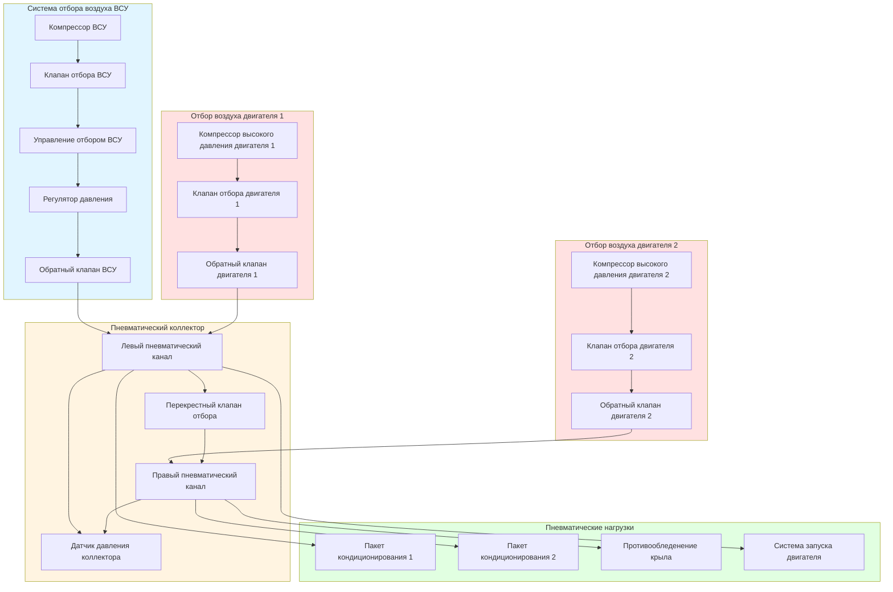

## Функция отбора воздуха ВСУ

Вспомогательная силовая установка (ВСУ) обеспечивает независимый источник высокого давления и высокотемпературного отбираемого воздуха для систем экологического контроля летательного аппарата, запуска двигателей и систем противообледенения крыла. ВСУ работает как небольшой газотурбинный двигатель, обычно расположенный в хвостовом конусе, извлекая сжатый воздух из секции компрессора для подачи пневматических услуг, когда основные двигатели недоступны или для дополнения отбора от двигателя во время высоконагруженных режимов.

## Производительность и рабочий диапазон отбора воздуха ВСУ

Производительность отбора воздуха ВСУ значительно варьируется в зависимости от типа летательного аппарата и модели ВСУ, при типичной производительности от 0,23 до 1,13 кг/с в зависимости от установки:

**Типичные спецификации отбора воздуха ВСУ:**

| Категория летательного аппарата | Расход отбираемого воздуха ВСУ | Давление | Температура |
|-------------------|----------------|----------|-------------|
| Региональный реактивный | 0,23-0,38 кг/с | 276-345 кПа | 190-218°C |
| Узкофюзеляжный | 0,45-0,68 кг/с | 310-379 кПа | 204-232°C |
| Широкофюзеляжный | 0,75-1,13 кг/с | 345-414 кПа | 218-246°C |

Расход массы отбираемого воздуха ВСУ может быть рассчитан с использованием характеристик производительности компрессора:

$$\dot{m}_{ВСУ} = \rho_{inlet} \cdot V_{inlet} \cdot A_{compressor} \cdot \eta_{volumetric}$$

где $\rho_{inlet}$ — плотность воздуха на входе, $V_{inlet}$ — скорость на входе, $A_{compressor}$ — площадь входа компрессора, $\eta_{volumetric}$ — объемный КПД (обычно 0,85-0,92).

Коэффициент отбора воздуха определяет процент расхода воздуха компрессора, доступный для пневматических услуг:

$$БОВ = \frac{\dot{m}_{bleed}}{\dot{m}_{compressor}} \times 100$$

Типичные коэффициенты отбора воздуха ВСУ варьируются от 60-75%, значительно выше, чем в системах отбора от основного двигателя (15-25%) из-за специализированной функции пневматического снабжения ВСУ.

## Работа на земле и возможности в полете

Системы отбора воздуха ВСУ демонстрируют различные характеристики производительности между наземной и полетной операциями из-за изменений плотности воздуха на входе, окружающей температуры и потока охлаждающего воздуха:

**Наземные операции:**
- Максимальная производительность отбираемого воздуха доступна
- Ограничения окружающей температуры: -40°C до 49°C
- От уровня моря до 3050 м высоты аэродрома
- Полная пневматическая производительность для кондиционирования воздуха и запуска двигателя
- Входная дверь полностью открыта для максимального расхода воздуха
- Без эффекта скоростного напора, полагаясь на конструкцию входа для расхода воздуха

**Полетные операции:**
- Сниженная производительность отбираемого воздуха выше 6100-7600 м
- Эффект скоростного напора улучшает восстановление давления на входе
- Более низкие окружающие температуры повышают потенциал расхода массы
- Ограничена противодавлением выпуска на большей высоте
- Обычно используется для аварийного резервирования или дополнительного отбора
- Максимальная высота полета: 10668-12497 м (в зависимости от летательного аппарата)

Доступный расход отбираемого воздуха снижается с высотой согласно:

$$\dot{m}_{высота} = \dot{m}_{sea level} \cdot \sqrt{\frac{\rho_{altitude}}{\rho_{sea level}}}$$

На высоте 7600 м плотность окружающего воздуха составляет примерно 45% от уровня моря, снижая производительность отбираемого воздуха ВСУ до примерно 67% от показателей на уровне земли.

## Ограничения отбора воздуха ВСУ по высоте

Системы отбора воздуха ВСУ сталкиваются с несколькими ограничениями, связанными с высотой:

1. **Максимальная высота полета:** Большинство ВСУ сертифицированы для работы на высотах до 10668-13106 м, некоторые современные установки способны работать на высотах 15545 м
2. **Ограничение диапазона отбора воздуха:** Доступность отбираемого воздуха обычно ограничена высотой 6100-7600 м для полной производительности
3. **Диапазон запуска:** Возможность запуска ВСУ ограничена более низкими высотами (4572-7600 м) из-за требований сгорания
4. **Ограничения по температуре отходящих газов:** Температура отходящих газов увеличивается с высотой, ограничивая отбор воздуха

Степень сжатия через компрессор ВСУ варьируется с высотой:

$$PR = \left(1 + \frac{\eta_{compressor} \cdot \Delta h}{C_p \cdot T_{inlet}}\right)^{\frac{\gamma}{\gamma-1}}$$

где $\eta_{compressor}$ — эффективность компрессора (0,80-0,85), $\Delta h$ — прирост удельной энтальпии, $C_p$ — удельная теплоемкость при постоянном давлении, $T_{inlet}$ — температура на входе, $\gamma$ — отношение удельных теплоемкостей (1,4 для воздуха).

## Интеграция с системой отбора воздуха основного двигателя

Отбор воздуха ВСУ интегрируется с системой отбора воздуха основного двигателя через координированный пневматический коллектор с обратными клапанами, изолирующими клапанами и клапанами регулирования давления:

Архитектура пневматической системы обеспечивает, что отбор воздуха ВСУ может снабжать все пневматические нагрузки, когда двигатели не работают, в то время как обратные клапаны предотвращают обратный поток и регуляторы давления поддерживают постоянное давление подачи независимо от источника.

## Распределение нагрузки между ВСУ и отбором от двигателя

Распределение нагрузки между системами отбора воздуха ВСУ и двигателя следует определенным операционным приоритетам:

**Последовательность приоритетов:**
1. Отбор воздуха ВСУ используется исключительно на наземных операциях перед запуском двигателя
2. Отбор от двигателя берет верх после стабилизации двигателя
3. Отбор воздуха ВСУ обеспечивает дополнительную производительность во время высоконагруженных условий
4. ВСУ служит аварийным резервом при отказе отбора от двигателя в полете

Общая пневматическая нагрузка распределяется согласно:

$$\dot{m}_{total} = \dot{m}_{ВСУ} + \dot{m}_{engine1} + \dot{m}_{engine2}$$

При распределении нагрузки, отдающем приоритет отбору от двигателя для минимизации расхода топлива и износа ВСУ. Система управления отбором воздуха автоматически модулирует позицию клапана отбора ВСУ на основе требований давления коллектора:

$$P_{manifold,target} = P_{regulated} \pm \Delta P_{tolerance}$$

где типичное регулируемое давление составляет 310-345 кПа с допуском ±14-21 кПа.

## Характеристики выходной температуры и давления

Отбираемый воздух ВСУ выходит из компрессора при повышенной температуре и давлении, требуя регулирования перед распределением на пневматические нагрузки:

**Характеристики сырого отбираемого воздуха ВСУ:**
- Температура: 190-288°C (зависит от модели ВСУ и нагрузки)
- Давление: 345-552 кПа (на выпуске компрессора)
- Расход массы: Переменный в зависимости от позиции клапана отбора

**Характеристики регулируемого отбираемого воздуха ВСУ:**
- Температура: 204-232°C (после регулирования давления)
- Давление: 310-345 кПа (регулируемое для пневматического коллектора)
- Расход массы: Контролируемый модуляцией клапана отбора

Связь между давлением, температурой и расходом массы следует закону идеального газа, модифицированному для поведения реальных газов:

$$P \cdot V = n \cdot Z \cdot R \cdot T$$

где $Z$ — коэффициент сжимаемости (приблизительно 1,0 для воздуха при этих условиях).

## Сравнение отбора воздуха ВСУ и отбора от двигателя

| Параметр | Отбор ВСУ | Отбор от двигателя | Примечания |
|-----------|-----------|--------------|-------|
| **Производительность расхода** | 0,23-1,13 кг/с | 1,13-3,40 кг/с | Отбор от двигателя значительно выше |
| **Выходное давление** | 310-414 кПа | 276-483 кПа | Аналогичное регулируемое давление |
| **Температура** | 190-246°C | 204-482°C | Отбор от двигателя горячее, требует предоборудования |
| **Эффективность** | 60-75% отбора | 15-25% отбора | ВСУ оптимизирована для отбора |
| **Расход топлива** | 91-182 кг/ч | Малое воздействие на двигатель | Выделенный расход топлива ВСУ |
| **Доступность** | Земля + ограниченная высота | Все условия полета | Отбор от двигателя предпочтителен в полете |
| **Время отклика** | 60-90 секунд запуска | Немедленно (если работает) | ВСУ требует запуска |
| **Ограничение высоты** | 6100-7600 м отбора | 13106+ м | Преимущество отбора от двигателя по высоте |

Системы отбора воздуха ВСУ обеспечивают существенную пневматическую независимость для наземных операций и аварийную резервную производительность, в то время как системы отбора от двигателя обеспечивают более высокую производительность и преимущества высоты во время полетных операций. Интеграция обоих источников обеспечивает надежность пневматической системы на всех этапах полета.
