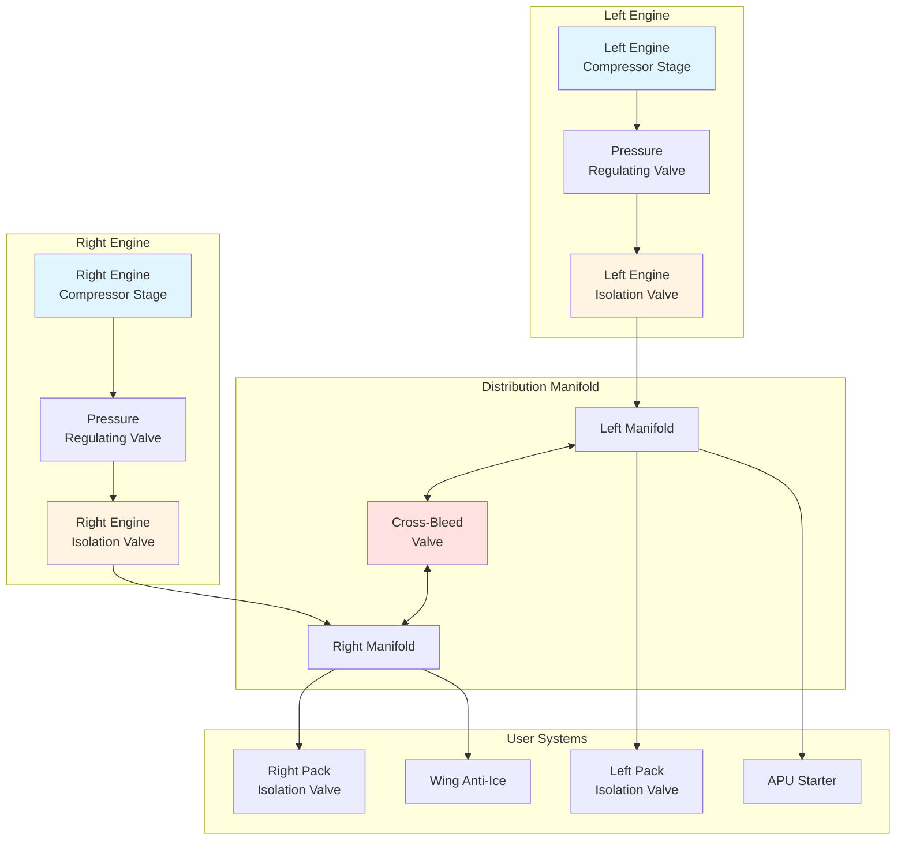

Системы распределения воздуха от компрессора в авиации доставляют воздух высокой температуры и высокого давления из компрессоров двигателей к различным системам летательного аппарата, включая системы управления окружающей средой, противообледенения и запуска двигателя. Сеть распределения должна поддерживать тепловую целостность, обеспечивать операционную гибкость и гарантировать безопасность экипажа и пассажиров через избыточность и возможности изоляции.

## Конструкция и прокладка распределительного коллектора

Коллектор воздуха от компрессора служит первичным распределительным позвоночником, обычно состоящим из нержавеющей стали или титановых воздуховодов, проложенных через фюзеляж летательного аппарата. Конструкция коллектора следует этим принципам:

**Первичные соображения при прокладке:**
- Кратчайший практический путь для минимизации потерь давления и термического воздействия
- Физическое разделение от гидравлических линий, электрических систем и топливных баков
- Доступность для осмотра и обслуживания
- Защита от повреждений посторонними предметами и механическими ударами
- Достаточный зазор от конструктивных элементов для размещения теплового расширения

**Архитектура коллектора** обычно использует двухканальную конструкцию с подачей от левого и правого двигателей. Это конфигурация обеспечивает возможность перекрёстной подачи при работе на одном двигателе или отказе подачи от компрессора. Ответвления от главного коллектора подают воздух отдельным системам через выделенные точки отвода.

**Станции регулирования давления** снижают воздух высокого давления от компрессора (1380-3100 кПа) до промежуточных уровней, подходящих для оборудования нижнего уровня. Несколько ступеней регулирования предотвращают чрезмерное падение температуры при одноступенчатом снижении давления.

## Эксплуатация и управление перекрёстным клапаном

Перекрёстный клапан представляет критическое взаимное соединение между левой и правой системами воздуха от компрессора, обеспечивая операционную гибкость и избыточность.

**Функции клапана:**
- **Операции запуска двигателя:** Направляет воздух от компрессора работающего двигателя к пневматическому стартёру противоположного двигателя
- **Одномоторное движение по земле:** Снабжает оба кондиционирующих модуля воздухом от компрессора одного двигателя
- **Изоляция источника воздуха:** Разделяет левую и правую системы при событиях загрязнения или обслуживании

**Логика управления** интегрирует переключатели в кабине пилота, автоматическое давление и цепи блокировки. Типовая последовательность операций:

1. Пилот переводит перекрёстный клапан в положение ОТКРЫТО
2. Система управления проверяет отсутствие условия перепада давления
3. Исполнительный механизм клапана получает сигнал питания
4. Обратная связь по положению подтверждает полный ход
5. Давление системы выравнивается по коллекторам

**Дизайн бабочки или шарового клапана** обеспечивает полнопроходной поток с минимальным падением давления. Пневматические или электрические исполнительные механизмы позиционируют клапан с возможностью ручного переключения для экстренной операции.

## Функции и расположение клапанов изоляции

Клапаны изоляции разделяют систему распределения воздуха от компрессора для локализации отказов, обеспечения обслуживания и защиты оборудования нижнего уровня.

**Клапаны изоляции воздуха от компрессора двигателя** монтируются непосредственно на пилонах двигателя, разделяя порты компрессора от коллекторов летательного аппарата. Эти клапаны автоматически закрываются при:
- Обнаружении пожара в двигателе
- Условиях перепада давления от компрессора
- Событиях перегрева воздуха от компрессора (обычно >260°C)
- Ручном отключении экипажем

**Клапаны изоляции модуля** защищают кондиционирующие модули от загрязненного или чрезмерно горячего воздуха от компрессора. Расположение непосредственно перед каждым модулем обеспечивает независимую операцию системы.

**Клапаны изоляции противообледенения крыла** управляют подачей воздуха от компрессора к системам трубок piccolo передней кромки крыла. Эти клапаны предотвращают образование льда во время полёта в облаках с видимой влагой при температурах ниже 10°C.

## Размер воздуховодов для потока воздуха от компрессора

Размер воздуховода воздуха от компрессора уравновешивает ограничения потери давления против ограничений веса и пространства. Фундаментальное отношение следует принципам сжимаемого потока.

Для дозвукового потока (число Маха < 0,3) падение давления можно оценить:

$$\Delta P = f \cdot \frac{L}{D} \cdot \frac{\rho V^2}{2}$$

Где:
- $\Delta P$ = падение давления (Па)
- $f$ = коэффициент трения Дарси (безразмерный)
- $L$ = длина воздуховода (м)
- $D$ = диаметр воздуховода (м)
- $\rho$ = плотность воздуха (кг/м³)
- $V$ = скорость потока (м/с)

Массовый расход через круглые воздуховоды:

$$\dot{m} = \rho \cdot V \cdot A = \rho \cdot V \cdot \frac{\pi D^2}{4}$$

**Критерии конструкции** обычно ограничивают скорость до 30-50 м/с для минимизации потерь давления и акустического шума. Целевые показатели падения давления остаются ниже 5% абсолютного давления подачи между источником воздуха от компрессора и оборудованием потребителя.

**Выбор диаметра воздуховода** рассматривает:
- Требуемый массовый расход (0,05-2,0 кг/с в зависимости от применения)
- Бюджет допустимого падения давления
- Ограничения установочного пространства
- Оптимизацию веса
- Стандартизацию с доступными фитингами

## Требования к тепловой изоляции

Температуры воздуха от компрессора достигают 200-260°C при типичных условиях крейсерского полёта, требуя комплексной тепловой защиты.

**Материалы изоляции** включают:
- Одеяла из стекловолокна с облицовкой из нержавеющей стали
- Керамические волокнистые обёртки для зон высокой температуры
- Изоляция на основе аэрогеля для пространственно ограниченных областей
- Резиновые сапоги из силикона для гибких соединений

**Цели конструкции:**
- Ограничить температуру внешней поверхности воздуховода до <80°C в пассажирских отсеках
- Предотвратить тепловое повреждение смежных конструкций и систем
- Поддерживать минимальный зазор (обычно 25-50 мм) к горючим материалам
- Снизить потери тепла для повышения эффективности системы

**Практики установки** требуют непрерывного покрытия изоляцией без зазоров в фланцах, креплениях или проходах. Материалы, устойчивые к сжатию, в местах крепления предотвращают сжатие изоляции и горячие точки.

## Материалы воздуховодов воздуха от компрессора и условия эксплуатации

| Материал | Максимальная температура | Типичное применение | Вес (кг/м для 50 мм воздуховода) | Устойчивость к коррозии |
|----------|-------------------|---------------------|---------------------------|---------------------|
| Нержавеющая сталь 321 | 650°C | Коллекторы высокого давления | 2,8 | Отличная |
| Inconel 625 | 980°C | Воздуховоды пилона двигателя | 3,4 | Отличная |
| Титан (Ti-6Al-4V) | 430°C | Критические по весу участки | 1,6 | Отличная |
| Нержавеющая сталь 304 | 540°C | Ответвления низкой температуры | 2,7 | Очень хорошая |
| Алюминий 6061 | 200°C | Распределение холодного воздуха | 0,9 | Хорошая (анодированный) |

## Системы и датчики обнаружения утечек

Утечки воздуха от компрессора представляют опасность пожара и снижают эффективность системы, требуя непрерывного мониторинга.

**Методы обнаружения:**

**Детекторы петлевого типа** состоят из трубки из инконеля, заполненной эвтектической солью, которая становится проводящей при нагреве выше пороговой температуры (обычно 260°C). Петля обнаружения проходит через зоны пожара рядом с воздуховодами от компрессора. Цепи мониторинга сопротивления определяют изменения непрерывности проводника.

**Дискретные датчики температуры** монтируются в стратегических местах, включая:
- Фланцы воздуховодов и механические соединения
- Корпусы клапанов и интерфейсы исполнительных механизмов
- Точки конструктивных проходов
- Области с уязвимыми соседними системами

**Акустическое обнаружение утечек** использует ультразвуковые датчики, которые определяют высокочастотные сигналы шума, характерные для высокого давления газа, выходящего через малые отверстия. Эта технология обеспечивает идентификацию утечек во время наземного обслуживания, когда тепловое обнаружение остаётся неактивным.

**Реакция системы** на обнаружение утечки:
1. Экипаж получает предупреждение "BLEED AIR LEAK" с идентификацией зоны
2. Автоматические системы могут закрыть клапаны изоляции в зависимости от серьёзности утечки
3. Экипаж следует процедурам для идентификации затронутой системы и изоляции источника воздуха от компрессора
4. Персонал обслуживания проверяет указанную зону перед следующим полётом

**Интервалы осмотра** для систем распределения обычно следуют графикам 600-1200 часов полёта, с визуальным осмотром состояния внешнего воздуховода, целостности изоляции и надёжности крепления. Испытание на спад давления во время комплексного обслуживания проверяет герметичность полной системы.

Система распределения воздуха от компрессора представляет кровеносную сеть пневматической энергии по всему летательному аппарату, требуя робастной конструкции, точного управления и непрерывного мониторинга для обеспечения безопасной и эффективной операции на всех этапах полёта.
