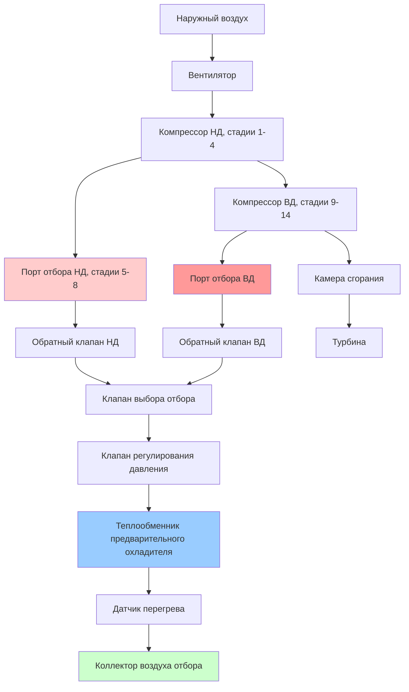

## Физика извлечения воздуха из отбора двигателя

Турбинные двигатели летательных аппаратов извлекают воздух из отбора определенных стадий компрессора для обеспечения пневматической мощности для систем кондиционирования окружающей среды, противообледенительной защиты и других бортовых систем. Это извлечение создает прямой термодинамический штраф на производительность двигателя, но обеспечивает высокое давление воздуха без необходимости дополнительного оборудования сжатия.

Выбор точек извлечения сбалансирован между конкурирующими требованиями адекватной доступности давления, приемлемых уровней температуры, минимального воздействия на производительность двигателя и операционной гибкости во всем диапазоне полета.

### Термодинамика стадии компрессора

Термодинамическое состояние воздуха на любой стадии компрессора зависит от общего коэффициента давления и политропной эффективности сжатия. Для процесса изоэнтропного сжатия соотношение между давлением и температурой следующее:

$$\frac{T_2}{T_1} = \left(\frac{P_2}{P_1}\right)^{\frac{\gamma-1}{\gamma}}$$

Где $\gamma = 1,4$ для воздуха. В реальных компрессорах политропная эффективность ($\eta_p = 0,88$ до $0,92$) изменяет это соотношение:

$$\frac{T_2}{T_1} = \left(\frac{P_2}{P_1}\right)^{\frac{\gamma-1}{\gamma \eta_p}}$$

Современные турбовентиляторные двигатели с высокой степенью двухконтурности достигают общих коэффициентов давления компрессора от 30:1 до 50:1, с коэффициентами давления на отдельных стадиях от 1,15 до 1,30. Работа компрессора на стадии следует:

$$w_{stage} = c_p \times (T_{out} - T_{in})$$

Где $c_p = 1,005$ кДж/(кг·K) для воздуха при типичных условиях компрессора.

## Точки извлечения воздуха из отбора

Турбинные двигатели обеспечивают воздух из отбора из нескольких мест компрессора для размещения различных требований воздушного судна и условий полета.

### Отбор компрессора высокого давления

Извлечение воздуха из отбора высокого давления (ВД) происходит на 9-14 стадии компрессора в зависимости от конструкции двигателя. Это местоположение обеспечивает:

**Характеристики давления:**
- Холостой ход на земле: 172-241 кПа
- Холостой ход в полете на крейсерской высоте: 241-310 кПа
- Максимальная непрерывная мощность: 379-517 кПа

**Характеристики температуры:**
- Условия на земле: 232-288°C
- Условия полета: 204-260°C
- Высокие режимы мощности: 288-343°C

Порт отбора ВД обеспечивает достаточное давление при всех условиях полета, но требует значительного предварительного охлаждения перед использованием. Штраф извлечения массового потока напрямую снижает давление выпуска компрессора и общую эффективность двигателя.

### Отбор низкого/среднего давления

Извлечение воздуха из отбора низкого давления (НД) или среднего давления (СД) происходит на 5-8 стадии компрессора. Это местоположение предлагает:

**Характеристики давления:**
- Холостой ход на земле: 103-172 кПа
- Холостой ход в полете на крейсерской высоте: 138-207 кПа
- Высокая мощность: 241-345 кПа

**Характеристики температуры:**
- Условия на земле: 121-177°C
- Условия полета: 93-149°C

Отбор НД обеспечивает адекватное давление при высокомощных условиях с более низкой температурой, снижая тепловую нагрузку предварительного охладителя. Однако при низких оборотах двигателя (холостой ход на земле, снижение), давление отбора НД может быть недостаточным для требований пневматической системы.

## Управление клапаном отбора и планирование

Система управления воздухом отбора регулирует извлечение для поддержания требуемого давления и температуры при минимизации штрафов на производительность двигателя.

### Клапан регулирования давления (КРД)

КРД поддерживает постоянное давление на выходе (обычно 310-345 кПа) независимо от изменений на входе. Клапан работает как устройство с балансировкой давления и пружинным управлением:

**Уравнение управления:**

$$P_{downstream} \times A_{sense} = F_{spring} + F_{control}$$

Где область чувствительности ($A_{sense}$) обеспечивает обратную связь для модуляции положения клапана. Современные системы используют электрически приводимые КРД с управлением FADEC для точного регулирования и диагностических возможностей.

### Выбор клапана высокой/низкой стадии

Система управления отбором автоматически выбирает между источниками ВД и НД на основе условий работы двигателя:

**Логика выбора:**
1. **Операции на земле и на низкой высоте:** отбор НД обеспечивает адекватное давление с более низкой температурой
2. **Крейсерский полет на высокой высоте с низкой тягой:** требуется отбор ВД, так как давление НД падает ниже порога
3. **Запуск двигателя:** отбор ВД закрыт для сохранения запаса устойчивости компрессора
4. **Односистемная работа:** выбран отбор ВД для обеспечения адекватного потока

Переход между источниками НД и ВД происходит путем ступенчатого секвенирования клапана для предотвращения переходных процессов давления. Клапан НД начинает закрываться перед открытием клапана ВД с периодом перекрытия 1-2 секунды.

### Интеграция FADEC

Системы управления полной авторитетностью цифрового двигателя (FADEC) интегрируют планирование клапана отбора с пределами эксплуатационной пригодности двигателя:

- **Защита запаса устойчивости:** ограничивает извлечение отбора при быстрых переходных режимах тяги
- **Оптимизация эффективности:** минимизирует извлечение отбора, когда достаточно альтернативных источников
- **Управление избыточностью:** управляет распределением отбора при асимметричной работе
- **Диагностический мониторинг:** отслеживает положение клапана, время отклика и утечки

## Работа предварительного охладителя

Теплообменники предварительного охладителя снижают температуру воздуха отбора до приемлемых уровней для нисходящего пневматического трубопровода и оборудования. Основной предварительный охладитель использует воздух выпуска вентилятора или напорный воздух в качестве охлаждающей среды.

### Термодинамика теплообменника

Предварительный охладитель работает как перекрестный теплообменник с эффективностью определяемой:

$$\varepsilon = \frac{T_{bleed,in} - T_{bleed,out}}{T_{bleed,in} - T_{cooling,in}}$$

Типичные значения эффективности составляют от 0,60 до 0,75 в зависимости от условий потока охлаждающего воздуха. Требование отвода тепла следует:

$$\dot{Q} = \dot{m}_{bleed} \times c_p \times (T_{bleed,in} - T_{bleed,out})$$

Для потока отбора 0,68 кг/с при 260°C, требующего охлаждения до 121°C:

$$\dot{Q} = 0,68 \times 1,005 \times (260 - 121) = 95,2 \text{ кДж/с} = 342,7 \text{ МДж/ч}$$

Требуемый поток охлаждающего воздуха зависит от допустимого повышения температуры в охлаждающем потоке:

$$\dot{m}_{cooling} = \frac{\dot{Q}}{c_p \times \Delta T_{cooling}}$$

Предполагая повышение температуры 56°C в охлаждающем воздухе:

$$\dot{m}_{cooling} = \frac{95,2}{1,005 \times 56} = 1,68 \text{ кг/с}$$

Этот поток охлаждения составляет примерно 2,5 раза массовый поток отбора, создавая значительное аэродинамическое сопротивление напорному воздуху при высоких операциях отбора.

### Рассмотрение операций на земле

Во время операций на земле скорость напорного воздуха недостаточна для адекватной производительности предварительного охладителя. Клапан предварительного охладителя воздуха вентилятора модулирует для увеличения потока охлаждения, забирая воздух непосредственно из выпуска вентилятора двигателя. Это расположение:

- Увеличивает эффективность охлаждения до 0,70-0,80
- Создает дополнительный штраф производительности двигателя (потеря тяги 0,3-0,5%)
- Генерирует повышенные температуры выпуска предварительного охладителя (282-320°C) при работе в жаркий день, превышающий 37,8°C

Наземная команда должна тщательно контролировать температуру воздуха отбора во время продленных операций без ВСУ, когда отбор двигателя обеспечивает все кондиционирование окружающей среды, особенно в жаких условиях окружающей среды, превышающих 37,8°C.

## Воздействие на производительность двигателя

Извлечение воздуха отбора создает несколько штрафов производительности, которые накапливаются в значительные увеличения потребления топлива.

### Прямая потеря тяги

Извлечение массового потока из компрессора снижает воздух, доступный для сгорания и производства тяги. Первое приблизительное значение:

$$\Delta F_{thrust} \approx -1,2 \times \frac{\dot{m}_{bleed}}{\dot{m}_{engine}}$$

Для типичного извлечения 2,5% расхода воздуха двигателя:

$$\Delta F_{thrust} \approx -1,2 \times 0,025 = -3,0\%$$

Это представляет постоянный дефицит тяги 3%, который должен быть компенсирован повышенным положением дросселя, повышающим потребление топлива.

### Деградация эффективности компрессора

Извлечение отбора нарушает аэродинамическую конструкцию компрессора, снижая согласованность стадии и общую эффективность сжатия. Внепроектная работа создает:

- Увеличение работы компрессора на единицу массового потока (увеличение удельной работы на 2-3%)
- Снижение запаса устойчивости, требующее консервативных рабочих пределов
- Неравномерное распределение потока на нисходящих стадиях

Объединенный штраф эффективности добавляет 0,5-1,0% к удельному расходу топлива за пределами штрафа прямого массового потока.

### Сравнение воздействия извлечения отбора

| Условие полета | Поток отбора (кг/с) | Штраф тяги | Увеличение расхода топлива | Общий системный штраф |
|---|---|---|---|---|
| Холостой ход на земле, жаркий день | 0,82 | 4,2% | 2,1% | 6,3% |
| Взлет | 0,68 | 2,8% | 1,4% | 4,2% |
| Крейсер, нормальное кондиционирование | 0,45 | 2,4% | 1,2% | 3,6% |
| Крейсер, сниженное кондиционирование | 0,27 | 1,4% | 0,7% | 2,1% |
| Снижение, холостой ход тяги | 0,36 | 5,5% | 2,8% | 8,3% |

Условие снижения показывает наивысший процентный штраф, потому что извлечение отбора при низкой мощности двигателя представляет большую часть общего расхода воздуха двигателя.

## Предотвращение и обнаружение загрязнения

Качество воздуха отбора напрямую влияет на безопасность воздуха в кабине, требуя надежных систем предотвращения и обнаружения загрязнения.

### Источники загрязнения

Потенциальные загрязнители, попадающие в поток воздуха отбора, включают:

**Утечка масла двигателя:**
- Уплотнения из углерода основного подшипника позволяют микроскопической миграции масла
- Деградированные уплотнения увеличивают утечку с 0,24 л/ч до 0,95-1,4 л/ч
- Синтетические масла для турбин содержат добавки трикрезилфосфата (ТКФ) с проблемами токсичности

**Проникновение гидравлической жидкости:**
- Гидравлические линии, проложенные рядом с трубопроводом отбора, могут протекать на горячие поверхности
- Жидкости на основе фосфатного эфира (Skydrol) производят токсичные продукты пиролиза выше 149°C
- Разложение жидкости создает острый запах, обнаруживаемый при концентрациях ниже 1 ppm

**Продукты сгорания:**
- Неполное сгорание во время запуска двигателя вводит CO и несгоревшие углеводороды
- Обратный поток при помпаже компрессора может втягивать продукты сгорания вперед
- Внутренние пожары двигателя загрязняют воздух отбора до их тушения

### Конструкция и техническое обслуживание уплотнений

Современные турбовентиляторные двигатели используют многоступенчатые уплотнения из углерода в местах расположения основного подшипника. Расположение уплотнения включает:

1. **Полость буферного уплотнения:** давление от компрессорного воздуха выше, чем давление масла подшипника
2. **Уплотнения с углеродистой поверхностью:** две или три стадии с минимальной утечкой (0,048-0,14 л/ч на подшипник)
3. **Система эвакуации:** сепараторы масляного тумана предотвращают повышение давления в поддонах подшипников

Индикаторы деградации уплотнения включают:
- Растущее потребление масла (> 0,24 л/ч увеличение)
- Видимые полосы масла на внешней части двигателя
- Запах масла в воздухе кабины (описано как «грязные носки» или запах «мокрой собаки»)

Замена уплотнения обычно происходит при интервалах капитального ремонта (15 000-25 000 часов полета), но может потребовать преждевременной замены, если произойдут события загрязнения.

### Системы обнаружения и мониторинга

Текущие системы обнаружения обеспечивают ограниченное прямое зондирование загрязнения:

**Мониторинг температуры:**
- Обнаружение перегрева при 127-138°C запускает отключение воздуха отбора
- Предотвращает термическое разложение загрязнений
- Не обнаруживает загрязнение при нормальных рабочих температурах

**Мониторинг давления:**
- Высокое давление (> 414 кПа) указывает на отказ КРД
- Низкое давление (< 172 кПа) указывает на утечку системы или неадекватное предложение
- Аномалии давления могут указывать на закупоривание трубопровода от мусора

**Технологии датчиков нового поколения:**
- CO датчики обнаруживают загрязнение продуктом сгорания (порог: 50 ppm)
- Датчики общего летучего органического соединения (ЛОС) измеряют концентрации паров масла
- Счетчики частиц обнаруживают масляный туман и другие аэрозоли

Продвинутые системы в разработке объединяют несколько типов датчиков с алгоритмами распознавания образов для различия событий загрязнения от нормальных вариаций системы. Эти системы нацелены на обнаружение в течение 30-60 секунд от входа загрязнения, обеспечивая быстрое корректирующее действие перед деградацией качества воздуха в кабине.

### Операционные процедуры

Экипаж летательного аппарата реагирует на подозреваемое загрязнение воздуха отбора через установленные процедуры:

1. **Изолировать затронутый источник отбора:** закрыть клапан отбора двигателя или переключиться на противоположный двигатель
2. **Увеличить поток пакета:** разбавить загрязнения с более высокими скоростями циркуляции воздуха
3. **Развернуть аварийный кислород:** если серьезность загрязнения угрожает способности экипажа
4. **Приземлиться в ближайшем подходящем аэропорту:** минимизировать время воздействия пассажиров

Действия техническому обслуживанию после событий загрязнения включают:
- Бороскопическое обследование трубопровода отбора для отложений масла
- Оценка состояния уплотнения подшипника посредством тенденции потребления масла
- Тестирование качества воздуха с использованием портативных анализаторов ЛОС
- Осмотр и очистка предварительного охладителя, если обнаружены отложения

## Интеграция системы и будущие тенденции

Современные системы отбора интегрируются с несколькими системами летательного аппарата, требующими согласованного управления:

- **Противообледенительные системы:** крыло и противообледенитель двигателя требуют 1,4-2,3 кг/с во время условий обледенения
- **Pressurization резервуара гидравлической жидкости:** непрерывный низкий поток (0,023 кг/с) поддерживает 276-345 кПа
- **Pressurization резервуара воды:** периодический поток при работе водяной системы
- **Запуск двигателя:** кросс-отбор стартер потребляет 0,91-1,4 кг/с в течение 30-90 секунд

Тенденция промышленности в направлении более электрических архитектур летательного аппарата исключает отбор двигателя для кондиционирования окружающей среды, сохраняя отбор только для применений противообледенителя на некоторых платформах. Boeing 787 представляет первый крупный коммерческий летательный аппарат с полным исключением извлечения отбора ЭКС, демонстрируя экономию топлива 3-4% только из этого архитектурного изменения.

Остающиеся применения воздуха отбора (двигатель и противообледенитель крыла) могут перейти на электрический нагрев по мере развития электроники мощности и систем электрической генерации, потенциально исключая все извлечение отбора к 2035-2040 годам для новых конструкций летательных аппаратов.
