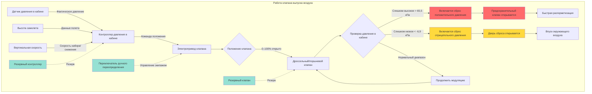

Клапаны выпуска воздуха из кабины самолета служат основным средством управления давлением в кабине путем модулирования выброса воздуха из герметизированного фюзеляжа. Эти критически важные компоненты поддерживают график давления, установленный контроллером давления в кабине, и обеспечивают необходимые функции безопасности сброса давления.

## Принципы работы

Клапаны выпуска воздуха работают на основе принципа массового баланса, когда скорость выхода воздуха из кабины равна скорости подачи воздуха от агрегатов системы кондиционирования минус скорость повышения давления в кабине. Клапан модулирует между полностью открытым и полностью закрытым положениями для поддержания целевой высоты кабины.

Основное соотношение, определяющее работу клапана выпуска воздуха:

$$\dot{m}_{outflow} = \dot{m}_{supply} - \rho_{cabin} V_{cabin} \frac{dP_{cabin}}{dt}$$

где $\dot{m}_{outflow}$ — массовый расход через клапан выпуска воздуха, $\dot{m}_{supply}$ — массовый расход подаваемого воздуха, $\rho_{cabin}$ — плотность воздуха в кабине, $V_{cabin}$ — объем кабины, и $\frac{dP_{cabin}}{dt}$ — скорость изменения давления в кабине.

Поток через клапан выпуска воздуха подчиняется уравнению:

$$\dot{m}_{outflow} = C_d A_{valve} \sqrt{2 \rho_{cabin} \Delta P}$$

где $C_d$ — коэффициент расхода (обычно 0,6–0,8), $A_{valve}$ — эффективная площадь открытия клапана, и $\Delta P$ — перепад давления через клапан.

## Типы клапанов и конструкция

Клапаны выпуска воздуха самолета используют несколько механических конфигураций, каждая из которых предлагает особые преимущества для различных применений.

| Тип клапана | Диапазон работы | Время отклика | Типичное применение | Преимущества | Ограничения |
|------------|-----------------|---------------|---------------------|------------|-------------|
| Дроссельный | 0–90° поворот | 2–5 секунд | Крупные коммерческие самолеты | Высокая пропускная способность, простая конструкция | Нелинейная характеристика потока |
| Поршневой | Линейный ход 0–7,6 см | 3–8 секунд | Бизнес-джеты, региональные самолеты | Герметичное перекрытие, линейный поток | Ограниченная пропускная способность |
| Ирисовый | Радиальное перекрытие | 4–10 секунд | Малые самолеты | Компактность, плавная модуляция | Сложный механизм |
| Раздвижные ворота | Линейное перемещение | 2–6 секунд | Широкофюзеляжные самолеты | Очень высокая пропускная способность | Требует значительной силы привода |

**Дроссельные клапаны** применяют круглый диск, установленный на вращающемся валу. Диск вращается от положения, перпендикулярного потоку (закрыто), к положению, параллельному потоку (открыто). Эти клапаны обеспечивают отличную пропускную способность в компактном исполнении, что делает их предпочтительным выбором для крупных коммерческих самолетов с высокими скоростями циркуляции воздуха.

**Поршневые клапаны** имеют пробку или диск, поднимающиеся из седла, чтобы пропустить поток. Линейное движение обеспечивает более предсказуемые характеристики потока и превосходную герметизацию при закрытом положении. Положение клапана прямо коррелирует с площадью потока, упрощая алгоритмы управления.

**Ирисовые клапаны** используют перекрывающиеся сегменты, открывающиеся и закрывающиеся радиально, как апертура фотоаппарата. Эта конструкция обеспечивает плавную модуляцию и компактную установку, но требует более сложного механического привода.

## Режимы автоматического управления

В автоматическом режиме контроллер давления в кабине команднует положением клапана выпуска воздуха на основе входных сигналов датчиков, включая высоту кабины, высоту полета самолета, вертикальную скорость и барометрическое давление. Контроллер реализует алгоритм пропорционально-интегрально-дифференцирующий (ПИД) для минимизации отклонений давления:

$$u(t) = K_p e(t) + K_i \int_0^t e(\tau) d\tau + K_d \frac{de(t)}{dt}$$

где $u(t)$ — сигнал команды клапана, $e(t)$ — ошибка давления, и $K_p$, $K_i$, $K_d$ — коэффициенты ПИД.

Контроллер постоянно регулирует положение клапана для поддержания запрограммированной высоты кабины на протяжении всего профиля полета. При наборе высоты клапан постепенно закрывается для поддержания давления в кабине при снижении барометрического давления. При снижении клапан открывается, позволяя давлению в кабине снижаться контролируемым образом.

Современные цифровые контроллеры опрашивают датчики давления с частотой 10–50 Гц и обновляют команды клапана с аналогичной частотой, обеспечивая плавное управление давлением без колебаний. Ограничение скорости предотвращает резкие движения клапана, которые могут вызвать дискомфорт у пассажиров.

## Режимы ручного управления

Ручной режим позволяет экипажу самолета непосредственно управлять положением клапана выпуска воздуха через переключатели на приборной доске или поворотные регуляторы. Этот резервный режим активируется при:

- Отказе автоматического контроллера
- Необходимости экипажа вмешаться при ненормальном давлении
- Проведении системных испытаний или устранении неисправностей
- Необходимости быстрой разгерметизации из-за дыма или паров

В ручном режиме экипаж непосредственно командует положением клапана, переопределяя сигналы автоматического управления. Большинство систем обеспечивают дискретные положения (полностью открыто, частично открыто, полностью закрыто) вместо непрерывной модуляции. Обучение подчеркивает плавные движения клапана для предотвращения быстрого изменения давления, превышающего скорость изменения высоты кабины 91–152 м/мин.

## Функция сброса давления при отрицательном давлении

Сброс отрицательного давления предотвращает падение давления в кабине ниже барометрического давления, что может вызвать структурное повреждение путем приложения нагрузок в направлении, противоположном направлению проектирования. Клапан выпуска воздуха включает пружинный механизм или отдельную дверь сброса отрицательного давления, которая открывается, когда давление в кабине падает примерно на 3,4–6,9 кПа ниже барометрического.

Механизм сброса работает пассивно без электроэнергии. При смене направления перепада давления аэродинамические силы и предварительное напряжение пружины вызывают открытие клапана, впуская окружающий воздух до выравнивания давлений.

## Функция сброса давления при положительном давлении

Сброс положительного давления защищает от чрезмерного давления в кабине, которое могло бы превысить пределы прочности фюзеляжа. Эта функция активируется при перепаде давления, обычно на 3,4–6,9 кПа выше максимально допустимого дифференциального давления (обычно 58,6–65,5 кПа всего).

Когда давление в кабине достигает порога сброса, отдельный предохранительный клапан или сам клапан выпуска воздуха полностью открывается для быстрого выпуска воздуха из кабины. Этот механический резерв работает независимо от электронной системы управления, обеспечивая отказоустойчивую защиту даже при полном отказе электроэнергии.

## Интеграция контроллера давления в кабине

Клапан выпуска воздуха получает команды положения от контроллера давления в кабине через электрические сигналы. Большинство современных систем используют:

- **Аналоговые сигналы:** напряжение 0–5 В или петли тока 4–20 мА для команды положения клапана
- **Цифровая коммуникация:** передача данных ARINC 429 или CAN-шина
- **Сигналы обратной связи:** датчики положения клапана (RVDT или потенциометр) передают фактическое положение контроллеру

Контроллер реализует управление с обратной связью, сравнивая командованную высоту кабины с фактической высотой кабины и регулируя положение клапана для минимизации ошибки. Алгоритмы защиты от интегрального насыщения предотвращают насыщение интегральной составляющей во время переходных процессов.

## Требования к резервированию и отказоустойчивости

Стандарты сертификации самолетов требуют обширного резервирования в системах управления давлением в кабине:

**Двойные клапаны выпуска воздуха:** Большинство коммерческих самолетов имеют два независимых клапана выпуска воздуха. Любой из клапанов может самостоятельно поддерживать давление в кабине, обеспечивая непрерывную работу после отказа одного клапана. Клапаны обычно устанавливаются в разных секциях фюзеляжа для предотвращения общемодовых отказов.

**Резервные контроллеры:** Двойные контроллеры давления в кабине обеспечивают автоматическое переключение на резерв. Резервный контроллер контролирует работу основного контроллера и берет управление при обнаружении аномалий. Некоторые системы используют логику голосования, при которой согласие двух из трех контроллеров является обязательным.

**Независимые источники питания:** Приводы клапана выпуска воздуха подключены к отдельным электрораспределительным шинам. Резервное питание от аккумулятора обеспечивает работу клапана при полном отказе генератора, позволяя производить контролируемую разгерметизацию.

**Механическая отказоустойчивость:** Пружинные механизмы смещают клапан в безопасное положение (обычно среднее или полностью открытое), если питание привода потеряно. Это предотвращает запертое давление в кабине при сохранении некоторой герметизации.

**Контроль положения:** Двойные датчики положения на каждом клапане обеспечивают обратную связь о положении. Несогласие между датчиками инициирует сигнализацию неисправности и может активировать резервные системы.

Общая надежность системы превышает вероятность потери управления давлением в кабине в размере 10^–9 на часть полета, достигаемую благодаря этим множественным уровням резервирования.

## Техническое обслуживание и испытания

Техническое обслуживание клапана выпуска воздуха включает:

- Функциональные испытания при проведении больших проверок самолета (каждые 18–24 месяца)
- Проверку калибровки датчиков положения
- Измерение потребляемого тока электродвигателя привода
- Проверку уплотнений и их замену при капитальном ремонте
- Испытание полного хода при условиях перепада давления
- Проверку времени отклика на командные сигналы

Надлежащая работа клапана выпуска воздуха критически важна для комфорта пассажиров, безопасности и структурной целостности самолета во всем диапазоне полета.
