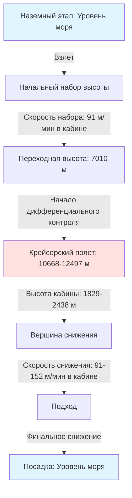

Графики давления в кабине самолета определяют запрограммированную зависимость между высотой полета и высотой кабины на всех этапах полета. Эти графики обеспечивают баланс между физиологическими требованиями комфорта пассажиров, конструкционными ограничениями фюзеляжа самолета и эксплуатационной эффективностью.

## Программирование высоты кабины

Система управления давлением в кабине следует заранее определенному графику, при котором высота кабины изменяется в зависимости от высоты самолета. При наборе высоты высота кабины увеличивается с контролируемой скоростью, которая значительно ниже скорости набора высоты самолета. Типичный график поддерживает давление на уровне моря в кабине до высоты полета примерно 7010 м (23 000 футов), после чего высота кабины начинает увеличиваться пропорционально.

Математическая зависимость в режиме крейсерского полета может быть выражена как:

$$P_{cabin} = P_{ambient} + \Delta P_{max}$$

где $P_{cabin}$ — абсолютное давление в кабине, $P_{ambient}$ — внешнее атмосферное давление, а $\Delta P_{max}$ — максимально допустимая разность давлений.

Высота кабины $h_{cabin}$ связана с давлением в кабине через уравнение стандартной атмосферы:

$$P_{cabin} = P_0 \left(1 - \frac{0.0065 \cdot h_{cabin}}{T_0}\right)^{5.2561}$$

где $P_0 = 101.325$ кПа (давление на уровне моря) и $T_0 = 288.15$ К (температура на уровне моря).

## Предельные значения высоты кабины

Регламентные требования устанавливают предельные значения высоты кабины для обеспечения достаточного парциального давления кислорода для пассажиров без использования дополнительного кислорода. Регламенты FAA (14 CFR Part 25) определяют:

- Максимальная нормальная высота кабины: 2438 м (8000 футов)
- Предел аварийного снижения давления: 4572 м (15 000 футов)
- Дополнительный кислород требуется выше 4572 м (15 000 футов)

На высоте кабины 2438 м (8000 футов) атмосферное давление составляет примерно 75.1 кПа (10.9 psia), что обеспечивает парциальное давление кислорода 15.9 кПа (2.3 psia) — достаточно для нормальной физиологической функции у здоровых людей. Типичная высота кабины в режиме крейсерского полета варьируется от 1829 до 2438 м (от 6000 до 8000 футов) в зависимости от высоты полета и типа самолета.

## Предельные значения разности давлений

Разность давлений $\Delta P$ между внутренним пространством кабины и внешним атмосферным воздухом ограничена конструкционными пределами фюзеляжа. Современные коммерческие самолеты обычно работают с максимальной разностью давлений от 59.3 до 64.8 кПа (от 8.6 до 9.4 psi):

| Тип самолета | Макс. разность давлений (кПа) | Макс. высота кабины в крейсерском полете (м) |
|------|-----------------|----------|
| Boeing 737 | 57.6 | 2438 |
| Boeing 747 | 61.4 | 2438 |
| Boeing 787 | 64.8 | 1829 |
| Airbus A320 | 60.0 | 2438 |
| Airbus A380 | 62.7 | 2134 |
| Airbus A350 | 64.8 | 1829 |

Разность давлений создает кольцевое напряжение в цилиндрическом фюзеляже:

$$\sigma_{hoop} = \frac{\Delta P \cdot r}{t}$$

где $r$ — радиус фюзеляжа, а $t$ — толщина обшивки. Это напряжение определяет вес конструкции и вопросы усталости материала.

## Режимы управления

### Режим изобарического управления

В изобарическом режиме контроллер давления в кабине поддерживает постоянную высоту кабины независимо от изменений высоты самолета. Этот режим обычно используется в режиме крейсерского полета, когда самолет поддерживает относительно стабильную высоту полета. Клапан выпуска воздуха модулируется для поддержания:

$$\frac{dP_{cabin}}{dt} = 0$$

### Режим управления по разности давлений

Режим управления по разности давлений поддерживает постоянную разность давлений между кабиной и окружающей средой. Этот режим активируется при достижении максимально допустимой разности давлений, предотвращая структурное перенапряжение. Контроллер поддерживает:

$$\Delta P = P_{cabin} - P_{ambient} = constant$$

По мере увеличения высоты самолета за точку, где достигнута максимальная разность давлений, высота кабины должна увеличиваться пропорционально, чтобы не превысить конструкционные пределы.

## Предельные значения скорости изменения

Комфорт пассажиров требует ограничения скорости изменения высоты кабины. Чрезмерные скорости вызывают дискомфорт в ушах из-за неспособности евстахиевых труб достаточно быстро уравновесить давление в среднем ухе.

Типичные предельные значения скорости:

- Набор высоты: увеличение высоты кабины на 1.5–2.5 м/с (300–500 футов/мин)
- Снижение: уменьшение высоты кабины на 1.5–2.5 м/с (300–500 футов/мин)
- Аварийное снижение: до 10.2 м/с (2000 футов/мин) (временный режим)

Скорость изменения давления регулируется положением клапана выпуска:

$$\frac{dP_{cabin}}{dt} = \frac{\dot{m}_{in} - \dot{m}_{out}}{V_{cabin}} RT$$

где $\dot{m}_{in}$ — массовый расход воздуха отбора, $\dot{m}_{out}$ — массовый расход через клапан выпуска, $V_{cabin}$ — объем кабины, $R$ — газовая постоянная, $T$ — температура в кабине.

## График давления профиля полета

Полный график давления координирует высоту кабины с профилем полета:

## Корреляция между высотой полета и высотой кабины

Зависимость между высотой полета $h_{flight}$ и высотой кабины $h_{cabin}$ варьируется в зависимости от фазы полета:

**Ниже переходной высоты** (обычно < 7010 м):
$$h_{cabin} = \text{от уровня моря до } 610 \text{ м}$$

**Выше переходной высоты**:
$$h_{cabin} = h_{flight} - \frac{\Delta P_{max}}{\rho g}$$

где эффективная разность высот определяется максимальной способностью к созданию перепада давления.

**На максимальной крейсерской высоте** (12497 м):
- Обычные самолеты: $h_{cabin} = 2438$ м, $\Delta P = 59.3$ кПа
- Продвинутые самолеты: $h_{cabin} = 1829$ м, $\Delta P = 64.8$ кПа

## Вопросы программирования

Современные цифровые контроллеры давления кабины используют таблицы поиска и алгоритмы для оптимизации графика давления на основе:

- Крейсерской высоты по плану полета
- Производительности набора и снижения высоты самолета
- Погодных условий и турбулентности
- Приоритетов комфорта пассажиров
- Управления усталостью конструкции

Контроллер предвосхищает изменения высоты и начинает корректировку высоты кабины до изменения высоты самолета, обеспечивая плавные переходы и минимизируя резкие изменения давления, влияющие на комфорт пассажиров.

Продвинутые системы включают предиктивные алгоритмы, которые взаимодействуют с системой управления полетом, получая обновления плана полета в реальном времени для оптимизации графиков герметизации для каждого сегмента полета.
