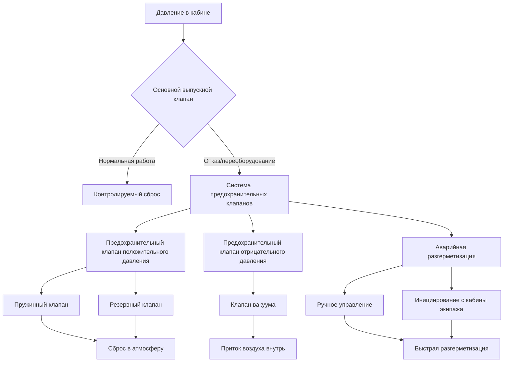

# Предохранительные клапаны в системе герметизации кабины летательного аппарата

Предохранительные клапаны представляют собой критически важные защитные системы в герметизации кабины летательного аппарата, предотвращающие повреждение конструкции из-за чрезмерного дифференциального давления и обеспечивающие контролируемую аварийную разгерметизацию. Эти устройства работают независимо от основных систем управления герметизацией, обеспечивая резервную защиту посредством механических и пневматических механизмов.

## Защита от дифференциального давления

Корпусные конструкции летательного аппарата должны выдерживать максимальное дифференциальное давление без превышения пределов конструкционного расчета. Система предохранительного клапана поддерживает давление в рамках сертифицированных границ.

### Предельные значения максимального дифференциального давления

Дифференциальное давление конструкционного расчета определяет установки предохранительного клапана:

$$\Delta P_{max} = P_{кабина,макс} - P_{окружающее,мин}$$

Для коммерческих транспортных летательных аппаратов:

$$\Delta P_{конструкция} = 59 \text{ до } 63 \text{ кПа}$$

Давление открытия предохранительного клапана обычно устанавливается на:

$$P_{сброс} = 0.95 \times \Delta P_{конструкция}$$

Это обеспечивает запас до конструкционных пределов, одновременно учитывая время срабатывания клапана и требования к пропускной способности.

### Расчет размеров клапана сброса давления

Пропускная способность клапана сброса должна обеспечивать обработку максимальной скорости герметизации для предотвращения перепада давления. Требуемая площадь проходного сечения определяется из:

$$\dot{m}_{сброс} = \dot{m}_{агрегат} - \dot{m}_{утечка} - \dot{m}_{разгерметизация}$$

Расчет площади проходного сечения клапана:

$$A_{клапан} = \frac{\dot{m}_{сброс}}{C_d \cdot P_{кабина} \cdot \sqrt{\frac{\gamma}{R \cdot T_{кабина}} \cdot \left(\frac{2}{\gamma + 1}\right)^{\frac{\gamma + 1}{\gamma - 1}}}}$$

Где коэффициент расхода $C_d$ изменяется от 0,65 до 0,85 в зависимости от геометрии клапана, а условия запертого потока применяются когда отношение давлений превышает критическое значение.

## Типы предохранительных клапанов и конфигурации

Летательные аппараты используют несколько конфигураций предохранительных клапанов для обеспечения резервной защиты и надежности в процессе эксплуатации.

### Предохранительные клапаны положительного давления

Пружинные механические клапаны открываются автоматически при превышении давлением в кабине установленного дифференциального значения:

- **Основной предохранительный клапан**: открывается при 56,2–57,2 кПа
- **Вторичный предохранительный клапан**: открывается при 58,6–60,0 кПа
- **Предварительное натяжение пружины**: регулируется во время производства и проверяется при техническом обслуживании
- **Пропускная способность**: рассчитана на обработку максимального выхода агрегата при отказе выпускного клапана

### Предохранительные клапаны отрицательного давления

Предотвращают падение давления в кабине ниже атмосферного во время снижения или разгерметизации:

- **Дифференциальное давление открытия**: от 2,1 до 3,4 кПа отрицательного давления
- **Конструкция легкого лепесткового клапана**: минимальное сопротивление потоку воздуха внутрь
- **Расположение**: несколько клапанов распределены по корпусу
- **Функция**: позволяет поступлению атмосферного воздуха для выравнивания давления

### Система аварийной разгерметизации

Инициируемая экипажем быстрая разгерметизация в чрезвычайных ситуациях (дым, пары, пожар):

$$t_{разгерметизация} = \frac{V_{кабина}}{C_v \cdot A_{клапан} \cdot \sqrt{\rho_{кабина} \cdot \Delta P}}$$

Целевое время разгерметизации: 10–45 секунд в зависимости от типа летательного аппарата и высоты полета.

## Характеристики производительности предохранительного клапана

| Параметр | Сброс положительного давления | Сброс отрицательного давления | Аварийная разгерметизация |
|-----------|------|------|------|
| **Давление открытия** | 56,2–60,0 кПа | −2,1 до −3,4 кПа | Ручное активирование |
| **Пропускная способность** | 6,8–11,3 кг/мин | 22,7–45,4 кг/мин | 90,7–226,8 кг/мин |
| **Время срабатывания** | 50–100 мс | <10 мс | 200–500 мс |
| **Тип клапана** | Пружинный золотник | Лепесток/обратный | Поворотный или радужный |
| **Резервирование** | Два клапана | Несколько клапанов | Два управления |
| **Интервал техническог обслуживания** | 2000–4000 летных часов | 4000–6000 летных часов | 1000–2000 летных часов |

## Принципы отказоустойчивой конструкции

Системы предохранительных клапанов включают несколько уровней защиты и анализ режимов отказов.

### Архитектура резервирования

- **Два независимых клапана**: каждый способен осуществлять полный сброс давления
- **Отдельные места крепления**: физическое разделение предотвращает отказ, имеющий общую причину
- **Различные механизмы срабатывания**: пружинный и пневматический пилотный
- **Постоянный мониторинг**: датчики давления с индикацией на кабине экипажа

### Анализ режимов отказов и их последствий

Критические сценарии отказов и конструкционное снижение риска:

1. **Выпускной клапан заклинен в закрытом положении**: предохранительные клапаны открываются автоматически при давлении сброса
2. **Утечка седла предохранительного клапана**: резервный клапан обеспечивает защиту, повышенная нагрузка на агрегат
3. **Предохранительный клапан заклинен в открытом положении**: предупреждение о высоте кабины, ручное управление герметизацией
4. **Отказ системы управления**: механические клапаны работают независимо от электроники

### Защита конструкции

Конструкция корпуса включает коэффициенты безопасности, учитывающие:

$$SF = \frac{\sigma_{предел прочности}}{\sigma_{рабочая}} \geq 1.5$$

Где напряжение на пределе прочности превышает рабочее напряжение минимум в 1,5 раза согласно FAR 25.365, обеспечивая запас для превышений давления до срабатывания предохранительного клапана.

## Требования к испытаниям и сертификации

Системы предохранительных клапанов проходят строгие испытания квалификации согласно правилам FAA.

### Протокол наземных испытаний

- **Функциональное испытание**: проверка давления открытия в пределах допуска (±0,7 кПа)
- **Испытание пропускной способности**: измерение расхода при различных дифференциальных давлениях
- **Испытание на герметичность**: максимально допустимая утечка при 0,95 × давления сброса
- **Испытание на выносливость при циклировании**: 10 000 циклов, имитирующих рабочий ресурс
- **Воздействие окружающей среды**: диапазон температур −54 до +71 °C, вибрация, влажность

### Техническое обслуживание в условиях эксплуатации

Программы техническото обслуживания включают периодическую проверку предохранительного клапана:

- **Визуальный осмотр**: коррозия, повреждения, загрязнение посторонними предметами
- **Проверка на герметичность**: герметизация кабины до максимального нормального дифференциального давления, мониторинг утечек
- **Функциональное испытание**: проверка давления открытия с использованием откалиброванного оборудования
- **Критерии замены**: любой клапан, не соответствующий допускам или показывающий признаки повреждения

### Стандарты сертификации

Системы герметизации летательного аппарата соответствуют:

- **FAR 25.365**: нагрузки на герметичный отсек
- **FAR 25.841**: герметичные кабины, включая требования к предохранительным клапанам
- **TSO-C116**: предохранительные клапаны для летательного аппарата
- **RTCA DO-160**: условия окружающей среды и процедуры испытаний

## Рабочие соображения

Рабочие процессы и процедуры технического обслуживания обеспечивают надежность системы предохранительных клапанов.

### Процедуры экипажа летательного аппарата

- **Мониторинг системы герметизации**: постоянное наблюдение за высотой кабины и дифференциальным давлением
- **Ненормальные ситуации**: распознавание открытия предохранительного клапана через изменение высоты кабины или увеличение расхода агрегата
- **Аварийная разгерметизация**: правильная последовательность активирования и защитные действия
- **Процедуры снижения**: контролируемая разгерметизация предотвращает активирование предохранительного клапана отрицательного давления

### Лучшие практики технического обслуживания

- **Проверка регулировки**: обеспечение правильного предварительного натяжения пружины и давления открытия
- **Замена уплотнений**: периодическое обновление уплотнений предотвращает утечки и поддерживает производительность
- **Предотвращение коррозии**: защитные покрытия и проверка корпусов клапанов из алюминия
- **Документирование калибровки**: документирование результатов испытаний и обеспечение отслеживаемости

Система предохранительного клапана обеспечивает необходимую защиту корпусов летательного аппарата, действуя как заключительная механическая защита от перепада давления, одновременно обеспечивая аварийную разгерметизацию по требованию экипажа. Надлежащая конструкция, испытания и техническое обслуживание обеспечивают надежное функционирование этих критически важных компонентов на протяжении всего срока эксплуатации летательного аппарата.
