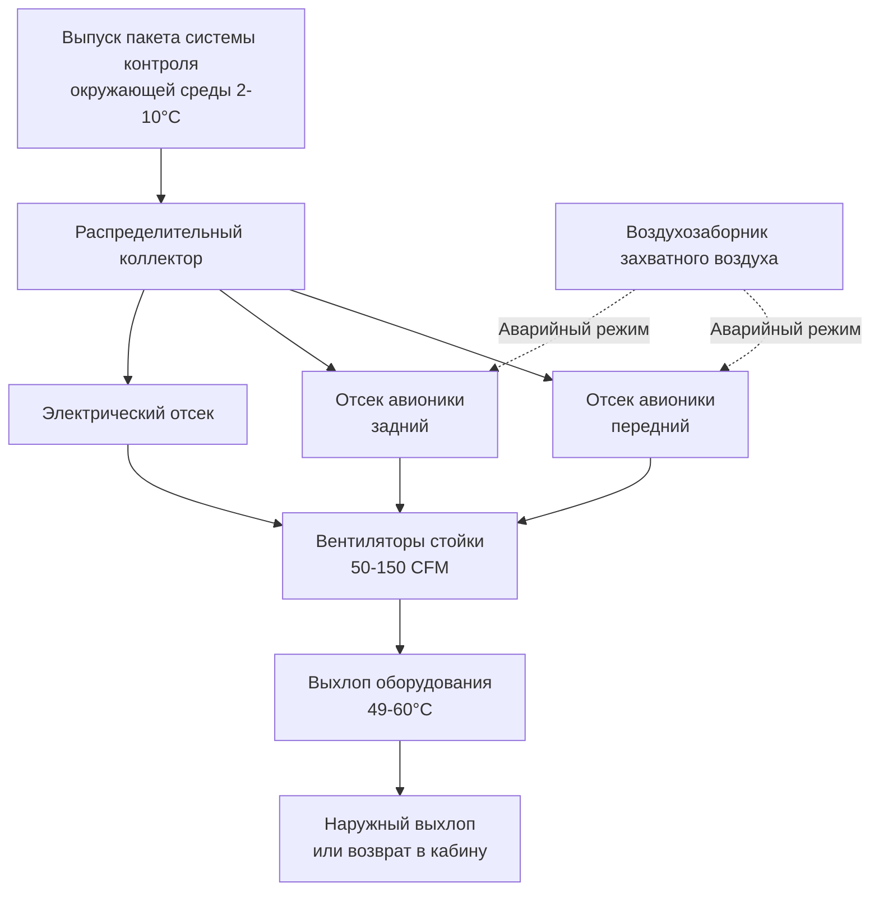
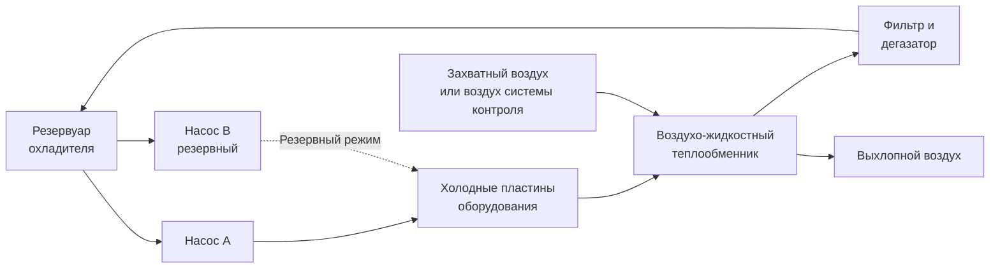

Системы охлаждения оборудования воздушных судов поддерживают рабочие температуры авионики, электрических компонентов, оборудования галлей и кондиционирования грузов в экстремальных условиях окружающей среды от -54°C на крейсерской высоте до +52°C на пустынных летных палубах. Эти специализированные системы теплового управления используют воздушное охлаждение, жидкостное охлаждение и гибридные подходы, адаптированные к требованиям рассеивания тепла оборудования, ограничениям по массе и нормативным требованиям, установленным FAA 14 CFR Part 25 и стандартами окружающей среды DO-160G.

## Требования к охлаждению оборудования

Электронное и механическое оборудование воздушного судна генерирует значительное количество тепла, которое необходимо отводить для поддержания температуры компонентов в пределах установленных диапазонов эксплуатации. Отсутствие надлежащего охлаждения приводит к снижению надежности, сокращению срока службы и потенциальным угрозам безопасности из-за тепловых сбоев.

### Категории тепловых нагрузок

**Оборудование авионики:**
- Компьютеры системы управления полетом: 200-500 Вт на устройство
- Навигационные системы: 150-300 Вт на стойку
- Приемопередатчики связи: 100-250 Вт на устройство
- Процессоры метеорадара: 300-600 Вт
- Системы управления полетом: 250-400 Вт
- Дисплей-модули: 50-150 Вт на экран

**Электрические системы:**
- Блоки распределения электроэнергии: 500-1200 Вт на шкаф
- Трансформаторно-выпрямительные агрегаты: 1000-2500 Вт
- Системы зарядки аккумуляторных батарей: 400-800 Вт
- Системы аварийного электроснабжения: 300-700 Вт

**Оборудование галлей:**
- Печи и нагревающие ящики: 2000-4000 Вт на устройство
- Кофеварки и нагреватели для напитков: 800-1500 Вт
- Холодильные установки: 500-1200 Вт охлаждающей нагрузки
- Компакторы мусора: 200-400 Вт

**Грузовое отделение:**
- Отсеки живых животных: 2-4 CFM/м² вентиляция
- Температурный контроль груза: поддержание 2-24°C
- Специальное охлаждение груза: фармацевтические поставки, требующие 2-8°C

### Пределы температур и критерии проектирования

Пределы рабочей температуры оборудования в соответствии с спецификациями экологических испытаний DO-160G:

| Тип оборудования | Диапазон эксплуатации | Максимальная температура корпуса | Метод охлаждения |
|------------------|----------------------|----------------------------------|------------------|
| Стойки авионики | 0-55°C | 70°C | Принудительное воздушное |
| Силовая электроника | -40-85°C | 95°C | Жидкостное или принудительное воздушное |
| Дисплеи полета | -20-55°C | 65°C | Теплопроводность/конвекция |
| Батареи | 0-50°C | 60°C | Вентиляция |
| Печи галлей | 0-75°C | 200°C (внешняя) | Изоляция/вентиляция |

## Системы воздушного охлаждения

Воздушное охлаждение представляет основной метод управления тепловым режимом оборудования воздушных судов благодаря простоте, надежности и интеграции с архитектурой системы контроля окружающей среды.

### Источники вентиляционного воздуха

**Кондиционированный воздух от системы контроля окружающей среды:**

Холодный воздух, извлекаемый из выпуска охлаждающего пакета (2-10°C), обеспечивает максимальную охлаждающую способность. Маршрут воздухопровода:

1. Коллектор выпуска пакета → Распределение по отсеку оборудования
2. Вентиляторы нагнетают воздух через стойки авионики
3. Горячий выхлопной воздух (49-60°C) возвращается в кабину или наружу
4. Расходы потока: 50-150 CFM (85-255 м³/ч) на стойку авионики

Охлаждающая способность, доступная от кондиционированного воздуха, зависит от температурного перепада и массового расхода:

$Q = \dot{m} \cdot c_p \cdot (T_{out} - T_{in})$

Где:
- $Q$ = охлаждающая способность (кДж/ч)
- $\dot{m}$ = массовый расход (кг/ч)
- $c_p$ = удельная теплоемкость воздуха (1.005 кДж/кг·°C)
- $T_{out}$ = температура выхлопа оборудования (°C)
- $T_{in}$ = температура подаваемого воздуха (°C)

Для 100 CFM (169 м³/ч, примерно 340 кг/ч) с входом 4°C и выходом 54°C:

$Q = 340 \times 1.005 \times (54 - 4) = 17,085 \text{ кДж/ч (4.75 кВт)}$

**Охлаждение захватным воздухом:**

Воздух, забираемый непосредственно из атмосферы, охлаждает оборудование, когда охлаждающая способность системы контроля окружающей среды недостаточна или для аварийного резервного копирования. Воздухозаборники захватывают динамическое давление на крейсерских скоростях воздушного судна, нагнетая наружный воздух через теплообменники и отсеки оборудования перед выпуском наружу.

**Преимущества:**
- Не требует энергии кондиционирования
- Высокая доступность массового расхода
- Независимость от работы системы контроля окружающей среды
- Низкая масса системы

**Ограничения:**
- Температура варьируется с высотой и этапом полета (-54°C на крейсере до +52°C на земле)
- Риск попадания влаги и загрязняющих веществ
- Возможность обледенения при низких температурах
- Штраф на аэродинамическое сопротивление от воздухозаборников и выпускных отверстий

**Рециркулированный воздух кабины:**

Охлаждение вторичных нагрузок использует возвратный воздух кабины (24-27°C) при недостаточном воздухе от охлаждающего пакета. Это обеспечивает умеренную охлаждающую способность без аэродинамического штрафа, но с ограниченным температурным перепадом.

### Архитектура вентиляции отсека оборудования

**Распределение потока:**

Распределение охлаждающего воздуха оборудования приоритизирует критическую авионику в первую очередь, со вторичными системами, получающими нисходящий воздух. Типичная иерархия распределения:

1. **Первичная**: Компьютеры управления полетом, навигационные системы
2. **Вторичная**: Оборудование связи, дисплей-модули
3. **Третичная**: Распределение электроэнергии, вспомогательные системы

Перепады давления через стойки оборудования составляют 0.5-2.0 см H₂O, требуя вентиляторов для создания достаточного статического давления для преодоления сопротивления системы.

### Проектирование принудительного воздушного охлаждения

Стойки авионики используют принудительную конвекцию со стандартизированными конфигурациями монтажа в соответствии со спецификациями ARINC 404A, ARINC 600 и ARINC 628. Заменяемые на линии блоки (LRU) устанавливаются в шасси с направленными путями потока воздуха.

**Соображения проектирования:**

**Скорость воздуха через оборудование:** 122-244 м/мин для адекватного коэффициента конвективной теплопередачи (h = 17-34 Вт/м²·°C)

**Расстояние между компонентами:** Минимум 1.3 см между модулями для потока воздуха

**Требования фильтра:** Эффективность 25-35% ASHRAE для предотвращения скопления пыли при минимизации перепада давления

**Надежность вентилятора:** Резервные вентиляторы с автоматическим переключением при обнаружении отказа

**Акустические пределы:** Шум вентилятора <70 дBA в отсеках оборудования в соответствии с нормативами охраны здоровья на работе

## Системы жидкостного охлаждения

Электроника высокой плотности тепла в современных воздушных судах (>50 Вт/см²) требует жидкостного охлаждения для адекватного управления тепловым режимом. Системы жидкостного охлаждения используют холодные пластины, теплообменники и насосные контуры охладителя.

### Жидкости жидкостного охлаждения

**Полиальфаолефиновые (PAO) жидкости:**
- Диапазон эксплуатации: -54°C до +135°C
- Низкая вязкость при низких температурах
- Некоррозионная, совместима с алюминием
- Типовая жидкость: MIL-PRF-87257

**Смеси этиленгликоля/воды:**
- Смесь 50/50 обеспечивает защиту от замерзания при -29°C
- Более высокая теплоемкость, чем PAO-жидкости
- Требуются ингибиторы коррозии
- Распространены в наземном вспомогательном оборудовании

**Диэлектрические жидкости:**
- Приложения прямого погружного охлаждения
- Свойства электрической изоляции
- Высокая стоимость ограничивает использование специализированным оборудованием
- Типовая жидкость: 3M Fluorinert

### Конструкция холодной пластины

Холодные пластины, установленные на оборудование, обеспечивают интерфейс кондуктивной теплопередачи между электроникой и контуром охладителя. Алюминиевые холодные пластины с внутренними каналами потока достигают теплового сопротивления 0.0013-0.0033 °C·см²/Вт.

**Анализ теплопередачи:**

Общее тепловое сопротивление от перехода к охладителю:

$R_{total} = R_{junction-case} + R_{interface} + R_{cold\ plate} + R_{convection}$

Где:
- $R_{junction-case}$ = внутреннее сопротивление компонента (указано производителем)
- $R_{interface}$ = сопротивление теплового интерфейсного материала (0.0007-0.0020 °C·см²/Вт)
- $R_{cold\ plate}$ = теплопроводность через материал пластины (0.0007-0.0013 °C·см²/Вт)
- $R_{convection}$ = коэффициент пленки охладителя (0.0003-0.0010 °C·см²/Вт)

Повышение температуры от охладителя к переходу компонента:

$\Delta T = Q \cdot R_{total}$

Для рассеивания 500 Вт с $R_{total}$ = 0.0040 °C·см²/Вт на квадратный сантиметр площади контакта:

$\Delta T = 500 \times 0.0040 = 2°C$

При охладителе 4°C температура перехода достигает 6°C—хорошо в пределах типовых пределов операции полупроводников.

### Архитектура контура жидкостного охлаждения

Системы жидкостного охлаждения воздушных судов используют замкнутые конфигурации с резервными насосами, теплообменниками и резервуарами расширения.

**Основные компоненты:**

**Насос охладителя:** Центробежные или шестеренчатые насосы, обеспечивающие 19-57 л/мин при 207-414 кПа

**Воздухо-жидкостный теплообменник:** Отводит тепло воздуху пакета системы контроля окружающей среды или захватному воздуху, эффективность 0.70-0.85

**Резервуар расширения:** Вмещает тепловое расширение охладителя и поддерживает давление системы

**Фильтры и дегазаторы:** Удаляют твердые частицы и растворенный воздух

**Датчики потока и температурные мониторы:** Обеспечивают мониторинг здоровья системы и обнаружение отказов

**Обнаружение утечек:** Проводящие датчики обнаруживают утечку охладителя в критических областях

### Гибридные подходы к охлаждению

Продвинутые системы объединяют воздушное и жидкостное охлаждение для оптимизации массы, надежности и производительности:

**Первичное жидкостное охлаждение:** Компоненты высокой плотности тепла (силовая электроника, процессоры)

**Вторичное воздушное охлаждение:** Устройства меньшей мощности, блоки питания, интерфейсные модули

**Спрей-охлаждение:** Экспериментальные системы для экстремальных тепловых потоков (>500 Вт/см²)

## Охлаждение оборудования галлей и обслуживания

Галлеи воздушных судов требуют охлаждения оборудования обслуживания пищи, включая холодильники, морозильники и хранилище охлажденных напитков.

### Системы охлаждения галлей с холодильниками

**Агрегаты парового сжатия:**

Стандартные тележки галлея и холодильники используют герметичные компрессорные системы с хладагентом R-134a, работающие от источника питания 115 В переменного тока воздушного судна.

- Охлаждающая способность: 585-1755 кДж/ч на тележку
- Поддержание температуры: 3-6°C холодильник, -12-12°C морозильник
- Мощность компрессора: 150-400 Вт
- Воздушные конденсаторы, выпускающие в галлей или кабину

**Термоэлектрические охладители:**

Твердотельные элементы Пельтье обеспечивают малую охлаждающую способность для охладителей напитков и специализированных приложений. Низкая эффективность (COP = 0.4-0.8) ограничивает использование до <100 Вт охлаждающих нагрузок.

### Требования вентиляции галлеев

Высокомощные печи галлеев, генерирующие 2000-4000 Вт каждая, требуют существенной вентиляции для предотвращения перегрева галлеев:

- Скорость вентиляции: 100-200 CFM (170-340 м³/ч) на печь
- Отвод тепла: 7,000-14,000 кДж/ч на печь
- Предел температуры выхлопа: <82°C в кабину
- Отдельная система вентиляции изолирует нагрузки галлеев от основной системы контроля

## Кондиционирование грузовых отделений

Системы охлаждения груза поддерживают температурный контроль для фармацевтических поставок, скоропортящихся товаров и транспортировки живых животных.

### Системы контроля температуры груза

**Пассивная изоляция:**

Изолированные контейнеры груза (ULD) с материалами накопления фазовых переходов поддерживают температуру на протяжении 8-12 часов без активного охлаждения. Тепловая масса и R-значение изоляции определяют время удержания.

**Активное охлаждение:**

Выделенные системы кондиционирования воздуха грузовых отделений извлекают холодный воздух из основных пакетов или используют независимые агрегаты парового цикла:

- Температурный диапазон: 2-24°C (фармацевтический), 4-10°C (скоропортящиеся товары)
- Частота смены воздуха: 15-25 смен воздуха в час
- Распределение: Воздухопроводы верхнего уровня с возвратом на уровне пола
- Мониторинг: Непрерывная запись температуры для цепи хранения

## Производительность системы и надежность

Надежность системы охлаждения оборудования непосредственно влияет на доступность отправок воздушного судна и безопасность операций. Типичные режимы отказов и стратегии смягчения:

| Режим отказа | Воздействие | Смягчение |
|---------------|-------------|----------|
| Отказ вентилятора | Перегрев оборудования через 5-15 минут | Резервные вентиляторы, автоматическое переключение |
| Утечка охладителя | Потеря охлаждения жидкостного контура | Обнаружение утечек, автоматическая изоляция, резервное воздушное охлаждение |
| Засорение теплообменника | Снижение емкости | Входные фильтры, плановая проверка |
| Отказ насоса | Потеря циркуляции контура | Двойные резервные насосы |
| Отказ датчика потока | Потеря мониторинга | Диагностика автотестирования, резервные датчики |

Встроенное тестовое оборудование (BITE) обеспечивает непрерывный мониторинг здоровья, с автоматическими отключениями, предотвращающими повреждение оборудования от тепловых скачков.

## Стандарты и требования к испытаниям

Системы охлаждения оборудования воздушных судов должны демонстрировать соответствие:

- **DO-160G Раздел 4 и 5:** Температурное и высотное испытание
- **SAE AS50881:** Проводка и дерейтинг компонентов
- **MIL-STD-810:** Соображения инженерии окружающей среды
- **FAA AC 25-7D:** Процедуры летных испытаний для квалификации оборудования
- **ARINC 600/628:** Форм-факторы оборудования авионики и интерфейсы охлаждения

Испытания валидируют тепловую производительность по всему эксплуатационному диапазону включая:

- Операции на земле: -40°C до +52°C окружающая среда
- Крейсерская высота: -54°C окружающая среда, сниженное конвективное охлаждение
- Аварийная депрессуризация: Быстрые переходные процессы давления/температуры
- Отказ единственной точки: Операция со сниженной охлаждающей емкостью

Системы охлаждения оборудования воздушных судов представляют критический интерфейс между системами контроля окружающей среды и критической для выполнения миссии авионикой, электрическими и обслуживающими системами. Надлежащее управление тепловым режимом обеспечивает надежность оборудования, оптимизирует производительность системы и поддерживает безопасность операций во всех фазах полета и условиях окружающей среды.
