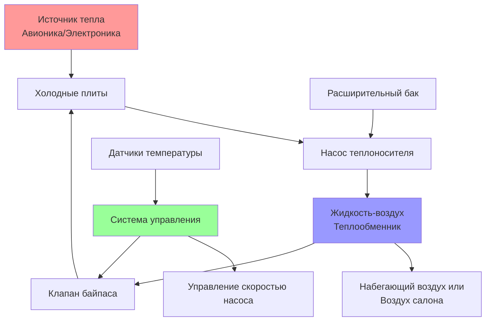

## Обзор

Системы жидкостного охлаждения обеспечивают высокопроизводительное управление тепловыми потоками для авиационной авионики, силовой электроники и радиолокационных систем, где воздушное охлаждение недостаточно. Эти замкнутые системы передают тепло от оборудования к теплообменникам с воздушным или топливным охлаждением, предлагая превосходную емкость отвода тепла на единицу объема по сравнению с прямым воздушным охлаждением.

## Фундаментальные принципы теплопередачи

Конвективная теплопередача от оборудования к теплоносителю следует закону охлаждения Ньютона:

$$Q = h \cdot A \cdot (T_s - T_f)$$

Где:
- $Q$ = скорость теплопередачи (Вт)
- $h$ = коэффициент конвективной теплопередачи (Вт/м²·К)
- $A$ = площадь поверхности (м²)
- $T_s$ = температура поверхности (К)
- $T_f$ = температура жидкости (К)

Жидкие теплоносители достигают коэффициентов теплопередачи в 10-100 раз выше, чем воздух, обеспечивая компактные решения для управления тепловыми потоками, критически важные для установок в тесных условиях воздушных судов.

## Выбор и свойства теплоносителя

Системы жидкостного охлаждения авиационного оборудования используют специализированные теплоносители, выбираемые по тепловым характеристикам, стабильности и безопасности.

### Сравнение теплоносителей

| Тип теплоносителя | Удельная теплоемкость (кДж/кг·К) | Теплопроводность (Вт/м·К) | Диапазон рабочих температур (°C) | Температура вспышки (°C) |
|-------------------|-----------------------------------|---------------------------|-----------------------------------|-------------------------|
| PAO (полиальфаолефин) | 2,1 | 0,14 | -54 до 135 | 260 |
| EGW (этиленгликоль/вода) | 3,5 | 0,45 | -40 до 107 | 111 |
| HFE (гидрофторэфир) | 1,3 | 0,07 | -80 до 160 | Нет (негорючий) |
| PAG (полиалкиленгликоль) | 2,4 | 0,16 | -45 до 150 | 235 |

Теплоносители на основе PAO доминируют в приложениях военной авиации благодаря отличной тепловой стабильности, широкому диапазону температур и совместимости с авиационными материалами. Гражданские воздушные суда все чаще используют негорючие теплоносители HFE для повышенной безопасности в пассажирских отсеках.

## Архитектура системы

Замкнутая система поддерживает циркуляцию теплоносителя через холодные плиты, установленные на оборудовании, генерирующем тепло, затем к теплообменникам, где тепловая энергия передается воздуху или топливу.

## Проектирование теплообменников

Системы жидкостного охлаждения авиационного оборудования используют компактные теплообменники, оптимизированные для ограничений по массе и объему.

### Метод эффективности-NTU

Производительность теплообменника следует соотношению эффективность-NTU:

$$\varepsilon = \frac{Q_{actual}}{Q_{max}} = \frac{1 - e^{-NTU(1-C_r)}}{1 - C_r \cdot e^{-NTU(1-C_r)}}$$

Где:
- $\varepsilon$ = эффективность теплообменника
- $NTU$ = число передачи = $\frac{UA}{C_{min}}$
- $C_r$ = отношение емкостей = $\frac{C_{min}}{C_{max}}$
- $U$ = общий коэффициент теплопередачи (Вт/м²·К)
- $A$ = площадь теплопередачи (м²)

Пластинчато-оребренные и микроканальные теплообменники достигают значений эффективности 0,75-0,90, минимизируя массу и занимаемое пространство.

## Выбор и размер насоса

Насосы теплоносителя должны преодолевать перепад давления в системе при обеспечении требуемого расхода.

### Требуемая мощность насоса

$$P_{pump} = \frac{\dot{m} \cdot \Delta P}{\rho \cdot \eta_{pump}}$$

Где:
- $P_{pump}$ = мощность насоса (Вт)
- $\dot{m}$ = массовый расход (кг/с)
- $\Delta P$ = перепад давления в системе (Па)
- $\rho$ = плотность теплоносителя (кг/м³)
- $\eta_{pump}$ = коэффициент полезного действия насоса (обычно 0,4-0,6 для авиационных насосов)

### Определение расхода

Требуемый массовый расход теплоносителя определяется из тепловой нагрузки и повышения температуры:

$$\dot{m} = \frac{Q}{c_p \cdot \Delta T}$$

Где:
- $c_p$ = удельная теплоемкость (Дж/кг·К)
- $\Delta T$ = повышение температуры теплоносителя (К)

Типичные авиационные системы жидкостного охлаждения поддерживают повышение температуры 5-15°C через холодные плиты, балансируя требования расхода против потребления электроэнергии насосом.

## Расчеты перепада давления

Перепад давления в системе включает вклады от трубопроводов, соединений, холодных плит и теплообменников.

### Полный перепад давления

$$\Delta P_{total} = \Delta P_{pipe} + \Delta P_{fittings} + \Delta P_{coldplate} + \Delta P_{HX}$$

Для турбулентного потока в круглых трубах:

$$\Delta P_{pipe} = f \cdot \frac{L}{D} \cdot \frac{\rho \cdot V^2}{2}$$

Где:
- $f$ = коэффициент трения Дарси
- $L$ = длина трубопровода (м)
- $D$ = диаметр трубопровода (м)
- $V$ = скорость потока (м/с)

Авиационные системы минимизируют перепад давления посредством тщательной прокладки, изгибов с большим радиусом и обтекаемых соединений для снижения паразитной мощности насоса.

## Стратегии управления

Управление температурой поддерживает температуру подаваемого теплоносителя в установленных пределах, минимизируя потребление электроэнергии.

### Управление переменной скоростью насоса

Модуляция скорости насоса обеспечивает пропорциональное управление расходом:

$$\dot{V}_2 = \dot{V}_1 \cdot \frac{N_2}{N_1}$$

$$P_2 = P_1 \cdot \left(\frac{N_2}{N_1}\right)^3$$

Где:
- $\dot{V}$ = объемный расход
- $N$ = частота вращения насоса (об/мин)
- $P$ = мощность насоса

Снижение скорости насоса при малых тепловых нагрузках дает кубическую экономию энергии, значительно снижая электрический спрос.

### Модуляция клапана байпаса

Трехходовые клапаны байпаса отводят теплоноситель вокруг теплообменников при холодных пусках и при малых нагрузках, ускоряя прогрев и предотвращая чрезмерное охлаждение. Пропорциональное управление поддерживает целевую температуру теплоносителя:

$$\dot{m}_{bypass} = K \cdot (T_{target} - T_{actual})$$

## Интеграция с авиационными системами

Системы жидкостного охлаждения взаимодействуют с системой кондиционирования воздуха воздушного судна через вторичные теплообменники.

### Теплообменники с охлаждением топливом

Высокопроизводительные военные воздушные суда отводят тепло в топливо перед сгоранием, используя тепловую емкость топлива и устраняя штрафы за лобовое сопротивление от набегающего воздуха. Теплопередача топливу ограничена максимально допустимой температурой топлива (обычно 65-70°C) для предотвращения паровых пробок и термического разложения.

### Теплообменники с набегающим воздухом

Гражданские воздушные суда используют теплообменники с набегающим воздухом, обменивая аэродинамическое сопротивление на более простую интеграцию. NACA воздухозаборники и выравненные входы минимизируют сопротивление при обеспечении адекватного расхода воздуха через сердцевины теплообменников.

## Надежность и техническое обслуживание

Системы жидкостного охлаждения авиационного оборудования требуют обнаружения утечек, контроля качества теплоносителя и периодического обслуживания.

### Методы обнаружения утечек

- Визуальный осмотр на соединениях и стыках
- Испытание на спад давления во время техническогооо обслуживания
- Добавление флуоресцентного красителя для УФ-обнаружения утечек
- Мониторинг влажности в расширительных баках

### Мониторинг состояния теплоносителя

Признаки деградации теплоносителя включают:
- Сдвиг pH (окисление и подкисление)
- Загрязнение частицами
- Изменения вязкости
- Снижение тепловой стабильности

Стандарт ASHRAE 147 предоставляет рекомендации по практикам обслуживания теплоносителя, адаптированным для авиационных приложений.

## Соображения при проектировании

Эффективное проектирование систем жидкостного охлаждения авиационного оборудования учитывает:

1. **Оптимизацию массы**: минимизация объема теплоносителя и конструкционной массы
2. **Резервирование**: двойные контуры для критических систем
3. **Влияние высоты**: учет пониженной теплопередачи со стороны воздуха на крейсерской высоте
4. **Перегрузки**: обеспечение работы насоса при маневрировании
5. **Горючесть**: использование негорючих теплоносителей рядом с пассажирскими зонами
6. **Экранирование ЭМИ**: предотвращение электромагнитных помех авионике

## Оптимизация производительности

Оптимизация системы балансирует тепловую производительность, массу, потребление электроэнергии и надежность. Моделирование вычислительной гидродинамики (CFD) позволяет оптимизировать холодные плиты и теплообменники перед прототипированием. Переходный тепловой анализ проверяет отклик системы при быстром изменении мощности и вариациях профиля полета.

Системы жидкостного охлаждения авиационного оборудования представляют собой сложные решения для управления тепловыми потоками, обеспечивающие авионику нового поколения и силовую электронику в требовательных аэрокосмических условиях.
