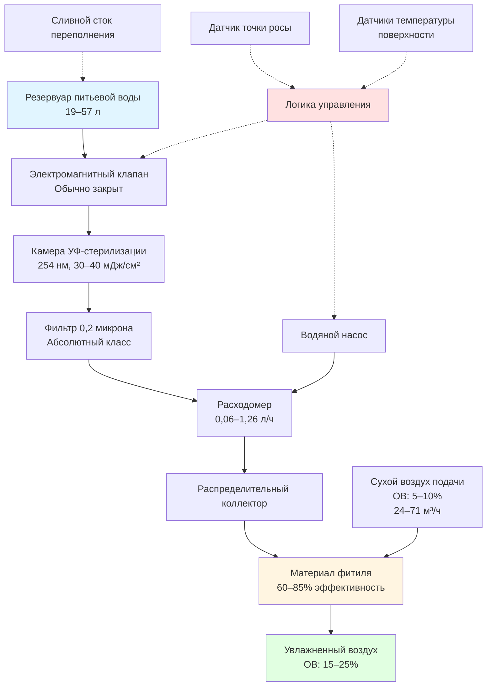
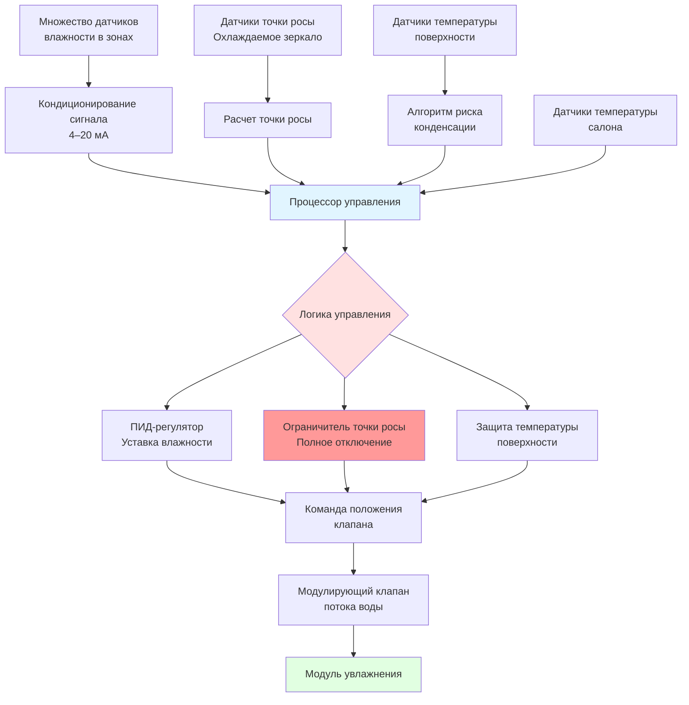

Системы увлажнения салона воздушного судна решают задачу экстремально низкой влажности, присущей авиационной системе контроля окружающей среды, при одновременном соблюдении жестких ограничений по массе, мощности и предотвращению конденсации. Эти системы используют специализированные технологии, принципиально отличающиеся от наземного увлажнения из-за высоты, конструктивных ограничений и требований безопасности.

## Технология испарительного увлажнения

Испарительное увлажнение доминирует в авиационных применениях благодаря своей пассивной природе, надежности и саморегулирующемуся поведению. Технология вводит влагу путем прямого контакта сухого воздуха салона с увлажненными поверхностями носителя.

### Физические принципы

Скорость испарения с увлажненной поверхности в движущийся воздух следует соотношениям массопередачи:

$$
\dot{m}_w = h_d A_s (W_s - W_a)
$$

Где:
- $\dot{m}_w$ = скорость испарения влаги (кг/ч)
- $h_d$ = коэффициент массопередачи (кг/ч·м²)
- $A_s$ = площадь увлажненной поверхности (м²)
- $W_s$ = коэффициент влажности на поверхности (кг/кг_су)
- $W_a$ = коэффициент влажности воздушного потока (кг/кг_су)

Коэффициент массопередачи связан с скоростью потока воздуха и геометрией носителя эмпирическими корреляциями. Для типичных модулей увлажнения на воздушном судне, работающих при скорости потока 0,51–1,02 м/с:

$$
h_d = 0.15 \times V^{0.8}
$$

Где $V$ представляет скорость воздуха в м/с, давая значения $h_d$ в диапазоне 3,1–4,9 кг/ч·м² для стандартных условий эксплуатации.

### Конструкция испарительного носителя

Модули увлажнения на воздушном судне используют специализированные материалы фитилей, оптимизированные по массе, площади поверхности и устойчивости к бактериям.

**Спецификации носителя:**

| Тип носителя | Площадь поверхности (м²/м³) | Удержание воды (кг/м³) | Масса (кг/м³) | Ожидаемый срок службы |
|------------|------------------------|--------------------------|-----------------|-----------------|
| Керамическая матрица | 820–1150 | 128–192 | 240–400 | 5000+ часов |
| Полимерное волокно | 985–1475 | 160–256 | 128–240 | 3000–4000 часов |
| Целлюлозный композит | 1312–1969 | 192–320 | 160–288 | 2000–3000 часов |
| Покрытие диоксидом титана | 920–1246 | 144–224 | 288–448 | 7000+ часов |

Покрытие из диоксида титана обеспечивает фотокаталитические антибактериальные свойства под УФ-облучением, критически важные для поддержания качества воды при продолжительной работе.

### Конфигурация системы

Полный модуль испарительного увлажнения интегрирует накопитель воды, очистку, увлажнение носителя и управление:

### Эффективность испарения

Эффективность испарительного увлажнения зависит от скорости воздуха, площади увлажненного носителя и условий входящего воздуха:

$$
\eta_{evap} = \frac{W_{out} - W_{in}}{W_{sat} - W_{in}}
$$

Где:
- $\eta_{evap}$ = эффективность испарения (безразмерная)
- $W_{out}$ = коэффициент влажности выходящего воздуха (кг/кг_су)
- $W_{in}$ = коэффициент влажности входящего воздуха (кг/кг_су)
- $W_{sat}$ = коэффициент влажности насыщения при входящей температуре сухого термометра (кг/кг_су)

Для модулей на воздушном судне, работающих с воздухом подачи 21 °C при 8% ОВ:
- $W_{in}$ = 0,00079 кг/кг_су
- $W_{sat}$ = 0,0113 кг/кг_су (при 21 °C, 100% ОВ)
- Целевой $W_{out}$ = 0,00238 кг/кг_су (20% ОВ при 21 °C)
- Требуемый $\eta_{evap}$ = 15%

Это требование низкой эффективности обеспечивает пассивную работу без принудительной атомизации воды, критично для минимизации потребления мощности и механической сложности.

## Системы ультразвукового увлажнения

Ультразвуковое увлажнение генерирует тонкие капли воды путем высокочастотной механической вибрации. Хотя менее распространено, чем испарительные системы на воздушных судах, ультразвуковая технология предлагает преимущества в скорости реагирования и компактности упаковки.

### Принципы работы

Ультразвуковые преобразователи, работающие на частоте 1,6–2,4 МГц, создают кавитацию на поверхности воды, выбрасывая капли диаметром 1–5 микрон. Скорость генерирования капель связана с мощностью преобразователя и частотой:

$$
\dot{m}_d = \frac{P_{trans} \times \eta_{conv}}{h_{fg}}
$$

Где:
- $\dot{m}_d$ = скорость генерирования капель (кг/ч)
- $P_{trans}$ = мощность преобразователя (кДж/ч)
- $\eta_{conv}$ = эффективность преобразования (0,25–0,40 типично)
- $h_{fg}$ = скрытая теплота парообразования (2446 кДж/кг при 21 °C)

### Компоненты ультразвуковой системы

**Критические элементы конструкции:**

1. **Пьезоэлектрический преобразователь**
   - Материал: керамический свинцово-циркониевый титанат (PZT)
   - Рабочая частота: 1,65 МГц (типично)
   - Плотность мощности: 5–10 Вт/см²
   - Срок службы: 8000–12000 часов непрерывной работы

2. **Секция испарения капель**
   - Скорость воздуха: минимум 1,52–2,54 м/с
   - Время нахождения: 0,5–1,0 секунды
   - Полное испарение требуется перед впрыском в салон
   - Неполное испарение вызывает накопление конденсата

3. **Управление уровнем воды**
   - Поплавковый клапан или емкостное зондирование
   - Допуск: ±5 мм глубины воды
   - Критично для согласованного связывания преобразователя

### Сравнение производительности

| Параметр | Испарительная | Ультразвуковая |
|-----------|-------------|------------|
| Выход влаги | 0,23–0,91 кг/ч | 0,45–1,81 кг/ч |
| Потребление мощности | 50–150 Вт | 200–400 Вт |
| Время реагирования | 5–10 минут | 30–90 секунд |
| Чувствительность к качеству воды | Умеренная | Высокая |
| Интервал обслуживания | 2000–3000 часов | 1000–1500 часов |
| Размер капель | Н/П (пар) | 1–5 микрон |
| Генерирование минерального пыле | Отсутствует | Присутствует без демinerализации |
| Масса (сухая) | 6,8–13,6 кг | 9,1–15,9 кг |

Ультразвуковые системы требуют демinerализованную воду, чтобы предотвратить образование белой пыли из минерального содержимого. Это требует обратного осмоса или дезионизирующей очистки, добавляющей сложность и массу системы.

## Требования к очистке воды

Качество воды определяет надежность системы, предотвращает рост бактерий и обеспечивает безопасность пассажиров. Системы увлажнения на воздушных судах должны соответствовать строгим микробиологическим и химическим стандартам.

### Этапы процесса очистки

**Многоуровневый подход:**

1. **Качество исходной воды**
   - Система питьевой воды на воздушном судне согласно ARP1616
   - Периодическое тестирование: бактерии, pH, остаточный хлор
   - Материал резервуара хранения: нержавеющая сталь (316L) или титан

2. **УФ-стерилизация**
   - Длина волны: 254 нм (герицидная)
   - Доза: минимум 30–40 мДж/см²
   - Конструкция проточного реактора
   - Срок службы лампы: 9000–12000 часов
   - Мониторинг интенсивности УФ с автоматическим отключением

3. **Тонкая фильтрация**
   - Абсолютный класс: 0,2 микрона
   - Материал: гофрированный полипропилен или мембрана из PTFE
   - Мониторинг дифференциального давления
   - Индикатор замены: типично 103 кПа

4. **Дополнительная deminerализация** (ультразвуковые системы)
   - Картриджи смол ионного обмена
   - Смешанная кровать или двухступенчатая конфигурация
   - Мониторинг проводимости: целевой показатель <10 мкСм/см
   - Емкость: 1136–1893 л на картридж

### Микробиологический контроль

Пролиферация бактерий в стагнирующих водных системах создает риск для здоровья. Стратегии контроля включают:

$$
\text{УФ доза} = I \times t = \frac{P_{lamp}}{A_{cross}} \times \frac{V_{chamber}}{Q_{flow}}
$$

Где:
- $I$ = интенсивность УФ (мкВт/см²)
- $t$ = время воздействия (секунды)
- $P_{lamp}$ = выходная мощность лампы (Вт)
- $A_{cross}$ = площадь поперечного сечения камеры (см²)
- $V_{chamber}$ = объем камеры облучения (см³)
- $Q_{flow}$ = расход воды (см³/с)

Для типичной 15Вт УФ-лампы в камере объемом 1640 см³, обрабатывающей 30 мл/мин:
- Время нахождения: 200 секунд
- УФ доза: 40 мДж/см² (превышает требование 30 мДж/см²)

**Дополнительные варианты биоцидов:**
- Выпуск ионов серебра: концентрация 20–50 мкг/л
- Периодическое ударное перекисью водорода: 50 мг/л в течение 30 минут
- Тепловая пастеризация: 71 °C в течение 15 минут (наземное обслуживание)

## Управление впрыском влаги

Точное управление добавлением влаги предотвращает конденсацию при одновременном поддержании целевых уровней влажности. Алгоритмы управления балансируют скорость реагирования с запасами безопасности.

### Архитектура стратегии управления

### Алгоритмы управления

**Первичное управление влажностью** использует пропорционально-интегральное (ПИ) регулирование:

$$
u(t) = K_p e(t) + K_i \int_0^t e(\tau) d\tau
$$

Где:
- $u(t)$ = сигнал управления (положение клапана, 0–100%)
- $K_p$ = пропорциональный коэффициент усиления (5–15 типично)
- $K_i$ = интегральный коэффициент усиления (0,5–2,0 типично)
- $e(t)$ = сигнал ошибки (уставка – измеренная ОВ)

**Ограничение точки росы** переопределяет управление влажностью при приближении к риску конденсации:

$$
\text{Если } T_{dp,cabin} > (T_{surface,min} - \Delta T_{safety}) \text{, то } u = 0
$$

Где:
- $T_{dp,cabin}$ = измеренная точка росы воздуха в салоне (°C)
- $T_{surface,min}$ = минимальная контролируемая температура поверхности (°C)
- $\Delta T_{safety}$ = запас безопасности (5–10 °C типично)

### Размещение датчиков и резервирование

Критично для надежного управления:

- **Датчики влажности:** 3–5 мест на увлажняемую зону
  - Технология: емкостная тонкопленочная полимерная
  - Точность: ±2% ОВ (диапазон 10–90%)
  - Дрейф: <0,5% ОВ в год
  - Время реагирования: T63 < 15 секунд

- **Датчики точки росы:** 2–3 типа охлаждаемого зеркала
  - Точность: ±0,3 °C
  - Повторяемость: ±0,1 °C
  - Сопротивление загрязнению: автоматическая оптическая очистка поверхности

- **Датчики температуры поверхности:** 5–10 мест на холодных точках
  - Тип: RTD (Pt1000) или термистор
  - Точность: ±0,3 °C
  - Монтаж: прямой контакт с контролируемой поверхностью

## Стратегии предотвращения конденсации

Накопление влаги на холодных поверхностях угрожает структурной целостности и требует абсолютного предотвращения через многоуровневое управление.

### Критические зоны конденсации

**Области высокого риска требующие мониторинга:**

1. **Узлы окон**
   - Температура внутреннего стекла: 2–13 °C при крейсерском полете
   - Открывающиеся части и рамы: тепловые мосты к наружной оболочке
   - Максимально допустимая точка росы: 7 °C

2. **Уплотнения дверей и рамы**
   - Температура варьируется с промежутками теплоизоляции
   - Риск проникновения влаги при наземных операциях
   - Нагревающие элементы интегрированы в некоторые конструкции

3. **Пенетрации фюзеляжа**
   - Крепежные детали создают локальные холодные точки
   - Выпуски системы распределения воздуха
   - Интерфейсы грузового отсека

### Тепловой анализ для конденсации

Риск конденсации требует расчета минимальной температуры поверхности:

$$
T_{surface} = T_{cabin} - \frac{(T_{cabin} - T_{ambient})}{R_{total} \times h_{conv}}
$$

Где:
- $T_{surface}$ = температура внутренней поверхности (°C)
- $T_{cabin}$ = температура воздуха в салоне (°C)
- $T_{ambient}$ = наружная температура воздуха (°C)
- $R_{total}$ = тепловое сопротивление сборки теплоизоляции (м²·°C/Вт)
- $h_{conv}$ = коэффициент конвективной теплопередачи, сторона салона (Вт/м²·°C)

Для типичной теплоизоляции широкофюзеляжного самолета при крейсерском полете:
- $T_{cabin}$ = 22 °C
- $T_{ambient}$ = -51 °C
- $R_{total}$ = 1,4–2,1 м²·°C/Вт
- $h_{conv}$ = 8,5 Вт/м²·°C (неподвижный воздух около поверхности)

Минимальная температура поверхности: 9–11 °C

Максимальная безопасная точка росы: 4–7 °C (поддержание запаса безопасности 5–8 °C)

### Активное предотвращение конденсации

**Нагреваемые поверхности в критических местах:**

- Нагрев окон: 10–25 Вт на узел окна
- Нагрев рамы двери: резистивное нагревание проводом, 50–150 Вт
- Целевые воздушные завесы: направленный теплый воздух на холодные поверхности

**Дренажные системы:**

- Области трюма ниже панелей пола собирают конденсат
- Сливные мачты маршрутизируют воду за борт во время полета
- Обратные клапаны предотвращают обратный поток
- Требования наземной инспекции после длительных полетов

## Рассмотрения установки и обслуживания

Системы увлажнения на воздушных судах требуют тщательной интеграции и периодического обслуживания для поддержания соответствия сертификации.

### Требования к установке

**Влияние на массу и центр масс:**
- Сухая масса водной системы: 13,6–27,2 кг
- Полная нагрузка воды: дополнительно 18,1–56,7 кг
- Требуется расчет смещения центра масс
- Анализ структурного крепления для вибрации

**Электрическая интеграция:**
- Источники питания 115В переменного тока или 28В постоянного тока
- Выделенные автоматические выключатели
- Доступные экипажу органы управления аварийным отключением
- Потребление мощности: 250–600 Вт системы в целом

**Интеграция сантехники:**
- Подключение к системе питьевой воды
- Дренажные системы переполнения в трюм или слив
- Запорные клапаны для изоляции при обслуживании
- Совместимость материалов: нержавеющая сталь, титан, PTFE

### График обслуживания

| Задача | Интервал | Требования |
|------|----------|--------------|
| Тест качества воды | Каждые 30 дней | Бактерии, pH, остаточный хлор согласно ARP1616 |
| Замена фильтра | 500–1000 часов | Мониторинг дифференциального давления |
| Замена УФ-лампы | 9000–12000 часов | Проверка интенсивности УФ |
| Инспекция носителя | 1000 часов | Визуальный контроль, испытание эффективности |
| Замена носителя | 2000–5000 часов | Зависит от типа, на основе производительности |
| Испытание системы на утечки | Каждые 100 часов | Испытание на падение давления |
| Калибровка управления | Каждые 6 месяцев | Проверка датчиков влажности и точки росы |
| Полная инспекция системы | Ежегодно | Требования FAA/EASA согласно STC |

### Устранение неполадок обычных проблем

**Недостаточное увлажнение:**
- Высыхание носителя: проверка потока воды, работа клапана
- Сниженный поток воздуха: перепад давления фильтра, блокировка воздуховода
- Дрейф датчика: проверка калибровки
- Деградация качества воды: образование биопленки на носителе

**Обнаружение конденсации:**
- Немедленное отключение системы согласно конструкции
- Инспекция поверхности в сообщенном месте
- Проверка калибровки датчика точки росы
- Пересмотр параметров алгоритма управления

**Загрязнение водной системы:**
- Проверка работы УФ-лампы
- Испытание целостности фильтра
- Очистка резервуара и санитарная обработка
- Промывка системы распределения

## Соответствие нормативным требованиям и сертификация

Системы увлажнения на воздушных судах требуют одобрения дополнительного сертификата типа (STC), подтверждающего соответствие стандартам летной годности.

### Требования сертификации

**Регулирование FAA:**
- 14 CFR часть 25.831: Конструкция и производительность системы вентиляции
- 14 CFR часть 25.1309: Оборудование, системы и установки
- Требуется анализ режимов отказов и их последствий (FMEA)
- Демонстрация отсутствия опасных режимов отказов

**Протоколы испытаний:**
- Испытания на земле в диапазоне наружной температуры: -40 °C до 49 °C
- Испытания в камере высотности: морской уровень до 13 106 м
- Испытания на конденсацию при максимальном выходе влаги
- Проверка поддержания качества воды
- Испытание ЭМЧ/ЭМС согласно DO-160

**Требования к документации:**
- Инструкции по установке одобрены FAA
- Дополнения справочников обслуживания
- Пределы времени служб компонентов и графики замены
- Изменения справочников пилота

### Стандарты отрасли

**Авиакосмические рекомендуемые практики SAE:**
- ARP85G: Системы кондиционирования воздуха для дозвуковых самолетов
- ARP1616: Рекомендации по системам питьевой воды на воздушных судах
- ARP1270: Системы управления герметизацией салона на воздушных судах
- AIR1168: Штраф в весе топлива воздушного судна из-за кондиционирования воздуха

Эти стандарты предоставляют рекомендации по конструкции, методологию испытаний и критерии производительности для разработки и сертификации систем увлажнения.

Системы увлажнения салона воздушного судна демонстрируют специализированное инженерное решение уникальных ограничений авиационной среды. Правильная конструкция, установка и обслуживание обеспечивают улучшение комфорта пассажиров при сохранении абсолютной защиты от структурного повреждения влагой.
