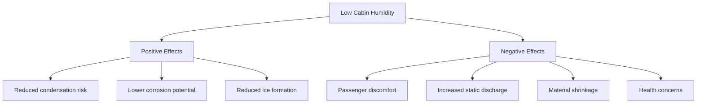

## Общие сведения

Влажность в салоне воздушного судна является критической проблемой систем управления окружающей средой. Коммерческие воздушные суда обычно поддерживают уровень относительной влажности от 5 до 15% в режиме крейсерского полета, что значительно ниже диапазона 30-60%, рекомендуемого ASHRAE Standard 55 для занимаемых помещений. Эта экстремальная сухость является результатом фундаментальной физики систем управления окружающей средой, использующих воздух от компрессора на высокой высоте, и отсутствия активного увлажнения.

## Физическая основа низкой влажности в салоне

### Влагосодержание на высоте

Абсолютная влажность наружного воздуха резко уменьшается с высотой из-за снижения температуры и меньшей способности атмосферы удерживать водяной пар:

$$
\omega = 0.622 \frac{P_v}{P_{atm} - P_v}
$$

где:
- $\omega$ = влагосодержание (г влаги/кг сухого воздуха)
- $P_v$ = парциальное давление водяного пара (кПа)
- $P_{atm}$ = атмосферное давление на высоте (кПа)

На крейсерской высоте 10 700 м температура наружного воздуха приближается к -48°C с почти нулевым содержанием влаги. Когда этот воздух сжимается, нагревается и подается в салон без увлажнения, относительная влажность падает до экстремально низких уровней.

### Баланс влаги в салоне

Влажность в салоне является результатом баланса между генерацией и удалением влаги:

$$
\dot{m}_{moisture,cabin} = \dot{m}_{gen,passengers} + \dot{m}_{gen,galley} - \dot{m}_{out,ventilation} - \dot{m}_{out,leakage}
$$

Типичные скорости генерации влаги:

| Источник | Скорость | Примечания |
|----------|---------|-----------|
| Пассажир в состоянии покоя | 0,055-0,068 кг/ч | Дыхание и потоотделение |
| Активный член экипажа | 0,091-0,113 кг/ч | Повышенный метаболизм |
| Операции в галерее | 0,227-0,907 кг/ч | Приготовление пищи, сервировка напитков |
| Использование туалета | 0,045-0,136 кг/ч на блок | Мытье рук, смыв |

## Физиологические эффекты

### Влияние на дыхательные пути

Низкая влажность влияет на дыхательную систему несколькими механизмами:

1. **Высыхание слизистых оболочек**: Слизистые оболочки носа и горла требуют влажной пленки для надлежащего функционирования
2. **Нарушение активности ресничек**: Снижение эффективности очистки от твердых частиц
3. **Повышенная восприимчивость**: Компрометация первой линии защиты иммунной системы

Зависимость между относительной влажностью и потерей влаги слизистыми оболочками:

$$
\dot{Q}_{evap} = h_{fg} \cdot A \cdot k \cdot (P_{sat,mucosa} - P_v)
$$

где:
- $\dot{Q}_{evap}$ = потеря теплоты испарением (кДж/ч)
- $h_{fg}$ = скрытая теплота парообразования (≈2500 кДж/кг)
- $A$ = площадь открытой слизистой оболочки (м²)
- $k$ = коэффициент массопередачи
- $P_{sat,mucosa}$ = давление насыщения при температуре тела

### Дискомфорт в глазах

Пользователи контактных линз испытывают ускоренное испарение слезной пленки. Скорость испарения с поверхности глаза линейно увеличивается с дефицитом давления пара:

$$
E_{eye} = k_{eye}(RH_{tear} - RH_{cabin})
$$

При влажности салона 10% по сравнению с 40% скорость испарения примерно утраивается, вызывая значительный дискомфорт при полетах длительностью более нескольких часов.

### Эффекты на кожу

Потеря влаги кожей подчиняется закону Фика диффузии через роговой слой:

$$
J = -D \frac{\partial C}{\partial x}
$$

Низкая влажность в салоне увеличивает градиент концентрации влаги, ускоряя трансэпидермальную потерю воды (TEWL) и вызывая:
- Сухую, шелушащуюся кожу
- Повышенное образование статического электричества
- Снижение восприятия теплового комфорта

## Операционные последствия

### Воздействие на системы воздушного судна

### Генерация статического электричества

Накопление поверхностного заряда экспоненциально увеличивается при снижении ОВ ниже 30%:

$$
\sigma = \sigma_0 \cdot e^{-k \cdot RH}
$$

где:
- $\sigma$ = поверхностная плотность заряда
- $\sigma_0$ = базовая плотность заряда
- $k$ = зависящая от материала постоянная
- $RH$ = относительная влажность (%)

События статического разряда могут повредить чувствительное авионическое оборудование и создать дискомфорт пассажирам.

## Стратегии смягчения последствий

### Инженерные решения

| Подход | Реализация | Эффективность | Штраф по весу |
|--------|-----------|---------------|----------------|
| Прямое увлажнение | Паровые/испарительные системы | Высокая (40-50% ОВ достижима) | 91-182 кг |
| Повышенная вентиляция | Более высокий обмен свежего воздуха | Низкая (12-18% ОВ) | Увеличение расхода топлива |
| Мембранные увлажнители | Выборочная передача воды | Средняя (20-30% ОВ) | 23-68 кг |
| Личные зоны влажности | Локальная подача влаги | Средняя (локальная выгода) | Минимальный |

### Системы активного увлажнения

Требуемая нагрузка испарения воды для достижения целевой влажности:

$$
\dot{m}_{water} = \dot{m}_{air} (\omega_{target} - \omega_{ambient})
$$

Для типичного широкофюзеляжного воздушного судна (25 500 CFM (432 м³/ч) вентиляции в режиме крейсерского полета):

$$
\dot{m}_{air} = 432 \frac{м^3}{ч} \times 1.21 \frac{кг}{м^3} = 523 \text{ кг/ч}
$$

Для повышения влажности с 10% до 30% ОВ при температуре в салоне 24°C требуется примерно 3,6-5,4 кг/ч добавления воды, в зависимости от скоростей вентиляции и утечек.

### Операционные процедуры

Экипаж воздушного судна может минимизировать дискомфорт, связанный с влажностью, посредством:

1. **Управление температурой**: Поддержание температуры в салоне на нижнем конце диапазона комфорта (22-23°C) снижает восприятие сухости
2. **Оптимизация вентиляции**: Балансировка подачи свежего воздуха для минимизации чрезмерной сушки
3. **Информирование пассажиров**: Поощрение гидратации и использования спреев с физиологическим раствором

## Соображения при проектировании

### Выбор материалов

Среды с низкой влажностью требуют материалов, устойчивых к:
- Изменению размеров с вариацией влагосодержания
- Хрупкости и растрескиванию
- Чрезмерному накоплению статического заряда

### Расположение датчиков влажности

Места мониторинга влажности должны представлять:
- Основные условия в салоне (середина салона, на уровне пассажиров)
- Критические зоны конденсации (окна кабины экипажа, грузовые отсеки)
- Производительность системы увлажнения (ниже по потоку от добавления влаги)

Требования к точности датчика: ±3% ОВ в диапазоне 5-30%, с временем отклика <60 секунд.

## Будущие технологии

Передовые системы управления окружающей средой в разработке:

- **Восстановление воды из топливных элементов**: Преобразование побочного продукта топливного элемента (водород) в влагу салона
- **Буферизация влажности на основе адсорбентов**: Поглощение влаги из галереи во время обслуживания, выделение в сухие периоды
- **Персональные системы управления окружающей средой**: Индивидуальное управление влажностью на уровне места пассажира

Эти технологии обеспечивают баланс между противоречивыми требованиями комфорта пассажиров, веса системы, потребления энергии и операционной эффективности воздушного судна.

## Стандарты и рекомендации

Хотя ASHRAE Standard 55 рекомендует 30-60% ОВ для теплового комфорта, управление окружающей средой в воздушном судне должно учитывать:
- Требования сертификации FAA (14 CFR Part 25)
- Максимальное предотвращение конденсации
- Ограничения по весу и сложности системы
- Воздействие на эффективность использования топлива

Авиационная промышленность продолжает оценивать соотношение затрат и выгод между системами повышенного увлажнения и улучшенным комфортом пассажиров для полетов длительностью более 8 часов.
