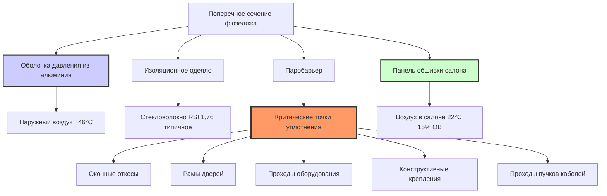
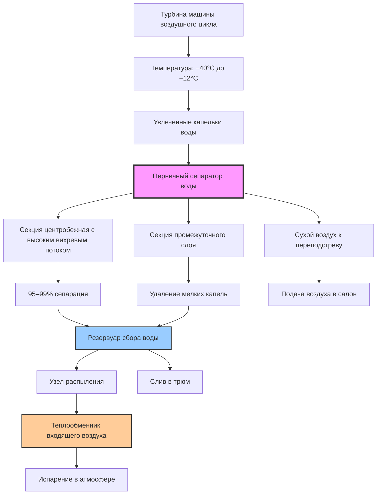
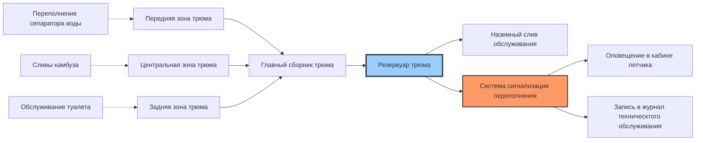

Контроль влажности в самолетах представляет критическую инженерную задачу, при которой неконтролируемая конденсация угрожает целостности конструкции, увеличивает массу и ускоряет коррозию. В отличие от наземных систем HVAC, самолеты работают в экстремальных температурных градиентах с нулевой допустимостью накопления влаги в конструктивных полостях.

## Физика конденсации в конструкциях самолета

Фундаментальная проблема контроля влажности вытекает из значительного температурного перепада между воздухом салона и наружными поверхностями во время полета на крейсерской скорости.

### Анализ температурного градиента

На типичной крейсерской высоте (10 700–12 500 м) температура кожи фюзеляжа достигает −40°C до −51°C, в то время как воздух в салоне поддерживается на уровне 20–24°C. Это создает тепловой градиент через систему изоляции, который вызывает миграцию влаги и конденсацию.

**Передача тепла через фюзеляж:**

$$q = \frac{T_{cabin} - T_{ambient}}{R_{total}}$$

где:
- $q$ = тепловой поток через фюзеляж (кВт/м²)
- $T_{cabin}$ = температура воздуха в салоне (°C)
- $T_{ambient}$ = температура наружного воздуха (°C)
- $R_{total}$ = полное термическое сопротивление (м²·K/кВт)

Для типичной изоляции широкофюзеляжного самолета (RSI 1,4–2,1):

$$q = \frac{22 - (-46)}{1,76} = 38,6 \text{ кВт/м}^2$$

### Точка росы и температура конденсации

Влага конденсируется, когда воздух соприкасается с поверхностями ниже его температуры точки росы. Депрессия точки росы определяет запас прочности против конденсации.

**Давление насыщенного водяного пара (формула Магнуса–Тетенса):**

$$e_s(T) = 6,112 \times e^{\frac{17,67T}{T + 243,5}}$$

где:
- $e_s$ = давление насыщенного водяного пара (мбар)
- $T$ = температура (°C)

**Температура точки росы:**

$$T_d = \frac{243,5 \ln(e/6,112)}{17,67 - \ln(e/6,112)}$$

где $e$ = фактическое давление водяного пара (мбар)

Для воздуха в салоне при 22°C и 15% ОВ точка росы составляет примерно −4°C. Любая поверхность ниже этой температуры будет накапливать конденсацию при воздействии воздуха салона.

## Проектирование паробарьера и требования

Паробарьеры предотвращают проникновение влажного воздуха салона через изоляционные одеяла и его контакт с холодной алюминиевой кожей.

### Материалы паробарьеров

Системы изоляции самолетов используют несколько технологий барьеров:

| Тип материала | Паропроницаемость (перм) | Применение | Диапазон температур |
|---------------|--------------------------|-----------|---------------------|
| Металлизированная полиэфирная пленка | 0,02–0,05 | Первичный паробарьер | −54°C до 121°C |
| Ламинат алюминиевой фольги | 0,001–0,01 | Критические зоны | −54°C до 149°C |
| Полиимидная пленка | 0,03–0,08 | Высокотемпературные области | −54°C до 204°C |
| Покрытое стекловолокно | 0,1–0,3 | Вторичные барьеры | −54°C до 177°C |

По SAE ARP85G паробарьеры должны поддерживать паропроницаемость ниже 0,1 пермы для предотвращения накопления влаги при типичных условиях полета.

### Механизмы миграции влаги

Три основных механизма способствуют прохождению влаги через системы изоляции:

**1. Диффузия пара через материалы**

Первый закон Фика управляет передачей пара:

$$J = -D \frac{dc}{dx}$$

где:
- $J$ = поток влаги (кг/ч·м²)
- $D$ = коэффициент диффузии (м²/ч)
- $dc/dx$ = градиент концентрации (кг/м³/м)

**2. Утечка воздуха через проходы**

Перепад давления заставляет влажный воздух проходить через щели, швы и проходы:

$$\dot{m} = C_d A \sqrt{2\rho\Delta P}$$

где:
- $\dot{m}$ = массовый расход (кг/ч)
- $C_d$ = коэффициент расхода (0,6–0,8 для проходов в самолетах)
- $A$ = площадь утечки (м²)
- $\rho$ = плотность воздуха (кг/м³)
- $\Delta P$ = перепад давления (Па)

При крейсерском давлении в салоне (75–78 кПа) в сравнении с внешним давлением (19–24 кПа) этот перепад вызывает значительное движение воздуха через любой незащищенный проход.

**3. Капиллярное действие в изоляции**

Волокнистые материалы изоляции проявляют капиллярный транспорт влаги при частичном намокании, перераспределяя конденсированную воду по всему одеялу.

### Критические зоны уплотнения

## Системы извлечения воды

Системы управления окружающей средой включают сепараторы воды для удаления конденсированной влаги из технологического воздуха перед его поступлением в салон.

### Технологии сепарации воды

**Сепаратор с высоким вихревым потоком (центробежный тип):**

Воздух, выходящий из турбинного расширителя, имеет температуру −40°C до −12°C с увлеченными капельками воды. Сепаратор придает касательную скорость, используя центробежную силу для сбора капель.

$$F_c = \frac{m v^2}{r}$$

где:
- $F_c$ = центробежная сила (кН)
- $m$ = масса капли (кг)
- $v$ = касательная скорость (м/с)
- $r$ = радиус сепаратора (м)

Типичные параметры производительности:

| Параметр | Значение | Примечания |
|----------|----------|-----------|
| Температура входящего воздуха | −40°C до −12°C | После турбинного расширения |
| Скорость вихрей | 30–61 м/с | Создается лопатками |
| Эффективность сепарации | 95–99% | Для капель >10 микрон |
| Перепад давления | 2–6 кПа | Через сепаратор |
| Скорость сбора воды | 5–18 кг/ч | На установку, крейсерский режим |

**Сепаратор с промежуточным слоем (тип ударного скопления):**

Мелкие капли соприкасаются с сеткой или гофрированными поверхностями, объединяясь в более крупные капли, которые под действием силы тяжести стекают в сборные резервуары.

Эффективность следует теории мишени:

$$\eta = 1 - e^{-K \cdot Stk}$$

где:
- $\eta$ = эффективность сбора
- $K$ = эмпирическая константа (1,5–3,0 для сепараторов в самолетах)
- $Stk$ = число Стокса = $\frac{\rho_p d_p^2 v}{18 \mu D_c}$

Параметры:
- $\rho_p$ = плотность частиц (998 кг/м³ для воды)
- $d_p$ = диаметр частиц (м)
- $v$ = скорость подхода (м/с)
- $\mu$ = вязкость воздуха (Па·с)
- $D_c$ = диаметр сборщика (м)

### Архитектура системы извлечения воды

### Методы удаления воды

Извлеченная вода требует удаления одним из трех методов:

**1. Распылительное испарение (основной метод)**

Вода распыляется на теплообменник входящего воздуха, испаряясь в поток входящего воздуха. Скорость испарения:

$$\dot{m}_{evap} = h_m A (W_{sat} - W_{\infty})$$

где:
- $\dot{m}_{evap}$ = скорость испарения (кг/ч)
- $h_m$ = коэффициент массопередачи (кг/ч·м²)
- $A$ = площадь смачиваемой поверхности (м²)
- $W_{sat}$ = коэффициент влажности на поверхности (кг/кг)
- $W_{\infty}$ = коэффициент влажности входящего воздуха (кг/кг)

**2. Слив мачты дренажа (резервный метод)**

Гравитационный дренажный патрубок выходит ниже фюзеляжа. Вода сливается за борт, когда гидростатическое давление превышает атмосферное:

$$\Delta P = \rho g h$$

Конструкция мачты предотвращает ледяную закупорку и всасывание входящего воздуха.

**3. Сбор в трюме (защита переполнения)**

Избыточная вода поступает в трюмные области самолета для удаления при наземном обслуживании. Емкость трюма рассчитана на максимальную длительность полета плюс 100% запас безопасности.

## Стратегии предотвращения конденсации

Несколько слоев защиты предотвращают конденсацию в конструкциях самолета.

### Активный контроль точки росы

Системы управления окружающей средой постоянно контролируют и ограничивают точку росы воздуха в салоне.

**Алгоритм управления:**

1. Измеряют температуру салона и относительную влажность в нескольких зонах
2. Рассчитывают текущую температуру точки росы
3. Оценивают минимальную температуру конструкции (кожа фюзеляжа, оконные откосы)
4. Поддерживают точку росы как минимум на 5,6°C ниже самой холодной предполагаемой поверхности
5. Снижают влажность или увеличивают вентиляцию, если точка росы приближается к пределу

**Запасы безопасности по зонам:**

| Расположение | Минимальная температура поверхности | Максимальная точка росы | Запас безопасности |
|--------------|--------------------------------------|-------------------------|-------------------|
| Стенка салона | 10°C (изолированная) | 4°C | 5,6°C |
| Оконный откос | 2°C (тепловой мост) | −4°C | 5,6°C |
| Рама двери | 7°C (изолированная) | 2°C | 5,6°C |
| Панель полета | 13°C (тепло грузового отсека) | 7°C | 5,6°C |

### Контроль температуры поверхности

Критические самолеты оснащены датчиками температуры в местах, склонных к конденсации:

- Внутренняя поверхность окна (тепловой мост)
- Области уплотнения дверей (пути утечки воздуха)
- Границы отсеков оборудования (температурный перепад)
- Места слива в камбузе (источники влаги)

Размещение датчиков следует тепловому моделированию для определения холодных участков, где сжатие изоляции, тепловой мост или модели циркуляции воздуха создают низкие температуры поверхности.

### Вентиляция и циркуляция воздуха

Надлежащая циркуляция воздуха предотвращает локальные повышения влажности и поддерживает однородную точку росы в салоне.

**Стратегия рециркуляции:**

Современные самолеты рециркулируют 40–60% воздуха салона, смешивая его со свежей подачей из установок системы управления окружающей средой. Этот подход:

- Снижает нагрузку на удаление влаги на ECS
- Поддерживает постоянную влажность по всему салону
- Предотвращает мертвые зоны, где накапливается влага
- Улучшает энергетическую эффективность

**Требования по кратности воздухообмена:**

По 14 CFR Part 25.831 и SAE ARP85G:
- Минимум свежего воздуха: 0,25 кг/мин на пассажира
- Общий воздухообмен: 15–20 воздухообменов в час (пассажирский салон)
- Отсеки оборудования: 8–12 воздухообменов в час (основной акцент на удаление тепла)

## Механизмы повреждения влагой и их предотвращение

Неконтролируемая влага вызывает множество режимов отказа в конструкциях самолета.

### Процессы коррозии

Алюминиевые сплавы, используемые в конструкции самолетов (2024-T3, 7075-T6), показывают ускоренную коррозию при воздействии влаги, особенно при загрязнении солью.

**Факторы скорости коррозии:**

| Условие | Относительная скорость коррозии | Снижение |
|---------|--------------------------------|----------|
| Сухой воздух (<30% ОВ) | 1,0 (база) | Поддерживать низкую влажность |
| Циклы конденсации | 5–10× | Исключить воздействие влаги |
| Загрязненная солью влага | 20–50× | Предотвратить попадание соли, уплотнить барьеры |
| Постоянное погружение | 15–25× | Системы дренажа, ингибиторы коррозии |

**Гальваническая коррозия в многометальных конструкциях:**

Различия электрохимического потенциала между алюминием и титановыми/стальными крепежами ускоряют коррозию во влажных условиях:

$$i_{corr} = \frac{E_{cathode} - E_{anode}}{R_{electrolyte}}$$

где ток коррозии увеличивается с проводимостью влаги.

### Весовой штраф от накопления влаги

Вода, попавшая в изоляционные одеяла, добавляет значительный вес. Широкофюзеляжный самолет с нарушенными паробарьерами может накопить 91–227 кг воды при нормальных операциях.

**Расчет весового воздействия:**

Для 372 м² изоляции фюзеляжа толщиной 1,27 см:
- Объем изоляции: 4,73 м³
- Плотность стекловолокна: 9,6 кг/м³ (сухая)
- Удержание воды: 30% по объему при насыщении
- Масса влаги: 4,73 м³ × 0,3 × 998 кг/м³ = 1418 кг

Этот экстремальный случай демонстрирует критичность целостности паробарьера.

### Методы проверки и обнаружения

Регулярные проверки выявляют накопление влаги до возникновения повреждения конструкции:

**1. Визуальная проверка**
- Водяные пятна на панелях салона
- Продукты коррозии (белый порошок на алюминии)
- Деформированные или провисающие изоляционные одеяла
- Накопление воды в трюме

**2. Приборы обнаружения влаги**
- Емкостные влагомеры (неразрушающие)
- Инфракрасная термография (выявляет влажную изоляцию)
- Ультразвуковое тестирование (выявляет скрытую коррозию)

**3. Бороскопическая проверка**
- Прямой просмотр недоступных областей
- Через смотровые отверстия в полу салона
- Оценка состояния паробарьера

## Проектирование систем трюма и дренажа

Системы трюма самолета собирают и управляют водой из множества источников.

### Источники воды и объемы

Типичные точки поступления воды:

| Источник | Объем (л/полет) | Примечания |
|----------|-----------------|-----------|
| Слив камбуза переполнения | 2–8 | Нормальные операции |
| Утечки в туалетах | 0,4–4 | Износ уплотнений |
| Конденсация в грузовом отсеке | 4–11 | Влага в багаже |
| Переполнение сепаратора воды ECS | 2–6 | Режим неисправности |
| Попадание дождя (наземные операции) | 0,8–4 | Уплотнение дверей, панели обслуживания |

### Архитектура системы трюма

### Требования системы дренажа

По SAE ARP85G и спецификациям производителей планеров:

- Емкость трюма: Минимум 19 л плюс ожидаемая нагрузка влаги на самый длинный полетный сегмент
- Скорость дренажа: Полный дренаж трюма за <15 минут при наземном обслуживании
- Уклон: Минимум 1° к точкам сбора по всему полу фюзеляжа
- Материал: Коррозионностойкий (обычно титан или нержавеющая сталь)
- Защита от замерзания: Нагревательные приспособления для дренажных линий в неизолированных областях

## Нормативные стандарты и сертификация

Системы контроля влажности должны соответствовать требованиям нескольких нормативных актов.

### Требования FAA

**14 CFR Part 25:**
- §25.831: Вентиляция (включает положения контроля влажности)
- §25.1439: Защитное дыхательное оборудование (воздействие влаги на системы кислорода)

**Консультативные циркуляры:**
- AC 25-20: Улучшенные стандарты летноподобности для самолетов транспортной категории
- AC 20-62E: Приемлемость, качество и идентификация аэронавигационных запасных частей

### Стандарты промышленности

**Рекомендуемые методики аэрокосмической промышленности SAE:**
- **ARP85G:** Системы кондиционирования воздуха для дозвуковых самолетов (комплексные требования контроля влажности)
- **ARP1270:** Системы управления герметизацией кабины самолета (воздействие конденсации на управление давлением)
- **ARP994F:** Изоляционные одеяла самолета (спецификации паробарьеров)

**Требования к испытаниям:**
- Испытание наземное при высокой влажности: 35°C при 95% ОВ в течение 6 часов
- Испытание в альтитудной камере: Полный профиль полета, включая сценарии спуска/скачка влажности
- Испытание при холодном замачивании: −54°C наружная, +24°C внутренняя для проверки конденсации
- Моделирование длительного крейсерского режима: 16-часовое моделирование полета для оценки накопления влаги

### Демонстрация сертификации

Новые системы увлажнения или модификации контроля влажности требуют:

1. Анализ, показывающий отсутствие конденсации при наихудших условиях (температура, влажность, профиль высоты)
2. Испытание, демонстрирующее целостность паробарьера по всему рабочему диапазону
3. Процедуры проверки для выявления накопления влаги
4. Интервалы технического обслуживания для обслуживания сепаратора воды и проверки трюма
5. Ограничения летного руководства для управления точкой росы

## Возникающие технологии

Самолеты нового поколения включают передовые подходы к контролю влажности:

- **Активные паробарьеры:** Электрически нагреваемые барьерные пленки поддерживают температуру поверхности выше точки росы в критических местах
- **Изоляция с осушителем:** Силикагель или молекулярное сито, встроенные в изоляционные одеяла, поглощают влагу перед контактом с холодными поверхностями
- **Интеллектуальные датчики:** Распределенные датчики влажности по всей конструкции обеспечивают картирование мокрых/сухих зон в реальном времени
- **Прогнозные алгоритмы:** Модели машинного обучения прогнозируют риск конденсации на основе профиля полета, погодных условий и параметров системы

Эти технологии позволяют повысить влажность в салоне при сохранении защиты конструкции, улучшая комфорт пассажиров на дальних рейсах.
