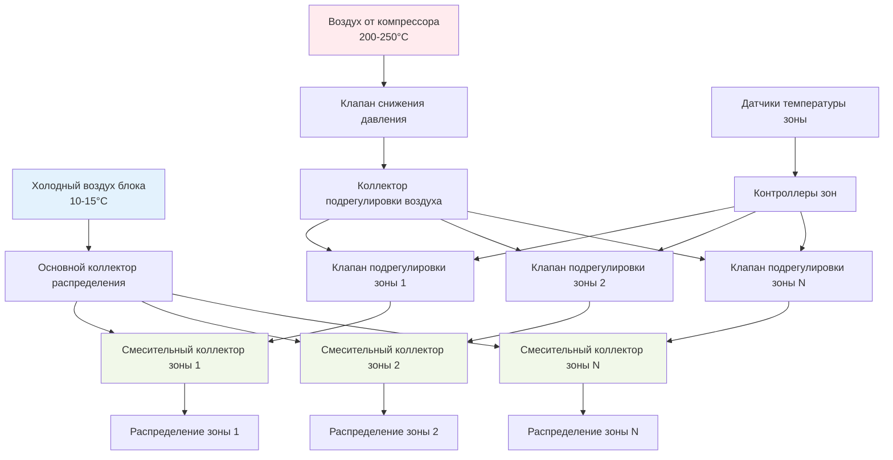
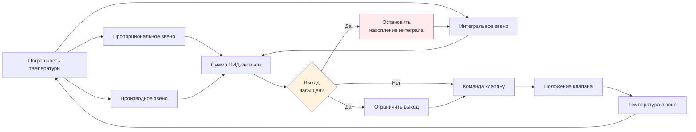

Контроль температурных зон салона представляет собой основную архитектуру, обеспечивающую управление климатом отдельных участков воздушного судна. Современные коммерческие воздушные суда разделяют салон на 6–12 независимых температурных зон, каждая из которых поддерживает точные тепловые условия путем модуляции клапанов подрегулировки воздуха, смешивающих горячий воздух из компрессора двигателя с холодным воздухом из блока холодоснабжения. Такой зонированный подход обеспечивает учет предпочтений пассажиров, различных тепловых нагрузок и эксплуатационных требований при оптимизации энергоэффективности и минимизации штрафа по массе.

## Проектирование многозонной архитектуры

Разделение салонов воздушных судов на дискретные температурные зоны следует как продольным, так и поперечным схемам на основе геометрии фюзеляжа, плотности пассажиров и распределения тепловой нагрузки.

### Конфигурация продольных зон

Широкофюзеляжные воздушные суда обычно реализуют 8–12 продольных зон:

| Расположение зоны | Типичная длина | Количество пассажиров | Приоритет контроля |
|-------------------|----------------|-----------------------|-------------------|
| Полетная палуба | 0,9–1,5 м | 2–4 экипаж | Максимальная точность |
| Передний вход | 0,6–0,9 м | 8–12 | Быстрый отклик |
| Передний салон | 2,4–3,7 м | 30–50 | Комфорт премиум-класса |
| Передняя средняя часть | 3,0–4,6 м | 40–60 | Стандартный контроль |
| Центральная средняя часть | 3,0–4,6 м | 40–60 | Высокая плотность |
| Задняя средняя часть | 3,0–4,6 м | 40–60 | Близость к камбузу |
| Задний салон | 2,4–3,7 м | 30–50 | Стандартный контроль |
| Задний вход | 0,6–0,9 м | 8–12 | Быстрый отклик |

Узкофюзеляжные воздушные суда имеют 4–6 зон с каждой зоной, обслуживающей 25–40 пассажиров. Сокращенное количество зон упрощает сложность управления, но обеспечивает менее детальное управление температурой.

**Оптимизация длины зоны:**

Длина зоны уравновешивает точность управления и сложность системы. Более короткие зоны обеспечивают лучшую однородность температуры, но требуют дополнительных клапанов подрегулировки воздуха, датчиков и контроллеров. Оптимальная длина зоны соответствует:

$$L_{zone} = \sqrt{\frac{2kA_{cross}\Delta T_{max}}{q_{pass} \cdot n_{pass}}}$$

Где:
- $L_{zone}$ = оптимальная длина зоны (м)
- $k$ = теплопроводность изоляции салона (0,03–0,04 Вт/м·К)
- $A_{cross}$ = площадь сечения салона (м²)
- $\Delta T_{max}$ = максимально допустимое изменение температуры (1,5–2,0 °C)
- $q_{pass}$ = выделение тепла одним пассажиром (75–100 Вт)
- $n_{pass}$ = плотность пассажиров (пассажиров/м)

### Стратегия вертикального распределения

Управление температурой распространяется на трехмерные схемы потока воздуха, выходя за рамки простого продольного зонирования:

**Вертикальное расслоение:**
- Распределение сверху: 60–70 % потока воздуха в зоне
- Распределение снизу: 30–40 % потока воздуха в зоне
- Соотношение смешивания отрегулировано для предотвращения тепловой стратификации
- Целевой вертикальный градиент: ≤1,5 °C от пола до потолка

**Боковое распределение:**
- Зоны возле окон получают компенсацию дополнительной солнечной нагрузки
- Центральные проходы получают выгоду от смешивания с соседними зонами
- Индивидуальные регулируемые выходы обеспечивают локальный контроль (25–42 м³/ч)

## Работа клапана подрегулировки воздуха

Клапаны подрегулировки воздуха модулируют подачу горячего воздуха от компрессора в смесительный коллектор каждой зоны, обеспечивая основной механизм управления температурой. Эти пневматические или электропневматические клапаны работают непрерывно для поддержания заданного значения температуры в зоне.

### Конструкция и характеристики клапана

**Характеристики пневматического клапана подрегулировки воздуха:**

| Параметр | Типичное значение | Инженерные требования |
|----------|-------------------|----------------------|
| Давление входа | 207–310 кПа | Регулируется от воздуха компрессора |
| Пропускная способность | 23–68 кг/ч | В зависимости от требований зоны |
| Время отклика | 0,5–1,5 сек | Ход 10–90 % |
| Точность позиционирования | ±2 % от полного хода | Повторяемость |
| Температура эксплуатации | −55 до +250 °C | Во всем диапазоне полетов |
| Утечка при закрытии | <0,5 % от максимального потока | Полностью закрытое положение |

Клапан модулируется от полностью закрытого (0 % горячего воздуха, максимальное охлаждение) к полностью открытому (100 % горячего воздуха, максимальный нагрев). Промежуточные положения смешивают холодный воздух блока с горячим воздухом от компрессора для достижения необходимой для каждой зоны точной температуры.

**Характеристики потока клапана:**

Клапаны подрегулировки воздуха используют равнопроцентные характеристики потока, обеспечивающие более точный контроль при низких открытиях, где чувствительность комфорта пассажиров наиболее высока:

$$Q_{trim} = Q_{max} \cdot R^{(x-1)}$$

Где:
- $Q_{trim}$ = скорость потока подрегулировки воздуха (кг/ч)
- $Q_{max}$ = максимальная пропускная способность клапана (кг/ч)
- $R$ = коэффициент диапазона (типично 20–50)
- $x$ = доля позиции клапана (0–1)

Эта характеристика гарантирует, что небольшие движения клапана при низких открытиях производят пропорционально меньшие изменения температуры, чем эквивалентные движения при полном открытии, предотвращая чрезмерную коррекцию и скачки.

### Термодинамика смесительного коллектора

Смесительный коллектор комбинирует холодный воздух блока с горячим подрегулировочным воздухом через смешивание, вызванное импульсом:

$$T_{supply} = \frac{\dot{m}_{pack} \cdot c_p \cdot T_{pack} + \dot{m}_{trim} \cdot c_p \cdot T_{trim}}{\dot{m}_{pack} \cdot c_p + \dot{m}_{trim} \cdot c_p}$$

Упрощение при постоянной удельной теплоемкости:

$$T_{supply} = \frac{\dot{m}_{pack} \cdot T_{pack} + \dot{m}_{trim} \cdot T_{trim}}{\dot{m}_{pack} + \dot{m}_{trim}}$$

Где:
- $T_{supply}$ = температура смешанного поступающего воздуха (°C)
- $\dot{m}_{pack}$ = скорость потока воздуха блока (кг/ч)
- $T_{pack}$ = температура выпуска блока (10–15 °C)
- $\dot{m}_{trim}$ = скорость потока подрегулировки воздуха (кг/ч)
- $T_{trim}$ = температура подрегулировки воздуха (200–250 °C)
- $c_p$ = удельная теплоемкость воздуха (константа)

**Практический расчет смешивания:**

Для зоны, требующей поступающего воздуха 22 °C с воздухом блока при 12 °C и подрегулировочным воздухом при 230 °C:

$$\frac{\dot{m}_{trim}}{\dot{m}_{pack}} = \frac{T_{supply} - T_{pack}}{T_{trim} - T_{supply}} = \frac{22 - 12}{230 - 22} = 0,048$$

Это требует потока подрегулировки воздуха, равного 4,8 % потока воздуха блока. Если зона получает 363 кг/ч воздуха блока, поток подрегулировки воздуха должен быть 17,4 кг/ч.

## Измерение температуры в зонах

Точное измерение температуры критично для эффективного управления зоной. Размещение датчика, стратегии усреднения и время отклика напрямую влияют на комфорт и стабильность.

### Стратегия размещения датчиков

Каждая зона обычно включает 2–4 датчика температуры, размещенные для измерения репрезентативных условий в зоне:

**Основной датчик зоны:**
- Местоположение: решетка возврата воздуха или потолочный плинтус
- Измеряет: температуру смешанного воздуха в салоне
- Время отклика: 10–30 секунд
- Точность: ±0,5 °C

**Вторичные датчики зоны:**
- Местоположения: передняя и задняя границы зоны
- Функция: обнаружение тепловых градиентов и асимметрий
- Используются для: улучшения управления и обнаружения неисправностей

**Датчик поступающего воздуха:**
- Местоположение: ниже по потоку смесительного коллектора
- Измеряет: фактическая температура поступающего воздуха
- Функция: проверка положения клапана и диагностика системы подрегулировки воздуха

### Усреднение и фильтрация температуры

Контроллеры зон усредняют несколько входов датчиков для предотвращения вызванной локализованными возмущениями нестабильности управления:

$$T_{zone} = \sum_{i=1}^{n} w_i \cdot T_i$$

Где:
- $T_{zone}$ = взвешенная средняя температура зоны (°C)
- $w_i$ = весовой коэффициент датчика $i$ (Σ$w_i$ = 1)
- $T_i$ = температура отдельного датчика (°C)
- $n$ = количество датчиков на зону (2–4)

Типичное взвешивание присваивает 60–70 % основному датчику возврата воздуха с оставшимся весом распределенным среди граничных и поступающих датчиков.

**Цифровая фильтрация:**

Сырые показания датчиков проходят через фильтры первого порядка для исключения переходных шумов:

$$T_{filtered}(t) = T_{filtered}(t-1) + \frac{\Delta t}{\tau + \Delta t} \cdot [T_{measured}(t) - T_{filtered}(t-1)]$$

Где:
- $\tau$ = временная константа фильтра (20–60 секунд)
- $\Delta t$ = интервал выборки (1–5 секунд)

Более длинные временные константы улучшают подавление шума, но снижают отзывчивость на фактические изменения температуры.

## Реализация ПИД-управления

Контроллеры температуры зон используют алгоритмы пропорционально-интегрально-производные (ПИД), преобразующие погрешность температуры в команды положения клапана подрегулировки воздуха.

### Структура алгоритма управления

$$u(t) = K_p \cdot e(t) + K_i \int_0^t e(\tau)d\tau + K_d \frac{de(t)}{dt}$$

Где:
- $u(t)$ = выход контроллера (команда положения клапана, 0–100 %)
- $e(t)$ = погрешность температуры = $T_{setpoint} - T_{zone}$ (°C)
- $K_p$ = коэффициент усиления пропорциональности (% на °C)
- $K_i$ = коэффициент усиления интегрирования (% на °C·с)
- $K_d$ = коэффициент усиления дифференцирования (% на °C/с)

**Типичные параметры настройки ПИД:**

| Коэффициент управления | Диапазон значений | Функция |
|------------------------|-------------------|---------|
| $K_p$ | 15–30 % на °C | Немедленный отклик на погрешность |
| $K_i$ | 0,5–2,0 % на °C·мин | Исключение установившегося смещения |
| $K_d$ | 2–8 % на °C/мин | Демпфирование колебаний |

### Защита от интегрального насыщения

Интегральное насыщение возникает когда клапан достигает физических пределов (полностью открыт или закрыт) при сохранении погрешности температуры. Логика защиты от насыщения предотвращает чрезмерное накопление интеграла:

При насыщении выхода накопление интеграла приостанавливается до тех пор, пока погрешность не измениться направлением, предотвращая чрезмерные колебания при условиях, позволяющих клапану отойти от предела.

### Планирование коэффициентов усиления

Коэффициенты ПИД изменяются в зависимости от условий эксплуатации для поддержания согласованной производительности:

**Планирование по высоте:**
- Более высокие коэффициенты на крейсерской высоте (сниженная плотность воздуха улучшает отклик)
- Более низкие коэффициенты при наземной работе (более высокая тепловая инерция)

**Планирование по нагрузке:**
- Повышенное интегральное усиление при высокой загрузке пассажирами (более быстрое подавление возмущений)
- Сниженное производное усиление при посадке (предотвращение реакции на открывание двери)

## Взаимодействие и связанность зон

Управление температурой в одной зоне влияет на соседние зоны путем теплопередачи через конструкцию салона и смешивания потока воздуха на границах зон.

### Модель термической связанности

Теплопередача между соседними зонами следует:

$$Q_{coupling} = U_{partition} \cdot A_{partition} \cdot (T_{zone1} - T_{zone2})$$

Где:
- $Q_{coupling}$ = межзонная теплопередача (Вт)
- $U_{partition}$ = проводимость перегородки (2–5 Вт/м²·К для перегородок салона)
- $A_{partition}$ = площадь перегородки (типично 8–15 м²)

Для разности температур 2 °C между соседними зонами, разделенными перегородкой площадью 12 м² с U = 3 Вт/м²·К:

$$Q_{coupling} = 3 \times 12 \times 2 = 72 \text{ Вт}$$

Это представляет примерно 1 % типичной холодильной производительности зоны (17,6–28,1 кВт), указывая на слабую термическую связанность между зонами.

### Стратегии развязки

**Компенсация с предварительной обратной связью:**
Контроллеры зон контролируют температуры соседних зон и упреждающе корректируют клапаны подрегулировки воздуха для нейтрализации предсказываемых эффектов связанности.

**Реализация мертвой зоны:**
Мертвые зоны управления ±0,5 °C предотвращают скачки и снижают взаимодействие:
- Нет корректировки клапана для погрешностей в пределах мертвой зоны
- Постепенное действие управления для погрешностей чуть вне мертвой зоны
- Полное управление ПИД для погрешностей >1,5 °C от заданного значения

## Метрики производительности

Эффективность системы управления температурной зоной измеряется через несколько критериев производительности:

| Метрика | Целевое значение | Метод измерения |
|---------|------------------|-----------------|
| Точность в установившемся режиме | ±0,5 °C от заданного значения | 10-минутное усреднение при крейсере |
| Время отклика | <5 минут для изменения на 3 °C | Тест переходного отклика |
| Пространственная однородность | ±1,0 °C в пределах зоны | Сравнение нескольких датчиков |
| Перерегулирование | <1,0 °C | Анализ переходного отклика |
| Энергетическая эффективность | Минимальное использование подрегулировки воздуха | Мониторинг положения клапана |

Современные системы управления температурной зоной воздушных судов достигают этих целей благодаря усовершенствованному синтезу датчиков, адаптивным алгоритмам ПИД и предсказательной компенсации переходов летной фазы, солнечных нагрузок и схем активности пассажиров.

## Интеграция с системами воздушного судна

Управление температурной зоной салона взаимодействует с более широкими системами экологического контроля и управления воздушным судном:

- **Контроллеры блока:** Координируют заданные значения температуры блока с требуемой подачей подрегулировки воздуха в зоне
- **Система управления полетом:** Обеспечивает высоту, воздушную скорость и температуру окружающей среды для планирования коэффициентов усиления
- **Система обслуживания пассажиров:** Позволяет отдельным пассажирам регулировать температуру в пределах лимитов зоны
- **Компьютеры обслуживания:** Регистрируют производительность температуры зоны и переключение клапана для диагностики

Эта многоуровневая архитектура управления обеспечивает согласованный тепловой комфорт во всех зонах салона на протяжении всего диапазона полетов при одновременной оптимизации потребления энергии и долговечности компонентов.
