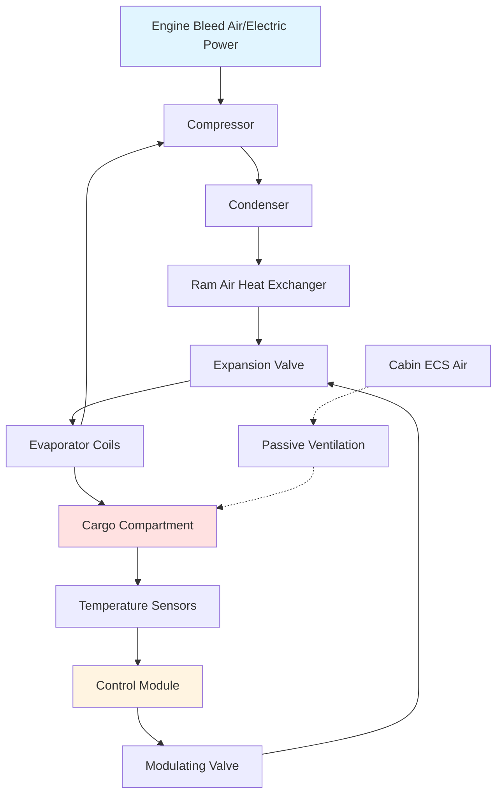

## Фундаментальные принципы

Системы контроля температуры грузовых отсеков самолётов поддерживают заданные тепловые условия для грузов от естественной вентиляции до активного охлаждения. Проектная задача сосредоточена на минимизации массы и потребления энергии при обеспечении надёжного контроля температуры в различных условиях окружающей среды и режимах полёта.

Контроль температуры груза работает в существенно отличающихся от кондиционирования салона условиях. Отсутствие пассажиров исключает требования к вентиляции, что позволяет использовать герметичные отсеки с рециркуляцией воздуха. Тепловые нагрузки происходят в основном от солнечного излучения на фюзеляж, выделения тепла оборудованием и теплопроводности через границы, а не от метаболических источников.

## Конфигурации системы

### Системы пассивной вентиляции

Отсеки массового груза в большинстве гражданских самолётов используют пассивную вентиляцию кондиционированным воздухом из системы контроля окружающей среды салона. Этот подход выпускает воздух салона в грузовой отсек перед выбросом за борт, обеспечивая отопление в крейсерском полёте при ограничении крайних температур.

Теплопередача между салоном и грузом происходит через:

$$Q_{bulk} = UA(T_{cabin} - T_{cargo}) + \dot{m}c_p(T_{supply} - T_{cargo})$$

где $U$ представляет общий коэффициент теплопередачи через границу отсека (обычно 4,5–6,8 Вт/(м²·К)), $A$ — площадь поверхности, $\dot{m}$ — массовый расход вентиляционного воздуха.

Пассивные системы поддерживают температуру груза в диапазоне 7–24°C во время типичных операций, с нижним пределом, предотвращающим замораживание температурочувствительных грузов, и верхним пределом, контролируемым отводом тепла от воздуха салона.

### Активное охлаждение груза

Грузовые отсеки с регулируемой температурой используют системы парокомпрессионного охлаждения, приводимые воздухом от двигателей или электрическими системами. Эти системы поддерживают температуры от -29 до 24°C для фармацевтических, скоропортящихся и биологических грузов.

Цикл охлаждения работает при высоких давлениях конденсатора из-за ограниченной доступности теплоприёмника:

$$COP_{actual} = \frac{Q_{evap}}{W_{comp}} = \eta_{carnot} \cdot \frac{T_{evap}}{T_{cond} - T_{evap}}$$

Системы охлаждения груза в самолётах достигают значений COP от 1,5 до 2,5, значительно ниже, чем наземные системы, из-за оптимизированных по массе компонентов и повышенных температур конденсации.

## Расчёты тепловых нагрузок

Нагрузки охлаждения грузового отсека включают теплопроводность через границы, солнечное излучение, выделение тепла оборудованием и инфильтрацию воздуха при операциях на земле:

$$Q_{total} = Q_{cond} + Q_{solar} + Q_{equip} + Q_{infil}$$

### Нагрузки теплопроводности

Теплопередача через кожу фюзеляжа и переборки представляет доминирующий компонент нагрузки в крейсерском режиме:

$$Q_{cond} = \sum UA(T_{ambient} - T_{cargo})$$

Общий коэффициент теплопередачи учитывает:
- Теплопроводность алюминиевого фюзеляжа (λ = 222 Вт/(м·К))
- Слои теплоизоляции (обычно RSI 1,8–2,6)
- Внутренние коэффициенты плёночного теплообмена
- Эффекты пограничного слоя на внешней границе

На высоте крейсера внешняя температура кожи достигает -40 до -51°C, создавая существенные потери тепла из регулируемых по температуре отсеков, требующие непрерывной подачи тепла.

### Солнечное излучение

Во время операций на земле солнечное усиление через фюзеляж становится критическим:

$$Q_{solar} = \alpha \cdot A_{projected} \cdot I_{solar} \cdot SHGF$$

где $\alpha$ — поглощающая способность наружной окраски (0,3–0,5 для белой краски), $A_{projected}$ — проектируемая площадь, $I_{solar}$ представляет падающее солнечное излучение (максимум 790–950 Вт/м²).

## Архитектура системы

## Стратегии температурного зонирования

Современные грузовые самолёты реализуют несколько температурных зон для размещения разнообразных требований грузов:

| Тип зоны | Диапазон температуры | Применение | Метод управления |
|----------|-------------------|-------------|------------------|
| Окружающая | 7–24°C | Общий груз | Пассивная вентиляция |
| Охлаждаемая | 2–7°C | Скоропортящиеся грузы, фармацевтика | Активное охлаждение |
| Замороженная | -29 до -18°C | Замороженные товары, биологические образцы | Активное охлаждение |
| Отапливаемая | 16–24°C | Живые животные, чувствительные материалы | Активное отопление |

Стратификация температуры в отсеках требует циркуляции воздуха под давлением. Эффективность смешивания зависит от:

$$\varepsilon_{mix} = \frac{T_{supply} - T_{exhaust}}{T_{supply} - T_{zone}}$$

Циркуляционные вентиляторы потребляют 200–500 Вт на отсек, представляя значительные электрические нагрузки на широкофюзеляжных грузовых самолётах с несколькими температурными зонами.

## Системы управления

Контроллеры температуры груза используют каскадные управляющие циклы с внешним контролем температуры и внутренним управлением потоком хладагента. Алгоритм управления регулирует производительность компрессора и положение дроссельного вентиля для поддержания уставки:

$$\dot{m}_{ref} = K_p(T_{setpoint} - T_{actual}) + K_i\int(T_{setpoint} - T_{actual})dt$$

Датчики температуры стратегически расположены, чтобы избежать термических градиентов около регистров подачи и вентиляционных решёток. Типичные требования к точности датчика составляют ±1,1°C с временем отклика 1 минута.

## Операции на земле

Наземные блоки предварительного кондиционирования груза (PCU) подключаются к грузовым системам самолёта при загрузке, обеспечивая кондиционированный воздух без работы систем самолёта. Требования к производительности PCU зависят от:

$$Q_{PCU} = Q_{pulldown} + Q_{infiltration} + Q_{solar}$$

Нагрузки охлаждения до уставки доминируют при загрузке горячего груза в охлаждаемые отсеки. Требуемая производительность охлаждения достигает 17–35 кВт для грузовых отсеков широкофюзеляжных самолётов, со временем охлаждения 30–60 минут.

## Стандарты производительности

ASHRAE Research Project RP-1596 установил руководящие принципы для контроля окружающей среды в грузовых отсеках, задав:

- Равномерность температуры: ±2,8°C по всему отсеку
- Время восстановления: возврат к уставке в течение 15 минут после закрытия двери
- Производительность на высоте: поддержание производительности до 13 100 м
- Надёжность: 0,99+ готовность к вылету

Правила Федерального управления авиации (FAA) требуют контроля температуры и сигнализации для груза, содержащего опасные материалы, с индикацией в кабине экипажа о превышениях температуры за определённые пределы.

## Энергетические соображения

Активный контроль температуры груза налагает существенный спрос на электрическую энергию и воздух от двигателей. Типичный широкофюзеляжный грузовой самолёт с тремя охлаждаемыми грузовыми отсеками потребляет 15–25 кВт электрической энергии и 90–136 кг/ч воздуха от двигателей для кондиционирования груза.

Удельное потребление энергии на единицу объёма груза:

$$SEC = \frac{P_{total}}{V_{cargo}} = 0,3-0,5 \text{ кВт/м}^3$$

Современные самолёты тяготеют к электрически приводимым системам парокомпрессионного охлаждения, питаемым высокомощными генераторами, исключая штрафы от отбора воздуха от двигателей, которые снижают эффективность двигателя на 1–2%.

## Оптимизация проектирования

Минимизация массы определяет проектирование грузовой системы. Каждый килограмм HVAC-оборудования снижает грузоподъёмность, создавая экономическое давление для лёгких компонентов:

- Алюминиевые испарительные змеевики с микроканальной геометрией
- Высокооборотные компрессоры (30 000–50 000 об/мин) с магнитными подшипниками
- Материалы тонкоплёночной теплоизоляции (толщина 1,3–2,5 см)
- Композитные воздуховоды, заменяющие традиционный алюминий

Отношение мощности к массе для систем охлаждения груза в самолётах достигает 22–33 Вт/кг, в сравнении с 4–9 Вт/кг для наземных систем, отражая премию на снижение массы в аэрокосмических приложениях.

---

*Этот контент предоставляет техническое руководство инженерного уровня для профессионалов HVAC, участвующих в проектировании, спецификации и устранении неисправностей систем контроля температуры грузов в самолётах.*
