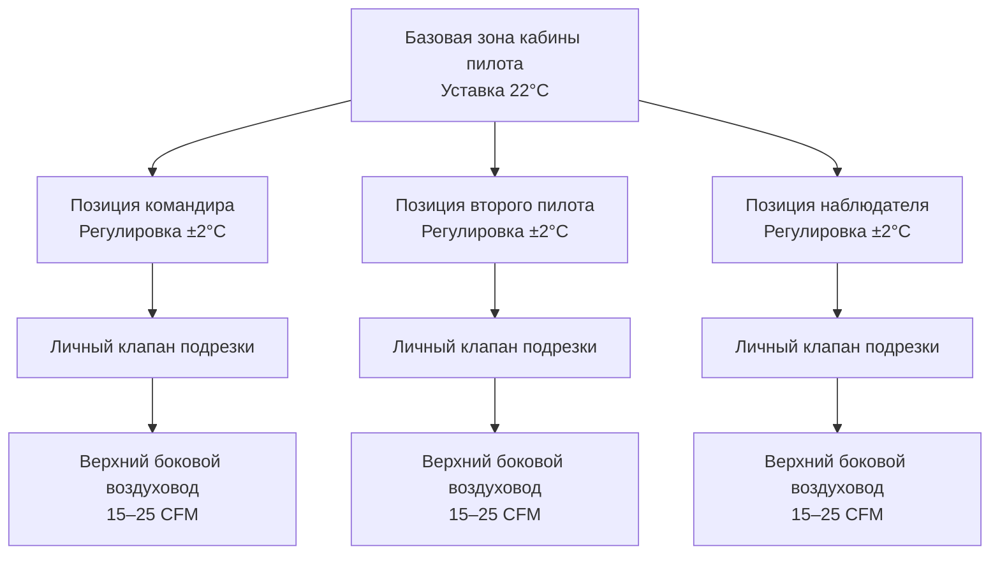
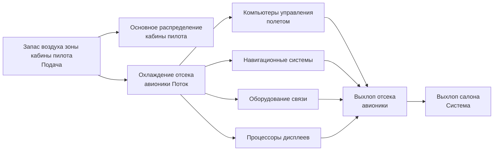
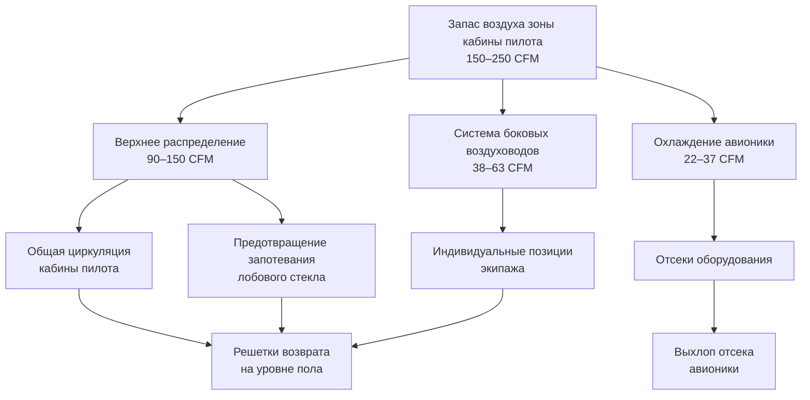

Управление климатом кабины пилота представляет наиболее требовательное требование к регулированию температуры в системах экологического контроля воздуха летательного аппарата. Среда палубы полетов прямо влияет на производительность экипажа, способность принимать решения и безопасность. В отличие от зон пассажирского салона, где достаточна допустимость ±1,5°C, системы кабины пилота поддерживают точность ±0,5°C при интегрировании теплового управления авионикой, обогрева лобового стекла и индивидуальной регулировки комфорта экипажа. Это специализированное зональное управление работает непрерывно от тропических наземных операций через крейсерский полет на большой высоте и операции подхода в арктических условиях.

## Архитектура зональной системы палубы полетов

### Независимое зональное управление кабиной пилота

Современные коммерческие самолеты выделяют палубу полетов в отдельную зону экологического контроля с независимым регулированием температуры, отделенное от управления пассажирским салоном. Эта архитектура обеспечивает:

**Компоненты выделенной зоны:**
- Изолированный массив датчиков температуры: 3–5 датчиков, расположенных на уровне глаз экипажа
- Независимый клапан подрезки: диапазон модуляции 0–100% с разрешением 1%
- Выделенный смешивающий коллектор: смешивает холодный воздух упаковки с горячим воздухом подрезки
- Контроллер зоны: двухканальное резервное управление PID с разрешением 0,1°C
- Индивидуальная регулировка экипажа: возможность переопределения ±2°C на каждой позиции экипажа

**Спецификации контроля температуры:**

| Параметр | Требования кабины пилота | Пассажирский салон | Преимущество дифференциала |
|-----------|------------------------|-----------------|--------------------------|
| Допуск температуры | ±0,5°C | ±1,5°C | 3× точность |
| Диапазон уставки | 18–29°C | 18–30°C | Более узкий для консистентности |
| Время отклика (шаг 3°C) | < 2 мин | < 5 мин | 2,5× быстрее |
| Разрешение управления | 0,1°C | 0,5°C | 5× более тонкая регулировка |
| Точность датчика | ±0,3°C | ±0,5°C | Более высокая точность |

Зона кабины пилота получает приоритет в распределении выходного потока упаковки ECS. Во время условий высокой тепловой нагрузки (наземные операции в жарком климате), система экологического контроля поддерживает уставку температуры кабины пилота, позволяя температурам пассажирского салона повышаться до 2°C выше уставки.

### Характеристики тепловой нагрузки

Тепловые нагрузки палубы полетов существенно отличаются от зон пассажирского салона из-за плотности оборудования и воздействия солнечного излучения:

**Источники тепловой нагрузки:**

| Источник | Тепловая нагрузка | Примечания |
|----------|-----------|-----------|
| Солнечное излучение через лобовое стекло | 500–1500 Вт | Варьируется в зависимости от угла солнца, широты, времени суток |
| Метаболическое тепло экипажа | 200–300 Вт | 2–3 члена экипажа на 100–150 Вт каждый |
| Оборудование авионики | 3000–8000 Вт | Системы управления полетом, навигации, связи |
| Освещение и дисплеи | 200–500 Вт | Приборные панели, верхние панели, экраны дисплеев |
| Обогрев лобового стекла | 0–2000 Вт | Электрический резистивный обогрев при активации |
| Обогрев боковых окон | 0–800 Вт | Электрический обогрев для предотвращения льда и конденсации |

Общая тепловая нагрузка кабины пилота варьируется от 4000 до 13000 Вт в зависимости от этапа полета и условий окружающей среды. Наземные операции под прямыми солнечными лучами создают максимальные потребности охлаждения, в то время как крейсерский полет на большой высоте с минимальным солнечным излучением существенно снижает требования охлаждения.

**Расчет солнечной нагрузки:**

Солнечное увеличение тепла через лобовое стекло кабины пилота следует:

$$Q_{solar} = A \times I \times \tau \times \cos(\theta)$$

Где:
- $A$ = площадь лобового стекла (2,5–4,0 м² типично)
- $I$ = солнечная облученность (до 1000 Вт/м² прямое солнце)
- $\tau$ = коэффициент пропускания остекления (0,5–0,7 для тонированных стекол)
- $\theta$ = угол падения

Лобовое стекло Boeing 737 (примерно 3,0 м²) с прямым солнечным облучением под углом падения 30° создает:

$$Q_{solar} = 3,0 \times 1000 \times 0,6 \times \cos(30°) = 1558 \text{ Вт}$$

Эта существенная солнечная нагрузка требует выделенных стратегий охлаждения и динамической регулировки управления температурой.

## Индивидуальное управление климатом экипажа

### Регулируемые температурные зоны

Каждая позиция экипажа (командир, второй пилот, наблюдатель) содержит возможность индивидуальной регулировки температуры, позволяющей отклонение ±2°C от базовой уставки зоны кабины пилота. Этот личный контроль повышает комфорт экипажа без компрометирования общего теплового управления.

**Реализация индивидуального управления:**

**Механизм личной регулировки температуры:**

Индивидуальные позиции экипажа модулируют локальную температуру воздушного потока через:
- Личный клапан подрезки: 10–20 Вт мощность обогрева
- Регулируемый боковой воздуховод: переменный выход 0–25 CFM (0–42,5 м³/ч)
- Контроль соотношения смешивания: смешивает основной запас зоны с личным воздухом подрезки
- Смещение температуры: добавляет/вычитает из уставки зоны

Когда член экипажа выбирает регулировку +2°C, система личного управления увеличивает поток воздуха подрезки к индивидуальным выходам боковых воздуховодов, одновременно слегка снижая основной запас зоны на эту позицию. Эта локализованная регулировка происходит без влияния на соседние позиции экипажа или общий баланс зоны.

### Распределение выхода боковых воздуховодов

Системы боковых воздуховодов кабины пилота обеспечивают регулируемый, направленный воздушный поток на каждой позиции экипажа:

**Спецификации боковых воздуховодов:**

| Параметр | Спецификация | Назначение |
|-----------|---------------|---------|
| Расход воздуха на выход | 15–25 CFM регулируемый | Индивидуальное управление комфортом |
| Выходы на позицию экипажа | 2–3 регулируемых сопла | Направленное распределение воздуха |
| Температура подачи | Температура зоны ± 2°C | Предпочтение личной температуры |
| Диапазон скорости | 0,5–2,5 м/с | Регулируемый от мягкого до энергичного |
| Уровень шума | < 45 дБA | Минимальное отвлечение |
| Диапазон регулировки | Вращение на 360°, поток 0–100% | Полное управление направлением |

Выходы боковых воздуховодов монтируются на верхней панели прямо над каждой позицией экипажа, позволяя направлять воздух в лицо, грудь или руки по предпочтению. Регулируемый расход воздуха приспосабливается к индивидуальным предпочтениям в диапазоне от минимального движения воздуха к существенному охлаждающему эффекту.

**Картины воздушного потока боковых воздуховодов:**

При типичных операциях:
- 60% запаса воздуха кабины пилота поступает через верхние распределяющие воздуховоды
- 25% подается через выходы боковых воздуховодов (регулируется экипажем)
- 15% обеспечивает охлаждение приборной панели и предотвращение запотевания лобового стекла

Это распределение поддерживает общее зональное управление температурой, в то время как приспосабливается к индивидуальным предпочтениям комфорта экипажа.

## Интеграция охлаждения авионики

### Тепловое управление отсеком оборудования

Современные кабины пилота самолетов содержат 3–8 кВт оборудования авионики, генерирующего тепло, требующего непрерывного охлаждения для поддержания надежности и предотвращения отказов из-за перегрева. Управление климатом кабины пилота интегрируется с охлаждением авионики для управления как комфортом экипажа, так и тепловыми пределами оборудования.

**Конфигурация отсека авионики:**

**Требования охлаждения авионики:**

| Категория оборудования | Тепловая нагрузка | Температура подачи | Требуемый воздушный поток |
|--------------------|-----------|-------------------|------------------|
| Система управления полетом | 800–1500 Вт | 15–20°C | 40–60 CFM (68–102 м³/ч) |
| Компьютеры навигации | 600–1000 Вт | 15–20°C | 30–50 CFM (51–85 м³/ч) |
| Оборудование связи | 500–800 Вт | 15–25°C | 25–40 CFM (42–68 м³/ч) |
| Процессоры дисплеев | 400–700 Вт | 15–20°C | 20–35 CFM (34–59 м³/ч) |
| Компьютеры автопилота | 300–600 Вт | 15–20°C | 15–30 CFM (25–51 м³/ч) |
| Общая авионика | 3000–8000 Вт | 15–20°C | 150–250 CFM (255–425 м³/ч) |

Отсеки оборудования авионики, расположенные под и позади палубы полетов, получают выделенный поток охлаждения, извлеченный из основного запаса подачи зоны кабины пилота. Этот воздух охлаждения проходит через стойки оборудования, поглощая тепло от электроники, затем выходит в систему рециркуляции салона или непосредственно за борт.

### Тепловые пределы оборудования

Надежность авионики экспоненциально уменьшается при температуре выше номинальных пределов. Управление температурой отсека оборудования поддерживает:

**Диапазоны рабочей температуры:**
- Нормальная операция: 15–35°C (спецификация оборудования)
- Оптимальная производительность: 18–25°C (сниженная частота отказов)
- Максимальный прерывистый: 40°C (операция в чрезвычайной ситуации)
- Порог отключения: 45°C (автоматическое защитное отключение)

Контроллер зоны кабины пилота отслеживает температуру отсека авионики через выделенные датчики. Когда температура отсека оборудования приближается к 35°C, система управления:

1. Увеличивает поток охлаждения в отсек авионики на 20–30%
2. Уменьшает уставку кабины пилота на 1–2°C для снижения температуры подаваемого воздуха
3. Открывает клапаны подрезки в максимальное положение охлаждения
4. Активирует вторичное охлаждение, если доступно (вентиляторы рециркуляции)
5. Оповещает экипаж через дисплей системы экологического контроля

Эта иерархическая реакция поддерживает оборудование в пределах рабочих диапазонов, минимизируя влияние на комфорт экипажа.

## Системы предотвращения запотевания лобового стекла

### Архитектура теплового предотвращения запотевания

Лобовые стекла кабины пилота требуют непрерывного теплового управления для предотвращения запотевания и обледенения, которые бы затемняли видимость экипажа. Системы предотвращения запотевания используют два взаимодополняющих подхода:

**Электрический обогрев лобового стекла:**
- Проводящее покрытие, встроенное в слои стекла
- Потребление мощности: 1,0–2,5 кВт на панель лобового стекла
- Температура поверхности: 30–45°C при работе
- Предотвращает образование льда и удаляет конденсацию
- Работает непрерывно во время полета в видимой влаге

**Распределение горячего воздуха:**
- Поток горячего воздуха, направленный на внутреннюю поверхность лобового стекла
- Расход: 20–40 CFM (34–68 м³/ч) на лобовое стекло
- Температура подачи: 40–60°C
- Создает тепловой барьер, предотвращающий конденсацию
- Дополняет электрический обогрев при наземных операциях

### Логика управления предотвращением запотевания

Система предотвращения запотевания лобового стекла активируется на основе нескольких параметров:

**Условия активации:**

| Условие | Порог | Реакция предотвращения запотевания |
|-----------|-----------|-------------------|
| Температура наружного воздуха | < 10°C | Активировать электрический обогрев |
| Видимая влага | Обнаружены дождь/снег | Полный обогрев + распределение воздуха |
| Влажность кабины пилота | > 50% ОВ | Увеличить поток распределения воздуха |
| Температура лобового стекла | < 15°C | Активировать электрический обогрев |
| Наземные операции | Запуск двигателя | Активировать полную систему предотвращения запотевания |

Система управления модулирует мощность обогрева лобового стекла и распределение потока горячего воздуха для поддержания внутренней поверхности лобового стекла на 5–10°C выше температуры точки росы кабины пилота, предотвращая конденсацию, минимизируя потребление энергии.

**Картина воздушного потока предотвращения запотевания:**

Горячий воздух распределяется через узкие щели у основания лобового стекла, создавая восходящий ламинарный поток через внутреннюю поверхность. Этот воздушный занавес служит тройной функции:
1. Обеспечивает тепловую энергию для разогрева поверхности лобового стекла
2. Создает слой воздуха с низкой влажностью, предотвращая контакт влаги
3. Уносит любой конденсат, который образуется

Выхлоп из воздушного занавеса лобового стекла смешивается с основной вентиляцией кабины пилота, способствуя общему тепловому балансу зоны.

## Тепловое управление боковыми окнами

### Электрический обогрев окон

Боковые окна кабины пилота (скользящие окна командира и второго пилота, фиксированные боковые окна) содержат элементы электрического резистивного обогрева для предотвращения обледенения и конденсации:

**Спецификации обогрева боковых окон:**

| Параметр | Спецификация | Диапазон операции |
|-----------|---------------|------------------|
| Мощность обогрева на окно | 200–400 Вт | Переменная в зависимости от условий |
| Температура поверхности | 25–35°C | Предотвращает конденсацию |
| Тип нагревательного элемента | Прозрачное проводящее покрытие | Сохраняет видимость |
| Метод управления | Термостат с защитой от перегрева | Автоматическое регулирование |
| Температура активации | Наружный воздух < 5°C ИЛИ видимая влага | Профилактическая операция |

Скользящие окна получают приоритет обогрева из-за их функции аварийного выхода. Система обогрева обеспечивает, что эти окна остаются свободными ото льда и рабочими во всех условиях полета.

### Стратегия предотвращения конденсации

Тепловое управление боковыми окнами предотвращает конденсацию через:

1. **Повышение температуры поверхности:** поддерживает внутреннюю поверхность окна выше точки росы
2. **Периметральные воздушные занавесы:** распределяет теплый воздух вдоль кромок окна из вентиляции кабины пилота
3. **Тепловые разрывы:** изолированные монтажные рамы уменьшают холодные мосты от экстерьера
4. **Дренаж осушителя:** направляет любой конденсат, отделяясь от оптических поверхностей

Во время наземных операций в условиях высокой влажности (тропические климаты, дождь), обогрев боковых окон работает непрерывно. На полете система модулирует мощность на основе температуры наружного воздуха и уровней влажности кабины пилота.

## Распределение воздушного потока кабины пилота

### Архитектура подаваемого воздуха

Системы вентиляции кабины пилота распределяют кондиционированный воздух через структурированную иерархию, оптимизирующую комфорт экипажа, охлаждение оборудования и производительность предотвращения запотевания:

**Разбивка распределения:**

**Расходы воздуха по функциям:**

| Путь распределения | Расход воздуха | Температура | Назначение |
|-------------------|-----------|-------------|---------|
| Верхнее общее | 60–100 CFM (102–170 м³/ч) | Уставка зоны | Общее кондиционирование кабины пилота |
| Предотвращение запотевания лобового стекла | 30–50 CFM (51–85 м³/ч) | +20°C выше зоны | Предотвращение конденсации |
| Боковые воздуховоды экипажа | 38–63 CFM (65–107 м³/ч) | Зона ±2°C | Индивидуальный комфорт |
| Охлаждение авионики | 150–250 CFM (255–425 м³/ч) | −5°C ниже зоны | Тепловое управление оборудованием |
| Обогрев боковых окон | 10–15 CFM (17–25 м³/ч) | +15°C выше зоны | Дополнительное предотвращение запотевания |
| Общая подача кабины пилота | 300–500 CFM (510–850 м³/ч) | Переменная по пути | Полная функция ECS |

### Соотношение давления

Кабина пилота поддерживает легкое положительное давление (+0,05–0,10 дюйма водяного столба) относительно пассажирского салона. Этот перепад давления:

- Предотвращает попадание воздуха салона и запахов на палубу полетов
- Обеспечивает чистую, кондиционированную среду воздуха для экипажа
- Поддерживает герметизацию дверей между кабиной пилота и салоном
- Поддерживает качество воздуха независимо от событий загрязнения салона

Управление давлением происходит через ограниченные пути возврата воздуха на уровне пола и модуляцию объема подачи воздуха кабины пилота.

## Архитектура системы управления

### Двухканальная резервность

Критические системы экологического контроля кабины пилота используют архитектуру двухканального резервного управления, обеспечивающую продолжение работы после отказов единственной точки:

**Элементы резервного управления:**

| Компонент | Метод резервности | Реакция на отказ |
|-----------|-------------------|-------------|
| Датчики температуры | 3–5 датчиков, выбор медианного значения | Пренебречь выбросами, использовать медиану |
| Контроллер зоны | Двойные процессоры с перекрестной проверкой | Автоматическое переключение на резервный |
| Клапаны подрезки | Двойные соленоиды, независимое управление | Вторичный клапан принимает управление |
| Охлаждение авионики | Двойные пути охлаждения, автоматическое переключение | Резервный путь активируется немедленно |
| Источники питания | Двойные электрические питания от отдельных шин | Автоматический перевод на резервное питание |

Эта архитектура резервности обеспечивает, что управление климатом кабины пилота продолжает работать даже при отказах компонентов, поддерживая среду экипажа и охлаждение оборудования на всем протяжении полета.

### Алгоритм управления температурой

Контроллеры зоны кабины пилота реализуют сложные алгоритмы управления PID (Пропорционально-Интегрально-Дифференциальные), достигая точного регулирования температуры:

**Работа контрольного цикла:**

Позиция клапана подрезки реагирует на ошибку температуры через:

$$u(t) = K_p \cdot e(t) + K_i \int_0^t e(\tau) d\tau + K_d \frac{de(t)}{dt}$$

Где:
- $u(t)$ = команда клапана подрезки (0–100%)
- $e(t)$ = ошибка температуры (уставка − фактическое)
- $K_p$ = пропорциональное усиление (типично 15–25%/°C)
- $K_i$ = интегральное усиление (типично 2–4%/(°C·мин))
- $K_d$ = дифференциальное усиление (типично 5–10%·мин/°C)

**Настройка контрольного цикла:**

Управление температурой кабины пилота использует более агрессивную настройку, чем зоны пассажиров:
- Время отклика: < 2 мин для шага 3°C
- Перерегулирование: < 0,3°C
- Время установления: < 5 мин
- Ошибка в установившемся состоянии: < 0,1°C

Эти спецификации производительности требуют тщательной настройки PID, балансирующей быстрый отклик против стабильности. Дифференциальный член обеспечивает упреждающее управление, начиная модуляцию клапана, когда температура приближается к уставке, снижая перерегулирование.

## Интеграция экологического контроля

### Координация выхода упаковки

Управление зоной кабины пилота интегрируется с более широкой системой экологического контроля воздуха летательного аппарата через скоординированную работу упаковки:

**Иерархия приоритета:**
1. Поддержание температуры кабины пилота (наивысший приоритет)
2. Охлаждение авионики (защита оборудования)
3. Управление температурой пассажирского салона
4. Терморегуляция груза (при установке)

Во время условий высокой тепловой нагрузки (наземные операции, жаркий день), контроллер упаковки ECS распределяет мощность охлаждения согласно этой иерархии. Кабина пилота получает достаточный объем кондиционированного воздуха для поддержания уставки, в то время как другие зоны могут временно превышать целевые температуры.

### Стратегия управления нагрузкой

Система экологического контроля реализует интеллектуальное управление нагрузкой во время ограничений мощности упаковки:

**Распределение мощности при ограничениях:**
- Уменьшить расход охлаждения пассажирской зоны на 10–15%
- Увеличить уставку пассажирской зоны на 1–2°C
- Поддерживать уставку зоны кабины пилота точно
- Обеспечить расход охлаждения авионики остается адекватным
- Оповестить экипаж о снижении охлаждения пассажирского салона

Эта стратегия защищает критическое тепловое управление кабины пилота и оборудования, в то время как приемлет временное снижение удовлетворения пассажирского комфорта во время экстремальных условий.

## Оперативные соображения

### Наземные операции

Наземные операции создают максимальные тепловые нагрузки кабины пилота из-за:
- Прямого солнечного излучения через лобовое стекло и боковые окна
- Минимального потока набирающегося воздуха через теплообменники (низкая/нулевая скорость полета)
- Теплового просачивания из горячей среды летного поля
- Полной работы оборудования авионики во время проверки перед полетом
- Метаболической нагрузки экипажа во время процедур контрольного списка

Стратегии наземного охлаждения включают:
- Работу вспомогательной силовой установки (ВСУ) для полной мощности ECS
- Подключение наземной тележки кондиционирования воздуха, когда доступно
- Предварительное охлаждение перед посадкой экипажа, когда возможно
- Максимальный выход упаковки во время запуска двигателя и буксировки

### Крейсерский полет на большой высоте

Крейсерский полет на высоте 10 700–13 100 м (35 000–43 000 футов) существенно снижает тепловые нагрузки кабины пилота:
- Минимальная солнечная нагрузка (кроме полетов в дневное время с прямым солнечным облучением)
- Низкое производство тепла авионики (операция в установившемся состоянии)
- Сниженная метаболическая нагрузка экипажа (сидячее, расслабленное положение)
- Холодная окружающая среда (−40 до −56°C температура наружного воздуха)

Система управления переходит из режима охлаждения в нейтральный или небольшого обогрева, поддерживая комфортную среду кабины пилота, минимизируя извлечение воздуха с отбором тепла и штраф расхода топлива.

### Холодные климатические операции

Арктические и зимние операции требуют повышенного обогрева кабины пилота:
- Предварительный обогрев грунта для предотвращения холодного замерзания оборудования
- Обогрев лобового стекла и окна на максимальный выход
- Клапаны подрезки в режиме обогрева
- Обогрев отсека авионики для предотвращения оборудования ниже минимальной температуры
- Непрерывная циркуляция горячего воздуха, предотвращающая образование льда

Система ECS обеспечивает адекватную мощность обогрева для поддержания температуры кабины пилота даже при продолжительных наземных операциях в условиях −40°C без внешней поддержки отопления.

## Метрики производительности

### Производительность управления температурой

Современные системы управления климатом кабины пилота достигают:

**Производительность в установившемся состоянии:**
- Допуск температуры: ±0,5°C от уставки
- Пространственная однородность: < 1,5°C вариация в объеме кабины пилота
- Временная стабильность: < 0,3°C вариация за 10-минутные периоды

**Динамическая производительность:**
- Время отклика (шаг 3°C): < 2 мин к 90% конечного значения
- Время восстановления (открытие двери): < 3 мин возврат к уставке
- Отклонение тепловых ударов: поддерживает ±1,0°C при быстрых изменениях окружающей среды

**Метрики удовлетворения экипажа:**
- Рейтинг теплового комфорта: 95% экипажей оценивают приемлемым или лучше
- Эффективность индивидуального управления: 90% сообщают об удовлетворительной личной регулировке
- Уровень шума: < 45 дБA фоновых (вклад ECS)
- Качество воздуха: поддерживает CO₂ < 1000 млн−¹, частицы < 25 мкг/м³

Эти характеристики производительности обеспечивают оптимальный комфорт экипажа, бдительность и способность принятия решений на всем протяжении всех операций полета от тропических вылетов через арктические прибытия.

## Заключение

Управление климатом кабины пилота представляет специализированное экологическое управление, требующее точного регулирования температуры, приспособления индивидуального комфорта экипажа, интегрированного теплового управления авионикой и надежной производительности предотвращения запотевания. Среда палубы полетов прямо влияет на безопасность через производительность экипажа, делая эти системы критическими для работы летательного аппарата. Понимание принципов термодинамики, стратегий управления и требований интеграции включает эффективный проект ECS кабины пилота, поиск неисправностей и оптимизацию на протяжении разнообразных условий операции.
